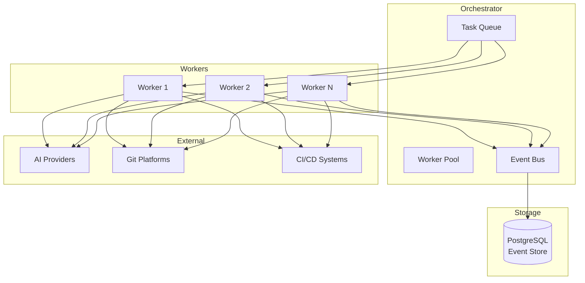

# 🤖 Tamma

Tam-ma or Tam for short, meaning It's Done

**AI-Powered Development Orchestration Platform**

From GitHub issue to merged PR—completely autonomous.

[](https://github.com/meywd/tamma/blob/main/LICENSE)
[](https://nodejs.org/)
[](https://www.typescriptlang.org/)
[](https://www.postgresql.org/)
[](http://makeapullrequest.com)

---

# 🚧 **Pre-Development Phase**

**⚠️ Important: This project is currently in the architecture and specification phase. No working code is available yet.**

However, we have:

- ✅ **Complete technical specifications** for all features
- ✅ **Comprehensive architecture documentation**
- ✅ **58 developer-ready stories** with detailed implementation guidance
- ✅ **Clear roadmap** and development timeline

**🎯 Ready to start contributing?** See [Development Setup](#️-development-setup-pre-implementation) below.

---

Tamma bridges the gap between AI coding assistants and fully autonomous development by providing a structured, event-sourced workflow that turns GitHub issues into merged pull requests without human intervention.

## 🎯 Why Tamma? (Planned Features)

- **🤖 Fully Autonomous**: From issue selection to PR merge without human intervention
- **🔧 Multi-Provider**: Works with Claude, OpenAI, GitHub Copilot, and any AI provider
- **🌐 Platform Agnostic**: GitHub, GitLab, and self-hosted Git support
- **📊 Event Sourced**: Complete audit trail with time-travel debugging
- **⚡ Hybrid Architecture**: Standalone CLI or distributed orchestrator/worker setup
- **🛡️ Enterprise Ready**: Secure, scalable, and observable

_All features are thoroughly planned and specified. Implementation has not yet begun._

## 🚀 Quick Start (Coming Soon)

### Current Status: 🚧 Pre-Development

Tamma is currently in the **specification and architecture phase**. Working code is not yet available, but you can get involved today!

### Prerequisites (for future use)

- Node.js 22 LTS or later
- pnpm 9.x or later
- PostgreSQL 17 (for orchestrator mode)

### Planned Installation (Not Yet Available)

```bash
# These commands will work once implementation begins
npx create-tamma-app@latest my-project
cd my-project
tamma init --mode standalone
tamma run --issue "Add user authentication"
```

### 🎯 What You Can Do Today

- **📚 Review Specifications**: Read our comprehensive technical documentation
- **🤝 Join Community**: Participate in design discussions and planning
- **👨‍💻 Contribute**: Help build the foundation - see [Development Stories](docs/stories/)
- **⭐ Watch Repository**: Get notified when development begins

## ✨ Planned Features

### 🤖 Autonomous Development Workflow

- **Issue Selection**: Intelligent filtering and prioritization from project management systems
- **Plan Generation**: Comprehensive development plans with approval checkpoints
- **Test-First Implementation**: Automated test writing followed by implementation
- **PR Management**: Automatic creation, monitoring, and merging of pull requests
- **CI/CD Integration**: Real-time status monitoring and error handling

### 🔌 Multi-Provider Architecture

- **AI Providers**: Claude, OpenAI, GitHub Copilot, Gemini, and custom providers
- **Git Platforms**: GitHub, GitLab, Gitea, Bitbucket, Azure DevOps, and plain Git
- **Automatic Failover**: Smart provider switching and load balancing
- **Streaming Support**: Real-time feedback and progress updates

### 🏗️ Hybrid Deployment Modes

- **Standalone**: Single-machine CLI for individual developers
- **Orchestrator**: Centralized task queue and state management
- **Worker**: Distributed execution for parallel processing
- **Cloud Native**: Container-ready with Kubernetes support

### 📊 Event Sourcing & Observability

- **Complete Audit Trail**: Every decision and action recorded
- **Time-Travel Debugging**: Replay any development session
- **Black-Box Testing**: Reproduce issues with exact context
- **Real-time Dashboards**: Development velocity and system health

_All features are fully specified in technical documentation. Implementation pending._

## 🏗️ Architecture

Tamma uses a **Dynamic Consistency Boundary (DCB)** pattern with event sourcing for deterministic replay and maximum flexibility:



### 🛠️ Tech Stack

- **Runtime**: Node.js 22 LTS + TypeScript 5.7
- **Database**: PostgreSQL 17 (event sourcing)
- **API Framework**: Fastify 5.x
- **Package Manager**: pnpm with workspaces
- **Testing**: Jest with integration suites
- **Security**: AES-256 encryption + OS keychain

## 📊 Development Progress

### 🚧 Current Status: Pre-Alpha Development

### ✅ Completed (October 2025)

- **Product Requirements**: Comprehensive PRD with feature definitions and acceptance criteria
- **Architecture Design**: Hybrid orchestrator/worker architecture with event sourcing foundation
- **Technical Specifications**: All 5 epics fully specified with detailed implementation guidance
- **Epic 1 Foundation**: 12 developer-ready stories with comprehensive technical contexts

### 🔄 In Progress

- **Core Implementation**: AI and Git provider abstractions
- **CLI Development**: Standalone mode scaffolding and command interface
- **Event Store**: PostgreSQL-based event sourcing implementation

### 📅 Upcoming Milestones

- **Alpha Release**: Q1 2025 (Epic 1 complete)
- **Beta Release**: Q2 2025 (Epic 1-2 complete)
- **Public Launch**: Q3 2025 (All epics complete)

### 🎯 Epic Readiness

- **Epic 1**: ✅ Ready for Development (12 stories)
- **Epic 2**: ✅ Specifications Complete (11 stories)
- **Epic 3**: ✅ Specifications Complete (9 stories)
- **Epic 4**: ✅ Specifications Complete (8 stories)
- **Epic 5**: ✅ Specifications Complete (10 stories)

## 🗺️ Roadmap

### Epic 1: Foundation & Core Infrastructure 🚧

**Multi-provider AI abstraction, multi-platform Git integration, hybrid orchestrator/worker architecture**

- ✅ **AI Provider Strategy**: Research and interface definition
- ✅ **Core Implementations**: Claude Code, GitHub, GitLab providers
- ✅ **Configuration Management**: Secure provider and platform configuration
- ✅ **Architecture Design**: Hybrid orchestrator/worker pattern
- ✅ **CLI Scaffolding**: Mode selection and basic commands
- ✅ **Extended Providers**: Additional AI and Git platform support

### Epic 2: Autonomous Development Workflow 📋

**Issue selection, plan generation, test-first implementation, PR creation and monitoring**

- 🔄 **Issue Selection**: Intelligent filtering and prioritization
- 🔄 **Development Planning**: Comprehensive plan generation with approvals
- 🔄 **Test-First Development**: Automated test writing and implementation
- 🔄 **PR Management**: Creation, monitoring, and merging
- 🔄 **CI/CD Integration**: Status monitoring and error handling

### Epic 3: Intelligence & Quality Enhancement 🧠

**Build/test automation, research capability, ambiguity detection, static analysis**

- 📋 **Build Automation**: Retry logic and error recovery
- 📋 **Research Integration**: Unfamiliar concept investigation
- 📋 **Ambiguity Detection**: Scoring and clarification workflows
- 📋 **Quality Gates**: Static analysis and security scanning

### Epic 4: Event Sourcing & Time-Travel ⏰

**Complete event capture, time-travel debugging, black-box replay**

- 📋 **Event Schema**: Comprehensive event design
- 📋 **Event Capture**: All development decisions and actions
- 📋 **Time-Travel Debugging**: Replay and analysis capabilities
- 📋 **Black-Box Testing**: Issue reproduction with exact context

### Epic 5: Observability & Production Readiness 📊

**Structured logging, metrics, dashboards, integration testing, alpha release**

- 📋 **Logging & Metrics**: Comprehensive observability
- 📋 **Real-time Dashboards**: System health and development velocity
- 📋 **Integration Testing**: End-to-end test suites
- 📋 **Production Deployment**: Alpha release preparation

**Legend**: ✅ Complete | 🔄 In Progress | 📋 Planned

## Technology Stack

- **Language**: TypeScript 5.7+
- **Runtime**: Node.js 22 LTS
- **Database**: PostgreSQL 17 (event store)
- **API Framework**: Fastify 5.x
- **Package Manager**: pnpm with workspaces
- **Testing**: Jest, integration testing suite
- **Security**: AES-256 encryption, OS keychain integration

## 🛠️ Development Setup (Pre-Implementation)

### 🚧 Current Phase: Architecture & Specification

We're currently in the **pre-development phase**. The codebase is not yet implemented, but the foundation is thoroughly planned and documented.

### 📋 What's Ready Today

- **✅ Complete Architecture**: Hybrid orchestrator/worker design with event sourcing
- **✅ Technical Specifications**: All 5 epics fully detailed with implementation guidance
- **✅ Development Stories**: 50+ stories with comprehensive technical context
- **✅ Project Structure**: Monorepo setup with workspaces and tooling configuration

### 🚀 How to Start Contributing

**For New Contributors:**

1. **📖 Study the Architecture**: Review [Architecture Overview](docs/architecture.md) and [Epic 1 Tech Spec](docs/tech-spec-epic-1.md)
2. **🎯 Choose a Story**: Pick from [Epic 1 stories](docs/stories/) - all have comprehensive technical context
3. **💬 Join Discussion**: Participate in [GitHub Discussions](https://github.com/meywd/tamma/discussions) to ask questions
4. **🌟 Watch Repository**: Get notified when implementation begins

**Good First Stories for Implementation:**

- [AI Provider Interface](docs/stories/1-1-ai-provider-interface-definition.md) - Define the core AI abstraction
- [CLI Scaffolding](docs/stories/1-9-basic-cli-scaffolding-with-mode-selection.md) - Create the command-line interface
- [Configuration Management](docs/stories/1-3-provider-configuration-management.md) - Build secure configuration system

### 📋 Planned Development Focus

**Epic 1 Foundation Implementation** (Specifications Complete):

- **AI Provider Abstraction**: Pluggable interface for Claude, OpenAI, GitHub Copilot, etc.
- **Git Platform Integration**: Unified API for GitHub, GitLab, Gitea, Bitbucket, etc.
- **Hybrid Architecture**: Orchestrator/worker pattern with PostgreSQL event sourcing
- **CLI Development**: Command-line interface with standalone and orchestrator modes

### 🗓️ Implementation Timeline

- **📅 November 2025**: Epic 1 implementation begins
- **📅 Q1 2026**: Alpha release with core functionality
- **📅 Q2 2026**: Beta release with autonomous workflows
- **📅 Q3 2026**: Public launch with all features

See [Sprint Status](docs/sprint-status.yaml) for current planning progress.

## 🤝 Community & Support

### 💬 Get Help

- **[GitHub Discussions](https://github.com/meywd/tamma/discussions)** - Ask questions and share ideas
- **[GitHub Issues](https://github.com/meywd/tamma/issues)** - Report bugs and request features

### 🚀 Contributing

We welcome contributions of all kinds! Here's how to get started:

#### **Good First Issues**

- [AI Provider Interface](https://github.com/meywd/tamma/issues?q=is%3Aissue+is%3Aopen+label%3A%22good+first+issue%22+label%3Aepic-1)
- [CLI Commands](https://github.com/meywd/tamma/issues?q=is%3Aissue+is%3Aopen+label%3A%22good+first+issue%22+label%3Acli)
- [Documentation](https://github.com/meywd/tamma/issues?q=is%3Aissue+is%3Aopen+label%3A%22good+first+issue%22+label%3Adocumentation)

#### **Contribution Areas**

- **🔧 Core Development**: AI providers, Git platforms, event sourcing
- **📚 Documentation**: Guides, tutorials, API docs
- **🧪 Testing**: Unit tests, integration tests, end-to-end scenarios
- **🎨 Design**: UI components, dashboards, user experience
- **🌐 Localization**: Help translate Tamma to other languages

#### **Development Process (Starting November 2025)**

1. Fork the repository
2. Create a feature branch (`git checkout -b feature/amazing-feature`)
3. Commit your changes (`git commit -m 'Add amazing feature'`)
4. Push to the branch (`git push origin feature/amazing-feature`)
5. Open a Pull Request

_Currently accepting contributions to architecture, documentation, and implementation planning._

### 📋 Code of Conduct

Please read and follow our [Code of Conduct](docs/code-of-conduct.md) to ensure a welcoming environment for all contributors.

### 🏆 Contributors

Thank you to all our contributors! Your work makes Tamma possible.

[](https://github.com/meywd/tamma/graphs/contributors)

## 🎯 Planned Use Cases

### 🏢 Enterprise Teams

- **Legacy Modernization**: Autonomous refactoring of large codebases
- **Feature Development**: Rapid prototyping and implementation
- **Code Review Automation**: Automated PR generation and review

### 👥 Solo Developers

- **Productivity Boost**: Handle routine development tasks automatically
- **Learning**: Understand best practices through AI-generated code
- **Side Projects**: Accelerate personal project development

### 🚀 Startups

- **MVP Development**: Fast feature implementation and iteration
- **Technical Debt**: Automated refactoring and maintenance
- **Scaling**: Handle growing codebase with limited resources

_These use cases are thoroughly planned and specified. Implementation will begin November 2025._

## 🔗 Related Projects

- **[GitHub Copilot](https://github.com/features/copilot)** - AI pair programming
- **[Cursor](https://cursor.sh)** - AI-powered code editor
- **[Aider](https://github.com/paul-gauthier/aider)** - AI pair programming in terminal
- **[Continue](https://github.com/continuedev/continue)** - Open-source AI code assistant

## 📄 License

This project is licensed under the Apache License 2.0 - see the [LICENSE](LICENSE) file for details.

## Acknowledgments

- Built with inspiration from the best open-source projects
- Thanks to all AI providers making autonomous development possible
- Community feedback and contributions that shape Tamma's evolution

---

<div align="center">

**⭐ Star this repository to support autonomous development!**

Built with the vision of democratizing autonomous software development

[🔝 Back to top](#-tamma)

</div>
