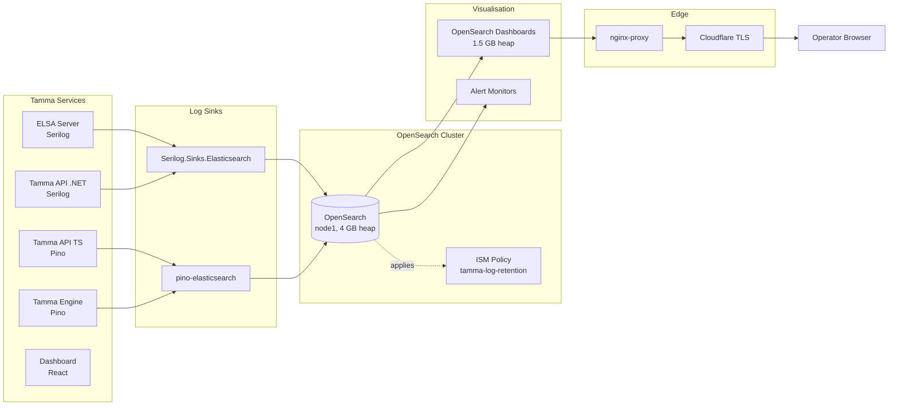
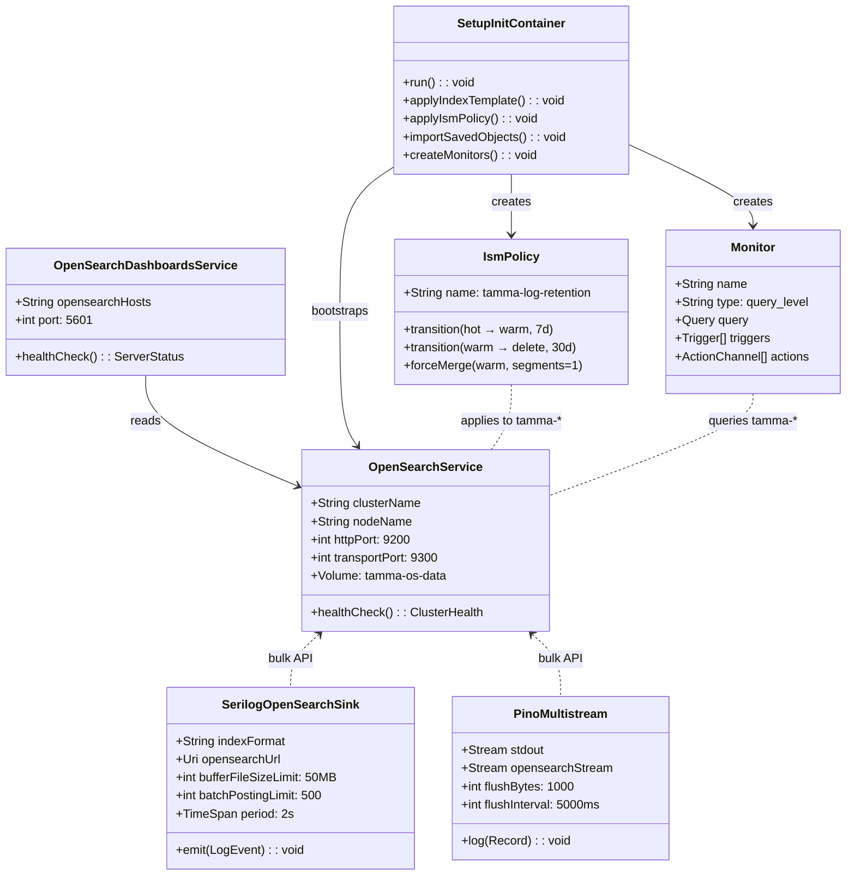
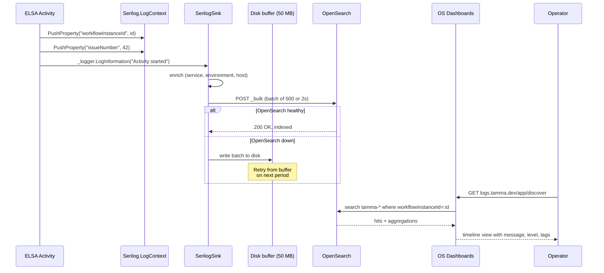

**Status:** Story 15-1 shipped; 15-2 and 15-3 planned
**Stories:** 3 total (1 done, 2 planned)
**Layer:** Layer 3 (Platform Ops)
**Depends on:** Epic 1.5 (Docker Compose + nginx), Epic 5 (structured logging primitives)

> **Root topic**: [Log Aggregation](Log-Aggregation) — the platform-wide logging story.
> For the rest of the ops plane see [Observability](Observability) (Epic 5, logger contracts) and [Deployment](Deployment) (Epic 1.5, compose + reverse proxy).

## Overview

Epic 15 stands up a centralised log plane for every Tamma service so that a single URL (`logs.tamma.dev`) lets operators search, correlate and alert on structured events across the C# ELSA workflow server, the .NET REST API, the TypeScript Fastify API, the TypeScript engine and the React dashboard. It replaces SSH-and-grep on individual containers with an OpenSearch cluster that carries indexed fields — `workflowInstanceId`, `issueNumber`, `sessionId`, `correlationId`, `provider`, `model`, `durationMs` — and a 30-day retention policy managed by Index State Management (ISM).

Three services participate:

1. **OpenSearch 2.19** (single node) — indexes, stores, searches
2. **OpenSearch Dashboards 2.19** — visualisation, saved searches, monitors, alerts
3. **Log shippers in every Tamma service** — `Serilog.Sinks.Elasticsearch` on the .NET side, `pino-elasticsearch` multistream transport on the TypeScript side

The epic closes the observability gap left by Epic 5: Epic 5 gave every service a structured logger, Epic 15 gives operators a place to query them.

## Architecture

The pipeline is a fan-in into a single-node OpenSearch cluster, with OpenSearch Dashboards fronted by nginx at `logs.tamma.dev` (Cloudflare origin cert, no public anonymous access). Every log shipper writes to Console + File + OpenSearch; if OpenSearch is unreachable the app keeps logging locally via a disk buffer (50 MB for Serilog, pino's internal backpressure handling for TS) so no log events are lost.

### Host budget

| Component | Heap | Notes |
|-----------|------|-------|
| OpenSearch | 4 GB JVM | `-Xms4g -Xmx4g`, `memlock` on |
| OpenSearch Dashboards | 1.5 GB Node.js | `--max-old-space-size=1536` |
| Existing stack | ~8.4 GB | Postgres, RabbitMQ, ChromaDB, ELSA, APIs, engine, dashboard, nginx |
| Total after deploy | ~13.9 GB / 16 GB | ~2 GB headroom on Hetzner CPX42 |

Single-node is a deliberate trade-off. The VPS cannot host a 3-node cluster without evicting workload services, and Tamma is not yet a tier-1 customer-facing observability system. A scale-out move to 3-node (with dedicated master + data roles) is the v2 story when volume exceeds ~500 GB/month.

## Components

| Component | Language | Responsibility | Source |
|-----------|----------|----------------|--------|
| **OpenSearch service** | Java | Durable log store, full-text + filter search, aggregations | `docker/docker-compose.yml` (`opensearch:`) |
| **OpenSearch Dashboards** | Node.js | Query UI, saved visualisations, Discover tab, Alerting | `docker/docker-compose.yml` (`opensearch-dashboards:`) |
| **opensearch-setup (init)** | Shell | One-shot bootstrap — applies index template, ISM policy, saved objects | `docker/opensearch/setup.sh` |
| **Index template `tamma-logs`** | JSON | Explicit field mappings for every structured log field | `docker/opensearch/index-template.json` |
| **ISM policy `tamma-log-retention`** | JSON | 7-day hot → warm (force-merge to 1 segment) → 30-day delete | `docker/opensearch/ism-policy.json` |
| **Saved objects NDJSON** | NDJSON | Pre-built dashboards (Errors, Workflow Timeline, LLM Latency, Tool Duration, Volume) | `docker/opensearch/dashboards-saved-objects.ndjson` |
| **Serilog sink (.NET)** | C# | Streams log events from ELSA + .NET API to OpenSearch bulk endpoint | `Tamma.ElsaServer/Program.cs`, `Tamma.Api/Program.cs` |
| **Pino multistream (TS)** | TypeScript | Dual-stream transport: stdout + OpenSearch bulk | `packages/observability/src/logger.ts` |
| **nginx `logs.tamma.dev` block** | nginx conf | Reverse-proxies Dashboards behind Cloudflare-authenticated access | `docker/nginx-proxy.conf` |
| **Monitor `tamma-error-spike`** | OpenSearch monitor | Fires when any service logs > 50 ERROR events in 5 min | `setup.sh` bootstraps via API |
| **Monitor `tamma-workflow-failure`** | OpenSearch monitor | Fires on `workflowInstanceId` + `level:ERROR` + "workflow failed" / "unhandled exception" | `setup.sh` bootstraps via API |

### Indexed fields (from the `tamma-logs` template)

`@timestamp`, `level`, `levelNum`, `service`, `message`, `workflowInstanceId`, `issueNumber`, `sessionId`, `correlationId`, `provider`, `model`, `durationMs`, `tokenCount`, `errorCode`, `stackTrace`, `host`, `environment`. The template is applied to the index pattern `tamma-*` so every service's daily index (`tamma-elsa-{yyyy.MM.dd}`, `tamma-api-dotnet-{yyyy.MM.dd}`, `tamma-ts-{yyyy.MM.dd}`) inherits the mapping.

## Class / deployment diagram

## Sequence: a workflow log event reaches the operator's screen

## Use cases

| # | Persona | Goal | Path |
|---|---------|------|------|
| 1 | On-call engineer | "Why did workflow `wf-abc123` fail?" | Discover → filter `workflowInstanceId:wf-abc123` → sort by `@timestamp` |
| 2 | Platform engineer | "Are error rates rising on the C# API?" | Dashboard "Errors by Service" → split on `service` |
| 3 | LLM cost owner | "Which model calls took > 30s today?" | Dashboard "LLM Call Latency" → filter `durationMs > 30000` |
| 4 | SRE | "Alert me when a service errors > 50 times in 5 min" | Monitor `tamma-error-spike` → Slack / email webhook |
| 5 | Auditor | "Show all events for issue #42 across services" | Discover → filter `issueNumber:42` → all three indices return |
| 6 | Developer | "Tool execution took too long — which tool?" | Dashboard "Tool Execution Duration" → split on `toolName` |

## Dependencies

**Upstream**
- [Epic 1.5](Epic-1.5-Infrastructure.md) — Docker Compose topology + nginx reverse proxy + Cloudflare DNS entry for `logs.tamma.dev`
- [Epic 5](Epic-5-Observability.md) — Pino / Serilog logger contracts, correlation-ID enrichment pattern

**Downstream**
- [Epic 16](Epic-16-Auth-Admin.md) — Stories 16-1 / 16-5 close the "public access to Dashboards" gap by putting oauth2-proxy in front of `logs.tamma.dev`
- [Epic 23](Epic-23-System-Monitoring.md) — Prometheus/Grafana pipeline reuses the same indices via correlation ID

## Current state

- Story 15-1 (OpenSearch + sinks + ISM + dashboards) **shipped** in production on Hetzner CPX42; `logs.tamma.dev` is live
- Story 15-2 (Structured Logging Gap Remediation) — planned. Audit showed two services emit unstructured `Console.WriteLine` in error paths; this story closes that and enforces the Pino/Serilog contract everywhere
- Story 15-3 (Advanced Dashboards & Alerting Tuning) — planned. Adds SLO dashboards, workflow saga timelines, per-tenant slice-and-dice once Epic 17 wires `tenantId` into every log record
- No per-tenant index isolation today — all tenants' logs land in the same `tamma-*` indices and are distinguished by the `tenantId` field. Epic 17 made `tenantId` mandatory on new log records; backfill for pre-Epic-17 indices is out of scope (they'll age out via ISM)

## Stories

| # | Title | Priority | Status |
|---|-------|----------|--------|
| 15-1 | OpenSearch Log Aggregation | P0 | **Done** |
| 15-2 | Structured Logging Gap Remediation | P1 | Planned |
| 15-3 | Advanced Dashboards & Alerting Tuning | P2 | Planned |

## Operational notes

- **Security plugin disabled** — OpenSearch runs without internal auth. Access control is enforced at nginx (Cloudflare-authenticated) and, after Epic 16, by oauth2-proxy.
- **Non-blocking sinks** — Serilog uses `EmitEventFailure = WriteToSelfLog` + a 50 MB file buffer; Pino's multistream continues writing to stdout even when the OpenSearch transport errors. An outage of OpenSearch never takes down an app container.
- **Index rollover** — daily indices (`tamma-elsa-2026.04.22` etc.). The ISM policy force-merges to a single segment at 7 days and deletes at 30 days. Retention is fixed in v1; a per-tenant retention overlay is a v2 candidate.
- **Correlation** — `Serilog.Context.LogContext.PushProperty` on the C# side and pino child loggers on the TS side carry `workflowInstanceId` / `sessionId` / `issueNumber` through every log record. `correlationId` is stamped by the API layer on request ingress.

## See also

- [Log Aggregation](Log-Aggregation) — root topic
- [Observability](Observability) — Epic 5 logger contracts
- [Deployment](Deployment) — Hetzner VPS layout
- [Epic 5: Observability](Epic-5-Observability.md)
- [Epic 16: Auth & Admin](Epic-16-Auth-Admin.md) — closes public Dashboards access
- [Epic 23: System Monitoring](Epic-23-System-Monitoring.md) — metrics side of ops
- [Story 15-1 on GitHub](/stories/epic-15/)

---

_Last updated: 2026-04-22_
