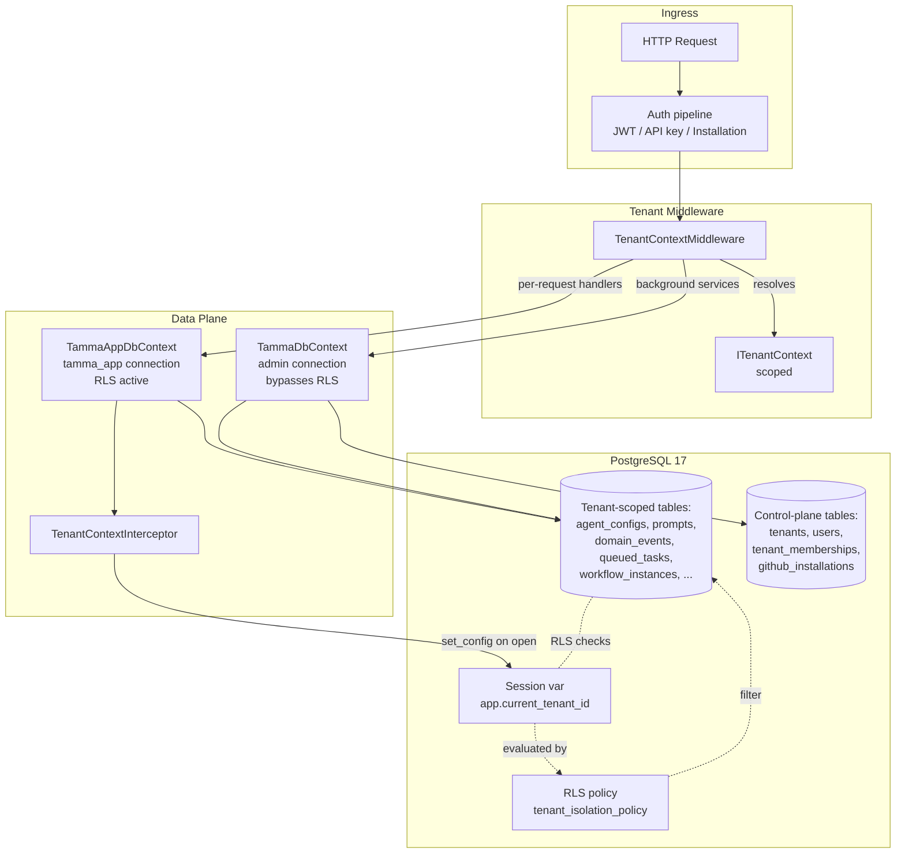
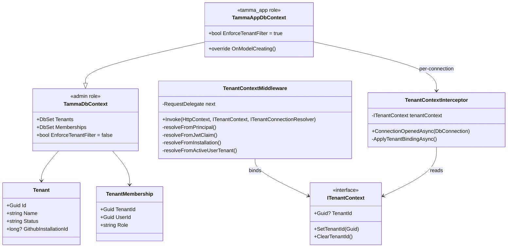
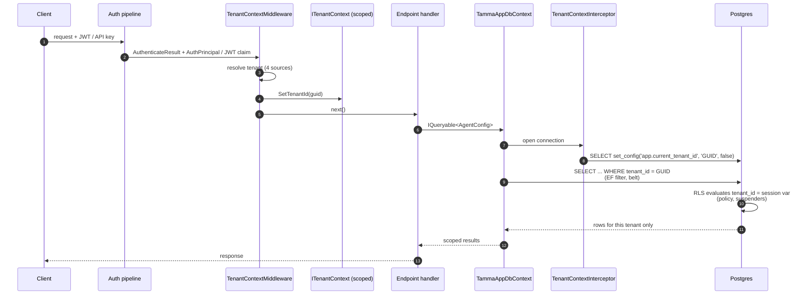

**Status:** Historical / superseded — Phase-2 RLS migration shipped; Phase-3 scaffolding committed; real isolation moves to Epic 28 (db-per-tenant) in Wave A.5
**Stories:** 5 (17-1 through 17-5)
**Layer:** Layer 3 (Platform Data)
**Depends on:** Epic 1.5 (GitHub App + API), Epic 10 (event store), Epic 14 (Elsa workflows)

> **Overview**: [Multi-Tenancy](Multi-Tenancy) is the topic page. This epic is the **shared-DB-with-RLS scaffold**; the real tenant-isolation story is [Epic 28: DB-per-Tenant](Epic-28-DB-Per-Tenant.md). Epic 17's `tenants` table + `tenant_memberships` + the `TammaAppDbContext` / `TenantContextInterceptor` pair remain useful building blocks that Epic 28 keeps and extends — the rest of the shared-DB surface is being retired in the Wave A.5 cleanup.

## Overview

Epic 17 was the v1 answer to "how do multiple customers share one Tamma deployment without leaking data?" It ships:

1. A first-class **tenant model** (`tenants` UUID PK, `tenant_memberships` M:N user↔tenant) that maps one GitHub App installation to one tenant.
2. **Postgres Row-Level Security (RLS)** policies on every tenant-scoped table — the defence-in-depth layer.
3. A **dual-connection split** — `TammaDbContext` (admin connection, bypasses RLS for migrations and cross-tenant background services) vs `TammaAppDbContext` (app-role connection, RLS active).
4. A **`TenantContextInterceptor`** that runs `SELECT set_config('app.current_tenant_id', …, false)` on every connection open, so RLS policies can read the session variable.
5. A **`TenantContextMiddleware`** that resolves the tenant from four sources (API-key principal, JWT `tid` claim, installation context, user's active-tenant column) and hands it to the interceptor.

This epic was always scoped as shared-schema-with-RLS. It ran into the limit of what query filters can safely guarantee (a forgotten `HasQueryFilter` = cross-tenant leak, GDPR delete is row-by-row, no cryptographic isolation). Epic 28 replaces the shared-DB model with db-per-tenant; Epic 17's `tenants` table, `tenant_memberships` table, and the app-role / interceptor scaffold are **kept** as the control-plane parts of Epic 28.

## Architecture (as shipped)



### Tenant = GitHub App installation

One GitHub organisation installs the Tamma GitHub App → one tenant. A personal GitHub user installing it → one tenant. Self-hosted / CLI mode → an implicit "default" tenant (all-zero UUID `00000000-0000-0000-0000-000000000000`). `github_installations.installation_id` is the external identifier; `tenants.tenant_id` is the internal UUID FK on every tenant-scoped table.

### Phase 2 vs Phase 3

| Phase | What shipped | Live? |
|-------|--------------|-------|
| **Phase 1** | `tenants` + `tenant_memberships` tables (Story 17-1) | Yes |
| **Phase 2** | RLS policies + triggers on 14 tenant-scoped tables (migration `20260419021119_Phase2RlsAndTriggers`) | Yes — installed but not enforced |
| **Phase 3** | `TammaAppDbContext` + `TenantContextInterceptor` + dual connection strings | **Scaffolded, not live** — endpoints still use admin connection |

The reason Phase 3 is not live: no per-request endpoint handler injected `TammaAppDbContext` at the time Epic 17 wrapped. Every repository still pointed at `TammaDbContext` which connects as the admin role and **bypasses RLS entirely**. The `set_config(...)` call runs but has no effect. Story 19-6 (Epic 19 follow-up) is the explicit close of this gap; it lands in Wave A.5 alongside the Epic 28 cutover.

## Components

| Component | Source | Role |
|-----------|--------|------|
| **`tenants` table** | migration 17-1 | UUID PK, `name`, `github_installation_id` FK, `status` |
| **`tenant_memberships` table** | migration 17-1 | M:N user↔tenant with role (`owner`/`admin`/`member`) |
| **`ITenantContext`** | `Tamma.Data/ITenantContext.cs` | Scoped service holding the current request's tenant |
| **`TenantContext`** | `Tamma.Data/TenantContext.cs` | Default impl with `SetTenantId(Guid)` / `ClearTenantId()` |
| **`TenantContextMiddleware`** | `Tamma.Api/Middleware/TenantContextMiddleware.cs` | Resolves tenant id (4 sources) and binds it into `ITenantContext` |
| **`EnsurePersonalTenantMiddleware`** | `Tamma.Api/Middleware/EnsurePersonalTenantMiddleware.cs` | Bootstraps an implicit personal tenant for a newly-authenticated user with no tenant row |
| **`TammaDbContext`** | `Tamma.Data/TammaDbContext.cs` | Admin-role connection; migrations + cross-tenant background services |
| **`TammaAppDbContext`** | `Tamma.Data/TammaAppDbContext.cs` | `tamma_app` role connection; `EnforceTenantFilter=true` EF query filter + RLS subject |
| **`TenantContextInterceptor`** | `Tamma.Data/Interceptors/TenantContextInterceptor.cs` | `DbConnectionInterceptor` that calls `SELECT set_config('app.current_tenant_id', @p, false)` on every Npgsql connection open |
| **Phase-2 migration** | `20260419021119_Phase2RlsAndTriggers` | Creates `tamma_app` role, grants CRUD, `ENABLE ROW LEVEL SECURITY` + `FORCE ROW LEVEL SECURITY` + `tenant_isolation_policy` on 14 tables |

### RLS policy template (applied per tenant-scoped table)

```sql
ALTER TABLE <table> ENABLE ROW LEVEL SECURITY;
ALTER TABLE <table> FORCE  ROW LEVEL SECURITY;
CREATE POLICY tenant_isolation_policy ON <table>
  USING      (tenant_id = NULLIF(current_setting('app.current_tenant_id', true), '')::uuid)
  WITH CHECK (tenant_id = NULLIF(current_setting('app.current_tenant_id', true), '')::uuid);
```

Tables covered: `agent_configs`, `prompts`, `prompt_overrides`, `domain_events`, `queued_tasks`, `workflow_instances`, `refresh_tokens`, `provider_diagnostics`, `sanitization_rules`, `api_keys` and more.

### Exempt tables

System-default prompt tables, action-default tables, convention templates — these cross tenant boundaries by design and opt out of RLS (documented in Story 17-2).

## Class diagram — tenant resolution plane



## Sequence — per-request tenant binding



## Use cases (as shipped vs future)

| # | Case | Epic 17 path | Replaced by |
|---|------|--------------|-------------|
| 1 | GitHub org installs Tamma App | `installation.created` webhook creates `tenants` row + `tenant_memberships` row | Epic 28 provisions a tenant DB instead |
| 2 | API request carries JWT `tid=ABC` | `TenantContextMiddleware` binds `ITenantContext.TenantId = ABC` | Unchanged — Epic 28 keeps this resolution plane |
| 3 | Endpoint reads `agent_configs` | `TammaAppDbContext` filters via EF + RLS on `app.current_tenant_id` | Epic 28: reads from the tenant's own DB — no RLS needed |
| 4 | Background service processes outbox for all tenants | Uses `TammaDbContext` (admin, bypasses RLS) | Control plane only (`platform_email_outbox`) in Epic 28 |
| 5 | Admin deletes a tenant | `DELETE FROM tenants WHERE id=?` cascades to all tables (hours for big tenants) | Epic 28: `DROP DATABASE tamma_tenant_<id>` — seconds |
| 6 | GDPR export for a single tenant | `SELECT ... WHERE tenant_id = ?` across 20 tables | Epic 28: `pg_dump` of the tenant DB |
| 7 | CLI mode / self-hosted | Default tenant UUID all-zero, RLS optional | Unchanged — CLI continues to run single-tenant |

## Dependencies

**Upstream**
- [Epic 1.5](Epic-1.5-Infrastructure.md) — GitHub App, API framework, Postgres hosting
- [Epic 10](Epic-10-Engine-Core.md) — event store gets a `tenantId` tag (Story 17-3)
- [Epic 14](Epic-11-14-ELSA.md) — Elsa workflow instances get a `tenantId` variable (Story 17-4)

**Downstream**
- [Epic 19](Epic-19-Agent-Dispatch.md) Story 19-6 — **wires `TammaAppDbContext` into endpoints + 21 repositories**; without 19-6 the RLS scaffold is dormant
- [Epic 28](Epic-28-DB-Per-Tenant.md) — **supersedes** the shared-DB approach; keeps `tenants` + memberships + interceptor, replaces RLS with database-level isolation
- [Epic 29](Epic-29-Secret-Management.md) — secret cabinet depends on 17's `tenants` table
- [Epic 30](Epic-30-Pluggable-Provisioning.md) — Story 30-8 closes per-tenant endpoint routing gap

## Current state

- **Story 17-1 (tenants + memberships)**: **Done** — tables are live, every tenant-scoped table carries a `tenant_id` column
- **Story 17-2 (RLS policies)**: **Phase-2 Done** — policies + triggers installed on 14 tables; Phase-3 scaffolded; runtime not live
- **Story 17-3 (tenant-scoped event store)**: **Planned** — `DomainEvent.TenantId` column shipped; query filter scaffolded. Event-store reads through `TammaAppDbContext` in the Wave-A.5 flip
- **Story 17-4 (tenant-scoped workflow instances)**: **Planned** — Elsa `WorkflowInstance` variables carry `tenantId`; Elsa-side RLS is moot once Epic 28 per-tenant Elsa DBs land
- **Story 17-5 (API tenant context middleware)**: **Partially Done** — `TenantContextMiddleware` is live in production but routes through `TammaDbContext`; Story 19-6 flips it to `TammaAppDbContext`

### Related port-gap findings

| Finding | Scope | Status |
|---------|-------|--------|
| `orgs/002` EF filter permissive when tenant null | orgs | Fixed in Phase-3 scaffold; will be flipped to **Superseded by Epic 28** in Wave A.5 |
| `orgs/004` `withTenantContext` set_local gone | orgs | Same as above |
| `admin-db/020` schema RLS policies missing | admin-db | Fixed by Phase-2 migration |
| `admin-db/021` `tamma_app` role missing | admin-db | Fixed by Phase-2 migration |

## Stories

| # | Title | Priority | Status | Est. |
|---|-------|----------|--------|------|
| 17-1 | Tenant Model + Database Schema | P0 | **Done** | 16h |
| 17-2 | Row-Level Security & Tenant Isolation | P0 | **Phase-2 Done** | 12h |
| 17-3 | Tenant-Scoped Event Store | P1 | Planned | 10h |
| 17-4 | Tenant-Scoped Workflow Instances | P1 | Planned | 10h |
| 17-5 | API Tenant Context Middleware | P0 | **Partial** | 14h |

## Relationship to Epic 28

Epic 17 ships **shared-schema + RLS**. Epic 28 ships **database-per-tenant**. The cutover plan (Wave A.5):

| Layer | Epic 17 model | Epic 28 model |
|-------|---------------|---------------|
| Tenant table | `tenants` in shared DB | `tenants` in control-plane DB |
| Tenant data | `*.tenant_id` columns + RLS | Separate `tamma_tenant_<id>` DB per tenant |
| Delete tenant | Row cascade (hours) | `DROP DATABASE` (seconds) |
| Cross-tenant query | `SET app.current_tenant_id` | Connect to the right DB — impossible otherwise |
| Audit leak-proof | Query-filter bugs are still possible | DB-level impossible to cross-read |
| Connection plane | Admin + app-role on one cluster | LRU pool cache of 1024 per-tenant pools |

Epic 28 keeps the **`TenantContextMiddleware` + `ITenantContext`** resolution plane unchanged — only the DbContext factory's connection resolution changes.

## See also

- [Multi-Tenancy](Multi-Tenancy) — root topic
- [Epic 28: DB-per-Tenant](Epic-28-DB-Per-Tenant.md) — the successor
- [Epic 19: Agent Dispatch](Epic-19-Agent-Dispatch.md) — Story 19-6 wires `TammaAppDbContext`
- [Epic 18: End-User Auth](Epic-18-User-Auth.md) — M:N user↔tenant extension (`tenant_memberships`)
- [Epic 16: Auth & Admin](Epic-16-Auth-Admin.md) — the single-tenant auth plane that this epic tenant-enables
- [Port-gap audit: orgs scope](../../docs/audit/port-gaps/orgs/) — finding 002 + 004 tied to Phase-3 scaffold
- [Stories on GitHub](/stories/epic-17/)

---

_Last updated: 2026-04-22_
