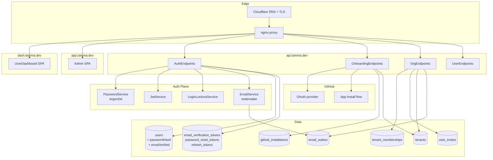
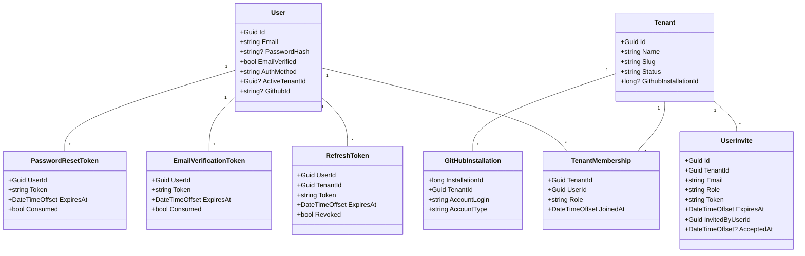

**Status:** Partially implemented — 18-4 nearly done (non-migration slices landed 2026-07-05; jsonb install-settings migration lane outstanding); 18-2/18-5 in progress; 18-1/18-3/18-6 drafted; 18-7/18-8 scoped 2026-04-21
**Stories:** 8 (18-1 through 18-8)
**Layer:** Layer 3 (Platform Ops)
**Depends on:** Epic 16 (unified auth), Epic 17 (tenant model), Epic 1.5 (Fastify API + GitHub App)

> **Root topic**: [User Auth](User-Auth) and [Onboarding](Onboarding). For tenant data-layer see [Epic 17](Epic-17-Multi-Tenancy.md); for tenant DB split see [Epic 28](Epic-28-DB-Per-Tenant.md); for the admin side see [Epic 16](Epic-16-Auth-Admin.md).

## Overview

Epic 16 gave Tamma single-sign-on for internal admins via GitHub OAuth. Epic 18 opens the door to **self-service SaaS**: any visitor can register by email + password, verify their email, create or join an organisation (which is a tenant from Epic 17), install the Tamma GitHub App, select repositories and kick off a first workflow run — all without an admin in the loop.

The epic covers:

- **18-1**: registration + email verification (Argon2id password hashing, UUID-v7 token + 24h expiry, SMTP via nodemailer)
- **18-2**: login + session management (dual auth: email+password OR GitHub OAuth; shared JWT on `.tamma.dev`)
- **18-3**: organisation / tenant creation (uses `tenants` from Epic 17; M:N via `tenant_memberships`)
- **18-4**: GitHub App installation onboarding (**Done** 2026-04-21)
- **18-5**: user-facing dashboard shell at `dash.tamma.dev`
- **18-6**: password reset
- **18-7**: tenant-admin user management API gaps (resend invite, tenant-scoped audit endpoint, role-change event)
- **18-8**: tenant-admin user management UI inside the dashboard shell

A user can belong to multiple tenants via `tenant_memberships`; `users.tenant_id` is the "active tenant" shortcut used by the frontend to pre-select a workspace.

## Architecture



### Onboarding flow

```
Register (email+password or GitHub OAuth)
     ↓
Verify email (skip if GitHub OAuth returned verified email)
     ↓
Create or join organisation (= tenant)
     ↓
Install GitHub App (→ github.com/apps/tamma-dev/installations/new)
     ↓
Select repositories
     ↓
First workflow run (guided)
     ↓
ONBOARDING.COMPLETED.SUCCESS event
```

## Components

| Component | Source | Story | Role |
|-----------|--------|-------|------|
| **AuthEndpoints (C#)** | `Tamma.Api/Endpoints/AuthEndpoints.cs` | 18-1, 18-2, 18-6 | Register, login, logout, verify-email, reset-password, refresh |
| **OnboardingEndpoints** | `Tamma.Api/Endpoints/OnboardingEndpoints.cs` | 18-4 | Status, install-github, install-callback, repo selection, repo activate/deactivate, onboarding-complete |
| **OrgEndpoints** | `Tamma.Api/Endpoints/OrgEndpoints.cs` | 18-3, 18-7 | Create tenant, list members, invite, change role, remove, transfer ownership, audit |
| **PasswordService** | `Tamma.Api/Auth/PasswordService.cs` | 18-1 | Argon2id hashing (m=64MB, t=3, p=4) |
| **PasswordStrengthValidator** | `Tamma.Api/Auth/PasswordStrengthValidator.cs` | 18-1 | zxcvbn-style rule: min 12 chars, not in common-passwords list |
| **LoginLockoutService** | `Tamma.Api/Auth/LoginLockoutService.cs` | 18-2 | 5 failures / 15 min lock per email |
| **JwtService** | `Tamma.Api/Auth/JwtService.cs` | 18-2 | HS256 JWT with `tenantId` / `userId` / `role` claims + refresh rotation |
| **SessionCookieWriter** | `Tamma.Api/Auth/SessionCookieWriter.cs` | 18-2 | Sets `tamma_session` on `.tamma.dev` |
| **OAuthStateCodec** | `Tamma.Api/Auth/OAuthStateCodec.cs` | 18-4 | JWT-encoded state param for GitHub App callback (`tenantId` + `userId` + `nonce` + 10-min exp) |
| **RedirectUrlSanitizer** | `Tamma.Api/Auth/RedirectUrlSanitizer.cs` | 18-2 | Open-redirect guard on post-login `?next=` |
| **DeleteConfirmationService** | `Tamma.Api/Auth/DeleteConfirmationService.cs` | 18-3 | "Type your tenant slug to confirm" challenge for destructive actions |
| **EmailService + OutboxSmtpSender** | `Tamma.Api/Services/` | 18-1 | Email outbox pattern; SMTP-agnostic |
| **UserStore / UserRepository** | `Tamma.Data/Repositories/UserRepository.cs` | 18-1 | `User` entity with `PasswordHash`, `EmailVerified`, `AuthMethod`, `ActiveTenantId` |
| **TenantMembershipRepository** | `Tamma.Data/Repositories/TenantMembershipRepository.cs` | 18-3 | M:N user↔tenant with role |
| **InviteRepository** | `Tamma.Data/Repositories/InviteRepository.cs` | 18-3, 18-7 | `user_invites` with token, role, expiry |
| **UserDashboard SPA** | `packages/dashboard/src/user/` | 18-5, 18-8 | Dashboard shell at `dash.tamma.dev` — projects, members, invites, audit |

## Class diagram



## Sequence — register + verify + create org + install GitHub App

```mermaid
sequenceDiagram
  autonumber
  participant U as User
  participant SPA as dash.tamma.dev SPA
  participant Api as Tamma API
  participant DB as Postgres
  participant SMTP as SMTP
  participant GH as GitHub

  U->>SPA: open signup page
  SPA->>Api: POST /auth/register {email, password}
  Api->>Api: PasswordStrengthValidator
  Api->>Api: PasswordService.Hash (argon2id)
  Api->>DB: INSERT user (emailVerified=false)
  Api->>DB: INSERT email_verification_token (24h)
  Api->>SMTP: send verify-email (outbox)
  Api-->>SPA: 202 Accepted
  U->>SMTP: click verify link
  SMTP->>SPA: /verify-email?token=…
  SPA->>Api: POST /auth/verify-email
  Api->>DB: UPDATE user SET emailVerified=true; DELETE token
  Api-->>SPA: 200 + session JWT

  U->>SPA: create organisation
  SPA->>Api: POST /orgs {name, slug}
  Api->>DB: INSERT tenants
  Api->>DB: INSERT tenant_memberships {role=owner}
  Api->>DB: UPDATE user SET active_tenant_id=…
  Api-->>SPA: 201 {tenantId}

  U->>SPA: click "Connect GitHub"
  SPA->>Api: GET /onboarding/install-github
  Api->>Api: OAuthStateCodec.encode({tenantId, userId, nonce, exp})
  Api-->>SPA: 302 github.com/apps/tamma-dev/installations/new?state=…
  SPA->>GH: user approves install
  GH->>Api: POST /api/github/webhooks (installation.created)
  Api->>DB: INSERT github_installations (linked via state)
  GH->>Api: GET /onboarding/install-callback?installation_id=&state=
  Api->>Api: OAuthStateCodec.decode + nonce check
  Api->>DB: UPDATE github_installations SET tenant_id=…
  Api-->>SPA: 302 /onboarding/repos
```

## Use cases

| # | Persona | Goal | Stories |
|---|---------|------|---------|
| 1 | Self-service signup | Email+password registration → verify → first workflow | 18-1, 18-2, 18-4, 18-5 |
| 2 | GitHub-native user | OAuth signup (email already verified) | 18-1, 18-2 |
| 3 | Organisation owner | Create tenant, invite teammates | 18-3, 18-7, 18-8 |
| 4 | Tenant admin | View members, change roles, view audit log | 18-7, 18-8 |
| 5 | Tenant admin | Resend an expiring invite | 18-7 (`POST /invites/:id/resend`), 18-8 |
| 6 | Tenant admin | Remove a teammate (last-owner guard kicks in) | 18-7, 18-8 |
| 7 | Owner | Transfer ownership (confirm-by-slug) | 18-3 (`DeleteConfirmationService`), 18-8 danger-zone page |
| 8 | Forgot password | Reset via email token | 18-6 |
| 9 | Multi-tenant user | Switch active tenant | 18-5, Epic 28 Story 28-9 adds `/auth/switch-org` |
| 10 | User | Cancel / restart onboarding | 18-4 — `GET /onboarding/status` returns progress, resumable |

## Dependencies

**Upstream**
- [Epic 16](Epic-16-Auth-Admin.md) — admin auth plane, unified cookie domain, JWT infrastructure
- [Epic 17](Epic-17-Multi-Tenancy.md) — `tenants` and `tenant_memberships` tables
- [Epic 1.5](Epic-1.5-Infrastructure.md) — Fastify / Kestrel API, GitHub App, nginx subdomain routing, SMTP

**Downstream**
- [Epic 19](Epic-19-Agent-Dispatch.md) — first workflow run (18-4 Task 6) dispatches through `IAgentExecutor`
- [Epic 20](Epic-20-Billing.md) — Stripe Customer is created on signup (Story 20-1 AC-4 hook)
- [Epic 28](Epic-28-DB-Per-Tenant.md) — **supersedes** the "just create tenant row" flow; verify-email becomes the provisioning trigger and `/auth/switch-org` (28-9) replaces the active-tenant shortcut
- [Epic 33](Epic-33-Per-Tenant-IdP.md) — local email+password auth is the fallback when no tenant IdP is configured

## Current state

| Story | Status | Notes |
|-------|--------|-------|
| 18-1 Registration + Email Verification | Drafted | Waits on Story 29 for hardened secret rotation of email-verification HMAC |
| 18-2 Login + Session Mgmt | **In Progress** | Dual auth (email+password + GitHub OAuth) + refresh rotation |
| 18-3 Organisation/Tenant Creation | Drafted | `OrgEndpoints.cs` already carries the full hierarchy-respecting mutation set |
| **18-4 GitHub App Install Onboarding** | **In Progress** (core landed 2026-04-21; non-migration slices completed 2026-07-05; jsonb install-settings migration lane outstanding) | Status endpoint, state-encoded install redirect, webhook + callback linking, repo selection. 2026-07-05 added the remaining non-migration slices: `PATCH /api/v1/onboarding/repos/{installationId}/{repoId}` toggles a connected repo's `IsActive` flag (AC4, emitting `REPO.ACTIVATED.SUCCESS` / `REPO.DEACTIVATED.SUCCESS`), and an onboarding-complete endpoint (AC6/AC7) that emits `ONBOARDING.COMPLETED.SUCCESS` — idempotent via the event stream (a prior completion event is returned, not re-emitted); there is no persisted "onboarding complete" column, the append-only DCB stream is the source of truth |
| 18-5 Dashboard Shell (`dash.tamma.dev`) | **In Progress** | React SPA scaffold + layout + projects + settings routes |
| 18-6 Password Reset | Drafted | Reuses the email outbox + token lifecycle |
| **18-7 Tenant-admin User Mgmt API gaps** | Planned (14h, added 2026-04-21) | Resend invite, tenant-scoped audit endpoint, `TENANT.MEMBER_ROLE_CHANGED.SUCCESS` event |
| **18-8 Tenant-admin User Mgmt UI** | Planned (32h, added 2026-04-21) | Dashboard pages — members, invites, audit, transfer ownership |

### 18-7 and 18-8 — the just-scoped pair

The tenant-user-mgmt gap audit (2026-04-21) found that `OrgEndpoints.cs` already ships the full hierarchy-respecting mutation set (invite, list, change role, remove member, transfer ownership, list/delete invites) with last-owner guards and atomic ownership transfer. Three thin gaps were missing:

1. **No role-change event** — `UpdateMemberRole` logs but doesn't emit to the event store. 18-7 adds `TENANT.MEMBER_ROLE_CHANGED.SUCCESS` with `{tenantId, userId=caller, targetUserId, oldRole, newRole}` tags.
2. **No resend-invite endpoint** — admins had to delete + recreate to nudge a user, which minted a new token (bad UX). 18-7 adds `POST /api/v1/orgs/{tenantId}/invites/{inviteId}/resend` that extends `ExpiresAt` by 72h and re-sends the same `TenantInviteEmail` template without rotating the token. Rate-limited at 3 resends per invite per hour.
3. **No tenant-scoped audit endpoint** — events carry `Tags.tenantId` but platform-admin `/api/admin/events` is platform-owner-only. 18-7 adds `GET /api/v1/orgs/{tenantId}/audit` filtered to that tenant.

Story 18-8 ships the UI — members page, pending-invites section, transfer-ownership danger zone, audit-log page — inside the 18-5 dashboard shell.

## Stories

| # | Title | Effort | Status |
|---|-------|--------|--------|
| 18-1 | User Registration + Email Verification | L (5d) | Drafted |
| 18-2 | User Login + Session Management | L (5d) | In Progress |
| 18-3 | Organisation/Tenant Creation | XL (8d) | Drafted |
| 18-4 | GitHub App Installation Onboarding | M (3d) | **Done** |
| 18-5 | User-Facing Dashboard Shell | L (5d) | In Progress |
| 18-6 | Password Reset Flow | M (3d) | Drafted |
| 18-7 | Tenant-Admin User Mgmt API gaps | S (14h) | Planned |
| 18-8 | Tenant-Admin User Mgmt UI | M (32h) | Planned |

## Operational notes

- **Password policy** — min 12 chars, blocked against `common-passwords.txt` (NIST SP 800-63B tier-3 list). No forced rotation; breach monitoring deferred.
- **Email outbox** — `email_outbox` table buffers outgoing emails; `OutboxSmtpSender` drains every 10s. Survives SMTP downtime without losing verifications. **Epic 28 note**: outbox moves to `platform_email_outbox` in the control-plane DB so welcome emails don't depend on tenant-DB availability.
- **Refresh-token rotation** — every refresh issues a new token; old token is marked `revoked`. Detection of a revoked-token reuse fires `AUTH.REFRESH.REPLAY_DETECTED` and invalidates the whole family.
- **Multi-tenant membership** — `users.tenant_id` is a shortcut; the canonical relation is `tenant_memberships`. Epic 28 Story 28-9 ships `/auth/switch-org` which rewrites the JWT's `tid` claim without a full re-login.
- **Rate limits** — register: 5 / hour / IP; login: 10 / min / IP + lockout; resend-invite: 3 / hour / invite. Keyed via `IRateLimitService`.

## See also

- [User Auth](User-Auth) — root topic
- [Onboarding](Onboarding) — the 5-step flow
- [Epic 16: Auth & Admin](Epic-16-Auth-Admin.md)
- [Epic 17: Multi-Tenancy](Epic-17-Multi-Tenancy.md) — `tenants` + memberships model
- [Epic 19: Agent Dispatch](Epic-19-Agent-Dispatch.md) — first workflow run target
- [Epic 20: Billing](Epic-20-Billing.md) — Stripe Customer created on signup
- [Epic 28: DB-per-Tenant](Epic-28-DB-Per-Tenant.md) — verify-email becomes provisioning trigger
- [Epic 33: Per-Tenant IdP](Epic-33-Per-Tenant-IdP.md) — enterprise IdP override
- [Stories on GitHub](/stories/epic-18/)

---

_Last updated: 2026-07-15_
