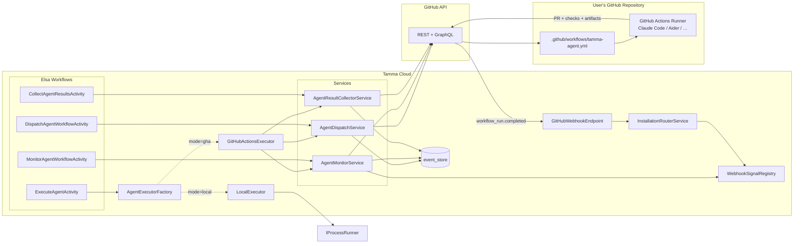
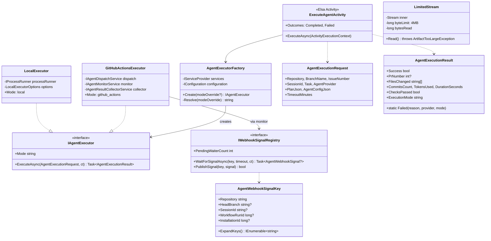
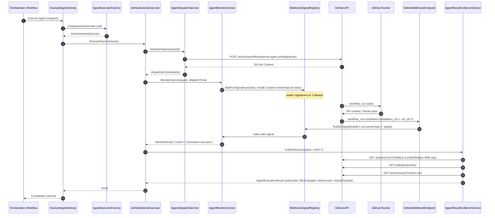

**Status:** **Complete** — 5 implementation stories shipped 2026-04-18..21; 19-6 follow-up in progress (superseded by Epic 28 direction)
**Stories:** 5 active (19-1..19-5) + 19-1 API consolidation + 19-6 follow-up
**Layer:** Layer 3 (Workflow Execution)
**Depends on:** Epic 1 (GitHub platform), Epic 10 (event store), Epic 14 (Elsa), Epic 1.5 (GitHub App)

> **Root topic**: [Agent Dispatch](Agent-Dispatch) — the executor abstraction, hardening timeline, source-file map.
> See [Autonomous Loop](Autonomous-Loop) (Epic 2) for how the orchestrator ends up invoking this plane, and [Epic 17](Epic-17-Multi-Tenancy.md) for tenant-scoped signal keys.

## Overview

Epic 19 is the execution plane that lets Tamma Cloud orchestrate autonomous development agents **without ever seeing the user's code**. Instead of cloning the repo and running Claude Code (or any other agent) on Tamma infrastructure, Tamma dispatches a `workflow_dispatch` event to the user's own GitHub Actions runner via the GitHub App API. The agent runs inside GitHub's compute, operating on a checkout of the user's branch; Tamma monitors the run through the GitHub API, collects the PR and check-run metadata when the run completes, and feeds the result back into the calling Elsa workflow.

Why this matters:

- **Zero data exfiltration risk** — user code, `.env` files, private dependencies never leave GitHub
- **Zero compute cost for Tamma** — the agent's CPU/RAM/disk are GitHub Actions minutes, billed to the user
- **BYO API keys** — Anthropic / OpenAI / etc. keys are GitHub Actions secrets in the user's repo, never handed to Tamma
- **Same workflow in CLI and SaaS** — the `IAgentExecutor` abstraction means `tamma start` (local subprocess) and Tamma Cloud (dispatched runner) run the same Elsa workflow and see the same `AgentExecutionResult` shape

The epic shipped end-to-end during the auth-foundation sprint (2026-04-18..21). Two P1 security findings from the 2026-04-20 code review were closed before merge: tenant-scoped webhook signal keys, and a 4 MB cap on artifact downloads to prevent a compromised agent from OOM-ing the Tamma API.

## Architecture

### Two modes, one interface

| Mode | When | What runs |
|------|------|-----------|
| **Local** | `tamma start` (CLI / self-hosted) | `LocalExecutor` spawns a Node.js subprocess (`packages/cli execute-agent --request <file> --output <file>`) |
| **GitHubActions** | Tamma Cloud (SaaS) | `GitHubActionsExecutor` composes `AgentDispatchService` → `AgentMonitorService` → `AgentResultCollectorService`, all talking to the GitHub API |

The `AgentExecutorFactory` resolves the mode with a four-level precedence: explicit override → `TAMMA_AGENT_MODE` env var → `Agent:ExecutorMode` config → auto (GitHubActions if a GitHub App is configured, else Local). A misconfiguration (e.g. `TAMMA_AGENT_MODE=GitHubActions` with no GitHub App) fails fast at dispatch time via `NullGitHubActionsClient` returning `NotConfigured`.

## Components

| Component | Source | Story | Role |
|-----------|--------|-------|------|
| **`IAgentExecutor`** | `Tamma.Activities/AgentDispatch/IAgentExecutor.cs` | 19-5 | Single-method abstraction: `Task<AgentExecutionResult> ExecuteAsync(AgentExecutionRequest, CancellationToken)` |
| **`LocalExecutor`** | `LocalExecutor.cs` | 19-5 | CLI mode — writes request JSON to `.tamma/exec-request-{sessionId}.json`, spawns Node.js subprocess, reads `.tamma/exec-result-{sessionId}.json` |
| **`GitHubActionsExecutor`** | `GitHubActionsExecutor.cs` | 19-5 | SaaS mode — composes dispatch + monitor + collect services |
| **`AgentExecutorFactory`** | `AgentExecutorFactory.cs` | 19-5 | Mode resolution with 4-level precedence |
| **`ExecuteAgentActivity`** | `ExecuteAgentActivity.cs` | 19-5 | Elsa activity wrapper — single output (`AgentExecutionResult`) regardless of mode |
| **`DispatchAgentWorkflowActivity`** | `DispatchAgentWorkflowActivity.cs` | 19-2 | Elsa activity — dispatches `workflow_dispatch` via GitHub API |
| **`AgentDispatchService`** | `AgentDispatchService.cs` | 19-2 | `POST /repos/{owner}/{repo}/actions/workflows/tamma-agent.yml/dispatches` |
| **`MonitorAgentWorkflowActivity`** | `MonitorAgentWorkflowActivity.cs` | 19-3 | Elsa activity — polls or subscribes to webhook signal |
| **`AgentMonitorService`** | `AgentMonitorService.cs` | 19-3 | Polling loop (30s default) + webhook fast-path; cancellation-aware |
| **`IWebhookSignalRegistry` / `WebhookSignalRegistry`** | `WebhookSignalRegistry.cs` | 19-3 | In-process signal plane; matches `workflow_run.completed` payloads to blocked monitor calls |
| **`AgentWebhookSignalKey`** | `WebhookSignalRegistry.cs` | 19-3 | 3-alias routing key: `run:`, `branch:`, `branch:…:sessionId` — all prefixed `install:{installationId}:` (finding 5 fix) |
| **`InstallationRouterService`** | `Tamma.Api/Services/GitHub/` | 19-3 | Looks up the installation id for an incoming webhook and propagates it to the signal registry |
| **`CollectAgentResultsActivity`** | `CollectAgentResultsActivity.cs` | 19-4 | Elsa activity — reads PR + check-run metadata + artifacts |
| **`AgentResultCollectorService`** | `AgentResultCollectorService.cs` | 19-4 | GitHub API reads; caps artifact downloads via `LimitedStream` (finding 6 fix) |
| **`LimitedStream` / `ArtifactTooLargeException`** | `LimitedStream.cs` | 19-4 | 4 MB cap + non-seekable wrapper so a compromised agent can't DoS the API via a 10 GB artifact |
| **`IGitHubActionsClient` / `NullGitHubActionsClient`** | `IGitHubActionsClient.cs`, `NullGitHubActionsClient.cs` | 19-2, 19-5 | Octokit seam + null fallback for misconfigured GHA mode |
| **`IProcessRunner` / `DefaultProcessRunner`** | `IProcessRunner.cs`, `DefaultProcessRunner.cs` | 19-5 | Subprocess seam for `LocalExecutor`; mockable in tests |
| **`tamma-agent.yml` template** | `docs/stories/epic-19/story-19-1/` | 19-1 | Reusable GitHub Actions workflow shipped to users |
| **`packages/cli execute-agent`** | `packages/cli/src/commands/execute-agent.ts` | 19-5 | CLI side of `LocalExecutor` JSON protocol |

## Class diagram

## Sequence — SaaS mode: dispatch, webhook-mode monitor, collect

## Use cases

| # | Persona | Goal | Mode |
|---|---------|------|------|
| 1 | SaaS user | Assign an issue → Tamma fixes it on my runner | GHA |
| 2 | Self-hosted user | Run Tamma end-to-end without cloud dependency | Local |
| 3 | CLI dev | Test an Elsa workflow locally with a fake runner | Local + mock `IProcessRunner` |
| 4 | SRE | Monitor a long-running agent run without polling | Webhook mode — `workflow_run.completed` wakes `AgentMonitorService` |
| 5 | Security | Ensure a 10 GB malicious artifact can't OOM Tamma API | `LimitedStream` caps at 4 MB + `AgentResultArtifact` field caps (2 KB / 32 KB) |
| 6 | Multi-tenant | Two tenants with Tamma on same `owner/repo` don't cross-wake each other | `install:{id}:` prefix on every `AgentWebhookSignalKey` alias |
| 7 | Ops | Switch a deployment from CLI to SaaS | Set `TAMMA_AGENT_MODE=GitHubActions` + provide GitHub App; no workflow code change |

## Security hardening

Two P1 findings from the 2026-04-20 review closed before merge:

| # | Finding | Severity | Status | Commit |
|---|---------|----------|--------|--------|
| 5 | Webhook signal registry not tenant-scoped | P1 | **Closed** | `9160db1` — `install:{installationId}:` prefix on all alias forms |
| 6 | Unbounded artifact download → OOM | P1 | **Closed** | `ced59bc` — 4 MB cap in `LimitedStream`; field caps (2 KB / 32 KB) in `ParseResultJson` |
| 8 | Arbitrary-length string fields in `AgentResultArtifact` | P2 | **Closed** | Included in `ced59bc` |
| 7 | `LocalExecutor` temp path on shared hosts | P2 | Follow-up | Documented; `TAMMA_AGENT_TMP` env var planned |
| 9 | `DefaultProcessRunner` 250 ms race for stream drain | P2 | Follow-up | Trivial swap to `Task.WhenAll` after `WaitForExitAsync` |

Finding 5 in plain English: without the `install:{id}:` prefix, if two tenants both installed Tamma on the same `owner/repo` (e.g. both tested Tamma on the same popular public repo), a webhook for tenant A's workflow run could wake tenant B's blocked `AgentMonitorService` via the branch-fallback alias and hand B an artifact reference from A's run. The prefix scopes every alias to the GitHub App installation id.

### GitHub App permissions required

| Permission | Access | Purpose |
|-----------|--------|---------|
| `actions` | write | Dispatch `workflow_dispatch`, read run status |
| `contents` | write | Create branches |
| `checks` | read | Read check run results |
| `pull_requests` | read | Read PR metadata, changed files |
| `issues` | read/write | Read issue details, post comments |

## Dependencies

**Upstream**
- [Epic 1](Epic-1-Foundation.md) — `GitHubPlatform` + Octokit
- [Epic 1.5](Epic-1.5-Infrastructure.md) — GitHub App credentials
- [Epic 10](Epic-10-Engine-Core.md) — event store for every dispatch / monitor / collect event
- [Epic 14](Epic-11-14-ELSA.md) — Elsa runtime for the four activities

**Downstream**
- [Epic 2](Epic-2-Autonomous-Loop.md) — orchestrator workflow uses `ExecuteAgentActivity`
- [Epic 17](Epic-17-Multi-Tenancy.md) — webhook signal keys carry installation id (tenant scope)
- [Epic 18](Epic-18-User-Auth.md) — onboarding 18-4 fires the first guided run through this plane
- [Epic 28](Epic-28-DB-Per-Tenant.md) — **supersedes 19-6's direction** (see below)

## Current state

- **Stories 19-1 / 19-2 / 19-3 / 19-4 / 19-5: all Done** (auth-foundation sprint, 2026-04-18..21)
- Story 19-1 consolidation PR landed the `.github/workflows/tamma-agent.yml` template + C# API consolidation
- Webhook-mode monitoring live with `install:{id}:` tenant-scoped alias keying
- 4 MB artifact cap + string clamps live
- Integration + unit + Elsa-activity tests green in `apps/tamma-elsa/tests/Tamma.Activities.Tests/AgentDispatch/`

### Story 19-6 — Phase-3 scaffold, superseded by Epic 28

Story 19-6 ("Wire `TammaAppDbContext` into endpoints + 21 repositories") was the original plan to activate the Epic 17 RLS scaffold at runtime. It landed **partial** code — endpoints and migrated repositories are now routed through `TammaAppDbContext` — and was the cutover that flipped port-gap findings `orgs/002` / `orgs/004` / `admin-db/020` / `admin-db/021` back to **Fixed**.

However, the real isolation story moves to [Epic 28](Epic-28-DB-Per-Tenant.md) in Wave A.5. Epic 28 ships database-per-tenant (`DROP DATABASE` deletion, per-tenant encryption at rest, zero possibility of a forgotten query filter). After Epic 28 lands, the shared-DB RLS scaffold 19-6 wired up is **redundant** — the runtime `TammaAppDbContext` still exists, but its `tamma_app` role is a per-tenant role in a per-tenant DB rather than a shared DB's restricted role. 19-6's remaining work (the 21-repository audit) will continue against the per-tenant model.

**Position**: document 19-6 as "Phase-3 scaffold, superseded by Epic 28 for long-term direction — its wiring PR stands as correct for the shared-DB model and as a stepping stone to the per-tenant DbContext factory in Epic 28 Story 28-3".

## Stories

| # | Title | Priority | Effort | Status |
|---|-------|----------|--------|--------|
| 19-1 | Tamma Agent GitHub Actions Workflow Template | P0 | M | **Done** |
| 19-1 (consolidation) | API consolidation to C# | P0 | L | **Done** |
| 19-2 | Workflow Dispatch from Elsa | P0 | L | **Done** |
| 19-3 | Agent Execution Monitoring (polling + webhook) | P0 | L | **Done** |
| 19-4 | Result Collection (4 MB cap) | P0 | M | **Done** |
| 19-5 | CLI / SaaS Mode Abstraction (`IAgentExecutor`) | P0 | L | **Done** |
| 19-6 | Wire `TammaAppDbContext` app-role context (follow-up) | P1 | M | Partial — superseded by Epic 28 |

## Success metrics

- Workflow dispatch latency: < 2s ✓
- Monitoring poll interval: 30s (configurable), webhook-based < 5s ✓
- End-to-end cycle time: < 15 min for typical issue
- Zero user code on Tamma infrastructure ✓
- 100% audit trail coverage ✓

## See also

- [Agent Dispatch](Agent-Dispatch) — root topic with source-file map
- [Autonomous Loop](Autonomous-Loop) — Epic 2, orchestrator that invokes this plane
- [Epic 17: Multi-Tenancy](Epic-17-Multi-Tenancy.md) — tenant scoping for webhook signals
- [Epic 28: DB-per-Tenant](Epic-28-DB-Per-Tenant.md) — supersedes 19-6 direction
- [Epic 18: User Auth](Epic-18-User-Auth.md) — onboarding fires the first guided run here
- [Stories on GitHub](/stories/epic-19/)

---

_Last updated: 2026-04-22 (auth-foundation sprint complete; 19-6 flagged as superseded by Epic 28)_
