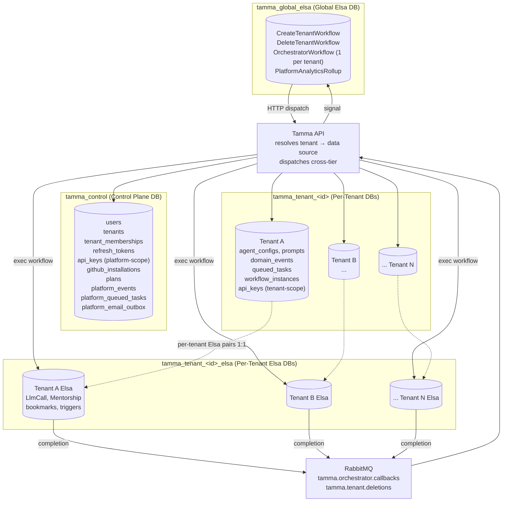
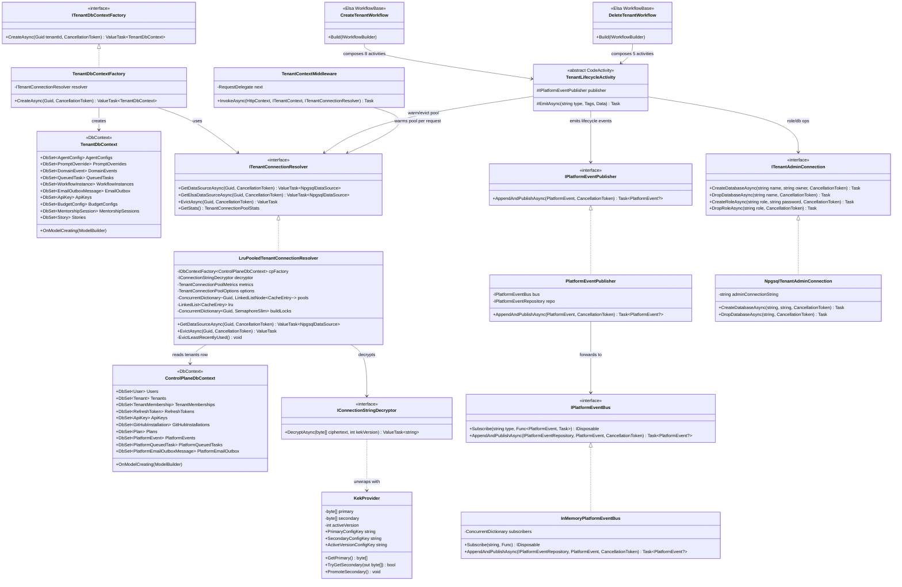
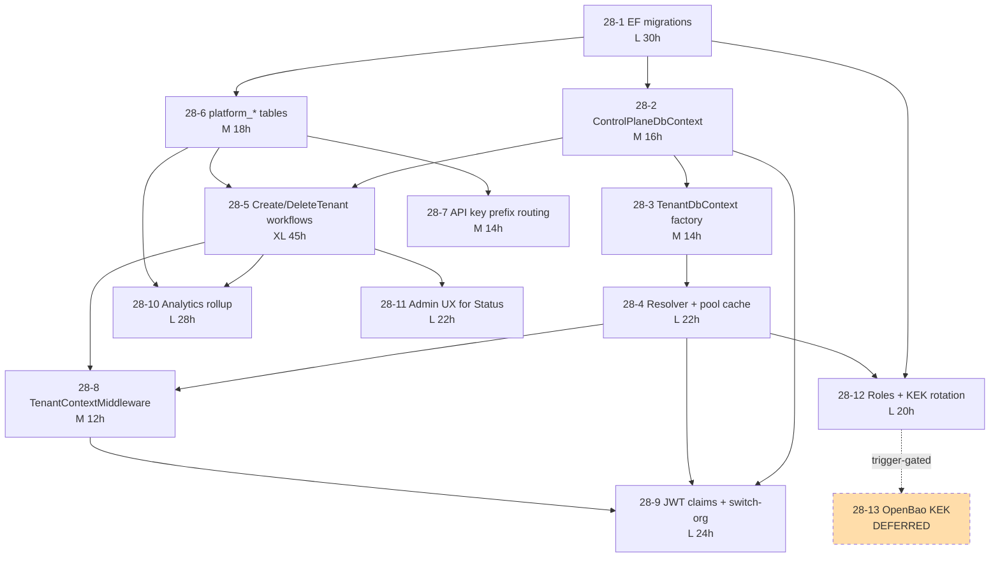

> **Extended/superseded by the unified schema-per-tenant model** — see `docs/superpowers/plans/2026-06-09-unified-schema-per-tenant.md` (complete 2026-06-10).

**Status:** In progress — 28-1/2/3/4/5/6/7/8/9/12 landed (Wave A + A.5); 28-10/11 in flight; 28-13 deferred (trigger-gated)
**Stories:** 12 active (28-1..28-12) + 1 deferred (28-13)
**Layer:** Layer 4 (Foundation + Provisioning + Auth + Operations)
**Depends on:** Epic 17 (`tenants` table — **being superseded**), Epic 1.5 secret-management track (KEK primitives)

> **Overview**: this epic is the definitive tenant-isolation answer for Tamma. It **supersedes Epic 17's shared-DB-with-RLS model**: `TammaDbContext` + `TammaAppDbContext` + `TenantContextInterceptor` are marked for deletion in Wave A.5. See [Epic 17](Epic-17-Multi-Tenancy.md) for the path being retired and [Multi-Tenant Provisioning](Multi-Tenant-Provisioning) for the generalised provisioning plane (Epic 30).

## 1. Overview

Move Tamma from a single shared Postgres database (with a `TenantId` column and EF global query filter) to a database-per-tenant topology with four distinct database tiers:

| Tier | Database name pattern | Schema owner | Purpose |
|------|-----------------------|--------------|---------|
| Control plane | `tamma_control` | `ControlPlaneDbContext` | `users`, `tenants`, `tenant_memberships`, `refresh_tokens`, `api_keys` (platform-scope), `github_installations`, `plans`, `platform_events`, `platform_queued_tasks`, `platform_email_outbox` — 14 CP-resident tables |
| Per-tenant app | `tamma_tenant_<id>` | `TenantDbContext` via factory | `agent_configs`, `prompt_overrides`, `provider_health`, `domain_events`, `queued_tasks`, `workflow_instances`, `email_outbox`, `api_keys` (tenant-scope only), mentorship aggregate, stories — 15+ tables |
| Global Elsa | `tamma_global_elsa` | Elsa-managed | `CreateTenantWorkflow`, `DeleteTenantWorkflow`, `OrchestratorWorkflow` (one instance per active tenant), `PlatformAnalyticsRollup` |
| Per-tenant Elsa | `tamma_tenant_<id>_elsa` | Elsa-managed | Tenant's `LlmCall`, `Mentorship`, workflow bookmarks, triggers |

### Why the shared-DB model had to go

The shared-DB pattern (Epic 17) reached the limit of what query filters can safely guarantee. Any forgotten `HasQueryFilter` is a cross-tenant leak. GDPR "delete me" requires a multi-hour row-by-row purge. Cryptographic tenant isolation is impossible. Database-per-tenant gives us:

- **Constant-time tenant deletion** (`DROP DATABASE` is O(1) regardless of data volume)
- **Per-tenant encryption at rest** (each tenant DB has its own TDE slot)
- **Per-tenant scaling knobs** (`max_connections`, `work_mem`, `shared_buffers` can be tenant-tier-specific)
- **Elimination of an entire bug class** — no query-filter-bypass, no `tenantId` column drift, no join-leak

It unlocks SOC 2 / ISO 27001 tenant-isolation requirements and opens the door to BYO-database and on-prem tiers (see [Epic 30](Epic-30-Pluggable-Provisioning.md)).

### Relationship to Epic 17 (what is being deleted)

Epic 17 shipped the shared-DB model with three artefacts that Epic 28 replaces:

| Epic 17 artefact | Replaced by (Epic 28) | Deletion wave |
|------------------|------------------------|---------------|
| `TammaDbContext` (single context over all tables) | `ControlPlaneDbContext` + `TenantDbContext` | Wave A.5 |
| `TammaAppDbContext` (Phase-3 dual-connection split) | `TenantDbContext` via `ITenantDbContextFactory` | Wave A.5 |
| `TenantContextInterceptor` (RLS + `SET LOCAL app.tenant_id`) | Connection-string discriminator (one DB = one tenant) | Wave A.5 |
| Global query filter `e => e.TenantId == ctx.TenantId` | Implicit discriminator in pool resolver | Wave A.5 |
| `tenants.cranl_*` columns (provisioning metadata) | Moved to Epic 30 provider abstraction | Epic 30 Story 30-1 |

Wave A.5 is the sweep that removes `TammaDbContext`, `TammaAppDbContext`, and `TenantContextInterceptor` once every endpoint has migrated to the CP/Tenant split.

## 2. Architecture

### 2.1 Topology



### 2.2 DbContext architecture (the centre of Epic 28)

```mermaid
graph TB
    subgraph Shared["SHARED across every request"]
        CP_DS[NpgsqlDataSource<br/>tamma_control]
        CP_CTX[ControlPlaneDbContext<br/>scoped per request]
        CP_REPOS{{"9 CP-scoped repositories<br/>UserRepository<br/>TenantRepository<br/>MembershipRepository<br/>RefreshTokenRepository<br/>PlatformEventRepository<br/>PlatformQueuedTaskRepository<br/>PlatformEmailOutboxRepository<br/>ApiKeyRepository (platform-scope)<br/>GitHubInstallationRepository"}}
    end

    subgraph PerTenant["PER TENANT — built on demand"]
        FACTORY[ITenantDbContextFactory<br/>CreateAsync&#40;tenantId&#41;]
        RESOLVER[ITenantConnectionResolver<br/>&#40;LruPooledTenantConnectionResolver&#41;]
        POOL[LRU pool cache<br/>max 1024 pools<br/>10 max conns each]
        T_DS[NpgsqlDataSource<br/>tamma_tenant_&lt;id&gt;<br/>one per cached tenant]
        T_CTX[TenantDbContext<br/>short-lived, per call]
        T_REPOS{{"10 tenant-scoped repositories<br/>AgentConfigRepository<br/>PromptOverrideRepository<br/>DomainEventRepository<br/>QueuedTaskRepository<br/>WorkflowInstanceRepository<br/>EmailOutboxRepository<br/>BudgetConfigRepository<br/>ApiKeyRepository (tenant-scope)<br/>MentorshipRepository<br/>StoryRepository"}}
    end

    subgraph Deleted["DELETED in Wave A.5 — superseded"]
        OLD1["TammaDbContext<br/>(single shared context)"]
        OLD2["TammaAppDbContext<br/>(Phase-3 dual-connection)"]
        OLD3["TenantContextInterceptor<br/>(RLS SET LOCAL)"]
    end

    CP_REPOS --> CP_CTX --> CP_DS
    T_REPOS --> T_CTX --> FACTORY --> RESOLVER --> POOL --> T_DS

    style Deleted fill:#ffdddd,stroke:#d00,stroke-width:2px,stroke-dasharray: 5 5
    style OLD1 fill:#ffdddd
    style OLD2 fill:#ffdddd
    style OLD3 fill:#ffdddd
```



The **9 + 10 repository split** is the observable contract across the codebase: if a repository needs `ControlPlaneDbContext` it joins the CP-scoped pool; if it needs `TenantDbContext` it goes through the factory.

### 2.3 Connection resolution flow

```mermaid
flowchart LR
    A[Request arrives] --> B[TenantContextMiddleware]
    B --> C{Tenant id<br/>resolved?}
    C -->|No| D[Pass through<br/>to next middleware]
    C -->|Yes| E[resolver.GetDataSourceAsync&#40;tenantId&#41;]
    E --> F{Pool<br/>cache hit?}
    F -->|Hit| G[Return warm<br/>NpgsqlDataSource]
    F -->|Miss| H[Per-tenant semaphore<br/>coalesces thundering herd]
    H --> I[Load tenants row<br/>from ControlPlaneDbContext]
    I --> J{Status = active?}
    J -->|No| K[Throw<br/>TenantNotProvisioned]
    J -->|Yes| L[Decrypt EncryptedConnectionString<br/>via IConnectionStringDecryptor]
    L --> M[Build NpgsqlDataSource<br/>with per-tenant pool settings]
    M --> N[Insert into LRU cache<br/>evict LRU on overflow]
    N --> G
    G --> O[Handler calls<br/>factory.CreateAsync&#40;tenantId&#41;]
    O --> P[Run query against<br/>tenant DB]
```



## 3. Components

### 3.1 Control plane (shared across all tenants)

| Component | Type | File | Stories |
|-----------|------|------|---------|
| `ControlPlaneDbContext` | `DbContext` | `Tamma.Data/ControlPlaneDbContext.cs` | 28-1, 28-2, 28-6 |
| `ControlPlaneDesignTimeDbContextFactory` | design-time factory | `Tamma.Data/ControlPlaneDesignTimeDbContextFactory.cs` | 28-1 |
| Migrations | `Migrations/ControlPlane/` | CP DDL (14 tables) | 28-1, 28-6, 28-12 |
| `IPlatformEventRepository` | repository | `Tamma.Data/Repositories/` | 28-6 |
| `IPlatformQueuedTaskRepository` | repository | `Tamma.Data/Repositories/` | 28-6 |
| `IPlatformEmailOutboxRepository` | repository | `Tamma.Data/Repositories/` | 28-6 |
| `IPlatformEventBus` / `InMemoryPlatformEventBus` | in-proc pub/sub | `Tamma.Api/Services/PlatformEvents/` | 28-5, 28-6 |
| `IPlatformEventPublisher` / `PlatformEventPublisher` | port consumed by activities | `Tamma.Data/Abstractions/` + `Tamma.Api/Services/PlatformEvents/` | 28-5, 28-6 |

### 3.2 Per-tenant data plane

| Component | Type | File | Stories |
|-----------|------|------|---------|
| `TenantDbContext` | `DbContext` | `Tamma.Data/TenantDbContext.cs` | 28-1, 28-3 |
| `ITenantDbContextFactory` | factory interface | `Tamma.Data/Abstractions/ITenantDbContextFactory.cs` | 28-3 |
| `TenantDbContextFactory` | default implementation | `Tamma.Data/TenantDbContextFactory.cs` | 28-3 |
| `TenantDesignTimeDbContextFactory` | design-time | `Tamma.Data/TenantDesignTimeDbContextFactory.cs` | 28-1 |
| `ITenantConnectionResolver` | resolver port | `Tamma.Data/Abstractions/ITenantConnectionResolver.cs` | 28-3 |
| `LruPooledTenantConnectionResolver` | production resolver | `Tamma.Data/Pooling/LruPooledTenantConnectionResolver.cs` | 28-4 |
| `TenantConnectionPoolOptions` | bound config | `Tamma.Data/Pooling/TenantConnectionPoolOptions.cs` | 28-4 |
| `TenantConnectionPoolMetrics` | diagnostics | `Tamma.Data/Pooling/TenantConnectionPoolMetrics.cs` | 28-4 |
| `IConnectionStringDecryptor` / `PassthroughConnectionStringDecryptor` | envelope | `Tamma.Data/Abstractions/` + `Tamma.Data/Pooling/` | 28-4, 28-12 |
| `ITenantAdminConnection` / `NpgsqlTenantAdminConnection` | role/DB admin API | `Tamma.Data/Abstractions/` + `Tamma.Data/Pooling/` | 28-4, 28-5 |
| `EfTenantDbMigrator` / `ITenantDbMigrator` | migration runner | `Tamma.Data/Pooling/` + `Tamma.Data/Abstractions/` | 28-5 |
| `TenantNaming` | naming helpers | `Tamma.Data/Pooling/TenantNaming.cs` | 28-4, 28-5 |

### 3.3 Tenant-lifecycle workflow (global Elsa)

| Component | Type | File | Stories |
|-----------|------|------|---------|
| `CreateTenantWorkflow` | Elsa `WorkflowBase` | `Tamma.ElsaServer/Workflows/CreateTenantWorkflow.cs` | 28-5 |
| `DeleteTenantWorkflow` | Elsa `WorkflowBase` | `Tamma.ElsaServer/Workflows/DeleteTenantWorkflow.cs` | 28-5 |
| `MarkProvisioningActivity` | Elsa code activity | `Tamma.Activities/TenantLifecycle/` | 28-5 |
| `CreateTenantRoleActivity` | Elsa code activity | `Tamma.Activities/TenantLifecycle/` | 28-5 |
| `CreateTenantDatabaseActivity` | Elsa code activity | `Tamma.Activities/TenantLifecycle/` | 28-5 |
| `BuildTenantConnectionStringActivity` | Elsa code activity | `Tamma.Activities/TenantLifecycle/` | 28-5 |
| `MigrateTenantDatabaseActivity` | Elsa code activity | `Tamma.Activities/TenantLifecycle/` | 28-5 |
| `SeedTenantDefaultsActivity` | Elsa code activity | `Tamma.Activities/TenantLifecycle/` | 28-5 |
| `EncryptAndPersistConnectionStringActivity` | Elsa code activity | `Tamma.Activities/TenantLifecycle/` | 28-5 |
| `WarmTenantPoolActivity` | Elsa code activity | `Tamma.Activities/TenantLifecycle/` | 28-5 |
| `MarkTenantActiveActivity` | Elsa code activity | `Tamma.Activities/TenantLifecycle/` | 28-5 |
| `MarkTenantDeletingActivity` | Elsa code activity | `Tamma.Activities/TenantLifecycle/` | 28-5 |
| `EvictTenantPoolActivity` | Elsa code activity | `Tamma.Activities/TenantLifecycle/` | 28-5 |
| `DropTenantDatabaseActivity` | Elsa code activity | `Tamma.Activities/TenantLifecycle/` | 28-5 |
| `DropTenantRoleActivity` | Elsa code activity | `Tamma.Activities/TenantLifecycle/` | 28-5 |
| `EmitDeletedSuccessActivity` | Elsa code activity | `Tamma.Activities/TenantLifecycle/` | 28-5 |

### 3.4 Auth + request pipeline

| Component | Type | File | Stories |
|-----------|------|------|---------|
| `ApiKeyPrefixGenerator` / `ApiKeyPrefixParser` | prefix router | `Tamma.Api/Auth/` | 28-7 |
| `ApiKeyAuthHandler` | ASP.NET auth handler | `Tamma.Api/Auth/ApiKeyAuthHandler.cs` | 28-7 |
| `TenantContextMiddleware` | middleware | `Tamma.Api/Middleware/TenantContextMiddleware.cs` | 28-8 |
| `JwtService` | JWT issuer + validator | `Tamma.Api/Auth/JwtService.cs` | 28-9 |
| `/auth/switch-org` endpoint | minimal endpoint | `Tamma.Api/Endpoints/AuthEndpoints.cs` | 28-9 |

### 3.5 KEK + rotation (Operations)

| Component | Type | File | Stories |
|-----------|------|------|---------|
| `KekProvider` | process-wide KEK cabinet | `Tamma.Api/Services/Secrets/KekProvider.cs` | 28-12 |
| `KekRotationCoordinator` | rotation orchestrator | `Tamma.Api/Services/Secrets/KekRotationCoordinator.cs` | 28-12 |
| `KekRotationStatus` | probe shape | `Tamma.Api/Services/Secrets/KekRotationStatus.cs` | 28-12 |
| `AesGcmConnectionStringDecryptor` | envelope decrypt | `Tamma.Api/Services/Secrets/` | 28-12 |

## 4. Class diagram



## 5. Sequence diagrams

### 5.1 Tenant provisioning — from verify-email click to `Status = active`

```mermaid
sequenceDiagram
    actor User
    participant API as Tamma API
    participant CP as ControlPlaneDbContext
    participant Bus as IPlatformEventBus
    participant GE as Global Elsa
    participant WF as CreateTenantWorkflow
    participant Admin as NpgsqlTenantAdminConnection
    participant Resolver as LruPooledTenantConnectionResolver
    participant KEK as KekProvider
    participant T_DB as tenant DB

    User->>API: POST /auth/verify-email?token=...
    API->>CP: Update tenants SET Status='provisioning'
    API->>Bus: AppendAndPublishAsync(TENANT.PROVISIONING_REQUESTED)
    Bus-->>CP: INSERT platform_events
    Bus-->>GE: signal correlated workflow
    GE->>WF: start CreateTenantWorkflow(tenantId)

    Note over WF: Step 1 — MarkProvisioningActivity
    WF->>CP: UPDATE tenants Status='provisioning', Attempt=1
    WF->>Bus: TENANT.PROVISIONING.STARTED

    Note over WF: Step 2 — CreateTenantRoleActivity
    WF->>Admin: CREATE ROLE tamma_tenant_<id>
    Admin-->>WF: role + generated password

    Note over WF: Step 3 — CreateTenantDatabaseActivity
    WF->>Admin: CREATE DATABASE tamma_tenant_<id> OWNER ...

    Note over WF: Step 4 — BuildTenantConnectionStringActivity (in-memory only)
    WF-->>WF: compose Host=...;Database=...;Username=...;Password=...

    Note over WF: Step 5 — MigrateTenantDatabaseActivity
    WF->>T_DB: EfTenantDbMigrator.MigrateAsync (run Tenant migrations)

    Note over WF: Step 6 — SeedTenantDefaultsActivity
    WF->>T_DB: seed agent_configs / prompt_overrides defaults

    Note over WF: Step 7 — EncryptAndPersistConnectionStringActivity
    WF->>KEK: GetPrimary() + version
    WF->>CP: UPDATE tenants SET EncryptedConnectionString, KekVersion

    Note over WF: Step 8 — WarmTenantPoolActivity
    WF->>Resolver: GetDataSourceAsync(tenantId) (primes LRU cache)

    Note over WF: Step 9 — MarkTenantActiveActivity
    WF->>CP: UPDATE tenants SET Status='active'
    WF->>Bus: TENANT.CREATED.SUCCESS
    WF->>CP: INSERT platform_email_outbox (welcome email)

    GE-->>API: workflow completed
    API-->>User: dashboard redirect
```

### 5.2 Per-request flow — JWT → middleware → factory → tenant DB query

```mermaid
sequenceDiagram
    actor Client
    participant API as ASP.NET pipeline
    participant Jwt as JwtService
    participant Mw as TenantContextMiddleware
    participant Ctx as ITenantContext
    participant Resolver as LruPooledTenantConnectionResolver
    participant LRU as LRU cache
    participant CP as ControlPlaneDbContext
    participant KEK as KekProvider
    participant Factory as ITenantDbContextFactory
    participant TenantCtx as TenantDbContext
    participant T_DB as tenant DB

    Client->>API: GET /api/v1/agents (Bearer: jwt)
    API->>Jwt: ValidateToken(bearer)
    Jwt-->>API: ClaimsPrincipal{ sub, tid }

    API->>Mw: InvokeAsync
    Mw->>Ctx: read TenantId claim
    Ctx-->>Mw: tid = tenant-A

    Mw->>Resolver: GetDataSourceAsync(tenant-A)
    Resolver->>LRU: TryGetValue(tenant-A)

    alt cache hit
        LRU-->>Resolver: warm NpgsqlDataSource
        Resolver->>LRU: move node to MRU head
    else cache miss
        Resolver->>Resolver: await per-tenant semaphore
        Resolver->>CP: SELECT EncryptedConnectionString, KekVersion, Status FROM tenants
        CP-->>Resolver: row
        alt Status != 'active'
            Resolver-->>Mw: throw TenantNotProvisioned
            Mw-->>Client: 409 / 401
        end
        Resolver->>KEK: GetKek(kekVersion)
        KEK-->>Resolver: 32-byte key
        Resolver->>Resolver: AES-GCM decrypt → plaintext connstr
        Resolver->>Resolver: build NpgsqlDataSource (pool 0..10)
        Resolver->>LRU: insert; evict LRU if full
    end

    Resolver-->>Mw: NpgsqlDataSource (pool)

    Mw->>Ctx: bind TenantId + DataSource
    Mw->>API: await next()

    API->>Factory: CreateAsync(tenant-A)
    Factory->>Resolver: GetDataSourceAsync(tenant-A)  [hot — cache hit]
    Factory->>TenantCtx: new TenantDbContext(options bound to DS)
    Factory-->>API: ctx

    API->>TenantCtx: AgentConfigs.ToListAsync()
    TenantCtx->>T_DB: SELECT * FROM agent_configs
    T_DB-->>TenantCtx: rows
    TenantCtx-->>API: List~AgentConfig~
    API-->>Client: 200 { agents: [...] }

    Note over TenantCtx: await using disposes ctx;<br/>NpgsqlDataSource stays warm in LRU
```

## 6. Use cases

### UC-28-01: New tenant signs up, verifies email, gets an active tenant DB

1. User `POST /auth/register` → CP inserts `users` + `tenants{Status='pending_verification'}` + `tenant_memberships` + `platform_events: USER.REGISTERED`.
2. Verification email delivered via `platform_email_outbox` (CP — decoupled from tenant DB which doesn't exist yet).
3. User clicks link → `POST /auth/verify-email` flips `tenants.Status='provisioning'` + emits `TENANT.PROVISIONING_REQUESTED`.
4. Global Elsa's `CreateTenantWorkflow` correlates on the event, runs the 8-step provisioning (§5.1), finishes with `tenants.Status='active'` and `TENANT.CREATED.SUCCESS`.
5. Welcome email enqueued to `platform_email_outbox` (design decision #2 — control plane, not tenant outbox).

### UC-28-02: Every API request routes to the right tenant DB

Every authenticated request flows through the per-request sequence (§5.2). Three tenant sources, in priority order: (1) API-key prefix (`tk_t_*` / `tk_pl_*` / `tk_u_*`), (2) JWT `tid` claim, (3) GitHub installation lookup. Platform-scope routes (`/api/v1/admin/*`, `/api/auth/*`, `/health`, `/swagger`) bypass resolution.

### UC-28-03: Tenant deletion is O(1)

1. Operator (or tenant owner) hits `DELETE /api/v1/admin/tenants/{id}` → CP sets `tenants.Status='delete_requested'` + `DeleteRequestedAt=now()` + emits `TENANT.DELETE_REQUESTED`.
2. Cooling-off window elapses (default 24h — dashboard shows countdown; admin UX Story 28-11).
3. Global Elsa `DeleteTenantWorkflow` fires: `MarkTenantDeleting` → `EvictTenantPool` → `DropTenantDatabase` → `DropTenantRole` → `EmitDeletedSuccess`.
4. Total wall-clock independent of tenant data volume — a 10-event tenant and a 10M-event tenant both finish in < 30s.

### UC-28-04: Admin impersonates a tenant via `/auth/switch-org`

1. Platform admin calls `POST /auth/switch-org` with `tenantId=target`.
2. JWT re-issued with new `tid=target`, existing refresh-token chain revoked, new refresh-token bound to the new tenant (Story 28-9).
3. Audit event `ADMIN.SWITCH_ORG` lands in `platform_events` with `{ fromTid, toTid, adminUserId }`.
4. Subsequent requests resolve to target tenant's DB via the per-request flow.

### UC-28-05: KEK rotation without downtime

1. Operator sets `Tamma:Kek:Secondary` env var (new 32-byte base64) and bumps `Tamma:Kek:ActiveVersion` to N+1.
2. `KekProvider` loads both keys at startup; decryption tries primary, falls back to secondary.
3. `KekRotationCoordinator` sweeps `tenants WHERE KekVersion < N+1`, decrypts with old key, re-encrypts with new key, bumps `KekVersion`.
4. When zero rows remain at the old version, operator clears `Secondary` and the rotation is done.

### UC-28-06: Cross-tenant leak tests (the validation gate)

The 12 scenarios that must all pass with zero leaked data (success metric #4):

1. Query without tenant context — fails closed
2. Stale JWT with old `tid` — rejected
3. API key routed to wrong tenant — prefix mismatch blocks
4. Workflow-variable tenant spoof — resolver-side check
5. Admin impersonation exit — session invalidated
6. Pool-cache eviction mid-request — grace-drained
7. Concurrent switch-org — refresh token revocation
8. Connection-string decrypt with wrong KEK — cryptographic exception
9. Forgotten `TenantId` in raw SQL query — CP/Tenant split makes this a compile error
10. Webhook routing with unresolved installation — 404
11. Rootless JWT hitting tenant-scoped route — 401
12. Orphaned `user_id` from a deleted user — filtered by soft-delete

## 7. Dependencies

### Upstream

- **Epic 17** — `tenants` table shape (from Story 17-1). **Being retired**: `TammaDbContext` / `TammaAppDbContext` / `TenantContextInterceptor` delete in Wave A.5.
- **Epic 1.5** secret-management track (1.5-16 onward) — KEK primitives, vault store, LLM-safe rotation activities.

### Downstream

- [Epic 19](Epic-19-Agent-Dispatch.md) — Story 19-6 wires `TenantDbContext` into agent-dispatch endpoints (closes the Phase-3 RLS scaffolding gap).
- [Epic 27](Epic-27-Prompt-Store.md) — prompt overrides live on `TenantDbContext`; depends on 28-3 factory.
- [Epic 29](Epic-29-Secret-Management.md) — secret cabinet uses 28-3 for per-tenant secret scope and 28-9 switch-org flow.
- [Epic 30](Epic-30-Pluggable-Provisioning.md) — generalises 28-5 `CreateTenantWorkflow` dispatch to per-backend handlers.
- [Epic 31](Epic-31-Multi-Git-Platform.md) — per-tenant platform routing uses 28-9 JWT claims.
- [Epic 33](Epic-33-Per-Tenant-IdP.md) — tenant lifecycle hooks (when activated).

### Dependency graph (internal)



## 8. Current state

### Landed (this session — 2026-04)

- **28-1** — EF migration scripts: four migration sets (CP, tenant, global-Elsa, per-tenant Elsa) all run clean on fresh Postgres 17, idempotent.
- **28-2** — `ControlPlaneDbContext` live with 14 DbSets; 9 CP-scoped repositories inject it.
- **28-3** — `ITenantDbContextFactory` + stub resolver + DI wiring.
- **28-4** — `LruPooledTenantConnectionResolver` in production: concurrent-dictionary hot path, per-tenant semaphore cold path, tenant-row cache, LRU eviction with async dispose.
- **28-5** — `CreateTenantWorkflow` + `DeleteTenantWorkflow` on global Elsa with the 16 tenant-lifecycle code activities in `Tamma.Activities/TenantLifecycle/`.
- **28-6** — `platform_events`, `platform_queued_tasks`, `platform_email_outbox` tables + repositories + `IPlatformEventPublisher` port + `InMemoryPlatformEventBus`.
- **28-7** — API-key prefix routing (`tk_t_` / `tk_pl_` / `tk_u_`) with `ApiKeyPrefixParser` + `ApiKeyAuthHandler`.
- **28-8** — `TenantContextMiddleware` resolves tenant from 4 sources and warms the resolver pool; fails fast on `TenantNotFoundException` / `TenantNotProvisionedException`.
- **28-9** — JWT `tid` claim + `/auth/switch-org` + cross-tenant refresh-token chain.
- **28-12** — `KekProvider` (primary / secondary / active-version) + `KekRotationCoordinator` + `AesGcmConnectionStringDecryptor`.

### In flight

- **28-10** — `platform_analytics_hourly` rollup workflow (needs 28-5 + 28-6 landed — unblocked).
- **28-11** — Admin UX for `tenants.Status` state machine (needs 28-5 — unblocked).

### Deferred / trigger-gated

- **28-13** — OpenBao KMS backend for tenant KEK. Env-var KEK (Doc 01 §8.2) is shipping; OpenBao waits for one of: paying tenants with breach clauses, compliance finding, threat-model change, OpenBao LF-graduation. Memory: `project_epic28_kek_decision.md`. The `ISecretsService` seam stays intact so activation is a driver swap.

### Drift findings (2026-04-22 audit)

- `TammaDbContext` and `TammaAppDbContext` still referenced by some endpoint groups not yet migrated; Wave A.5 closes the gap.
- The "rotation-driven invalidation gap" documented in `LruPooledTenantConnectionResolver.cs` — no `IPlatformEventBus` subscription wires `TENANT.CONNECTION_STRING_ROTATED.SUCCESS` → `EvictAsync` yet. Mechanical to wire once 28-12 rotation handler lands the event.
- Mentorship / Story aggregates were ported onto `TenantDbContext` with legacy POCO `TenantId` fields `Ignore()`d — clean up in Wave A.5 POCO sweep.

## 9. See also

- [Multi-Tenant Provisioning](Multi-Tenant-Provisioning) — Epic 30 topic page (generalised provisioning plane)
- [Epic 17](Epic-17-Multi-Tenancy.md) — the shared-DB/RLS model being retired
- [Epic 29](Epic-29-Secret-Management.md) — secret cabinet that consumes 28-3 factory + 28-12 KEK
- [Epic 30](Epic-30-Pluggable-Provisioning.md) — per-backend provisioner dispatch built on 28-5
- [Epic 31](Epic-31-Multi-Git-Platform.md) — per-tenant platform routing built on 28-9 claims
- [Epic 33](Epic-33-Per-Tenant-IdP.md) — per-tenant IdP (deferred) consumes 28 tenant lifecycle hooks
- Design docs:
  - `docs/stories/plans/db-per-tenant/01-control-plane-split.md`
  - `docs/stories/plans/db-per-tenant/02-elsa-two-tier.md`
  - `docs/stories/plans/db-per-tenant/03-async-tenant-provisioning.md`
  - `docs/stories/plans/db-per-tenant/04-connection-pool-and-delete.md`
  - `docs/stories/plans/db-per-tenant/00-sequencing.md`
- Story files: [Epic 28 on GitHub](/stories/epic-28/)

---

_Last updated: 2026-04-22_
