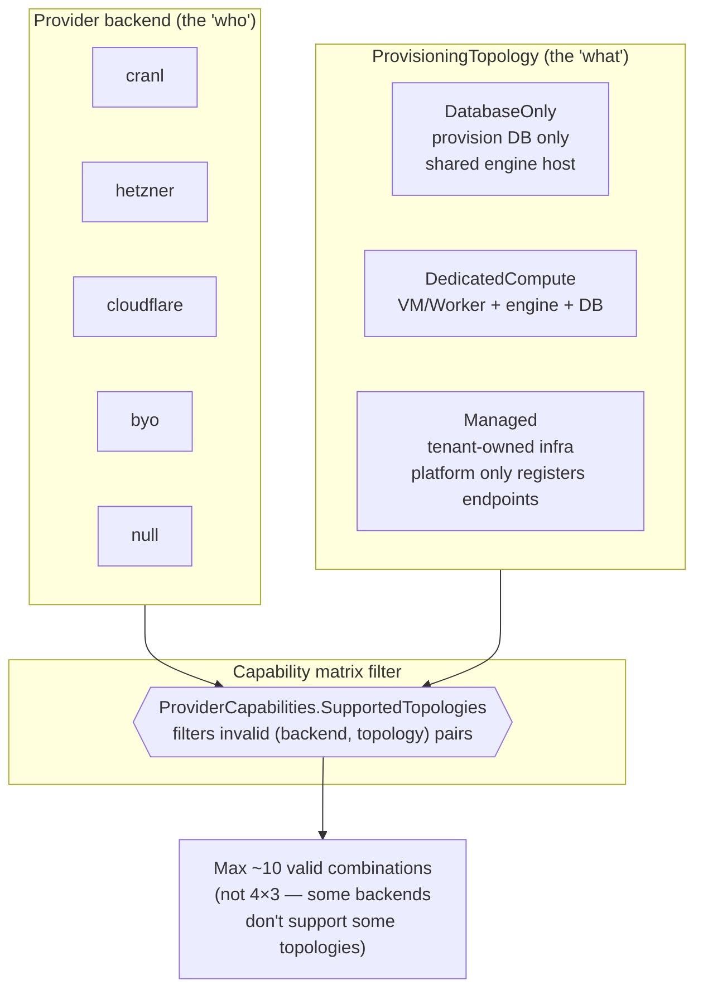
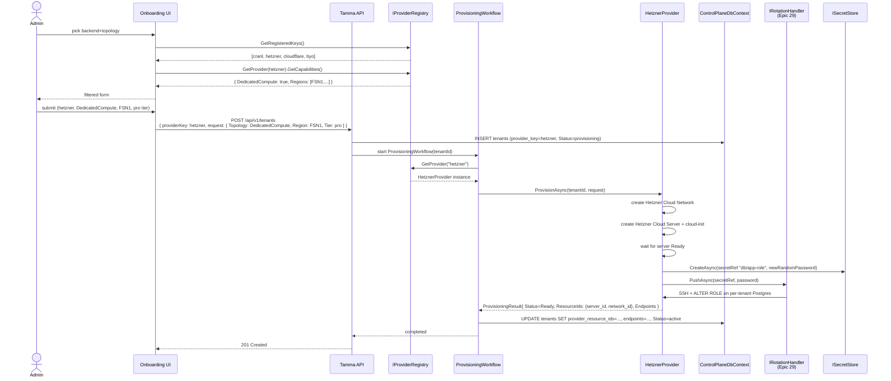
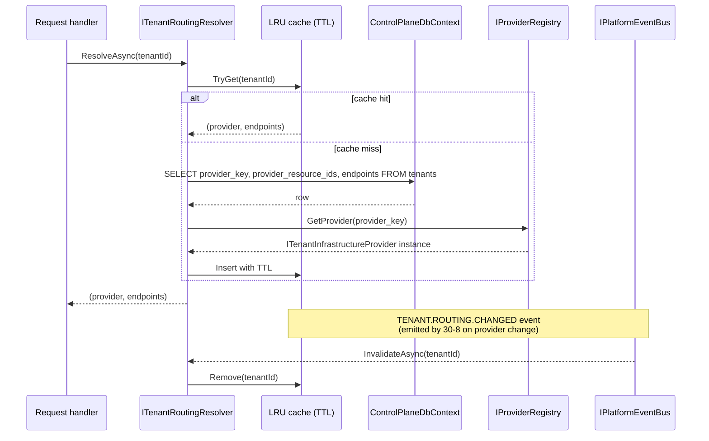
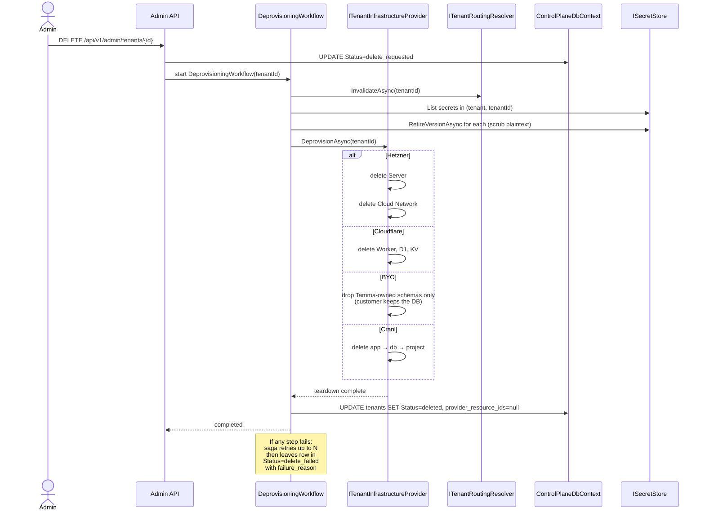
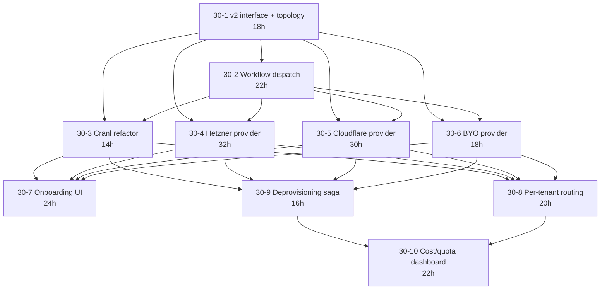

**Status:** Planning (briefs + impl plans authored 2026-04-20)
**Stories:** 10 (30-1 through 30-10), ~216h
**Layer:** Layer 5 (validation + scale-out)
**Depends on:** Epic 28 (tenant DbContext factory, tenant lifecycle workflows), Epic 29 Stories 29-6..29-8 (rotation primitive + handlers)

> **Overview**: [Multi-Tenant Provisioning](Multi-Tenant-Provisioning) — root-level topic page with the v2 abstraction, topology enum, capability matrix, and per-backend semantics.

## 1. Overview

Today `ITenantProvisioner` has two implementations: `Null` (dev fallback) and `Cranl`. Everything else about the tenant plane — the connection string, the engine host, the DB topology — is Cranl-specific. Epic 30 generalises the provisioning plane: one interface, multiple backends, multiple topologies, selectable per tenant at onboarding.

Customer asks that drive this epic:

- **BYO** tenants — enterprise accounts on their own Postgres + their own Elsa runner; Tamma registers endpoints and routes traffic but doesn't provision infrastructure
- **Hetzner Cloud** tenants — dedicated VPS per tenant for data-residency / performance customers
- **Cloudflare Workers for Platforms** tenants — edge-deployed engine + D1 DB; lowest-cost tier
- **Hybrid topologies** — a premium tenant on Hetzner for compute but connected to a customer-owned RDS instance for data

User design intent (2026-04-20):

> Cranl and maybe other replacements — either VPS-based DB servers, or Cloudflare or any DB provider — will allow tenant DBs to be created on the fly, physical or virtual servers, not just DBs per tenant.

### Non-goals

- Does not add more AI providers, Git platforms, or CI integrations (separate epics)
- Does not implement CDN caching / cold-start mitigation for Cloudflare (handled by Cloudflare's platform)
- Does not ship billing / invoicing (downstream billing epic consumes 30-10)
- Does not introduce region-failover or DR (future epic)

## 2. Architecture

### 2.1 Three orthogonal dimensions



### 2.2 V2 interface vs V1 Cranl-only interface

```mermaid
graph TB
    subgraph V1["V1 (today — being retired by 30-1)"]
        V1_IF[ITenantProvisioner<br/>Cranl-shaped]
        V1_CRANL[CranlTenantProvisioner]
        V1_NULL[NullTenantProvisioner]
        V1_IF <|.. V1_CRANL
        V1_IF <|.. V1_NULL
    end

    subgraph V2["V2 (30-1 lands)"]
        V2_IF[ITenantInfrastructureProvider]
        V2_REG[IProviderRegistry<br/>keyed DI]
        V2_CRANL[CranlProvider<br/>30-3]
        V2_HET[HetznerProvider<br/>30-4]
        V2_CF[CloudflareProvider<br/>30-5]
        V2_BYO[ByoProvider<br/>30-6]
        V2_NULL[NullProvider]
        V2_IF <|.. V2_CRANL
        V2_IF <|.. V2_HET
        V2_IF <|.. V2_CF
        V2_IF <|.. V2_BYO
        V2_IF <|.. V2_NULL
        V2_REG --> V2_IF
    end

    subgraph Shim["V1-on-V2 shim"]
        SHIM["Deprecated ITenantProvisioner<br/>delegates to registry.GetProvider('cranl')"]
    end

    V1_IF -.retired.-> SHIM
    SHIM --> V2_REG

    style V1 fill:#ffddaa,stroke-dasharray: 5 5
    style SHIM fill:#ffeecc
```

### 2.3 Capability matrix (initial)

| Provider | DatabaseOnly | DedicatedCompute | Managed | Regions | Notes |
|----------|--------------|-------------------|---------|---------|-------|
| cranl | no | yes | no | US / EU | existing Cranl project = project + db + app |
| hetzner | yes (stretch) | yes | no | FSN1, NBG1, HEL1, ASH, HIL | Cloud API + cloud-init |
| cloudflare | yes | yes | no | global (D1 regional) | D1 + Workers + KV |
| byo | no | no | yes | (tenant-specified) | validate on intake, run migrations |
| null | yes (shared in-process) | no | no | — | dev fallback |

Matrix drives the onboarding UI (Story 30-7) — UI never shows invalid combinations.

## 3. Components

### 3.1 Abstraction layer (Story 30-1)

| Component | Type | Status |
|-----------|------|--------|
| `ITenantInfrastructureProvider` | interface | Planned |
| `ProvisioningTopology` | enum (`DatabaseOnly`, `DedicatedCompute`, `Managed`) | Planned |
| `ProvisioningRequest` | record (topology, region, tier, custom-name, existing-db-url?, existing-engine-url?, extra-tags) | Planned |
| `ProvisioningResult` | record (status, provider-resource-ids dict, endpoints, duration, failure-reason?) | Planned |
| `ProviderCapabilities` | record (supported-topologies, regions, max-tenants-per-org?, cost-units-per-month?, features bit-flags) | Planned |
| `TenantEndpoints` | record (db-connection-info, engine-host, engine-url, custom-domain?) | Planned |
| `IProviderRegistry` | keyed DI resolver | Planned |
| `ITenantProvisioner` (v1 shim) | deprecated; delegates to `registry.GetProvider("cranl")` | Planned |

### 3.2 Provisioning workflow (Story 30-2)

Reshapes Epic 28's `CreateTenantWorkflow` to dispatch per-backend:

| Component | Type | Story |
|-----------|------|-------|
| `ProvisioningWorkflow` | Elsa workflow with dispatch step | 30-2 |
| `ProvisionInfrastructureActivity` | calls `registry.GetProvider(request.ProviderKey).ProvisionAsync(...)` | 30-2 |
| `ProbeProvisioningStatusActivity` | polls provider until Ready/Failed | 30-2 |
| `PersistProviderEndpointsActivity` | writes `TenantEndpoints` into CP `tenants.provider_resource_ids` (jsonb) + `tenants.provider_key` | 30-2 |
| `CompensateProvisioningActivity` | on failure, calls `DeprovisionAsync` | 30-2 |

### 3.3 Backend drivers

| Driver | Story | Key techs |
|--------|-------|-----------|
| `CranlProvider` | 30-3 | refactor of existing `CranlTenantProvisioner` to v2 |
| `HetznerProvider` | 30-4 | Hetzner Cloud API + cloud-init + per-tenant private network |
| `CloudflareProvider` | 30-5 | Workers for Platforms + D1 + KV + wrangler API |
| `ByoProvider` | 30-6 | validate external DB connection + check migration table |
| `NullProvider` | 30-1 | dev fallback; always present |

### 3.4 Onboarding + routing + ops

| Component | Story | Purpose |
|-----------|-------|---------|
| Backend+topology picker UI | 30-7 | filters to valid combos from capability matrix |
| `ITenantRoutingResolver` | 30-8 | resolves `tenantId` → `(provider, endpoints)` for every request |
| Deprovisioning saga | 30-9 | per-backend teardown with compensation |
| Cost + quota dashboard | 30-10 | consumes `ProviderCapabilities.CostUnitsPerMonth` + live usage |

## 4. Class diagram

```mermaid
classDiagram
    class ITenantInfrastructureProvider {
        <<interface>>
        +string ProviderKey
        +GetCapabilities() ProviderCapabilities
        +ProvisionAsync(Guid tenantId, ProvisioningRequest, CancellationToken) Task~ProvisioningResult~
        +DeprovisionAsync(Guid tenantId, CancellationToken) Task
        +GetStatusAsync(Guid tenantId, CancellationToken) Task~ProvisioningStatus~
        +ResolveEndpointsAsync(Guid tenantId, CancellationToken) Task~TenantEndpoints~
    }

    class ProvisioningTopology {
        <<enum>>
        DatabaseOnly
        DedicatedCompute
        Managed
    }

    class ProvisioningRequest {
        <<record>>
        +ProvisioningTopology Topology
        +string? Region
        +string? Tier
        +string? CustomName
        +string? ExistingDbUrl
        +string? ExistingEngineUrl
        +IDictionary~string,string~ ExtraTags
    }

    class ProvisioningResult {
        <<record>>
        +ProvisioningStatus Status
        +IDictionary~string,string~ ProviderResourceIds
        +TenantEndpoints Endpoints
        +int ProvisioningDurationSeconds
        +string? FailureReason
    }

    class ProviderCapabilities {
        <<record>>
        +TopologyFlags SupportedTopologies
        +IReadOnlyList~string~ Regions
        +int? MaxTenantsPerOrg
        +decimal? CostUnitsPerMonth
        +FeatureFlags Features
    }

    class TenantEndpoints {
        <<record>>
        +string DbConnectionInfo
        +string EngineHost
        +string EngineUrl
        +string? CustomDomain
    }

    class IProviderRegistry {
        <<interface>>
        +GetProvider(string key) ITenantInfrastructureProvider
        +GetRegisteredKeys() IEnumerable~string~
    }

    class CranlProvider {
        -ICranlClient cranl
        -ITenantSecretProtector protector
        +ProvisionAsync(...)
        +DeprovisionAsync(...)
    }

    class HetznerProvider {
        -IHetznerCloudClient hcloud
        -IRotationHandler rotHandler
        +ProvisionAsync(...) creates Cloud Network + Server + cloud-init
        +DeprovisionAsync(...) deletes Server + Network
    }

    class CloudflareProvider {
        -IWranglerApiClient wrangler
        +ProvisionAsync(...) creates Worker + D1 + KV namespace
        +DeprovisionAsync(...) deletes Worker + D1
    }

    class ByoProvider {
        -IPgConnectionProbe probe
        +ProvisionAsync(...) validates DB URL + runs migrations
        +DeprovisionAsync(...) drops only Tamma-owned schemas
    }

    class NullProvider {
        +ProvisionAsync(...) flips Status=Ready immediately
        +DeprovisionAsync(...) no-op
    }

    class ITenantRoutingResolver {
        <<interface>>
        +ResolveAsync(Guid tenantId) Task~(IProvider, TenantEndpoints)~
        +InvalidateAsync(Guid tenantId) Task
    }

    ITenantInfrastructureProvider <|.. CranlProvider
    ITenantInfrastructureProvider <|.. HetznerProvider
    ITenantInfrastructureProvider <|.. CloudflareProvider
    ITenantInfrastructureProvider <|.. ByoProvider
    ITenantInfrastructureProvider <|.. NullProvider
    ITenantInfrastructureProvider --> ProvisioningRequest : accepts
    ITenantInfrastructureProvider --> ProvisioningResult : returns
    ITenantInfrastructureProvider --> ProviderCapabilities : describes
    ProvisioningResult --> TenantEndpoints : contains
    ProvisioningRequest --> ProvisioningTopology
    ProviderCapabilities --> ProvisioningTopology : supports
    IProviderRegistry --> ITenantInfrastructureProvider : resolves
    ITenantRoutingResolver --> IProviderRegistry : uses
    ITenantRoutingResolver --> TenantEndpoints : caches
```



## 5. Sequence diagrams

### 5.1 Onboarding — tenant picks Hetzner + DedicatedCompute



### 5.2 Per-tenant routing resolution



### 5.3 Deprovisioning saga with compensation



## 6. Use cases

### UC-30-01: Enterprise tenant onboards with BYO Postgres

1. Enterprise admin signs up, picks backend `byo` + topology `Managed`.
2. Onboarding UI asks for existing DB URL + engine URL.
3. `ByoProvider.ProvisionAsync` probes the DB connection, verifies Postgres 15+, checks for `__EFMigrationsHistory` table.
4. If migrations not present, runs Tamma tenant schema. If customer schema drift, refuses with clear error.
5. Registers endpoints in CP — Tamma never stores DB credentials beyond the current-rotation cabinet entry.

### UC-30-02: Premium tenant on Hetzner for data residency

1. EU customer requires FSN1 region for GDPR.
2. `HetznerProvider` creates Cloud Network + Server in FSN1, installs Postgres + Tamma engine via cloud-init.
3. Per-tenant private network keeps DB traffic off the public internet.
4. Rotation handler knows how to SSH + `ALTER ROLE` + restart systemd unit on Hetzner servers (Story 29-7 + 30-4 seam).

### UC-30-03: Cost dashboard for a multi-backend fleet

Story 30-10 reads `ProviderCapabilities.CostUnitsPerMonth` plus live usage (Cloudflare D1 rows read, Hetzner CPU hours, Cranl project-tier fee) and surfaces a per-tenant cost estimate to platform admins — feeds into the future billing epic.

### UC-30-04: Backend swap (Cranl → Hetzner) via deprovisioning + reprovisioning

Not an in-place swap — full cycle:

1. Operator triggers export (future migration tooling).
2. `DeprovisioningWorkflow` tears down Cranl infrastructure.
3. New tenant row gets `provider_key=hetzner`, new provisioning runs.
4. Export/import data via Epic 4 (event sourcing) replay. Documented as manual runbook for v1.

### UC-30-05: Routing cache invalidation on provider change

When admin bumps a tenant's tier (e.g. pro → enterprise which may move regions):

1. New provisioning result updates `tenants.provider_resource_ids` + `endpoints`.
2. `TENANT.ROUTING.CHANGED` event fires on `IPlatformEventBus`.
3. `ITenantRoutingResolver` subscribes, invalidates cached row.
4. Next request resolves fresh endpoints from CP.

## 7. Dependencies

### Upstream

- [Epic 28](Epic-28-DB-Per-Tenant.md) — tenant DbContext factory (28-3), tenant lifecycle workflows (28-5), `ITenantConnectionResolver` (28-4)
- [Epic 29](Epic-29-Secret-Management.md) Stories 29-6..29-8 — rotation primitive + handlers for secret-push into provisioned infra
- [Epic 19](Epic-19-Agent-Dispatch.md) Story 19-6 — per-tenant routing wiring half

### Downstream

- Future billing epic — consumes 30-10 cost/quota data per tenant

### Story dependency graph



## 8. Current state

### Planned — briefs + impl plans only

All 10 stories have briefs authored 2026-04-20. Implementation plans live under `docs/stories/epic-30/`. Dev scheduled after Epic 28 Wave A.5 + Epic 29 rotation primitive (29-6) land.

### Today's baseline

- `CranlTenantProvisioner` is the sole real backend in `Tamma.Api/Services/Provisioning/`
- `NullTenantProvisioner` is the dev fallback (`Cranl:ApiKey` absent → tenant flips to Ready immediately on shared Postgres)
- V1 `ITenantProvisioner` interface is Cranl-shaped (see `ProvisioningModels.cs` state machine: `None → Pending → DatabaseProvisioning → DatabaseReady → AppProvisioning → AppDeploying → Ready → Failed / Deprovisioning / Deprovisioned`)
- `ProvisioningState` enum bakes Cranl sequence into every layer — v2 untangles

### Review findings closed

- **Finding 1** (per-tenant routing, real wiring) — closed by Story 30-8 (the DB-resolution half; Story 19-6 does the RLS half Epic 28's Phase-B only sketched)
- **Generalisation over Cranl** — Cranl-only coupling eliminated by 30-1 + 30-3

### Drift findings (2026-04-22 audit)

- `tenants` table still carries `cranl_project_id`, `cranl_database_id`, `cranl_app_id`, `cranl_region`, `cranl_app_url`, `cranl_database_url_encrypted` Cranl-specific columns. Story 30-1 AC6 migrates them to a generic `provider_resource_ids` jsonb column; legacy columns stay `Ignore()`d on `ControlPlaneDbContext` until Wave A.5 POCO sweep.
- V1 `ITenantProvisioner` interface still referenced in `ControlPlaneDbContext.ConfigureTenants()` (shadow-property ignore list). Removed when 30-3 Cranl refactor lands.

### Risks

| Risk | Mitigation |
|------|------------|
| Four backends × many topologies → combinatorial surface | Topology has three values; capability matrix filters to ~10 valid pairs |
| Provisioning half-failure leaves orphan cloud resources | Saga pattern (30-2 + 30-9); each step has compensation |
| Per-tenant routing cache staleness | LRU with TTL + event-driven invalidation (`TENANT.ROUTING.CHANGED`) |
| Cloudflare / Hetzner API rate limits | Per-backend per-API-key token bucket |
| BYO tenant provides a broken DB | 30-6 validates on intake (probe + migration-table + version-drift check) |

### Open questions

1. **Cloudflare D1 limits at scale**: per-database storage and concurrency limits. At 1000+ tenants on Cloudflare topology, do we need to shard? Defer to first real Cloudflare deployment.
2. **Hetzner private networking**: tenants on Hetzner need a private network for engine↔DB hop. 30-4 default = per-tenant private network; revisit if cost/limits become an issue.
3. **BYO trust model**: V1 = we own the schema (run migrations), customer owns ops (backup, patching). Documented in Story 30-6.

## 9. See also

- [Multi-Tenant Provisioning](Multi-Tenant-Provisioning) — root-level topic page
- [Epic 28](Epic-28-DB-Per-Tenant.md) — the tenant model Epic 30 generalises
- [Epic 29](Epic-29-Secret-Management.md) — rotation primitive each backend registers handlers with
- [Epic 31](Epic-31-Multi-Git-Platform.md) — peer epic; platform-for-repos plane (Epic 30 is platform-for-infra)
- Sources:
  - User design intent: 2026-04-20 planning session
  - Research notes: `docs/stories/research/secret-management-and-multi-backend-provisioning-2026.md` §2
  - Today's Cranl code: `apps/tamma-elsa/src/Tamma.Api/Services/Provisioning/`
- Story files: [Epic 30 on GitHub](/stories/epic-30/)

---

_Last updated: 2026-04-22_
