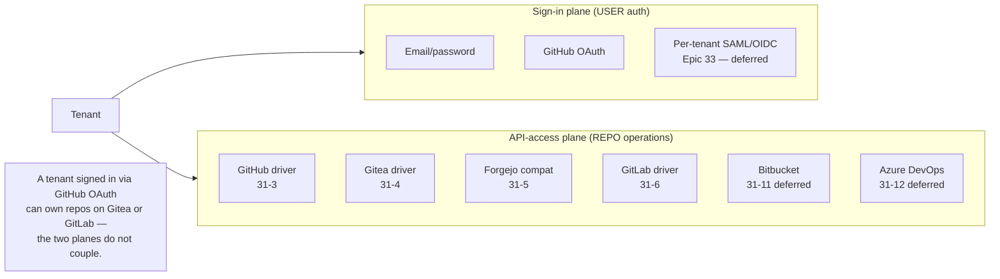
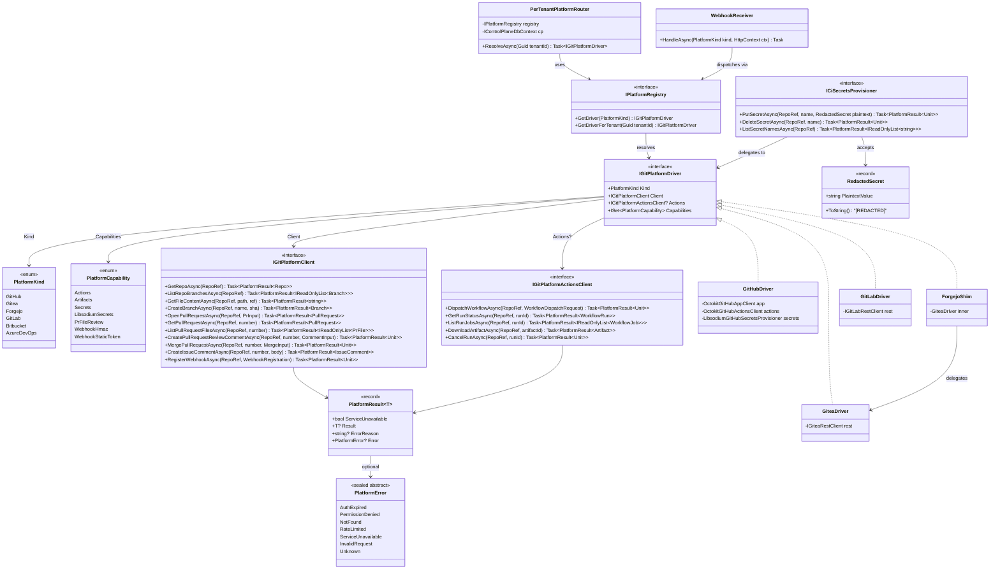
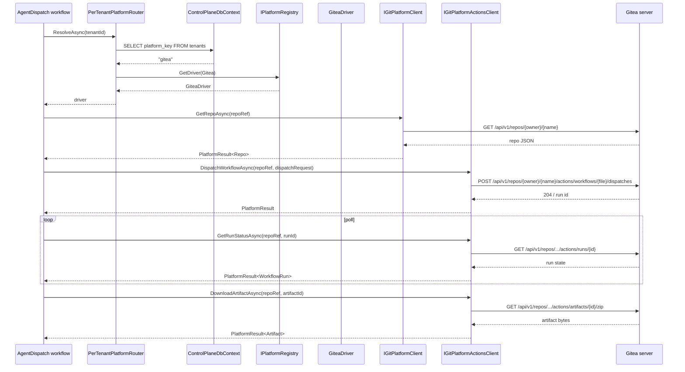
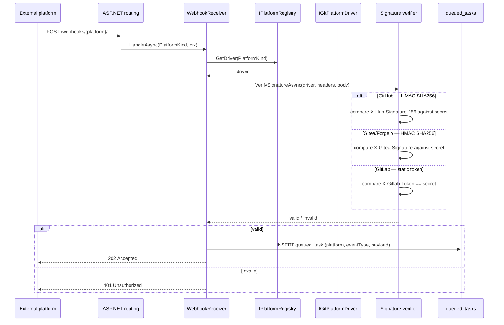
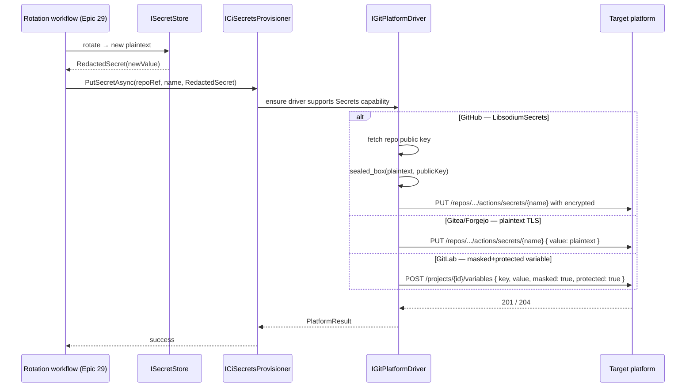
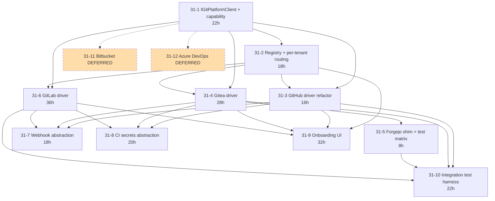

**Status:** Planning (briefs authored 2026-04-21; impl plans not yet written)
**Stories:** 10 core (31-1..31-10) + 2 deferred (31-11 Bitbucket, 31-12 Azure DevOps)
**Effort:** ~220h core / ~284h with optionals
**Layer:** Layer 4 for 31-1..31-5 + 31-7..31-10; Layer 5 for 31-6 (GitLab); deferred for 31-11/31-12
**Depends on:** Epic 28 (tenant + install-routing), Epic 19 stories 19-1..19-5 (current GitHub-only agent dispatch), Epic 17 (`tenants` + `github_installations` tables)

> **Overview**: [Multi Git Platform](Multi-Git-Platform) — root-level topic page with the `IGitPlatformClient` abstraction, per-platform driver semantics, and webhook routing details.

## 1. Overview

Today's C# port ships `IGitHubAppClient`, `IGitHubActionsClient`, `IGitHubSecretsProvisioner`, and the Epic 19 agent-dispatch activities — **all GitHub-only**. The original TS `packages/platforms/` tree scaffolded 7 platforms; we are not porting TS. Epic 31 introduces the C# abstraction + real drivers for the platforms customers are asking about.

User constraint (2026-04-21):

> The GitHub App is currently doing two things: (1) auth/sign-in, (2) API access for agent dispatch. These need to split. Epic 31 is purely about (2) API access.

Sign-in stays GitHub OAuth short-term; per-tenant IdP is [Epic 33](Epic-33-Per-Tenant-IdP.md) (deferred). Epic 31 is the platform-for-the-repo plane, not the platform-for-the-user plane — a tenant signed in via GitHub OAuth can own repos on Gitea / Forgejo / GitLab.

### Non-goals

- Does not introduce sign-in via Gitea / GitLab / Bitbucket. Users still sign into Tamma via email/password or GitHub OAuth; their tenant's repos can live on any supported platform. Per-tenant IdP is Epic 33.
- Does not port the existing Epic 1.5 secret-mirror track. 1.5 is LLM-safe-ops; 31 is operator-facing platform drivers. The two consume each other's abstractions at clean seams.
- Does not change the agent-runtime surface. Epic 19's `IAgentExecutor` contract is platform-agnostic already — 31 pushes the platform-specificity down into the client layer.

## 2. Architecture

### 2.1 Two planes — orthogonal concerns



### 2.2 Three-layer abstraction

```mermaid
graph TB
    subgraph L3["Layer 3 — driver dispatch (31-2)"]
        REG[IPlatformRegistry<br/>keyed DI per PlatformKind]
        ROUTE[PerTenantPlatformRouter<br/>tenantId → driver]
    end

    subgraph L2["Layer 2 — drivers (31-3..31-6)"]
        D_GH[GitHub Driver<br/>wraps Octokit]
        D_GT[Gitea Driver<br/>REST + tokens]
        D_FJ[Forgejo Shim<br/>= Gitea Driver + test matrix]
        D_GL[GitLab Driver<br/>REST + MRs + pipelines]
    end

    subgraph L1["Layer 1 — abstraction (31-1)"]
        IF_C[IGitPlatformClient<br/>repos/PRs/issues/branches/webhooks]
        IF_A[IGitPlatformActionsClient<br/>CI dispatch/monitoring/artifacts]
        IF_D[IGitPlatformDriver<br/>Kind + Client + Actions? + Capabilities]
        MODELS[Typed models<br/>Repo/Branch/PullRequest/PrFile/Issue<br/>WorkflowRun/WorkflowJob/Artifact]
        ERR[PlatformError union<br/>AuthExpired/PermissionDenied/<br/>NotFound/RateLimited/...]
        CAP[PlatformCapability<br/>Actions/Artifacts/Secrets/<br/>LibsodiumSecrets/WebhookHmac/...]
    end

    subgraph L0["Layer 0 — shared surfaces"]
        WEBHOOK[Webhook receiver abstraction<br/>31-7]
        SECRETS[ICiSecretsProvisioner<br/>31-8]
    end

    REG --> IF_D
    ROUTE --> REG
    IF_D <|.. D_GH
    IF_D <|.. D_GT
    IF_D <|.. D_FJ
    IF_D <|.. D_GL
    D_GH --> IF_C
    D_GH --> IF_A
    D_GT --> IF_C
    D_GT --> IF_A
    D_FJ -.delegates to.-> D_GT
    D_GL --> IF_C
    D_GL --> IF_A
    IF_C --> MODELS
    IF_C --> ERR
    IF_D --> CAP
    WEBHOOK -.dispatches to.-> D_GH
    WEBHOOK -.dispatches to.-> D_GT
    WEBHOOK -.dispatches to.-> D_GL
    SECRETS -.implements via.-> D_GH
    SECRETS -.implements via.-> D_GT
    SECRETS -.implements via.-> D_GL
```

### 2.3 Capability matrix (story 31-1)

| Platform | Actions | Artifacts | Secrets (libsodium) | Secrets (plaintext) | PrFileReview | WebhookHmac | WebhookStaticToken |
|----------|---------|-----------|---------------------|---------------------|--------------|-------------|---------------------|
| GitHub | yes | yes | yes | no | yes | yes | no |
| Gitea | yes (actions) | yes | no | yes | yes | yes | no |
| Forgejo | yes (actions) | yes | no | yes | yes | yes | no |
| GitLab | yes (pipelines) | yes | no | yes (masked+protected) | yes | yes | yes |
| Bitbucket (deferred) | yes (pipelines) | no | no | yes | yes | yes | no |
| Azure DevOps (deferred) | yes (pipelines) | yes | no | yes | yes | yes (JWT) | no |

Capabilities drive runtime feature gating — e.g. the libsodium path only runs when `Capabilities.Has(LibsodiumSecrets)`.

## 3. Components

### 3.1 Abstraction (Story 31-1)

| Component | Type | Location |
|-----------|------|----------|
| `IGitPlatformClient` | interface (repos/PRs/issues/branches/webhooks) | `Tamma.Platforms.Abstractions/` |
| `IGitPlatformActionsClient` | interface (CI dispatch/monitoring/artifacts) | `Tamma.Platforms.Abstractions/` |
| `IGitPlatformDriver` | top-level driver (`Kind + Client + Actions? + Capabilities`) | `Tamma.Platforms.Abstractions/` |
| `PlatformKind` | enum (`GitHub`, `Gitea`, `Forgejo`, `GitLab`, `Bitbucket`, `AzureDevOps`) | `Tamma.Platforms.Abstractions/` |
| `PlatformCapability` | enum (`Actions`, `Artifacts`, `Secrets`, `LibsodiumSecrets`, `PrFileReview`, `WebhookHmac`, `WebhookStaticToken`) | `Tamma.Platforms.Abstractions/` |
| Typed models | records — `Repo`, `Branch`, `PullRequest`, `PrFile`, `Issue`, `IssueComment`, `WebhookRegistration`, `WorkflowDispatchRequest`, `WorkflowRun`, `WorkflowJob`, `Artifact`, `RateLimitInfo` | `Tamma.Platforms.Abstractions/` |
| `PlatformResult<T>` | envelope — `ServiceUnavailable` / `Ok(value)` / `Failed(reason)` | `Tamma.Platforms.Abstractions/` |
| `PlatformError` | discriminated union — `AuthExpired`, `PermissionDenied`, `NotFound`, `RateLimited`, `ServiceUnavailable`, `InvalidRequest`, `Unknown` | `Tamma.Platforms.Abstractions/` |

### 3.2 Dispatch (Story 31-2)

| Component | Purpose |
|-----------|---------|
| `IPlatformRegistry` | keyed DI, resolves driver by `PlatformKind` |
| `PerTenantPlatformRouter` | reads `tenants.platform_key` (or per-repo binding) and returns the driver |
| `PlatformKindCapabilityMatrix` | static: default capabilities per kind for the onboarding UI filter |

### 3.3 Drivers

| Story | Driver | Scope |
|-------|--------|-------|
| 31-3 | `GitHubDriver` | refactor — wrap existing `OctokitGitHubAppClient` / `OctokitGitHubActionsClient` / `LibsodiumGitHubSecretsProvisioner` |
| 31-4 | `GiteaDriver` | new — Gitea REST API for repos/PRs/Actions/artifacts/webhooks |
| 31-5 | `ForgejoShim` | extends 31-4 test matrix (Forgejo 15+ keeps Gitea API compat) |
| 31-6 | `GitLabDriver` | new — GitLab REST for MRs/Pipelines/variables/webhooks (richer variable model) |
| 31-11 | `BitbucketDriver` | deferred |
| 31-12 | `AzureDevOpsDriver` | deferred (PAT auth deprecating) |

### 3.4 Webhooks + secrets (31-7, 31-8)

| Component | Story | Purpose |
|-----------|-------|---------|
| Webhook receiver path-segment dispatch (`/webhooks/{platform}/{...}`) | 31-7 | per-platform signature function (HMAC, static token, JWT) |
| `ICiSecretsProvisioner` | 31-8 | plaintext-in over TLS; GitHub libsodium becomes driver-private |
| `RedactedSecret` type | 31-8 | shared redaction wrapper used in all driver APIs |

### 3.5 UI + test harness (31-9, 31-10)

| Component | Story | Purpose |
|-----------|-------|---------|
| Onboarding platform picker | 31-9 | filters by capability matrix |
| Credential entry UX | 31-9 | per-platform variants (PAT vs App vs service-token) |
| Integration test harness | 31-10 | Gitea + Forgejo + GitLab containers in docker-compose |

## 4. Class diagram



## 5. Sequence diagrams

### 5.1 Agent dispatch — tenant on Gitea



### 5.2 Webhook receiver dispatch



### 5.3 CI secrets rotation across platforms



## 6. Use cases

### UC-31-01: Enterprise tenant with on-premise Forgejo

Enterprise customer runs Forgejo 15 on-prem. At onboarding:

1. Tenant admin picks `Forgejo` in platform picker (Story 31-9).
2. Enters Forgejo base URL + PAT.
3. `ForgejoShim` (= `GiteaDriver`) validates connectivity via `GET /api/v1/version`.
4. All subsequent repo operations (Epic 19 agent dispatch, webhook handling, secrets provisioning) go through the Gitea driver transparently.
5. Test matrix (31-10) runs nightly against Forgejo latest-LTS to catch divergence.

### UC-31-02: Mixed-platform fleet

- Tenant A — repos on GitHub Enterprise Server (company-managed)
- Tenant B — repos on gitea.company.com (self-hosted Gitea)
- Tenant C — repos on GitLab SaaS

All three tenants use the same Tamma agent-dispatch workflow. `PerTenantPlatformRouter` resolves the driver per tenant; the workflow doesn't know or care which platform it's talking to. V1 = one platform per tenant; multi-platform per tenant is a post-v1 ask.

### UC-31-03: Webhook from GitLab MR

1. GitLab sends `POST /webhooks/gitlab/merge-request` with `X-Gitlab-Token` static-token header.
2. `WebhookReceiver` dispatches to `GitLabDriver`'s signature verifier.
3. Verified → enqueue `queued_task` for async processing.
4. Queued task handler translates the GitLab MR event to the platform-neutral `PullRequest` model and triggers the Tamma review workflow.

### UC-31-04: Secret rotation pushes to 3 different platforms

Rotation handler (Epic 29) calls `ICiSecretsProvisioner.PutSecretAsync` for a tenant whose repos live on different platforms. The provisioner dispatches via the driver for each repo:

- GitHub repo → libsodium sealed-box encrypts plaintext using repo public key, PUTs to `/actions/secrets`
- Gitea repo → PUTs plaintext over TLS (Gitea server encrypts at rest)
- GitLab repo → POSTs a masked+protected variable to the project

Each driver's redaction contract ensures the plaintext never appears in logs.

### UC-31-05: Rate-limit handling

GitHub's rate-limit shape is `X-RateLimit-Remaining` / `X-RateLimit-Reset`. GitLab uses `RateLimit-Remaining` / `RateLimit-Reset` (similar but not identical). Gitea has per-token quotas. Each driver maps to `RateLimitInfo` in `PlatformResult`; workflows check `result.RateLimitInfo.IsExhausted` and back off uniformly.

## 7. Dependencies

### Upstream

- [Epic 28](Epic-28-DB-Per-Tenant.md) — tenant + install-routing model (28-9 JWT claims, 28-7 API-key prefixes)
- [Epic 19](Epic-19-Agent-Dispatch.md) — current GitHub-only agent dispatch (19-1..19-5)
- [Epic 17](Epic-17-Multi-Tenancy.md) — `tenants` + `github_installations` tables
- [Epic 29](Epic-29-Secret-Management.md) Story 29-5 — tenant-admin UI for credentials entry

### Downstream / related

- Epic 1.5-23..1.5-26 (LLM-safe secret mirroring to CI variable stores) — different theme, overlapping surface; consumes `IRotationHandler` where it overlaps
- [Epic 33](Epic-33-Per-Tenant-IdP.md) — separate concern from platform API access; sign-in plane is orthogonal

### Story dependency graph



## 8. Current state

### Today's baseline (all GitHub-only)

- `OctokitGitHubAppClient` — GitHub App auth + installation metadata + repo listing
- `OctokitGitHubActionsClient` — workflow dispatch + run monitoring
- `LibsodiumGitHubSecretsProvisioner` — libsodium sealed-box encryption for GitHub Actions secrets
- `IGitHubAppClient` / `IGitHubActionsClient` / `IGitHubSecretsProvisioner` with `Null*` dev fallbacks (`GitHubAppResult<T>.ServiceUnavailable`)
- `GitHubEndpoints.Webhooks` hard-coded to GitHub HMAC SHA256 shape
- Agent-dispatch activities in `Tamma.Activities/AgentDispatch/` take `IGitHubActionsClient` directly

### Planned

All 10 core stories have briefs authored 2026-04-21; impl plans not yet written. Dev scheduled after Epic 28 Wave A.5 completes and Epic 29 rotation primitive (29-6) lands.

### Review findings closed

- **"Self-hosted Git platforms" from 2026 roadmap** — closed by 31-4 + 31-5 + 31-6
- **Split GitHub App sign-in vs API** (user constraint, 2026-04-21) — closed structurally by 31-1 + 31-3 (API-access is platform-agnostic; sign-in stays on GitHub OAuth until Epic 33)
- **Webhook-endpoint security gap** (hard-coded GitHub HMAC) — closed by 31-7

### Drift findings (2026-04-22 audit)

- `Tamma.Activities/AgentDispatch/` still takes `IGitHubActionsClient` — 31-3 refactor repoints to `IGitPlatformActionsClient`
- `GitHubEndpoints.Webhooks` hard-codes GitHub HMAC; migration to path-segment dispatch is 31-7
- `github_installations` table is GitHub-specific — Epic 31 introduces a generic `platform_installations` concept or extends with `platform_kind` discriminator (ADR needed during 31-1 design)

### Risks

| Risk | Mitigation |
|------|------------|
| Interface churn after first non-GitHub driver lands | Lock 31-1 before 31-3 merges; 31-4 ships full compliance tests as abstraction contract |
| Gitea / Forgejo version drift | 31-5 test-matrix runs against Gitea latest + Forgejo latest-LTS; new divergence = new compat-shim commit |
| GitLab pipeline-model mismatch burns 31-6 budget | 31-6 brief calls out richer variable surface up front; capability matrix (31-1) absorbs shape differences |
| Webhook abstraction too generic | Per-platform signature function; dispatch on first path segment, not on header sniffing |
| Secrets provisioner leaks plaintext via logs | `RedactedSecret` type used in interface; each driver must redact per Epic 16 §Sensitive Data Redaction |
| Onboarding UI 31-9 overrun | Ship in two passes: pass 1 GitHub + Gitea (simple); pass 2 GitLab + Forgejo compat |

### Open questions

1. **Forgejo divergence**: if Forgejo 16.0 breaks Gitea API compat, promote 31-5 to full driver? Decision deferred to first real divergence.
2. **GitHub Enterprise Server vs GitHub.com**: GHES uses same Octokit with different base URL. V1 = config-driven; fork driver if GHES feature drift becomes a problem.
3. **Multi-platform per tenant**: can a tenant connect repos across multiple platforms simultaneously? V1 = one-per-tenant; revisit on customer ask.

## 9. See also

- [Multi Git Platform](Multi-Git-Platform) — root-level topic page
- [Epic 28](Epic-28-DB-Per-Tenant.md) — tenant + install-routing model
- [Epic 19](Epic-19-Agent-Dispatch.md) — agent dispatch consumers
- [Epic 29](Epic-29-Secret-Management.md) — secret cabinet Epic 31 pushes CI secrets from
- [Epic 33](Epic-33-Per-Tenant-IdP.md) — orthogonal sign-in plane
- Sources:
  - Research notes: `docs/stories/research/multi-git-platform-2026.md`
  - Current GitHub code: `apps/tamma-elsa/src/Tamma.Api/Services/GitHub/`, `apps/tamma-elsa/src/Tamma.Activities/AgentDispatch/`
  - Webhook endpoint: `apps/tamma-elsa/src/Tamma.Api/Endpoints/GitHubEndpoints.cs`
  - User constraint: 2026-04-21 planning session ("split sign-in from API access")
- Story files: [Epic 31 on GitHub](/stories/epic-31/)

---

_Last updated: 2026-04-22_
