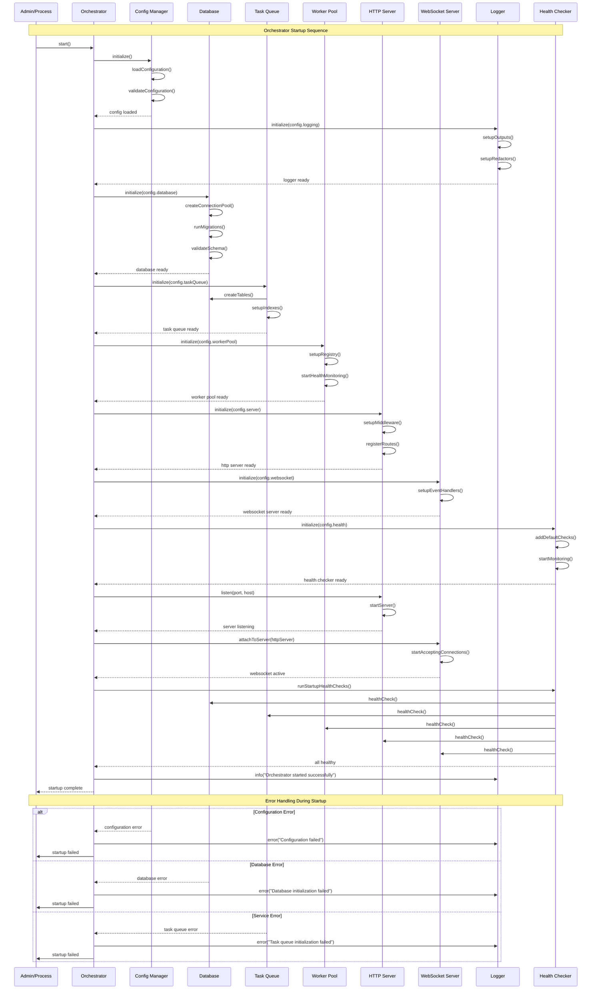
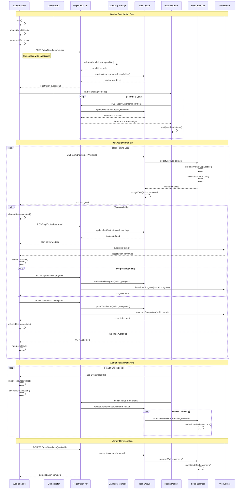
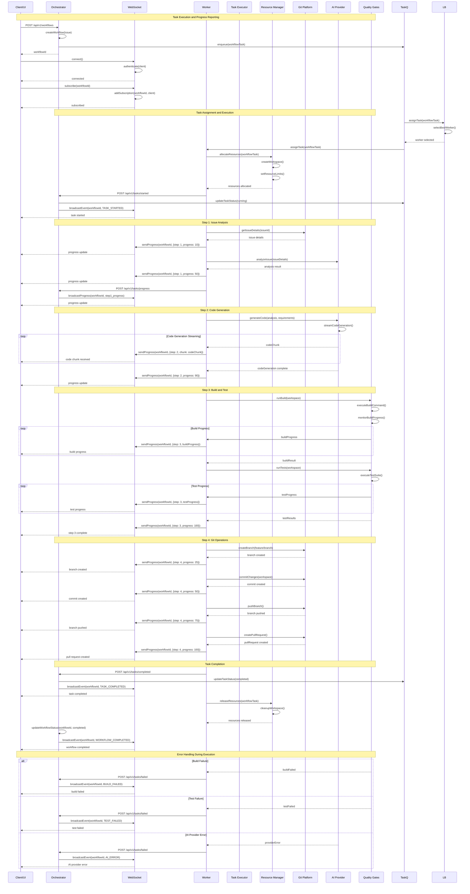
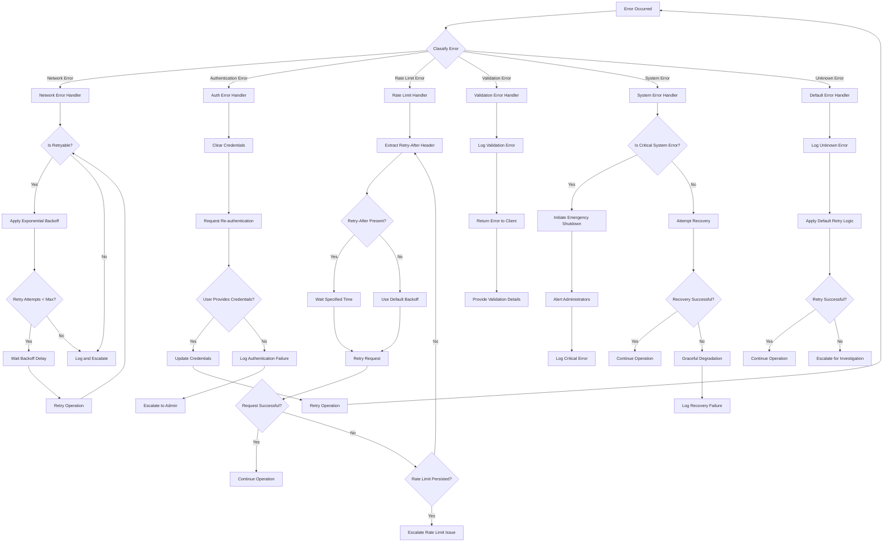
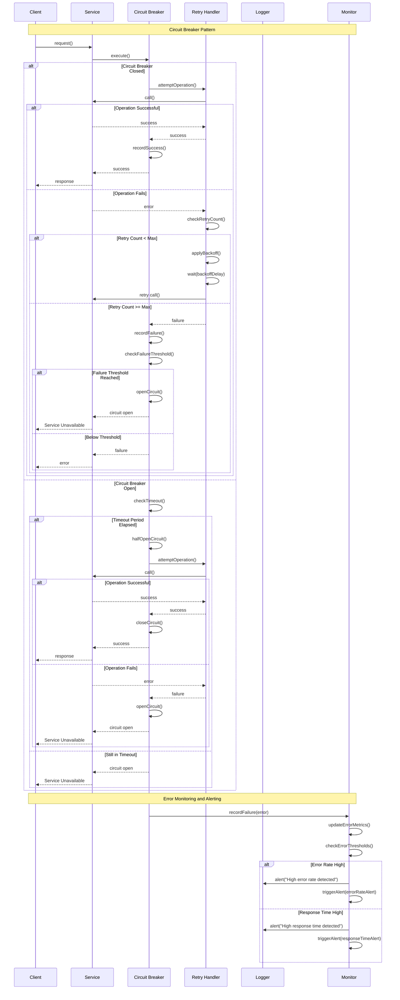

# Story 1.8 Task 4: Create Sequence Diagrams and Workflows

## Task Overview

Create comprehensive sequence diagrams and workflow documentation for both orchestrator and worker modes, including startup sequences, task assignment and execution flows, progress reporting workflows, error handling and recovery sequences, and graceful shutdown procedures. This task provides visual documentation of system interactions and workflows.

## Acceptance Criteria

### 4.1 Create Orchestrator Startup Sequence Diagram

- [ ] Document orchestrator initialization order and dependencies
- [ ] Show service startup sequence and health checks
- [ ] Illustrate database connection and migration flows
- [ ] Document worker pool initialization and registration
- [ ] Include error handling and recovery during startup

### 4.2 Create Worker Registration and Task Assignment Sequence Diagram

- [ ] Document worker registration flow with orchestrator
- [ ] Show capability negotiation and validation
- [ ] Illustrate task assignment and load balancing
- [ ] Document task queue management and priority handling
- [ ] Include worker health monitoring and heartbeat flows

### 4.3 Create Task Execution and Progress Reporting Sequence Diagram

- [ ] Document task execution workflow from assignment to completion
- [ ] Show progress reporting and real-time updates
- [ ] Illustrate resource allocation and monitoring
- [ ] Document result collection and validation
- [ ] Include WebSocket streaming for real-time progress

### 4.4 Create Graceful Shutdown and Recovery Sequence Diagrams

- [ ] Document orchestrator graceful shutdown sequence
- [ ] Show worker graceful shutdown and task completion
- [ ] Illustrate in-flight task handling and recovery
- [ ] Document resource cleanup and connection termination
- [ ] Include error scenarios and force termination procedures

### 4.5 Document Error Handling and Retry Workflows

- [ ] Create error classification and handling flowcharts
- [ ] Document retry patterns with exponential backoff
- [ ] Show circuit breaker patterns for external services
- [ ] Illustrate escalation procedures and human intervention
- [ ] Include error recovery and self-healing mechanisms

## Implementation Details

### 4.1 Orchestrator Startup Sequence Diagram



### 4.2 Worker Registration and Task Assignment Sequence Diagram



### 4.3 Task Execution and Progress Reporting Sequence Diagram



### 4.4 Graceful Shutdown and Recovery Sequence Diagrams

```mermaid
sequenceDiagram
    participant Admin as Admin/Process
    participant Orch as Orchestrator
    participant Worker as Worker
    participant TaskQ as Task Queue
    participant HTTP as HTTP Server
    participant WS as WebSocket Server
    participant DB as Database
    participant Res as Resource Manager

    Note over Admin,Res: Orchestrator Graceful Shutdown

    Admin->>Orch: stop()
    Orch->>TaskQ: pause()
    TaskQ->>TaskQ: stopAcceptingNewTasks()
    TaskQ-->>Orch: queue paused

    Orch->>HTTP: setDrainingMode()
    HTTP->>HTTP: stopAcceptingNewRequests()
    HTTP-->>Orch: draining mode set

    Orch->>WS: stopAcceptingNewConnections()
    WS->>WS: closeNewConnections()
    WS-->>Orch: connections closed

    Orch->>Orch: getActiveWorkflows()
    Orch->>Orch: getRunningTasks()

    alt Active Workflows Exist
        loop Wait for Workflows
            Orch->>Orch: checkWorkflowStatus()
            alt Workflow Still Running
                Orch->>Orch: wait(checkInterval)
            else All Workflows Complete
                Orch->>Orch: break loop
            end
        end
    end

    alt Running Tasks Exist
        loop Wait for Tasks
            Orch->>TaskQ: getRunningTasks()
            TaskQ-->>Orch: runningTasks
            alt Tasks Still Running
                Orch->>Orch: wait(checkInterval)
                Orch->>Worker: requestTaskCancellation()
                Worker->>Worker: gracefulTaskShutdown()
            else All Tasks Complete
                Orch->>Orch: break loop
            end
        end
    end

    Orch->>WS: closeAllConnections()
    WS->>WS: sendShutdownNotice()
    WS->>WS: closeConnections()
    WS-->>Orch: connections closed

    Orch->>HTTP: stop()
    HTTP->>HTTP: closeServer()
    HTTP-->>Orch: server stopped

    Orch->>TaskQ: stop()
    TaskQ->>TaskQ: stopProcessing()
    TaskQ-->>Orch: queue stopped

    Orch->>DB: closeConnections()
    DB->>DB: closeConnectionPool()
    DB-->>Orch: connections closed

    Orch->>Orch: cleanupResources()
    Orch-->>Admin: shutdown complete

    Note over Admin,Res: Worker Graceful Shutdown

    Worker->>Worker: stop()
    Worker->>TaskQ: unregisterWorker(workerId)
    TaskQ->>TaskQ: removeWorkerFromRegistry()
    TaskQ-->>Worker: unregistered

    Worker->>Worker: getCurrentTask()
    alt Current Task Exists
        Worker->>Worker: gracefulTaskShutdown()
        Worker->>Res: cleanupResources(taskId)
        Res->>Res: saveTaskState()
        Res-->>Worker: resources cleaned
        Worker->>TaskQ: reportTaskInterrupted(taskId)
        TaskQ-->>Worker: interruption recorded
    end

    Worker->>Res: cleanupAll()
    Res->>Res: cleanupWorkspaces()
    Res->>Res: releaseAllResources()
    Res-->>Worker: cleanup complete

    Worker->>Worker: stopBackgroundServices()
    Worker->>Worker: stopHeartbeat()
    Worker->>Worker: stopMonitoring()
    Worker-->>Worker: services stopped

    Worker-->>Admin: worker shutdown complete

    Note over Admin,Res: Recovery After Unexpected Shutdown

    Note over Orch,Res: Orchestrator Recovery
    Orch->>Orch: start()
    Orch->>DB: initialize()
    DB->>DB: checkForIncompleteTransactions()
    DB->>DB: rollbackIncompleteTransactions()
    DB-->>Orch: database ready

    Orch->>TaskQ: initialize()
    TaskQ->>TaskQ: checkForOrphanedTasks()
    TaskQ->>TaskQ: resetOrphanedTasks()
    TaskQ-->>Orch: queue ready

    Orch->>Orch: checkForInterruptedWorkflows()
    Orch->>Orch: restoreWorkflowStates()
    Orch->>Orch: resumeWorkflows()

    Note over Orch,Res: Worker Recovery
    Worker->>Worker: start()
    Worker->>Res: checkForIncompleteWorkspaces()
    Res->>Res: cleanupIncompleteWorkspaces()
    Res->>Res: restoreTaskStates()
    Res-->>Worker: resources ready

    Worker->>TaskQ: registerWorker()
    Worker->>Worker: checkForInterruptedTasks()
    Worker->>Worker: resumeInterruptedTasks()
```



### 4.5 Error Handling and Retry Workflows





## Workflow Documentation

### 1. Orchestrator Startup Workflow

```markdown
# Orchestrator Startup Workflow

## Overview

The orchestrator startup workflow initializes all required services in a specific order, validates system health, and begins accepting requests.

## Steps

### Phase 1: Configuration Loading (0-5 seconds)

1. Load configuration from multiple sources (default, file, environment, CLI)
2. Validate configuration schema and required fields
3. Apply environment variable overrides
4. Setup configuration file watching for hot reload

### Phase 2: Service Initialization (5-15 seconds)

1. Initialize logging infrastructure
2. Initialize database connections and run migrations
3. Initialize task queue and worker registry
4. Initialize HTTP server and WebSocket server
5. Initialize health checking and monitoring

### Phase 3: Server Startup (15-20 seconds)

1. Start HTTP server on configured port
2. Attach WebSocket server to HTTP server
3. Begin accepting worker registrations
4. Start background processing loops

### Phase 4: Health Validation (20-25 seconds)

1. Run comprehensive health checks on all services
2. Validate database connectivity
3. Test external service connections
4. Verify worker pool functionality

### Phase 5: Ready State (25+ seconds)

1. Emit startup complete event
2. Log successful startup
3. Begin normal operation

## Error Handling

- Configuration errors: Fail fast with detailed error messages
- Database errors: Retry with exponential backoff, fail after 3 attempts
- Service errors: Continue startup, mark service as degraded
- Port conflicts: Fail with clear error message

## Timeouts

- Configuration loading: 10 seconds
- Database initialization: 30 seconds
- Service initialization: 60 seconds
- Health checks: 30 seconds
- Total startup: 120 seconds maximum
```

### 2. Task Execution Workflow

```markdown
# Task Execution Workflow

## Overview

The task execution workflow handles the complete lifecycle of a task from assignment through completion, including progress reporting and error handling.

## Steps

### Phase 1: Task Assignment (0-2 seconds)

1. Worker polls orchestrator for available tasks
2. Orchestrator evaluates worker capabilities and current load
3. Task assigned to best-suited worker
4. Worker receives task assignment

### Phase 2: Resource Allocation (2-5 seconds)

1. Worker allocates resources for task (memory, CPU, disk)
2. Creates isolated workspace directory
3. Sets up environment variables and configuration
4. Applies security restrictions and sandboxing

### Phase 3: Task Execution (5-300 seconds)

1. Worker executes task according to type
2. Monitors resource usage and enforces limits
3. Reports progress at regular intervals
4. Handles errors and applies retry logic

### Phase 4: Progress Reporting (Throughout execution)

1. Worker sends progress updates to orchestrator
2. Orchestrator broadcasts progress via WebSocket
3. Clients receive real-time progress updates
4. Progress stored in audit trail

### Phase 5: Completion and Cleanup (300-305 seconds)

1. Worker completes task or reports failure
2. Results collected and validated
3. Resources released and workspace cleaned
4. Task status updated in orchestrator

## Error Handling

- Resource allocation failures: Report immediately, don't start task
- Execution timeouts: Graceful termination, report timeout error
- Resource limit exceeded: Throttle or terminate task
- Network failures: Retry with exponential backoff
- Validation errors: Report immediately, don't retry

## Progress Reporting

- Frequency: Every 5 seconds or on significant milestones
- Format: JSON with percentage, current step, details
- Channels: HTTP API + WebSocket streaming
- Persistence: Stored in audit trail

## Resource Limits

- Memory: 4GB maximum per task
- CPU: 2 cores maximum per task
- Disk: 10GB temporary space per task
- Network: 1Gbps bandwidth limit
- Time: 30 minutes maximum execution time
```

### 3. Error Recovery Workflow

```markdown
# Error Recovery Workflow

## Overview

The error recovery workflow provides systematic handling of errors with appropriate retry logic, escalation procedures, and self-healing mechanisms.

## Error Classification

### Network Errors

- **Symptoms**: Connection timeouts, refused connections, DNS failures
- **Retry Strategy**: Exponential backoff starting at 1 second, max 30 seconds
- **Max Retries**: 3 attempts
- **Escalation**: After 3 failed retries, alert administrators

### Authentication Errors

- **Symptoms**: 401 responses, invalid credentials
- **Retry Strategy**: No automatic retry, require user intervention
- **Resolution**: Clear cached credentials, request re-authentication
- **Escalation**: Immediate alert if authentication fails repeatedly

### Rate Limit Errors

- **Symptoms**: 429 responses, rate limit exceeded
- **Retry Strategy**: Honor Retry-After header, default 60 seconds
- **Max Retries**: 1 attempt after waiting period
- **Escalation**: Alert if rate limits persist for > 5 minutes

### System Errors

- **Symptoms**: Out of memory, disk full, CPU exhaustion
- **Retry Strategy**: No retry, immediate cleanup required
- **Resolution**: Resource cleanup, service restart
- **Escalation**: Critical alert, immediate administrator notification

### Validation Errors

- **Symptoms**: Invalid input data, schema validation failures
- **Retry Strategy**: No retry, client-side fix required
- **Resolution**: Return detailed error messages to client
- **Escalation**: Monitor for high validation error rates

## Circuit Breaker Pattern

### States

1. **Closed**: Normal operation, requests pass through
2. **Open**: All requests fail immediately, no retries
3. **Half-Open**: Limited requests allowed to test recovery

### Thresholds

- Failure threshold: 5 failures in 60 seconds
- Timeout period: 300 seconds in open state
- Recovery test: 1 request allowed in half-open state

### Metrics

- Success rate: Track per service and operation
- Response time: Monitor for degradation
- Error rate: Alert on abnormal increases
- Circuit state: Track state transitions

## Self-Healing Mechanisms

### Service Restart

- Automatic restart on service crashes
- Health check validation before restart
- Maximum restart attempts per hour
- Escalation if restarts fail repeatedly

### Resource Cleanup

- Automatic cleanup of orphaned resources
- Workspace cleanup on task completion/failure
- Temporary file cleanup on schedule
- Memory leak detection and cleanup

### Database Recovery

- Connection pool reset on connection errors
- Transaction rollback on failures
- Automatic reconnection with backoff
- Data consistency validation

## Monitoring and Alerting

### Real-time Monitoring

- Error rate per service and operation
- Response time percentiles (p50, p95, p99)
- Resource utilization trends
- Circuit breaker state changes

### Alert Thresholds

- Error rate > 5% for 5 minutes
- Response time p95 > 2 seconds for 5 minutes
- Circuit breaker open for any service
- Resource utilization > 90% for 10 minutes

### Escalation Procedures

- Level 1: Automatic retry and recovery
- Level 2: Alert on-call engineer
- Level 3: Alert team lead and manager
- Level 4: Critical incident, all-hands on deck
```

## Testing Strategy

### Diagram Validation Tests

```typescript
// packages/shared/src/__tests__/workflow-validation.test.ts

describe('Workflow Validation', () => {
  describe('Orchestrator Startup Workflow', () => {
    it('should follow correct initialization order', async () => {
      const orchestrator = new TestOrchestrator();
      const order = [];

      // Mock service initialization to track order
      orchestrator.on('serviceInit', (service) => order.push(service));

      await orchestrator.start();

      expect(order).toEqual([
        'config',
        'logger',
        'database',
        'taskQueue',
        'workerPool',
        'httpServer',
        'webSocketServer',
        'healthChecker',
      ]);
    });

    it('should handle startup failures gracefully', async () => {
      const orchestrator = new TestOrchestrator();

      // Mock database failure
      orchestrator.mockServiceFailure('database', new Error('Connection failed'));

      await expect(orchestrator.start()).rejects.toThrow('Database initialization failed');

      // Verify cleanup was attempted
      expect(orchestrator.cleanupCalled).toBe(true);
    });
  });

  describe('Task Execution Workflow', () => {
    it('should execute task with proper progress reporting', async () => {
      const worker = new TestWorker();
      const task = createMockTask();
      const progressEvents = [];

      worker.on('progress', (progress) => progressEvents.push(progress));

      const result = await worker.executeTask(task);

      expect(result.status).toBe('completed');
      expect(progressEvents.length).toBeGreaterThan(0);
      expect(progressEvents[progressEvents.length - 1].percentage).toBe(100);
    });

    it('should handle task timeouts correctly', async () => {
      const worker = new TestWorker();
      const task = createMockTask({ timeout: 100 });

      const startTime = Date.now();
      const result = await worker.executeTask(task);
      const duration = Date.now() - startTime;

      expect(result.status).toBe('failed');
      expect(result.error).toContain('timeout');
      expect(duration).toBeLessThan(200); // Allow some margin
    });
  });

  describe('Error Recovery Workflow', () => {
    it('should apply exponential backoff for retryable errors', async () => {
      const retryHandler = new RetryHandler();
      const attempts = [];

      retryHandler.on('attempt', (delay) => attempts.push(delay));

      const error = new NetworkError('Connection refused');
      await expect(
        retryHandler.execute(() => {
          throw error;
        })
      ).rejects.toThrow('Connection refused');

      expect(attempts).toEqual([1000, 2000, 4000]); // Exponential backoff
    });

    it('should open circuit breaker after failure threshold', async () => {
      const circuitBreaker = new CircuitBreaker({
        failureThreshold: 3,
        timeout: 60000,
      });

      // Fail 3 times to open circuit
      for (let i = 0; i < 3; i++) {
        try {
          await circuitBreaker.execute(() => {
            throw new Error('Service unavailable');
          });
        } catch (error) {
          // Expected to fail
        }
      }

      expect(circuitBreaker.getState()).toBe('open');

      // Next call should fail immediately
      await expect(circuitBreaker.execute(() => 'success')).rejects.toThrow(
        'Circuit breaker is open'
      );
    });
  });
});
```

## Completion Checklist

- [ ] Create orchestrator startup sequence diagram
- [ ] Create worker registration and task assignment sequence diagram
- [ ] Create task execution and progress reporting sequence diagram
- [ ] Create graceful shutdown and recovery sequence diagrams
- [ ] Document error handling and retry workflows
- [ ] Create workflow documentation for all major processes
- [ ] Add flowcharts for error classification and handling
- [ ] Document circuit breaker patterns and implementations
- [ ] Create testing strategy for workflow validation
- [ ] Add interactive diagram generation tools
- [ ] Document workflow metrics and monitoring points
- [ ] Create workflow optimization recommendations

## Dependencies

- Task 1: Orchestrator Mode Architecture (for orchestrator workflows)
- Task 2: Worker Mode Architecture (for worker workflows)
- Task 3: Shared Components and Interfaces (for common patterns)
- Task 5: State Persistence and Recovery Strategy (for data flows)
- Task 6: Integration Points and APIs (for external interactions)

## Estimated Time

**Orchestrator Startup Diagram**: 2-3 days
**Worker Registration Diagram**: 3-4 days
**Task Execution Diagram**: 3-4 days
**Shutdown and Recovery Diagrams**: 2-3 days
**Error Handling Workflows**: 3-4 days
**Workflow Documentation**: 2-3 days
**Testing and Validation**: 2-3 days
**Total**: 17-24 days
