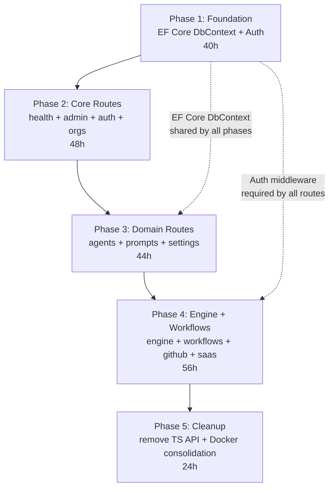

# Story 19-1: API Consolidation from TypeScript to C#

Status: ready-for-dev

## MANDATORY: Before You Code

**ALL contributors MUST read and follow the comprehensive development process:**

[BEFORE_YOU_CODE.md](../../BEFORE_YOU_CODE.md)

## Story

As a **platform maintainer**,
I want to consolidate the TypeScript Fastify API (`packages/api`) into the existing
C# ASP.NET Core API (`apps/tamma-elsa/src/Tamma.Api`),
so that we have a single backend runtime, one deployment artifact, one set of EF Core
migrations, and reduced operational complexity.

## Background

The Tamma platform currently runs **two** REST APIs behind nginx:

| Service | Runtime | Port | Routes |
|---|---|---|---|
| `tamma-api` (TS) | Node.js 22 + Fastify 5 | 3100 | `/api/*` (90+ endpoints) |
| `tamma-api-dotnet` (C#) | .NET 8 + ASP.NET Core | 5080 | `/health`, `/api/mentorship/*`, Elsa management |

Both connect to the same PostgreSQL 17 database. The TS API owns the 18 hand-written
SQL migrations (`database/migrations/001_*.sql` through `018_*.sql`) and 19+ persistence
store files. The C# API has a separate `TammaDbContext` with EF Core migrations covering
only the mentorship domain (4 entities).

This story defines a **phased migration** that moves all 90+ TS endpoints into the C#
API over 5 phases. The two APIs coexist during migration, with nginx routing requests to
the appropriate backend. Each phase flips a group of path prefixes from TS to C#.

---

## Key Design Decisions

### 1. EF Core Global Query Filters for RLS

Replaces hand-written `withTenantContext()` + `SET LOCAL app.current_tenant_id`. Every
entity with `TenantId` gets an automatic filter:

```csharp
// In TammaDbContext.OnModelCreating
builder.Entity<User>().HasQueryFilter(u => u.TenantId == _currentTenantId);
```

This eliminates the class of bugs where a developer forgets a WHERE clause.

### 2. ASP.NET Core Middleware Pipeline

Maps 1:1 to Fastify's onRequest/preHandler/handler chain:

```
UseAuthentication()            // JWT + API key validation
UseAuthorization()             // RBAC policy checks
TenantContextMiddleware        // Resolve tenant from auth claims
EnsurePersonalTenantMiddleware // Auto-create personal tenant
Controllers / Minimal APIs     // Route handlers
```

### 3. Minimal APIs (not MVC Controllers)

Closer to Fastify's route registration pattern, less ceremony than MVC controllers.
Group routes by domain using `MapGroup()`:

```csharp
var admin = app.MapGroup("/api/admin").RequireAuthorization("AdminAccess");
admin.MapGet("/health", AdminEndpoints.GetHealth);
admin.MapPost("/service-keys", AdminEndpoints.CreateServiceKey);
```

Exception: keep the existing `MentorshipController` as-is (already MVC).

### 4. SignalR Replaces Fastify SSE

The TS API uses raw Fastify SSE for three endpoints:
- `GET /api/engine/events/state` (SSE)
- `GET /api/engine/events/logs` (SSE)
- `GET /api/workflows/instances/:id/events` (SSE)

The C# API will expose a `TammaHub` SignalR hub. The dashboard connects via the
`@microsoft/signalr` JS client instead of `EventSource`.

### 5. Secret Broker Stays Separate

Even after consolidation, `packages/secret-broker` (when built) remains a separate
process because it handles plaintext secrets. The C# API talks to it via HTTP.

### 6. EF Core Migrations Replace SQL Files

Run `dotnet ef migrations add InitialSchema` to generate the initial schema matching
all 18 SQL migration files. Going forward, use incremental EF Core migrations. The
existing SQL files are archived in `database/migrations-archived/` but not executed.

### 7. In-Memory Test Doubles via EF Core InMemory Provider

Replaces the `InMemory*Store` pattern (19 files). One `DbContext`, one set of tests:

```csharp
var options = new DbContextOptionsBuilder<TammaDbContext>()
    .UseInMemoryDatabase("TestDb")
    .Options;
using var context = new TammaDbContext(options);
```

---

## Dependency Graph



Each phase is independently deployable. Phases 2 and 3 can overlap if different
developers work on non-intersecting route groups.

---

## Phase 1: Foundation (EF Core DbContext + Auth)

**Goal**: Establish the data layer and authentication infrastructure that all
subsequent phases depend on.

**Estimated effort**: 40 hours

### Task 1.1: EF Core Entity Definitions

Define C# entities matching all 18 SQL migration tables. Each entity maps to one
table created by the TS migrations:

| SQL Migration | Table | C# Entity | TS Store (InMemory + Pg) |
|---|---|---|---|
| 001 | `github_installations` | `GitHubInstallation` | `installation-store.ts`, `pg-installation-store.ts` |
| 001 | `github_installation_repos` | `GitHubInstallationRepo` | (same file) |
| 002 | `users` | `User` | `user-store.ts`, `pg-user-store.ts` |
| 003 | `api_keys` (legacy) | `LegacyApiKey` | `api-key-store.ts` (legacy) |
| 004 | `user_settings` | `UserSetting` | (embedded in user store) |
| 005 | `user_api_keys` | `UserApiKey` | `user-api-key-store.ts` |
| 006 | `user_invites` | `UserInvite` | `invite-store.ts` |
| 007 | (alter users) | (User entity update) | `user-store.ts` (soft delete fields) |
| 008 | `tenants` | `Tenant` | `tenant-store.ts`, `pg-tenant-store.ts` |
| 009 | `unified_api_keys` | `UnifiedApiKey` | `api-key-store.ts`, `pg-api-key-store.ts` |
| 010 | (RLS policies) | (global query filters) | `with-tenant-context.ts` |
| 011 | (tenant columns on existing tables) | (TenantId on existing entities) | `pg-event-store.ts` |
| 012 | `prompt_overrides` | `PromptOverride` | `pg-prompt-store.ts` |
| 013 | `agent_configs` | `AgentConfig` | `agent-config-store.ts`, `pg-agent-config-store.ts` |
| 014 | `provider_diagnostics` | `ProviderDiagnostic` | `diagnostics-store.ts`, `pg-diagnostics-store.ts` |
| 015 | `provider_health` | `ProviderHealth` | `health-store.ts`, `pg-health-store.ts` |
| 016 | `sanitization_rules` | `SanitizationRule` | `sanitization-store.ts`, `pg-sanitization-store.ts` |
| 017 | `tenant_memberships` | `TenantMembership` | `tenant-membership-store.ts` |
| 018 | (alter users — auth fields) | (User entity update) | `user-store.ts` (password, email verification) |

Additional entities from existing TS stores without dedicated migrations:
- `RefreshToken` — `refresh-token-store.ts`
- `PasswordResetToken` — `password-reset-store.ts`
- `WorkflowDefinition` / `WorkflowInstance` — `workflow-store.ts`
- `DomainEvent` — `pg-event-store.ts`

**Files to create**:
- `Tamma.Data/Entities/` — one file per entity (~22 entities)
- `Tamma.Data/TammaDbContext.cs` — rewrite with all DbSets + `OnModelCreating` config

### Task 1.2: Global Query Filters for Tenant Isolation

The `TammaDbContext` receives the current tenant ID from middleware via a scoped service:

```csharp
public class TenantContext
{
    public string? TenantId { get; set; }
}
```

Entities with `TenantId` get automatic filtering:

```csharp
builder.Entity<User>().HasQueryFilter(u =>
    _tenantContext.TenantId == null || u.TenantId == _tenantContext.TenantId);
```

The `null` check allows admin queries to bypass tenant filtering when needed.

**Replaces**: `packages/api/src/persistence/with-tenant-context.ts` (RLS via
`SET LOCAL app.current_tenant_id`).

### Task 1.3: EF Core Initial Migration

Generate the initial EF Core migration that matches the schema produced by all 18
SQL migration files. Verify schema equivalence by comparing `pg_dump` output before
and after.

Archive existing SQL files:
```bash
mv database/migrations/ database/migrations-archived/
```

### Task 1.4: Port Auth Middleware

Port all auth functionality from `packages/api/src/auth/` (13 files, ~1300 lines):

| TS File | C# Equivalent | Purpose |
|---|---|---|
| `auth/index.ts` | `Middleware/AuthenticationSetup.cs` | Auth plugin registration |
| `auth/jwt.ts` | Built-in `AddJwtBearer()` | JWT token validation |
| `auth/api-key.ts` | `Services/ApiKeyService.cs` | Key generation, hashing, prefix extraction |
| `auth/api-key-auth.ts` | `Middleware/ApiKeyAuthHandler.cs` | API key authentication handler |
| `auth/unified-auth.ts` | `Middleware/UnifiedAuthHandler.cs` | Unified auth (JWT + API key) |
| `auth/permissions.ts` | `Auth/Permissions.cs` | Role/permission definitions, `hasPermission()` |
| `auth/require-permission.ts` | `Auth/PermissionRequirement.cs` | ASP.NET Core authorization requirement + handler |
| `auth/require-scope.ts` | `Auth/ScopeRequirement.cs` | API key scope authorization |
| `auth/principal.ts` | `Auth/AuthPrincipal.cs` | Auth principal model |
| `auth/password.ts` | `Services/PasswordService.cs` | bcrypt password hashing |
| `auth/login-lockout.ts` | `Services/LoginLockoutService.cs` | Brute-force protection |

### Task 1.5: Port Tenant Context Middleware

Port from `packages/api/src/middleware/` (5 files, ~420 lines):

| TS File | C# Equivalent |
|---|---|
| `middleware/tenant-context.ts` | `Middleware/TenantContextMiddleware.cs` |
| `middleware/require-role.ts` | `Auth/RoleRequirement.cs` (ASP.NET authorization) |
| `middleware/require-tenant.ts` | `Auth/TenantRequirement.cs` |
| `middleware/require-tenant-role.ts` | `Auth/TenantRoleRequirement.cs` |
| `middleware/ensure-personal-tenant.ts` | `Middleware/EnsurePersonalTenantMiddleware.cs` |

### Task 1.6: Repository Layer

Create EF Core repository interfaces and implementations replacing all 19 TS store files:

| TS Store Pair | C# Repository | Methods |
|---|---|---|
| `InMemoryInstallationStore` / `PgInstallationStore` | `IInstallationRepository` | Upsert, GetById, ListByUser, Delete |
| `InMemoryUserStore` / `PgUserStore` | `IUserRepository` | Upsert, GetById, GetByEmail, GetByGitHub, List, SoftDelete |
| `InMemoryUserApiKeyStore` / `PgUserApiKeyStore` | `IUserApiKeyRepository` | Create, ListByUser, Delete |
| `InMemoryApiKeyStore` / `PgApiKeyStore` | `IUnifiedApiKeyRepository` | Create, GetByHash, ListByOwner, Rotate, Revoke |
| `InMemoryInviteStore` / `PgInviteStore` | `IInviteRepository` | Create, GetByToken, ListPending, Delete |
| `InMemoryTenantStore` / `PgTenantStore` | `ITenantRepository` | Create, GetById, GetBySlug, Update, Delete |
| `InMemoryTenantMembershipStore` / `PgTenantMembershipStore` | `ITenantMembershipRepository` | Add, Remove, ListByTenant, ListByUser, GetRole |
| `InMemoryAgentConfigStore` / `PgAgentConfigStore` | `IAgentConfigRepository` | Get, Upsert, Delete, ListByTenant |
| `InMemoryPromptStore` / `PgPromptStore` | `IPromptRepository` | Get, Upsert, Delete, List, Render |
| `InMemoryRefreshTokenStore` / `PgRefreshTokenStore` | `IRefreshTokenRepository` | Create, GetByToken, Revoke, RevokeAllForUser |
| `InMemoryPasswordResetStore` / `PgPasswordResetStore` | `IPasswordResetRepository` | Create, GetByToken, MarkUsed |
| `InMemoryWorkflowStore` | `IWorkflowRepository` | CreateDef, ListDefs, CreateInstance, UpdateInstance, ListInstances |
| `PgEventStore` | `IEventRepository` | Append, Query, GetById |
| `InMemoryHealthStore` / `PgHealthStore` | `IProviderHealthRepository` | RecordSuccess, RecordFailure, GetStatus, Reset |
| `InMemoryDiagnosticsStore` / `PgDiagnosticsStore` | `IDiagnosticsRepository` | Insert, Query, Report, GetBudget |
| `InMemorySanitizationStore` / `PgSanitizationStore` | `ISanitizationRepository` | GetRules, UpsertRules, Sanitize |

**Key benefit**: Each TS domain had 2 implementations (InMemory + Pg). EF Core
eliminates this duplication -- one repository, two providers (Npgsql for prod,
InMemory for tests).

### Phase 1 Tests

- 30 xUnit tests for entity configuration + query filter behavior
- 15 xUnit tests for auth middleware (JWT validation, API key auth, permissions)
- 10 xUnit tests for tenant context middleware

**Replaces Vitest tests**: `auth.test.ts`, `api-key.test.ts`, `api-key-auth.test.ts`,
`permissions.test.ts`, `unified-auth.test.ts`, `require-role.test.ts`,
`require-scope.test.ts`, `tenant-context.test.ts`, `tenant-store.test.ts`,
`tenant-membership-store.test.ts` (10 test files)

### Phase 1 nginx Change

None. No routes change hands yet.

### Phase 1 Success Metrics

- [ ] All 22 entities mapped with correct column types + indexes
- [ ] `dotnet ef migrations add` generates schema matching `pg_dump` of existing DB
- [ ] Global query filters verified: cross-tenant queries return empty results
- [ ] JWT auth + API key auth passing in integration tests
- [ ] All 55 Phase 1 xUnit tests green

---

## Phase 2: Core Routes (health, admin, auth, orgs)

**Goal**: Port the most fundamental routes that every other service depends on.

**Estimated effort**: 48 hours

### Endpoints Being Ported

#### Health (1 endpoint)

| Method | Path | TS Source | C# Target |
|---|---|---|---|
| GET | `/api/health` | `index.ts` (inline) | `Endpoints/HealthEndpoints.cs` |

#### Admin (6 endpoints)

| Method | Path | TS Source | C# Target |
|---|---|---|---|
| GET | `/api/admin/health` | `routes/admin/health-routes.ts` | `Endpoints/Admin/HealthEndpoints.cs` |
| POST | `/api/admin/service-keys` | `routes/admin/service-keys.ts` | `Endpoints/Admin/ServiceKeyEndpoints.cs` |
| GET | `/api/admin/service-keys` | `routes/admin/service-keys.ts` | (same) |
| POST | `/api/admin/service-keys/:id/rotate` | `routes/admin/service-keys.ts` | (same) |
| DELETE | `/api/admin/service-keys/:id` | `routes/admin/service-keys.ts` | (same) |
| GET | `/api/admin/users` | `routes/users/user-routes.ts` | `Endpoints/Admin/UserEndpoints.cs` |
| GET | `/api/admin/users/:id` | `routes/users/user-routes.ts` | (same) |
| PUT | `/api/admin/users/:id/role` | `routes/users/user-routes.ts` | (same) |
| DELETE | `/api/admin/users/:id` | `routes/users/user-routes.ts` | (same) |
| POST | `/api/admin/users/invite` | `routes/users/invite-routes.ts` | `Endpoints/Admin/InviteEndpoints.cs` |
| GET | `/api/admin/users/invites` | `routes/users/invite-routes.ts` | (same) |
| DELETE | `/api/admin/users/invites/:id` | `routes/users/invite-routes.ts` | (same) |
| POST | `/api/admin/users/:id/keys` | `routes/users/api-key-routes.ts` | `Endpoints/Admin/ApiKeyEndpoints.cs` |
| GET | `/api/admin/users/:id/keys` | `routes/users/api-key-routes.ts` | (same) |
| DELETE | `/api/admin/users/:id/keys/:keyId` | `routes/users/api-key-routes.ts` | (same) |

#### Auth (12 endpoints)

| Method | Path | TS Source | C# Target |
|---|---|---|---|
| POST | `/api/v1/auth/register` | `routes/auth/register.ts` | `Endpoints/Auth/RegisterEndpoints.cs` |
| POST | `/api/v1/auth/verify-email` | `routes/auth/register.ts` | (same) |
| POST | `/api/v1/auth/resend-verification` | `routes/auth/register.ts` | (same) |
| POST | `/api/v1/auth/login` | `routes/auth/login.ts` | `Endpoints/Auth/LoginEndpoints.cs` |
| POST | `/api/v1/auth/refresh` | `routes/auth/login.ts` | (same) |
| POST | `/api/v1/auth/logout` | `routes/auth/login.ts` + `github-oauth.ts` | (same) |
| POST | `/api/v1/auth/password-reset/request` | `routes/auth/password-reset.ts` | `Endpoints/Auth/PasswordResetEndpoints.cs` |
| POST | `/api/v1/auth/password-reset/confirm` | `routes/auth/password-reset.ts` | (same) |
| GET | `/api/auth/me` | `routes/auth/me-route.ts` + `github-oauth.ts` | `Endpoints/Auth/MeEndpoints.cs` |
| GET | `/api/auth/role-check` | `routes/auth/role-check.ts` | `Endpoints/Auth/RoleCheckEndpoints.cs` |
| GET | `/api/auth/github` | `routes/auth/github-oauth.ts` | `Endpoints/Auth/GitHubOAuthEndpoints.cs` |
| GET | `/api/auth/github/callback` | `routes/auth/github-oauth.ts` | (same) |

#### Organization / Tenant Routes (14 endpoints)

| Method | Path | TS Source | C# Target |
|---|---|---|---|
| POST | `/api/v1/orgs` | `routes/orgs/index.ts` | `Endpoints/Orgs/OrgEndpoints.cs` |
| GET | `/api/v1/orgs/:tenantId` | `routes/orgs/index.ts` | (same) |
| PUT | `/api/v1/orgs/:tenantId/settings` | `routes/orgs/index.ts` | (same) |
| GET | `/api/v1/orgs/:tenantId/members` | `routes/orgs/index.ts` | (same) |
| PUT | `/api/v1/orgs/:tenantId/members/:userId/role` | `routes/orgs/index.ts` | (same) |
| DELETE | `/api/v1/orgs/:tenantId/members/:userId` | `routes/orgs/index.ts` | (same) |
| POST | `/api/v1/orgs/:tenantId/invites` | `routes/orgs/index.ts` | (same) |
| GET | `/api/v1/orgs/:tenantId/invites` | `routes/orgs/index.ts` | (same) |
| DELETE | `/api/v1/orgs/:tenantId/invites/:inviteId` | `routes/orgs/index.ts` | (same) |
| POST | `/api/v1/orgs/invites/accept` | `routes/orgs/index.ts` | (same) |
| POST | `/api/v1/auth/switch-org` | `routes/orgs/index.ts` | (same) |
| GET | `/api/v1/tenants` | `routes/orgs/index.ts` | (same) |
| POST | `/api/v1/orgs/:tenantId/transfer-ownership` | `routes/orgs/index.ts` | (same) |
| DELETE | `/api/v1/orgs/:tenantId` | `routes/orgs/index.ts` | (same) |

**Total Phase 2 endpoints**: 43

### Phase 2 Tests

- 45 xUnit tests for admin endpoints (users, invites, API keys, service keys, health)
- 40 xUnit tests for auth endpoints (register, login, password reset, OAuth, me, role-check)
- 35 xUnit tests for org endpoints (CRUD, members, invites, ownership transfer)

**Replaces Vitest tests**: `service-keys.test.ts`, `user-routes.test.ts`,
`invite-routes.test.ts`, `api-key-routes.test.ts`, `create-app-admin-auth.test.ts`,
`register.test.ts`, `login.test.ts`, `password-reset.test.ts`, `auth.test.ts`,
`orgs.test.ts`, `create-app-auth-v1.test.ts`, `user-store.test.ts`,
`user-store-auth.test.ts`, `installation-store.test.ts`, `invite-store.test.ts` (15 test files)

### Phase 2 nginx Change

```nginx
# Phase 2: route core paths to C# API
location /api/health {
    proxy_pass http://tamma-api-dotnet:5080;
}
location /api/admin/ {
    proxy_pass http://tamma-api-dotnet:5080;
}
location /api/v1/auth/ {
    proxy_pass http://tamma-api-dotnet:5080;
}
location /api/auth/ {
    proxy_pass http://tamma-api-dotnet:5080;
}
location /api/v1/orgs/ {
    proxy_pass http://tamma-api-dotnet:5080;
}
location /api/v1/tenants {
    proxy_pass http://tamma-api-dotnet:5080;
}

# Everything else stays with TS API
location /api/ {
    proxy_pass http://tamma-api:3100/api/;
}
```

### Phase 2 Rollback

Remove the C#-specific `location` blocks from nginx. All traffic falls back to the
catch-all `location /api/` block pointing at the TS API (which still has all routes).

### Phase 2 Success Metrics

- [ ] All 43 endpoints returning correct responses (verified by integration tests)
- [ ] nginx routing validated: admin/auth/orgs go to C#, others to TS
- [ ] JWT cookies from C# auth accepted by TS API (shared JWT secret)
- [ ] All 120 Phase 2 xUnit tests green
- [ ] Dashboard login flow works end-to-end through C# auth

---

## Phase 3: Domain Routes (agents, prompts, settings, KB, convention-templates)

**Goal**: Port the configuration and domain-specific routes.

**Estimated effort**: 44 hours

### Endpoints Being Ported

#### Agent Config Routes (3 endpoints, prefix `/api/v1/agents`)

| Method | Path | TS Source | C# Target |
|---|---|---|---|
| GET | `/api/v1/agents/config` | `routes/agents/agent-config-routes.ts` | `Endpoints/Agents/AgentConfigEndpoints.cs` |
| PUT | `/api/v1/agents/config` | `routes/agents/agent-config-routes.ts` | (same) |
| POST | `/api/v1/agents/config/validate` | `routes/agents/agent-config-routes.ts` | (same) |

#### Agent Resolver Routes (2 endpoints, prefix `/api/v1/agents`)

| Method | Path | TS Source | C# Target |
|---|---|---|---|
| GET | `/api/v1/agents/:role/resolve` | `routes/agents/agent-resolver-routes.ts` | `Endpoints/Agents/AgentResolverEndpoints.cs` |
| POST | `/api/v1/agents/resolve-for-phase` | `routes/agents/agent-resolver-routes.ts` | (same) |

#### Prompt Routes (9 endpoints)

| Method | Path | TS Source | C# Target |
|---|---|---|---|
| GET | `/api/prompts/system` | `routes/prompts/prompt-routes.ts` | `Endpoints/Prompts/PromptEndpoints.cs` |
| GET | `/api/prompts/system/:role/:action` | `routes/prompts/prompt-routes.ts` | (same) |
| PUT | `/api/prompts/system/:role/:action` | `routes/prompts/prompt-routes.ts` | (same) |
| DELETE | `/api/prompts/system/:role/:action` | `routes/prompts/prompt-routes.ts` | (same) |
| GET | `/api/prompts` | `routes/prompts/prompt-routes.ts` | (same) |
| GET | `/api/prompts/:role/:action` | `routes/prompts/prompt-routes.ts` | (same) |
| PUT | `/api/prompts/:role/:action` | `routes/prompts/prompt-routes.ts` | (same) |
| DELETE | `/api/prompts/:role/:action` | `routes/prompts/prompt-routes.ts` | (same) |
| POST | `/api/prompts/:role/:action/render` | `routes/prompts/prompt-routes.ts` | (same) |

#### Settings Routes — Config Group (8 endpoints, prefix `/api/config`)

| Method | Path | TS Source | C# Target |
|---|---|---|---|
| GET | `/api/config/agents` | `routes/settings/agents-routes.ts` | `Endpoints/Settings/AgentsSettingsEndpoints.cs` |
| PUT | `/api/config/agents` | `routes/settings/agents-routes.ts` | (same) |
| GET | `/api/config/security` | `routes/settings/security-routes.ts` | `Endpoints/Settings/SecuritySettingsEndpoints.cs` |
| PUT | `/api/config/security` | `routes/settings/security-routes.ts` | (same) |
| POST | `/api/config/sanitize` | `routes/settings/security-routes.ts` | (same) |
| GET | `/api/config/sanitize/rules` | `routes/settings/security-routes.ts` | (same) |
| PUT | `/api/config/sanitize/rules` | `routes/settings/security-routes.ts` | (same) |
| GET | `/api/config/prompts` | `routes/settings/prompts-routes.ts` | `Endpoints/Settings/PromptsSettingsEndpoints.cs` |
| PUT | `/api/config/prompts/:role` | `routes/settings/prompts-routes.ts` | (same) |
| GET | `/api/config/providers` | `routes/settings/providers-routes.ts` | `Endpoints/Settings/ProvidersSettingsEndpoints.cs` |
| PUT | `/api/config/providers` | `routes/settings/providers-routes.ts` | (same) |

#### Settings Routes — Providers Group (12 endpoints, prefix `/api/providers`)

| Method | Path | TS Source | C# Target |
|---|---|---|---|
| GET | `/api/providers/health` | `routes/settings/health-routes.ts` | `Endpoints/Settings/ProviderHealthEndpoints.cs` |
| GET | `/api/providers/health/providers` | `routes/settings/health-routes.ts` | (same) |
| GET | `/api/providers/health/providers/:key` | `routes/settings/health-routes.ts` | (same) |
| POST | `/api/providers/health/providers/:key/failure` | `routes/settings/health-routes.ts` | (same) |
| POST | `/api/providers/health/providers/:key/success` | `routes/settings/health-routes.ts` | (same) |
| POST | `/api/providers/health/providers/:key/reset` | `routes/settings/health-routes.ts` | (same) |
| GET | `/api/providers/diagnostics` | `routes/settings/diagnostics-routes.ts` | `Endpoints/Settings/DiagnosticsEndpoints.cs` |
| GET | `/api/providers/diagnostics/query` | `routes/settings/diagnostics-routes.ts` | (same) |
| GET | `/api/providers/diagnostics/report` | `routes/settings/diagnostics-routes.ts` | (same) |
| GET | `/api/providers/diagnostics/budget/:accountId` | `routes/settings/diagnostics-routes.ts` | (same) |
| POST | `/api/providers/diagnostics` | `routes/settings/diagnostics-ingest-routes.ts` | (same) |
| POST | `/api/providers/providers/create` | `routes/settings/providers-factory-routes.ts` | `Endpoints/Settings/ProviderFactoryEndpoints.cs` |
| POST | `/api/providers/providers/:handle/execute` | `routes/settings/providers-factory-routes.ts` | (same) |
| DELETE | `/api/providers/providers/:handle` | `routes/settings/providers-factory-routes.ts` | (same) |
| GET | `/api/providers/providers/sessions` | `routes/settings/providers-factory-routes.ts` | (same) |

#### Convention Template Routes (2 endpoints)

| Method | Path | TS Source | C# Target |
|---|---|---|---|
| GET | `/api/convention-templates` | `routes/convention-templates.ts` | `Endpoints/ConventionTemplateEndpoints.cs` |
| GET | `/api/convention-templates/:key` | `routes/convention-templates.ts` | (same) |

#### Knowledge Base Routes (22 endpoints, prefix `/api/kb`)

| Method | Path | TS Source | C# Target |
|---|---|---|---|
| GET | `/api/kb/index/status` | `routes/knowledge-base/index-routes.ts` | `Endpoints/KnowledgeBase/IndexEndpoints.cs` |
| POST | `/api/kb/index/trigger` | (same) | (same) |
| DELETE | `/api/kb/index/cancel` | (same) | (same) |
| GET | `/api/kb/index/history` | (same) | (same) |
| GET | `/api/kb/index/config` | (same) | (same) |
| PUT | `/api/kb/index/config` | (same) | (same) |
| GET | `/api/kb/vector-db/collections` | `routes/knowledge-base/vector-db-routes.ts` | `Endpoints/KnowledgeBase/VectorDbEndpoints.cs` |
| POST | `/api/kb/vector-db/collections` | (same) | (same) |
| GET | `/api/kb/vector-db/collections/:name/stats` | (same) | (same) |
| DELETE | `/api/kb/vector-db/collections/:name` | (same) | (same) |
| POST | `/api/kb/vector-db/search` | (same) | (same) |
| GET | `/api/kb/vector-db/storage` | (same) | (same) |
| GET | `/api/kb/rag/config` | `routes/knowledge-base/rag-routes.ts` | `Endpoints/KnowledgeBase/RagEndpoints.cs` |
| PUT | `/api/kb/rag/config` | (same) | (same) |
| GET | `/api/kb/rag/metrics` | (same) | (same) |
| POST | `/api/kb/rag/test` | (same) | (same) |
| GET | `/api/kb/mcp/servers` | `routes/knowledge-base/mcp-routes.ts` | `Endpoints/KnowledgeBase/McpEndpoints.cs` |
| GET | `/api/kb/mcp/servers/:name` | (same) | (same) |
| POST | `/api/kb/mcp/servers/:name/start` | (same) | (same) |
| POST | `/api/kb/mcp/servers/:name/stop` | (same) | (same) |
| POST | `/api/kb/mcp/servers/:name/restart` | (same) | (same) |
| GET | `/api/kb/mcp/servers/:name/tools` | (same) | (same) |
| POST | `/api/kb/mcp/servers/:name/tools/:tool/invoke` | (same) | (same) |
| GET | `/api/kb/mcp/servers/:name/logs` | (same) | (same) |
| POST | `/api/kb/context/test` | `routes/knowledge-base/context-routes.ts` | `Endpoints/KnowledgeBase/ContextEndpoints.cs` |
| POST | `/api/kb/context/feedback` | (same) | (same) |
| GET | `/api/kb/context/history` | (same) | (same) |
| GET | `/api/kb/analytics/usage` | `routes/knowledge-base/analytics-routes.ts` | `Endpoints/KnowledgeBase/AnalyticsEndpoints.cs` |
| GET | `/api/kb/analytics/quality` | (same) | (same) |
| GET | `/api/kb/analytics/costs` | (same) | (same) |

**Total Phase 3 endpoints**: ~58

### Phase 3 Tests

- 20 xUnit tests for agent config + resolver
- 25 xUnit tests for prompt routes
- 30 xUnit tests for settings routes (config + providers)
- 10 xUnit tests for convention templates
- 20 xUnit tests for knowledge base routes

**Replaces Vitest tests**: `agent-config-routes.test.ts`, `agent-resolver-routes.test.ts`,
`prompt-routes.test.ts`, `settings-routes.test.ts`, `diagnostics-store-routes.test.ts`,
`health-store-routes.test.ts`, `provider-factory-routes.test.ts`, `providers-routes.test.ts`,
`sanitization-routes.test.ts`, `knowledge-base-routes.test.ts`,
`knowledge-base-services.test.ts` (11 test files)

### Phase 3 nginx Change

```nginx
# Phase 3: domain routes to C# API
location /api/v1/agents/ {
    proxy_pass http://tamma-api-dotnet:5080;
}
location /api/prompts/ {
    proxy_pass http://tamma-api-dotnet:5080;
}
location /api/config/ {
    proxy_pass http://tamma-api-dotnet:5080;
}
location /api/providers/ {
    proxy_pass http://tamma-api-dotnet:5080;
}
location /api/convention-templates {
    proxy_pass http://tamma-api-dotnet:5080;
}
location /api/kb/ {
    proxy_pass http://tamma-api-dotnet:5080;
}
# + Phase 2 blocks still active
```

### Phase 3 Rollback

Remove Phase 3 nginx `location` blocks. Traffic falls back to TS API.

### Phase 3 Success Metrics

- [ ] All 58 endpoints returning correct responses
- [ ] Prompt rendering produces identical output to TS version
- [ ] Agent resolver returns same config for same inputs
- [ ] All 105 Phase 3 xUnit tests green

---

## Phase 4: Engine + Workflow Routes (engine, workflows, github, saas, dashboard)

**Goal**: Port the most complex routes -- engine operations, workflow management,
GitHub integration, SaaS API, and dashboard aggregation. This phase also replaces
SSE with SignalR.

**Estimated effort**: 56 hours

### Endpoints Being Ported

#### Engine Core Routes (6 endpoints)

| Method | Path | TS Source | C# Target |
|---|---|---|---|
| POST | `/api/engine/command` | `routes/engine/index.ts` | `Endpoints/Engine/EngineEndpoints.cs` |
| GET | `/api/engine/state` | `routes/engine/index.ts` | (same) |
| GET | `/api/engine/stats` | `routes/engine/index.ts` | (same) |
| GET | `/api/engine/plan` | `routes/engine/index.ts` | (same) |
| GET | `/api/engine/history` | `routes/engine/index.ts` | (same) |
| GET | `/api/engine/events/state` | `routes/engine/index.ts` | **SignalR Hub** `TammaHub.EngineState` |
| GET | `/api/engine/events/logs` | `routes/engine/index.ts` | **SignalR Hub** `TammaHub.EngineLogs` |

#### Engine Context Routes (4 endpoints)

| Method | Path | TS Source | C# Target |
|---|---|---|---|
| POST | `/api/engine/store-context` | `routes/engine/engine-context-routes.ts` | `Endpoints/Engine/EngineContextEndpoints.cs` |
| GET | `/api/engine/context/:issueNumber` | `routes/engine/engine-context-routes.ts` | (same) |
| POST | `/api/engine/query-context` | `routes/engine/engine-context-routes.ts` | (same) |
| GET | `/api/engine/repo-config` | `routes/engine/engine-context-routes.ts` | (same) |

#### Engine GitHub Routes (7 endpoints)

| Method | Path | TS Source | C# Target |
|---|---|---|---|
| GET | `/api/engine/issues` | `routes/engine/engine-github-routes.ts` | `Endpoints/Engine/EngineGitHubEndpoints.cs` |
| GET | `/api/engine/security-alerts` | `routes/engine/engine-github-routes.ts` | (same) |
| POST | `/api/engine/issue-comment` | `routes/engine/engine-github-routes.ts` | (same) |
| POST | `/api/engine/issue-labels` | `routes/engine/engine-github-routes.ts` | (same) |
| DELETE | `/api/engine/issue-labels/:repo/:issueNumber/:label` | `routes/engine/engine-github-routes.ts` | (same) |
| POST | `/api/engine/create-issue` | `routes/engine/engine-github-routes.ts` | (same) |
| POST | `/api/engine/trigger-ci` | `routes/engine/engine-github-routes.ts` | (same) |

#### Engine Task Routes (3 endpoints)

| Method | Path | TS Source | C# Target |
|---|---|---|---|
| POST | `/api/engine/execute-task` | `routes/engine/engine-task-routes.ts` | `Endpoints/Engine/EngineTaskEndpoints.cs` |
| POST | `/api/engine/cycle-result` | `routes/engine/engine-task-routes.ts` | (same) |
| GET | `/api/engine/cycle-results` | `routes/engine/engine-task-routes.ts` | (same) |

#### Engine Callback Routes (2 endpoints)

| Method | Path | TS Source | C# Target |
|---|---|---|---|
| POST | `/api/engine/execute-task` | `routes/engine-callback.ts` | (merged into EngineTaskEndpoints) |
| POST | `/api/engine/agent-available` | `routes/engine-callback.ts` | `Endpoints/Engine/EngineCallbackEndpoints.cs` |

#### Workflow Routes (8 endpoints)

| Method | Path | TS Source | C# Target |
|---|---|---|---|
| POST | `/api/workflows/definitions` | `routes/workflows/index.ts` | `Endpoints/Workflows/WorkflowEndpoints.cs` |
| GET | `/api/workflows/definitions` | `routes/workflows/index.ts` | (same) |
| POST | `/api/workflows/instances` | `routes/workflows/index.ts` | (same) |
| PUT | `/api/workflows/instances/:id` | `routes/workflows/index.ts` | (same) |
| GET | `/api/workflows/instances` | `routes/workflows/index.ts` | (same) |
| POST | `/api/workflows/instances/:id/cancel` | `routes/workflows/index.ts` | (same) |
| DELETE | `/api/workflows/instances/:id` | `routes/workflows/index.ts` | (same) |
| GET | `/api/workflows/instances/:id/events` | `routes/workflows/index.ts` | **SignalR Hub** `TammaHub.WorkflowEvents` |

#### GitHub App Routes (3 endpoints)

| Method | Path | TS Source | C# Target |
|---|---|---|---|
| GET | `/api/github/callback` | `routes/github/github-callback.ts` | `Endpoints/GitHub/GitHubCallbackEndpoints.cs` |
| POST | `/api/github/webhooks` | `routes/github/github-webhook.ts` | `Endpoints/GitHub/GitHubWebhookEndpoints.cs` |

#### SaaS Routes (4 endpoints)

| Method | Path | TS Source | C# Target |
|---|---|---|---|
| POST | `/api/v1/llm/chat` | `routes/saas/llm-proxy.ts` | `Endpoints/SaaS/LlmProxyEndpoints.cs` |
| POST | `/api/v1/workflows/:id/status` | `routes/saas/workflow-status.ts` | `Endpoints/SaaS/WorkflowStatusEndpoints.cs` |
| POST | `/api/v1/workflows/:id/result` | `routes/saas/workflow-result.ts` | `Endpoints/SaaS/WorkflowResultEndpoints.cs` |
| POST | `/api/v1/installations/:id/rotate-key` | `routes/saas/key-rotation.ts` | `Endpoints/SaaS/KeyRotationEndpoints.cs` |

#### Dashboard Routes (3 endpoints)

| Method | Path | TS Source | C# Target |
|---|---|---|---|
| GET | `/api/dashboard/summary` | `routes/dashboard/index.ts` | `Endpoints/Dashboard/DashboardEndpoints.cs` |
| GET | `/api/dashboard/engines` | `routes/dashboard/index.ts` | (same) |
| GET | `/api/dashboard/workflows` | `routes/dashboard/index.ts` | (same) |

**Total Phase 4 endpoints**: ~40 (+ 3 SSE-to-SignalR conversions)

### SignalR Hub Setup

```csharp
// Hubs/TammaHub.cs
public class TammaHub : Hub
{
    public async Task SubscribeEngineState(string engineId) { ... }
    public async Task SubscribeEngineLogs(string engineId) { ... }
    public async Task SubscribeWorkflowEvents(string instanceId) { ... }
}
```

Dashboard client change:
```typescript
// Before (EventSource)
const es = new EventSource('/api/engine/events/state');

// After (SignalR)
import { HubConnectionBuilder } from '@microsoft/signalr';
const conn = new HubConnectionBuilder()
    .withUrl('/api/hubs/tamma')
    .withAutomaticReconnect()
    .build();
await conn.start();
conn.on('EngineStateUpdate', (data) => { ... });
```

### Phase 4 Tests

- 25 xUnit tests for engine routes (context, GitHub, task, callbacks)
- 20 xUnit tests for workflow routes
- 15 xUnit tests for GitHub App routes (webhooks, callbacks)
- 10 xUnit tests for SaaS routes
- 10 xUnit tests for dashboard routes
- 10 xUnit tests for SignalR hub

**Replaces Vitest tests**: `engine-routes.test.ts`, `engine-context-routes.test.ts`,
`engine-github-routes.test.ts`, `engine-task-routes.test.ts`, `engine-callback.test.ts`,
`workflow-routes.test.ts`, `github-callback.test.ts`, `github-webhook.test.ts`,
`saas-routes.test.ts`, `saas-flow.e2e.test.ts` (10 test files)

### Phase 4 nginx Change

```nginx
# Phase 4: engine, workflows, github, saas, dashboard to C# API
location /api/engine/ {
    proxy_pass http://tamma-api-dotnet:5080;
}
location /api/workflows/ {
    proxy_pass http://tamma-api-dotnet:5080;
}
location /api/github/ {
    proxy_pass http://tamma-api-dotnet:5080;
}
location /api/v1/llm/ {
    proxy_pass http://tamma-api-dotnet:5080;
}
location /api/v1/workflows/ {
    proxy_pass http://tamma-api-dotnet:5080;
}
location /api/v1/installations/ {
    proxy_pass http://tamma-api-dotnet:5080;
}
location /api/dashboard/ {
    proxy_pass http://tamma-api-dotnet:5080;
}
location /api/hubs/ {
    proxy_pass http://tamma-api-dotnet:5080;
    proxy_http_version 1.1;
    proxy_set_header Upgrade $http_upgrade;
    proxy_set_header Connection "upgrade";
}
# + Phase 2 + Phase 3 blocks
```

At this point, the only remaining TS route is the legacy engine callback in
`routes/engine-callback.ts`, which overlaps with `engine-task-routes.ts` and is
handled by the same C# endpoint.

### Phase 4 Rollback

Remove Phase 4 nginx `location` blocks. Revert dashboard to `EventSource`.

### Phase 4 Success Metrics

- [ ] All 40 endpoints returning correct responses
- [ ] SignalR hub delivering real-time events to dashboard
- [ ] GitHub webhooks processing correctly in C# API
- [ ] Engine Elsa callbacks (`store-context`, `execute-task`, etc.) working
- [ ] All 90 Phase 4 xUnit tests green

---

## Phase 5: Cleanup

**Goal**: Remove the TS API entirely. Single C# API serves all traffic.

**Estimated effort**: 24 hours

### Task 5.1: Remove `packages/api` Package

- Delete `packages/api/` directory entirely
- Remove `@tamma/api` from `pnpm-workspace.yaml`
- Update `packages/cli/` to call C# API endpoints (same REST paths, different process)
- Remove TS-specific dependencies from root `package.json`:
  - `fastify`, `@fastify/cors`, `@fastify/helmet`
  - `pg` (only used by TS API stores)
  - `@octokit/rest`, `@octokit/auth-app` (now in C# via `Octokit.net`)

### Task 5.2: Update `packages/cli`

The CLI currently imports from `@tamma/api` for the `startApiServer()` function.
After consolidation:
- `tamma api` command spawns the C# API process (`dotnet Tamma.Api.dll`)
- `tamma server` command spawns both C# API and Elsa server
- All API calls from CLI use HTTP client (already the case for most operations)

### Task 5.3: Update Docker Compose

**Before** (3 API services):
```yaml
tamma-api:          # TS Fastify (port 3100)
tamma-api-dotnet:   # C# ASP.NET (port 5080)
elsa-server:        # C# Elsa (port 5000)
```

**After** (2 API services):
```yaml
tamma-api:          # C# ASP.NET (port 3100) — takes over TS API's name + port
elsa-server:        # C# Elsa (port 5000)
```

The consolidated `tamma-api` service:
- Uses the C# Dockerfile
- Listens on port 3100 (same as the old TS API)
- All nginx `proxy_pass` directives point to `tamma-api:3100` (no split routing)

### Task 5.4: Update CI Workflow

- Remove the TS API build/test job from GitHub Actions
- Keep the C# build/test job (now covers all API tests)
- Update the Docker build job to use only the C# Dockerfile
- Remove `Dockerfile.ts` target `tamma-api`

### Task 5.5: Simplify nginx Configuration

Remove all per-path routing blocks. Single catch-all:
```nginx
location /api/ {
    proxy_pass http://tamma-api:3100/api/;
}
```

### Task 5.6: Archive SQL Migrations

```bash
git mv database/migrations database/migrations-archived
```

Keep for historical reference. EF Core migrations are the new source of truth.

### Phase 5 Tests

No new tests. Validate that:
- All existing C# tests still pass (from Phases 1-4)
- Dashboard end-to-end tests pass
- Post-deploy integration tests pass against the single API

**Removes Vitest tests**: All 75 test files in `packages/api/src/` are deleted along
with the package.

### Phase 5 nginx Change

Simplify to single upstream:
```nginx
location /api/ {
    proxy_pass http://tamma-api:3100/api/;
}
```

### Phase 5 Success Metrics

- [ ] `packages/api/` directory deleted
- [ ] `pnpm install` succeeds without `@tamma/api`
- [ ] Docker Compose runs with single `tamma-api` (C#) service
- [ ] All post-deploy integration tests pass
- [ ] No TS API process running anywhere

---

## Acceptance Criteria

1. Each phase is independently deployable and reversible via nginx routing changes
2. No data loss — EF Core schema matches existing PostgreSQL schema exactly
3. All existing functionality preserved — same request/response contracts
4. JWT tokens issued by either TS or C# API are accepted by the other (shared secret)
5. 75 Vitest test files replaced by ~370 xUnit tests across all phases
6. SignalR hub replaces all 3 SSE endpoints with equivalent real-time functionality
7. Docker Compose reduced from 3 API services to 2 (then 1 after Phase 5)
8. Total effort under 220 hours across all phases

---

## Tasks / Subtasks

### Phase 1: Foundation (40h)

- [ ] Task 1.1: Define 22 EF Core entities in `Tamma.Data/Entities/` (8h)
  - [ ] Map all column types, indexes, and relationships from SQL migrations
  - [ ] Add `TenantId` to all tenant-scoped entities
  - [ ] Configure JSONB columns with `HasColumnType("jsonb")`
- [ ] Task 1.2: Implement global query filters for tenant isolation (4h)
  - [ ] Create `TenantContext` scoped service
  - [ ] Add `HasQueryFilter()` to all tenant-scoped entities
  - [ ] Write bypass mechanism for admin cross-tenant queries
- [ ] Task 1.3: Generate initial EF Core migration (4h)
  - [ ] Run `dotnet ef migrations add InitialSchema`
  - [ ] Verify schema matches `pg_dump` of existing database
  - [ ] Archive existing SQL migration files
- [ ] Task 1.4: Port auth middleware (12h)
  - [ ] JWT validation (`AddJwtBearer()` with shared secret)
  - [ ] API key authentication handler
  - [ ] Permission-based authorization (requirements + handlers)
  - [ ] Login lockout service
  - [ ] Password hashing service (bcrypt-compatible)
- [ ] Task 1.5: Port tenant context middleware (4h)
  - [ ] `TenantContextMiddleware` — resolve tenant from auth claims
  - [ ] `EnsurePersonalTenantMiddleware` — auto-create personal tenant
  - [ ] Role/tenant authorization requirements
- [ ] Task 1.6: Create repository layer (8h)
  - [ ] 16 repository interfaces + EF Core implementations
  - [ ] Unit tests with InMemory provider

### Phase 2: Core Routes (48h)

- [ ] Task 2.1: Port health endpoint (2h)
- [ ] Task 2.2: Port admin routes — health, service keys (8h)
- [ ] Task 2.3: Port admin routes — user management, invites, API keys (10h)
- [ ] Task 2.4: Port auth routes — register, login, password reset (12h)
- [ ] Task 2.5: Port auth routes — GitHub OAuth, me, role-check (8h)
- [ ] Task 2.6: Port org/tenant routes (8h)
  - [ ] CRUD, members, invites, ownership transfer, switch-org

### Phase 3: Domain Routes (44h)

- [ ] Task 3.1: Port agent config + resolver routes (6h)
- [ ] Task 3.2: Port prompt routes (8h)
  - [ ] System defaults, user overrides, rendering
  - [ ] Port `default-prompts.ts` data to C# constants
- [ ] Task 3.3: Port settings routes — config group (8h)
  - [ ] Agents, security, sanitization, prompts, providers
- [ ] Task 3.4: Port settings routes — providers group (10h)
  - [ ] Health tracking, diagnostics, provider factory
- [ ] Task 3.5: Port convention template routes (2h)
- [ ] Task 3.6: Port knowledge base routes (10h)
  - [ ] Index, vector DB, RAG, MCP, context, analytics

### Phase 4: Engine + Workflows (56h)

- [ ] Task 4.1: Port engine core routes (8h)
- [ ] Task 4.2: Port engine context routes (6h)
- [ ] Task 4.3: Port engine GitHub routes (10h)
  - [ ] Requires Octokit.net integration
- [ ] Task 4.4: Port engine task routes + callbacks (8h)
- [ ] Task 4.5: Port workflow routes (8h)
- [ ] Task 4.6: Implement SignalR hub (8h)
  - [ ] Replace 3 SSE endpoints
  - [ ] Update dashboard `@microsoft/signalr` client
- [ ] Task 4.7: Port GitHub App routes — webhooks + callback (4h)
- [ ] Task 4.8: Port SaaS routes (4h)

### Phase 5: Cleanup (24h)

- [ ] Task 5.1: Delete `packages/api/` (2h)
- [ ] Task 5.2: Update CLI to spawn C# API (4h)
- [ ] Task 5.3: Consolidate Docker Compose (4h)
- [ ] Task 5.4: Update CI workflow (4h)
- [ ] Task 5.5: Simplify nginx configuration (2h)
- [ ] Task 5.6: End-to-end validation (8h)

---

## Risk Table

| Risk | Severity | Likelihood | Mitigation |
|---|---|---|---|
| EF Core migration diverges from hand-written SQL schema | High | Medium | Compare `pg_dump` before/after; run migration against a clone of production DB |
| JWT tokens incompatible between TS and C# during coexistence | High | Low | Use identical JWT secret + algorithm (HS256); test cross-API token acceptance first |
| Performance regression in C# vs Fastify for high-throughput routes | Medium | Low | Benchmark `/api/engine/execute-task` and SSE endpoints; Fastify and ASP.NET are both fast |
| SignalR client migration breaks dashboard real-time updates | Medium | Medium | Ship SignalR client change as a separate dashboard PR; test against TS API mock first |
| Octokit.net API differences from @octokit/rest | Medium | Medium | Integration test GitHub routes with real repo before flipping nginx |
| nginx routing rules conflict during multi-phase coexistence | Medium | Low | Test each location block with `curl -v`; more specific paths always take precedence |
| InMemory EF Core provider behaves differently from Npgsql | Low | High | Known limitation; use Npgsql in integration tests, InMemory only for unit tests |
| bcrypt hash compatibility between Node.js and .NET | High | Low | Both use the same bcrypt format; verify with a known hash from the existing DB |

---

## Effort Summary

| Phase | Description | Endpoints | New xUnit Tests | Effort (h) |
|---|---|---|---|---|
| 1 | Foundation (EF Core + Auth) | 0 | 55 | 40 |
| 2 | Core Routes (health, admin, auth, orgs) | 43 | 120 | 48 |
| 3 | Domain Routes (agents, prompts, settings, KB) | 58 | 105 | 44 |
| 4 | Engine + Workflows | 40 | 90 | 56 |
| 5 | Cleanup | 0 | 0 | 24 |
| **Total** | | **141** | **370** | **212** |

Serial execution (1 developer): ~5.3 weeks at 40h/week.

Phases 2 and 3 can partially overlap (different developers, different route groups),
reducing wall clock to ~4 weeks.

---

## File Inventory: TS to C# Mapping

### Persistence (19 TS files -> 16 EF Core repositories)

| TS File | Lines | C# Replacement |
|---|---|---|
| `persistence/installation-store.ts` | ~120 | `Repositories/InstallationRepository.cs` |
| `persistence/pg-installation-store.ts` | ~150 | (merged into above) |
| `persistence/user-store.ts` | ~180 | `Repositories/UserRepository.cs` |
| `persistence/pg-user-store.ts` | ~200 | (merged) |
| `persistence/user-api-key-store.ts` | ~100 | `Repositories/UserApiKeyRepository.cs` |
| `persistence/api-key-store.ts` | ~150 | `Repositories/UnifiedApiKeyRepository.cs` |
| `persistence/pg-api-key-store.ts` | ~180 | (merged) |
| `persistence/invite-store.ts` | ~100 | `Repositories/InviteRepository.cs` |
| `persistence/tenant-store.ts` | ~120 | `Repositories/TenantRepository.cs` |
| `persistence/pg-tenant-store.ts` | ~140 | (merged) |
| `persistence/tenant-membership-store.ts` | ~150 | `Repositories/TenantMembershipRepository.cs` |
| `persistence/agent-config-store.ts` | ~120 | `Repositories/AgentConfigRepository.cs` |
| `persistence/pg-agent-config-store.ts` | ~140 | (merged) |
| `persistence/refresh-token-store.ts` | ~100 | `Repositories/RefreshTokenRepository.cs` |
| `persistence/password-reset-store.ts` | ~100 | `Repositories/PasswordResetRepository.cs` |
| `persistence/workflow-store.ts` | ~180 | `Repositories/WorkflowRepository.cs` |
| `persistence/pg-event-store.ts` | ~200 | `Repositories/EventRepository.cs` |
| `persistence/with-tenant-context.ts` | ~60 | `TenantContext.cs` (scoped service) |

### Auth (13 TS files -> 11 C# files)

| TS File | C# Replacement |
|---|---|
| `auth/index.ts` | `Middleware/AuthenticationSetup.cs` |
| `auth/jwt.ts` | Built-in `AddJwtBearer()` |
| `auth/api-key.ts` | `Services/ApiKeyService.cs` |
| `auth/api-key-auth.ts` | `Auth/ApiKeyAuthHandler.cs` |
| `auth/unified-auth.ts` | `Auth/UnifiedAuthHandler.cs` |
| `auth/permissions.ts` | `Auth/Permissions.cs` |
| `auth/require-permission.ts` | `Auth/PermissionRequirement.cs` + `PermissionHandler.cs` |
| `auth/require-scope.ts` | `Auth/ScopeRequirement.cs` + `ScopeHandler.cs` |
| `auth/principal.ts` | `Auth/AuthPrincipal.cs` |
| `auth/password.ts` | `Services/PasswordService.cs` |
| `auth/login-lockout.ts` | `Services/LoginLockoutService.cs` |

### Middleware (5 TS files -> 5 C# files)

| TS File | C# Replacement |
|---|---|
| `middleware/tenant-context.ts` | `Middleware/TenantContextMiddleware.cs` |
| `middleware/require-role.ts` | `Auth/RoleRequirement.cs` |
| `middleware/require-tenant.ts` | `Auth/TenantRequirement.cs` |
| `middleware/require-tenant-role.ts` | `Auth/TenantRoleRequirement.cs` |
| `middleware/ensure-personal-tenant.ts` | `Middleware/EnsurePersonalTenantMiddleware.cs` |

### Services (18 TS files -> 15 C# files)

| TS File | C# Replacement |
|---|---|
| `services/prompt-store.ts` | `Services/PromptStoreService.cs` |
| `services/in-memory-prompt-store.ts` | (EF Core InMemory) |
| `services/pg-prompt-store.ts` | (EF Core Npgsql) |
| `services/default-prompts.ts` | `Data/DefaultPrompts.cs` |
| `services/prompt-store-events.ts` | `Services/PromptEventService.cs` |
| `services/agent-resolver.ts` | `Services/AgentResolverService.cs` |
| `services/diagnostics-store.ts` | (EF Core repository) |
| `services/pg-diagnostics-store.ts` | (merged) |
| `services/health-store.ts` | (EF Core repository) |
| `services/pg-health-store.ts` | (merged) |
| `services/sanitization-store.ts` | (EF Core repository) |
| `services/pg-sanitization-store.ts` | (merged) |
| `services/provider-session.ts` | `Services/ProviderSessionService.cs` |
| `services/installation-router.ts` | `Services/InstallationRouterService.cs` |
| `services/in-memory-task-queue.ts` | `Services/TaskQueueService.cs` |
| `services/github-secrets-provisioner.ts` | `Services/GitHubSecretsProvisionerService.cs` |
| `services/email.ts` | `Services/EmailService.cs` |
| `services/settings/ConfigService.ts` | `Services/Settings/ConfigService.cs` |

### Routes (40+ TS files -> 20 C# endpoint files)

See per-phase endpoint tables above for the complete mapping.

---

## Dependencies

### Internal Dependencies

- **Epic 17 (tenant isolation)**: Must be complete. Phase 1 depends on tenant
  scoping being defined in the TS API to know what to replicate.
- **Epic 18 (auth foundation)**: Must be complete. Phase 2 ports auth routes
  that were built in Epic 18.
- **Elsa Server**: Phase 4 engine routes callback to Elsa. The Elsa server's
  `TammaApi__BaseUrl` configuration must update to point to the C# API after
  Phase 4 (same port 3100 after Phase 5, but port 5080 during Phase 4).

### External Dependencies

- **Octokit.net** NuGet package (replaces `@octokit/rest`)
- **BCrypt.Net-Next** NuGet package (bcrypt hash compatibility)
- **Microsoft.AspNetCore.SignalR** (replaces Fastify SSE)
- **@microsoft/signalr** npm package (dashboard client)

---

## Dev Notes

### Testing Strategy

- **Unit tests**: xUnit + EF Core InMemory provider for all repository + service tests
- **Integration tests**: xUnit + real PostgreSQL (via Docker) for migration + query filter tests
- **Contract tests**: Verify that C# endpoints return identical JSON shapes to TS endpoints.
  Use snapshot testing: capture TS API responses, replay against C# API, diff.
- **End-to-end tests**: Existing post-deploy tests (`tests/post-deploy/`) run against
  the consolidated API after Phase 5.

### Coexistence Considerations

During Phases 2-4, both APIs are running simultaneously:
1. **Shared database**: Both connect to the same PostgreSQL instance. No schema changes
   during migration (EF Core migration runs once in Phase 1).
2. **Shared JWT secret**: `JWT_SECRET` env var is the same for both services.
3. **Session cookies**: JWT stored in `HttpOnly` cookie. Both APIs must set/read the
   same cookie name (`tamma-auth`) with the same domain.
4. **CORS**: Both APIs must allow the same origins.

### Performance Considerations

- ASP.NET Core Minimal APIs have comparable throughput to Fastify for CRUD endpoints.
- SignalR adds WebSocket overhead vs raw SSE, but provides automatic reconnection
  and binary protocol support.
- EF Core global query filters add a WHERE clause to every query. For hot paths,
  consider `IgnoreQueryFilters()` + manual filtering.

---

## Related

- **Architecture**: `docs/architecture.md`
- **TS API source**: `packages/api/src/`
- **C# API source**: `apps/tamma-elsa/src/Tamma.Api/`
- **C# Data layer**: `apps/tamma-elsa/src/Tamma.Data/`
- **SQL Migrations**: `database/migrations/001_*.sql` through `018_*.sql`
- **Docker Compose**: `docker/docker-compose.yml`
- **nginx Config**: `docker/nginx-proxy.conf.template`
- **Layer 2-3 Plan**: `docs/stories/plans/remaining-layer-2-3-execution.md`

## References

- **MANDATORY PROCESS:** [BEFORE_YOU_CODE.md](../../BEFORE_YOU_CODE.md)
- **Knowledge Base:** [.dev/README.md](../../.dev/README.md)
- [ASP.NET Core Minimal APIs](https://learn.microsoft.com/en-us/aspnet/core/fundamentals/minimal-apis)
- [EF Core Global Query Filters](https://learn.microsoft.com/en-us/ef/core/querying/filters)
- [ASP.NET Core SignalR](https://learn.microsoft.com/en-us/aspnet/core/signalr/introduction)
- [Octokit.net](https://github.com/octokit/octokit.net)
