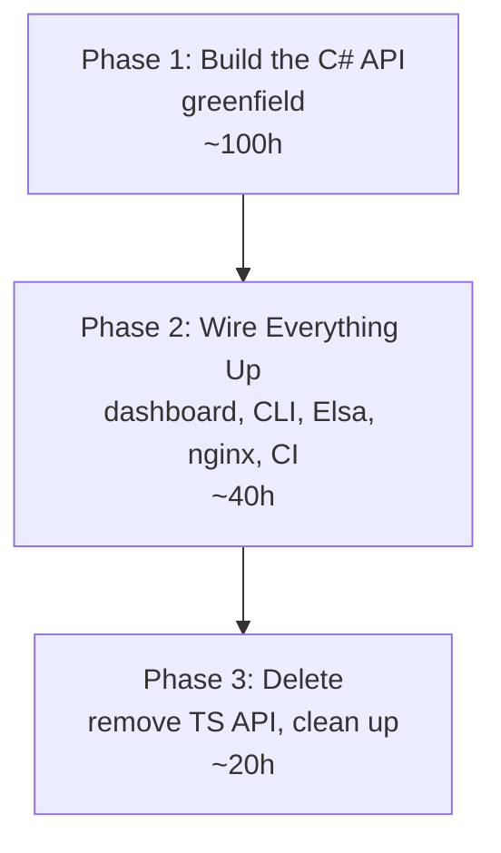

# Story 19-1: API Consolidation — Greenfield C# API, Wipe and Recreate

Status: ready-for-dev

## MANDATORY: Before You Code

**ALL contributors MUST read and follow the comprehensive development process:**

[BEFORE_YOU_CODE.md](../../BEFORE_YOU_CODE.md)

## Story

As a **platform maintainer**,
I want to replace the TypeScript Fastify API (`packages/api`) with a greenfield
C# ASP.NET Core API (`apps/tamma-elsa/src/Tamma.Api`),
so that we have a single backend runtime, one deployment artifact, one set of
EF Core migrations, and reduced operational complexity.

## Background

The Tamma platform currently runs **two** REST APIs behind nginx:

| Service | Runtime | Port | Routes |
|---|---|---|---|
| `tamma-api` (TS) | Node.js 22 + Fastify 5 | 3100 | `/api/*` (141 endpoints) |
| `tamma-api-dotnet` (C#) | .NET 8 + ASP.NET Core | 5080 | `/health`, `/api/mentorship/*`, Elsa management |

Both connect to the same PostgreSQL 17 database. The TS API owns 18 hand-written
SQL migrations and 19+ persistence store files. The C# API has a separate
`TammaDbContext` with EF Core migrations covering only the mentorship domain.

### Why greenfield, not port

This is **pre-production**. There are no real users, no real data, no production
uptime obligations. The correct approach is:

- **No coexistence.** No phased nginx split-routing. No two APIs running at once.
- **No migration.** No hash compatibility (scrypt/bcrypt). No JWT format compat.
  No cookie preservation. Design from scratch using .NET idioms.
- **No data preservation.** All user accounts, API keys, GitHub installations,
  tenant memberships can be recreated from scratch after cutover.
- **Fresh database.** `dotnet ef migrations add InitialCreate` generates the schema.
  No need to match the 18 existing SQL migrations.

---

## Key Design Decisions

### 1. Greenfield, Not Port

Design the C# API as if the TS API never existed. Use .NET conventions:
PascalCase, async/await, dependency injection, middleware pipeline. Do not copy
TS patterns (InMemory/Pg store pairs, Fastify plugin registration, etc.).

### 2. Argon2id for Password Hashing

.NET does not have a built-in Argon2id implementation, but `Konscious.Security.Cryptography`
or `Isopoh.Cryptography.Argon2` provide it. No need for bcrypt compatibility since
all accounts will be recreated.

### 3. JWT from Scratch

Design JWT claims properly:
- `iss`: `tamma`
- `aud`: `tamma-api`
- `sub`: user ID (UUID)
- `tid`: tenant ID (UUID)
- `role`: user role within current tenant
- `email`: user email
- `exp`, `iat`, `jti`: standard claims

Use `Microsoft.AspNetCore.Authentication.JwtBearer` with `HS256` or `RS256`.
No need to interoperate with TS-issued tokens.

### 4. EF Core Global Query Filters for Tenant Isolation

Every entity with `TenantId` gets an automatic filter:

```csharp
builder.Entity<User>().HasQueryFilter(u =>
    _tenantContext.TenantId == null || u.TenantId == _tenantContext.TenantId);
```

The `null` check allows admin queries to bypass tenant filtering.
Replaces the TS `withTenantContext()` / `SET LOCAL app.current_tenant_id` pattern.

### 5. Minimal APIs with Route Groups

Group routes by feature using `MapGroup()`:

```csharp
var auth = app.MapGroup("/api/v1/auth");
auth.MapPost("/register", AuthEndpoints.Register);
auth.MapPost("/login", AuthEndpoints.Login);

var admin = app.MapGroup("/api/admin").RequireAuthorization("AdminAccess");
admin.MapGet("/health", AdminEndpoints.GetHealth);
```

Exception: keep the existing `MentorshipController` as-is (already MVC).

### 6. SignalR for Real-Time (Only If Needed)

The TS API has 3 SSE endpoints:
- `GET /api/engine/events/state`
- `GET /api/engine/events/logs`
- `GET /api/workflows/instances/:id/events`

The dashboard does not appear to use any of these. If real-time is needed later,
add a SignalR hub. For now, skip it and provide polling endpoints instead.

### 7. Elsa Activities Call In-Process via DI

Since Elsa and the API run in the same .NET process, Elsa activities should
inject repositories and services directly via DI rather than making HTTP calls
to the API. This eliminates network overhead and simplifies error handling.

### 8. Secret Broker Stays TypeScript

`packages/secret-broker` (when built) remains a separate Node.js process.
The C# API calls it via HTTP, same as before.

### 9. Fresh Database

Run `dotnet ef migrations add InitialCreate` to generate a clean schema from
the EF Core entity definitions. The 18 existing SQL migrations are archived
for historical reference but never executed again.

---

## Dependency Graph



No parallel phases. No rollback strategy needed (pre-production, no users).

---

## Phase 1: Build the C# API (Greenfield)

**Goal**: Build a complete C# API covering all 141 endpoints, with auth,
RBAC, tenant isolation, and full test coverage. This is a from-scratch build
using .NET conventions.

**Estimated effort**: 100 hours

### 1.1 EF Core DbContext and Entities

Design entities from scratch. Do not replicate the TS schema 1:1 -- use .NET
conventions and fix any awkward naming. The entity list covers all domains:

**Auth & Users**

| Entity | Key Columns | Notes |
|---|---|---|
| `User` | Id, Email, PasswordHash, DisplayName, AvatarUrl, Role, TenantId, EmailVerified, IsActive | Soft-delete via `DeletedAt` |
| `RefreshToken` | Id, UserId, TokenHash, ExpiresAt, RevokedAt | One user can have multiple |
| `PasswordResetToken` | Id, UserId, TokenHash, ExpiresAt, UsedAt | Single-use |

**Tenants & Organizations**

| Entity | Key Columns | Notes |
|---|---|---|
| `Tenant` | Id, Name, Slug, Type (personal/org), OwnerId, Settings (JSONB) | |
| `TenantMembership` | Id, TenantId, UserId, Role | Composite unique on (TenantId, UserId) |
| `UserInvite` | Id, TenantId, Email, Role, Token, ExpiresAt, AcceptedAt | |

**API Keys**

| Entity | Key Columns | Notes |
|---|---|---|
| `ApiKey` | Id, OwnerId, OwnerType (user/installation), Name, KeyHash, KeyPrefix, Scopes (string[]), TenantId | Unified key model |

**GitHub Integration**

| Entity | Key Columns | Notes |
|---|---|---|
| `GitHubInstallation` | Id, InstallationId (GitHub int), AccountLogin, AccountType, AppSlug, Permissions (JSONB) | |
| `GitHubInstallationRepo` | Id, InstallationId, RepoFullName, RepoId | |

**Agent Configuration**

| Entity | Key Columns | Notes |
|---|---|---|
| `AgentConfig` | Id, TenantId, Config (JSONB), UpdatedAt | One per tenant |

**Prompts**

| Entity | Key Columns | Notes |
|---|---|---|
| `PromptOverride` | Id, UserId, Scope, Role, Action, Template, SystemPrompt, Variables (string[]), EnableTools, MaxTokens, TenantId | User overrides; system defaults stay in code |

**Provider Management**

| Entity | Key Columns | Notes |
|---|---|---|
| `ProviderHealth` | Id, ProviderKey, Status, LastSuccess, LastFailure, FailureCount, TenantId | |
| `ProviderDiagnostic` | Id, ProviderKey, RequestDuration, TokensUsed, Cost, TenantId, CreatedAt | |
| `SanitizationRule` | Id, TenantId, Rules (JSONB) | |

**Workflows & Events**

| Entity | Key Columns | Notes |
|---|---|---|
| `WorkflowDefinition` | Id, Name, Description, Steps (JSONB), TenantId | |
| `WorkflowInstance` | Id, DefinitionId, Status, Context (JSONB), TenantId, StartedAt, CompletedAt | |
| `DomainEvent` | Id, Type, Tags (JSONB), Metadata (JSONB), Data (JSONB), TenantId, CreatedAt | Event store |

**Mentorship (existing)**

Keep existing `MentorshipSession`, `MentorshipGoal`, `MentorshipFeedback`,
`MentorshipMetrics` entities from `Tamma.Core`.

**Total**: ~22 entities. Create in `Tamma.Data/Entities/`.

**DbContext**: Rewrite `TammaDbContext` with all DbSets, `OnModelCreating`
configuration (indexes, JSONB columns, composite keys, query filters).

### 1.2 Repository Layer

One repository per aggregate root. EF Core eliminates the InMemory/Pg pair pattern.

| Repository Interface | Methods |
|---|---|
| `IUserRepository` | Create, GetById, GetByEmail, GetByGitHubId, List, Update, SoftDelete |
| `IRefreshTokenRepository` | Create, GetByTokenHash, Revoke, RevokeAllForUser, CleanExpired |
| `IPasswordResetRepository` | Create, GetByTokenHash, MarkUsed |
| `ITenantRepository` | Create, GetById, GetBySlug, Update, Delete, ListByUser |
| `ITenantMembershipRepository` | Add, Remove, GetRole, ListByTenant, ListByUser |
| `IInviteRepository` | Create, GetByToken, ListByTenant, Delete |
| `IApiKeyRepository` | Create, GetByHash, ListByOwner, Revoke, Rotate |
| `IInstallationRepository` | Upsert, GetById, GetByInstallationId, ListByUser, Delete |
| `IAgentConfigRepository` | Get, Upsert, Delete |
| `IPromptRepository` | Get, Upsert, Delete, List |
| `IProviderHealthRepository` | RecordSuccess, RecordFailure, GetStatus, GetAll, Reset |
| `IDiagnosticsRepository` | Insert, Query, GetReport, GetBudget |
| `ISanitizationRepository` | GetRules, UpsertRules |
| `IWorkflowRepository` | CreateDef, GetDef, ListDefs, CreateInstance, UpdateInstance, GetInstance, ListInstances |
| `IEventRepository` | Append, Query, GetById |

Create in `Tamma.Data/Repositories/`. Each is a simple EF Core implementation --
inject `TammaDbContext`, use LINQ queries.

### 1.3 Auth Infrastructure

**Password hashing**: Argon2id via `Konscious.Security.Cryptography.Argon2`.

**JWT**: `Microsoft.AspNetCore.Authentication.JwtBearer`.
- Issue tokens with claims: `sub`, `tid`, `role`, `email`, `jti`, `iss`, `aud`.
- Store refresh tokens in the database.
- Access token expiry: 15 minutes. Refresh token expiry: 7 days.

**API key auth**: Custom `AuthenticationHandler<ApiKeyAuthOptions>`.
- Keys stored as Argon2id hashes with a cleartext prefix for identification.
- Scopes: `engine:read`, `engine:write`, `admin:read`, `admin:write`, etc.

**Authorization policies**: ASP.NET Core authorization with requirements + handlers.

| Policy | Requirement |
|---|---|
| `AdminAccess` | Role == admin or owner |
| `OwnerAccess` | Role == owner |
| `MemberAccess` | Any authenticated tenant member |
| `SettingsView` | Permission: `settings:view` |
| `SettingsManage` | Permission: `settings:manage` |
| `WorkflowsView` | Permission: `workflows:view` |
| `WorkflowsManage` | Permission: `workflows:manage` |
| `DashboardView` | Permission: `dashboard:view` |

**Login lockout**: 5 failed attempts in 15 minutes triggers a 30-minute lockout.

**Files to create**:
- `Tamma.Api/Auth/` -- `JwtService.cs`, `ApiKeyAuthHandler.cs`, `PermissionHandler.cs`, `Permissions.cs`
- `Tamma.Api/Services/` -- `PasswordService.cs`, `LoginLockoutService.cs`

### 1.4 Middleware

| Middleware | Purpose |
|---|---|
| `TenantContextMiddleware` | Extract tenant ID from JWT `tid` claim, set on scoped `TenantContext` |
| `EnsurePersonalTenantMiddleware` | Auto-create personal tenant on first authenticated request |

Both register in the ASP.NET Core middleware pipeline after `UseAuthentication()`
and `UseAuthorization()`.

### 1.5 Endpoint Groups

All 141 endpoints implemented as Minimal API route groups. Group by feature:

#### Auth Endpoints (12 routes)

| Method | Path | Handler |
|---|---|---|
| POST | `/api/v1/auth/register` | `AuthEndpoints.Register` |
| POST | `/api/v1/auth/verify-email` | `AuthEndpoints.VerifyEmail` |
| POST | `/api/v1/auth/resend-verification` | `AuthEndpoints.ResendVerification` |
| POST | `/api/v1/auth/login` | `AuthEndpoints.Login` |
| POST | `/api/v1/auth/refresh` | `AuthEndpoints.Refresh` |
| POST | `/api/v1/auth/logout` | `AuthEndpoints.Logout` |
| POST | `/api/v1/auth/password-reset/request` | `AuthEndpoints.RequestPasswordReset` |
| POST | `/api/v1/auth/password-reset/confirm` | `AuthEndpoints.ConfirmPasswordReset` |
| GET | `/api/auth/me` | `AuthEndpoints.Me` |
| GET | `/api/auth/role-check` | `AuthEndpoints.RoleCheck` |
| GET | `/api/auth/github` | `AuthEndpoints.GitHubOAuthStart` |
| GET | `/api/auth/github/callback` | `AuthEndpoints.GitHubOAuthCallback` |

#### Admin Endpoints (15 routes)

| Method | Path | Handler |
|---|---|---|
| GET | `/api/admin/health` | `AdminEndpoints.GetHealth` |
| POST | `/api/admin/service-keys` | `AdminEndpoints.CreateServiceKey` |
| GET | `/api/admin/service-keys` | `AdminEndpoints.ListServiceKeys` |
| POST | `/api/admin/service-keys/{id}/rotate` | `AdminEndpoints.RotateServiceKey` |
| DELETE | `/api/admin/service-keys/{id}` | `AdminEndpoints.DeleteServiceKey` |
| GET | `/api/admin/users` | `AdminEndpoints.ListUsers` |
| GET | `/api/admin/users/{id}` | `AdminEndpoints.GetUser` |
| PUT | `/api/admin/users/{id}/role` | `AdminEndpoints.UpdateUserRole` |
| DELETE | `/api/admin/users/{id}` | `AdminEndpoints.DeleteUser` |
| POST | `/api/admin/users/invite` | `AdminEndpoints.InviteUser` |
| GET | `/api/admin/users/invites` | `AdminEndpoints.ListInvites` |
| DELETE | `/api/admin/users/invites/{id}` | `AdminEndpoints.DeleteInvite` |
| POST | `/api/admin/users/{id}/keys` | `AdminEndpoints.CreateUserApiKey` |
| GET | `/api/admin/users/{id}/keys` | `AdminEndpoints.ListUserApiKeys` |
| DELETE | `/api/admin/users/{id}/keys/{keyId}` | `AdminEndpoints.DeleteUserApiKey` |

#### Organization / Tenant Endpoints (14 routes)

| Method | Path | Handler |
|---|---|---|
| POST | `/api/v1/orgs` | `OrgEndpoints.CreateOrg` |
| GET | `/api/v1/orgs/{tenantId}` | `OrgEndpoints.GetOrg` |
| PUT | `/api/v1/orgs/{tenantId}/settings` | `OrgEndpoints.UpdateSettings` |
| GET | `/api/v1/orgs/{tenantId}/members` | `OrgEndpoints.ListMembers` |
| PUT | `/api/v1/orgs/{tenantId}/members/{userId}/role` | `OrgEndpoints.UpdateMemberRole` |
| DELETE | `/api/v1/orgs/{tenantId}/members/{userId}` | `OrgEndpoints.RemoveMember` |
| POST | `/api/v1/orgs/{tenantId}/invites` | `OrgEndpoints.CreateInvite` |
| GET | `/api/v1/orgs/{tenantId}/invites` | `OrgEndpoints.ListInvites` |
| DELETE | `/api/v1/orgs/{tenantId}/invites/{inviteId}` | `OrgEndpoints.DeleteInvite` |
| POST | `/api/v1/orgs/invites/accept` | `OrgEndpoints.AcceptInvite` |
| POST | `/api/v1/auth/switch-org` | `OrgEndpoints.SwitchOrg` |
| GET | `/api/v1/tenants` | `OrgEndpoints.ListTenants` |
| POST | `/api/v1/orgs/{tenantId}/transfer-ownership` | `OrgEndpoints.TransferOwnership` |
| DELETE | `/api/v1/orgs/{tenantId}` | `OrgEndpoints.DeleteOrg` |

#### Agent Config Endpoints (5 routes)

| Method | Path | Handler |
|---|---|---|
| GET | `/api/v1/agents/config` | `AgentEndpoints.GetConfig` |
| PUT | `/api/v1/agents/config` | `AgentEndpoints.UpdateConfig` |
| POST | `/api/v1/agents/config/validate` | `AgentEndpoints.ValidateConfig` |
| GET | `/api/v1/agents/{role}/resolve` | `AgentEndpoints.ResolveAgent` |
| POST | `/api/v1/agents/resolve-for-phase` | `AgentEndpoints.ResolveForPhase` |

#### Prompt Endpoints (9 routes)

| Method | Path | Handler |
|---|---|---|
| GET | `/api/prompts` | `PromptEndpoints.ListAll` |
| GET | `/api/prompts/system` | `PromptEndpoints.ListSystemDefaults` |
| GET | `/api/prompts/system/{role}/{action}` | `PromptEndpoints.GetSystemDefault` |
| GET | `/api/prompts/{role}/{action}` | `PromptEndpoints.GetResolved` |
| PUT | `/api/prompts/{role}/{action}` | `PromptEndpoints.Upsert` |
| DELETE | `/api/prompts/{role}/{action}` | `PromptEndpoints.Delete` |
| PUT | `/api/prompts/system/{role}/{action}` | `PromptEndpoints.UpsertSystemOverride` |
| DELETE | `/api/prompts/system/{role}/{action}` | `PromptEndpoints.DeleteSystemOverride` |
| POST | `/api/prompts/{role}/{action}/render` | `PromptEndpoints.Render` |

#### Settings Endpoints -- Config Group (11 routes)

| Method | Path | Handler |
|---|---|---|
| GET | `/api/config/agents` | `SettingsEndpoints.GetAgentsConfig` |
| PUT | `/api/config/agents` | `SettingsEndpoints.UpdateAgentsConfig` |
| GET | `/api/config/security` | `SettingsEndpoints.GetSecurityConfig` |
| PUT | `/api/config/security` | `SettingsEndpoints.UpdateSecurityConfig` |
| POST | `/api/config/sanitize` | `SettingsEndpoints.Sanitize` |
| GET | `/api/config/sanitize/rules` | `SettingsEndpoints.GetSanitizationRules` |
| PUT | `/api/config/sanitize/rules` | `SettingsEndpoints.UpdateSanitizationRules` |
| GET | `/api/config/prompts` | `SettingsEndpoints.GetPromptsConfig` |
| PUT | `/api/config/prompts/{role}` | `SettingsEndpoints.UpdatePromptsConfig` |
| GET | `/api/config/providers` | `SettingsEndpoints.GetProvidersConfig` |
| PUT | `/api/config/providers` | `SettingsEndpoints.UpdateProvidersConfig` |

#### Settings Endpoints -- Providers Group (15 routes)

| Method | Path | Handler |
|---|---|---|
| GET | `/api/providers/health` | `ProviderEndpoints.GetHealthSummary` |
| GET | `/api/providers/health/providers` | `ProviderEndpoints.ListProviderHealth` |
| GET | `/api/providers/health/providers/{key}` | `ProviderEndpoints.GetProviderHealth` |
| POST | `/api/providers/health/providers/{key}/failure` | `ProviderEndpoints.RecordFailure` |
| POST | `/api/providers/health/providers/{key}/success` | `ProviderEndpoints.RecordSuccess` |
| POST | `/api/providers/health/providers/{key}/reset` | `ProviderEndpoints.ResetHealth` |
| GET | `/api/providers/diagnostics` | `ProviderEndpoints.ListDiagnostics` |
| GET | `/api/providers/diagnostics/query` | `ProviderEndpoints.QueryDiagnostics` |
| GET | `/api/providers/diagnostics/report` | `ProviderEndpoints.GetDiagnosticsReport` |
| GET | `/api/providers/diagnostics/budget/{accountId}` | `ProviderEndpoints.GetBudget` |
| POST | `/api/providers/diagnostics` | `ProviderEndpoints.IngestDiagnostics` |
| POST | `/api/providers/providers/create` | `ProviderEndpoints.CreateProvider` |
| POST | `/api/providers/providers/{handle}/execute` | `ProviderEndpoints.ExecuteProvider` |
| DELETE | `/api/providers/providers/{handle}` | `ProviderEndpoints.DeleteProvider` |
| GET | `/api/providers/providers/sessions` | `ProviderEndpoints.ListSessions` |

#### Convention Template Endpoints (2 routes)

| Method | Path | Handler |
|---|---|---|
| GET | `/api/convention-templates` | `ConventionEndpoints.ListAll` |
| GET | `/api/convention-templates/{key}` | `ConventionEndpoints.GetByKey` |

Convention templates are read-only reference data. Port the 20 templates from
`services/default-prompts.ts` to a static C# class.

#### Knowledge Base Endpoints (30 routes)

| Method | Path | Handler |
|---|---|---|
| GET | `/api/kb/index/status` | `KbEndpoints.GetIndexStatus` |
| POST | `/api/kb/index/trigger` | `KbEndpoints.TriggerIndex` |
| DELETE | `/api/kb/index/cancel` | `KbEndpoints.CancelIndex` |
| GET | `/api/kb/index/history` | `KbEndpoints.GetIndexHistory` |
| GET | `/api/kb/index/config` | `KbEndpoints.GetIndexConfig` |
| PUT | `/api/kb/index/config` | `KbEndpoints.UpdateIndexConfig` |
| GET | `/api/kb/vector-db/collections` | `KbEndpoints.ListCollections` |
| POST | `/api/kb/vector-db/collections` | `KbEndpoints.CreateCollection` |
| GET | `/api/kb/vector-db/collections/{name}/stats` | `KbEndpoints.GetCollectionStats` |
| DELETE | `/api/kb/vector-db/collections/{name}` | `KbEndpoints.DeleteCollection` |
| POST | `/api/kb/vector-db/search` | `KbEndpoints.SearchVectorDb` |
| GET | `/api/kb/vector-db/storage` | `KbEndpoints.GetStorageInfo` |
| GET | `/api/kb/rag/config` | `KbEndpoints.GetRagConfig` |
| PUT | `/api/kb/rag/config` | `KbEndpoints.UpdateRagConfig` |
| GET | `/api/kb/rag/metrics` | `KbEndpoints.GetRagMetrics` |
| POST | `/api/kb/rag/test` | `KbEndpoints.TestRag` |
| GET | `/api/kb/mcp/servers` | `KbEndpoints.ListMcpServers` |
| GET | `/api/kb/mcp/servers/{name}` | `KbEndpoints.GetMcpServer` |
| POST | `/api/kb/mcp/servers/{name}/start` | `KbEndpoints.StartMcpServer` |
| POST | `/api/kb/mcp/servers/{name}/stop` | `KbEndpoints.StopMcpServer` |
| POST | `/api/kb/mcp/servers/{name}/restart` | `KbEndpoints.RestartMcpServer` |
| GET | `/api/kb/mcp/servers/{name}/tools` | `KbEndpoints.ListMcpTools` |
| POST | `/api/kb/mcp/servers/{name}/tools/{tool}/invoke` | `KbEndpoints.InvokeMcpTool` |
| GET | `/api/kb/mcp/servers/{name}/logs` | `KbEndpoints.GetMcpLogs` |
| POST | `/api/kb/context/test` | `KbEndpoints.TestContext` |
| POST | `/api/kb/context/feedback` | `KbEndpoints.SubmitContextFeedback` |
| GET | `/api/kb/context/history` | `KbEndpoints.GetContextHistory` |
| GET | `/api/kb/analytics/usage` | `KbEndpoints.GetUsageAnalytics` |
| GET | `/api/kb/analytics/quality` | `KbEndpoints.GetQualityAnalytics` |
| GET | `/api/kb/analytics/costs` | `KbEndpoints.GetCostAnalytics` |

Note: KB routes are currently backed by mock services in the TS API. The C#
implementation should also start with stub/mock responses and be wired to
real services later.

#### Engine Endpoints (22 routes)

| Method | Path | Handler |
|---|---|---|
| POST | `/api/engine/command` | `EngineEndpoints.SendCommand` |
| GET | `/api/engine/state` | `EngineEndpoints.GetState` |
| GET | `/api/engine/stats` | `EngineEndpoints.GetStats` |
| GET | `/api/engine/plan` | `EngineEndpoints.GetPlan` |
| GET | `/api/engine/history` | `EngineEndpoints.GetHistory` |
| GET | `/api/engine/events/state` | `EngineEndpoints.PollStateEvents` |
| GET | `/api/engine/events/logs` | `EngineEndpoints.PollLogEvents` |
| POST | `/api/engine/store-context` | `EngineEndpoints.StoreContext` |
| GET | `/api/engine/context/{issueNumber}` | `EngineEndpoints.GetContext` |
| POST | `/api/engine/query-context` | `EngineEndpoints.QueryContext` |
| GET | `/api/engine/repo-config` | `EngineEndpoints.GetRepoConfig` |
| GET | `/api/engine/issues` | `EngineEndpoints.ListIssues` |
| GET | `/api/engine/security-alerts` | `EngineEndpoints.ListSecurityAlerts` |
| POST | `/api/engine/issue-comment` | `EngineEndpoints.CreateIssueComment` |
| POST | `/api/engine/issue-labels` | `EngineEndpoints.AddIssueLabels` |
| DELETE | `/api/engine/issue-labels/{repo}/{issueNumber}/{label}` | `EngineEndpoints.RemoveIssueLabel` |
| POST | `/api/engine/create-issue` | `EngineEndpoints.CreateIssue` |
| POST | `/api/engine/trigger-ci` | `EngineEndpoints.TriggerCi` |
| POST | `/api/engine/execute-task` | `EngineEndpoints.ExecuteTask` |
| POST | `/api/engine/cycle-result` | `EngineEndpoints.SubmitCycleResult` |
| GET | `/api/engine/cycle-results` | `EngineEndpoints.ListCycleResults` |
| POST | `/api/engine/agent-available` | `EngineEndpoints.AgentAvailable` |

The former SSE endpoints (`events/state`, `events/logs`) become polling endpoints
returning the latest N events. If real-time push is needed later, add SignalR.

#### Workflow Endpoints (8 routes)

| Method | Path | Handler |
|---|---|---|
| POST | `/api/workflows/definitions` | `WorkflowEndpoints.CreateDefinition` |
| GET | `/api/workflows/definitions` | `WorkflowEndpoints.ListDefinitions` |
| POST | `/api/workflows/instances` | `WorkflowEndpoints.CreateInstance` |
| PUT | `/api/workflows/instances/{id}` | `WorkflowEndpoints.UpdateInstance` |
| GET | `/api/workflows/instances` | `WorkflowEndpoints.ListInstances` |
| POST | `/api/workflows/instances/{id}/cancel` | `WorkflowEndpoints.CancelInstance` |
| DELETE | `/api/workflows/instances/{id}` | `WorkflowEndpoints.DeleteInstance` |
| GET | `/api/workflows/instances/{id}/events` | `WorkflowEndpoints.GetInstanceEvents` |

#### GitHub App Endpoints (2 routes)

| Method | Path | Handler |
|---|---|---|
| GET | `/api/github/callback` | `GitHubEndpoints.Callback` |
| POST | `/api/github/webhooks` | `GitHubEndpoints.Webhook` |

#### SaaS Endpoints (4 routes)

| Method | Path | Handler |
|---|---|---|
| POST | `/api/v1/llm/chat` | `SaaSEndpoints.LlmChat` |
| POST | `/api/v1/workflows/{id}/status` | `SaaSEndpoints.WorkflowStatus` |
| POST | `/api/v1/workflows/{id}/result` | `SaaSEndpoints.WorkflowResult` |
| POST | `/api/v1/installations/{id}/rotate-key` | `SaaSEndpoints.RotateKey` |

#### Dashboard Endpoints (3 routes)

| Method | Path | Handler |
|---|---|---|
| GET | `/api/dashboard/summary` | `DashboardEndpoints.GetSummary` |
| GET | `/api/dashboard/engines` | `DashboardEndpoints.ListEngines` |
| GET | `/api/dashboard/workflows` | `DashboardEndpoints.ListWorkflows` |

#### Health (1 route)

| Method | Path | Handler |
|---|---|---|
| GET | `/api/health` | inline `() => Results.Ok(new { status = "ok" })` |

**Total**: 141 endpoints across 12 endpoint files.

### 1.6 Prompt System Defaults

Port the system default prompts from `services/default-prompts.ts` to a static
C# class `Data/DefaultPrompts.cs`. This includes:
- 8 role identity prompts
- 10 action base templates
- 80 role+action templates
- 20 convention templates

The `PromptService` resolves prompts using the same 4-level resolution order
as the TS implementation (see CLAUDE.md "Prompt Store Architecture").

### 1.7 Dockerfile and Docker Compose

Create a production Dockerfile for the consolidated API:

```dockerfile
FROM mcr.microsoft.com/dotnet/aspnet:8.0 AS base
WORKDIR /app
EXPOSE 3100

FROM mcr.microsoft.com/dotnet/sdk:8.0 AS build
WORKDIR /src
COPY . .
RUN dotnet publish "Tamma.Api/Tamma.Api.csproj" -c Release -o /app/publish

FROM base AS final
COPY --from=build /app/publish .
ENTRYPOINT ["dotnet", "Tamma.Api.dll"]
```

The API listens on port 3100 (same as the TS API did) so nginx config stays simple.

### 1.8 xUnit Test Suite

Target: ~300 tests covering all functionality.

| Test Category | Count | What It Covers |
|---|---|---|
| Entity + DbContext | 30 | Column mapping, JSONB, query filters, relationships |
| Repository | 40 | CRUD for all 15 repositories |
| Auth | 30 | JWT issue/validate, API key auth, permissions, lockout |
| Middleware | 15 | Tenant context, personal tenant creation |
| Auth endpoints | 40 | Register, login, refresh, logout, password reset, OAuth |
| Admin endpoints | 35 | Users, invites, API keys, service keys, health |
| Org endpoints | 30 | CRUD, members, invites, ownership transfer |
| Agent endpoints | 10 | Config CRUD, resolver |
| Prompt endpoints | 20 | System defaults, overrides, rendering |
| Settings endpoints | 25 | Config group, providers group |
| Engine endpoints | 20 | Core, context, GitHub, task, callbacks |
| Workflow endpoints | 15 | Definitions, instances |
| Other endpoints | 10 | KB stubs, GitHub App, SaaS, dashboard, convention templates |
| **Total** | **~320** | |

Use `WebApplicationFactory<Program>` for integration tests. Use EF Core
InMemory provider for unit tests, real PostgreSQL (via Testcontainers) for
integration tests.

### Phase 1 Success Metrics

- [ ] All 22 entities mapped with correct column types + indexes
- [ ] `dotnet ef migrations add InitialCreate` generates clean schema
- [ ] Global query filters verified: cross-tenant queries return empty results
- [ ] JWT auth + API key auth working in integration tests
- [ ] All 141 endpoints returning correct responses
- [ ] All ~320 xUnit tests green
- [ ] Dockerfile builds and runs successfully

---

## Phase 2: Wire Everything Up

**Goal**: Connect all consumers to the new C# API and validate the full stack.

**Estimated effort**: 40 hours

### 2.1 Update Dashboard API Client

The dashboard (`apps/dashboard`) calls the API via fetch/axios. Since endpoint
paths are the same, the main changes are:
- Update any base URL configuration
- Remove any SSE/EventSource usage (replace with polling or remove)
- Update auth token format if cookie name or JWT shape changed

### 2.2 Update CLI

The CLI (`packages/cli`) currently imports `startApiServer()` from `@tamma/api`.
After consolidation:
- `tamma api` spawns the C# API process (`dotnet Tamma.Api.dll`)
- `tamma server` spawns both C# API and Elsa server
- All API calls from CLI use HTTP client (already the case for most operations)

### 2.3 Update Elsa Activities

Elsa activities currently call the TS API via HTTP. Since Elsa and the C# API
now share the same process:
- Activities inject repositories directly via DI instead of HTTP calls
- Remove `TammaApi__BaseUrl` configuration
- Remove HTTP client calls to `/api/engine/*`

This is a significant simplification. Activities like `StoreContextActivity`,
`ExecuteTaskActivity`, `CreateIssueCommentActivity` become thin wrappers
around repository/service calls.

### 2.4 Update nginx

Replace the current split-routing configuration with a single upstream:

```nginx
location /api/ {
    proxy_pass http://tamma-api:3100/api/;
}
```

No SignalR WebSocket upgrade needed unless we add real-time later.

### 2.5 Update CI/CD

- Remove the TS API build/test job from GitHub Actions
- Update the Docker build job to use the C# Dockerfile
- Add `dotnet test` step for the xUnit suite
- Update the deploy script to build only the C# API image

### 2.6 Post-Deploy Integration Tests

Run `tests/post-deploy/` against the new API. Update any tests that check for
TS-specific behavior (cookie names, JWT format, etc.).

### Phase 2 Success Metrics

- [ ] Dashboard login flow works end-to-end
- [ ] Dashboard pages load data correctly
- [ ] CLI `tamma api` spawns C# process
- [ ] Elsa activities execute successfully via DI
- [ ] nginx routes all `/api/*` to C# API
- [ ] CI pipeline green
- [ ] Post-deploy tests pass

---

## Phase 3: Delete

**Goal**: Remove all TS API artifacts. Clean slate.

**Estimated effort**: 20 hours

### 3.1 Remove `packages/api`

```bash
rm -rf packages/api
```

This removes:
- 40+ route files
- 19 persistence store files
- 13 auth files
- 5 middleware files
- 18 service files
- 75 test files
- ~15,000 lines of TypeScript

### 3.2 Update pnpm Workspace

Remove `@tamma/api` from `pnpm-workspace.yaml`. Run `pnpm install` to verify
no other package depends on it.

### 3.3 Remove TS-Only Dependencies

From root `package.json`, remove dependencies only used by the TS API:
- `fastify`, `@fastify/cors`, `@fastify/helmet`
- `pg` (only used by TS API stores)
- `@octokit/rest`, `@octokit/auth-app` (now in C# via Octokit.net)
- `scrypt` / `bcrypt` related packages

### 3.4 Archive SQL Migrations

```bash
git mv database/migrations database/migrations-archived
```

Keep for historical reference. EF Core migrations are the new source of truth.

### 3.5 Clean Up Docker Compose

**Before** (3 API services):
```yaml
tamma-api:          # TS Fastify (port 3100) -- DELETE
tamma-api-dotnet:   # C# ASP.NET (port 5080) -- RENAME to tamma-api, port 3100
elsa-server:        # C# Elsa (port 5000) -- KEEP
```

**After** (2 services):
```yaml
tamma-api:          # C# ASP.NET (port 3100)
elsa-server:        # C# Elsa (port 5000)
```

### 3.6 Update Documentation

- Update `docs/architecture.md` to reflect single C# API
- Update deployment docs
- Update CLAUDE.md if needed

### Phase 3 Success Metrics

- [ ] `packages/api/` directory gone
- [ ] `pnpm install` succeeds without `@tamma/api`
- [ ] Docker Compose runs with 2 services (API + Elsa), not 3
- [ ] All post-deploy integration tests pass
- [ ] No Node.js API process running
- [ ] CI pipeline green

---

## Acceptance Criteria

1. All 141 endpoints functional in the C# API with correct request/response contracts
2. Greenfield auth: Argon2id passwords, fresh JWT claims, no TS compatibility
3. Tenant isolation via EF Core global query filters on all tenant-scoped entities
4. ~320 xUnit tests covering all functionality
5. Elsa activities use DI (in-process), not HTTP calls to the API
6. Single API service in Docker Compose (plus Elsa server)
7. `packages/api` deleted entirely
8. Post-deploy integration tests passing
9. Total effort under 160 hours

---

## Tasks / Subtasks

### Phase 1: Build the C# API (100h)

- [ ] Task 1.1: Define 22 EF Core entities in `Tamma.Data/Entities/` (8h)
  - [ ] All column types, indexes, relationships, JSONB columns
  - [ ] `TenantId` on all tenant-scoped entities
  - [ ] Rewrite `TammaDbContext` with all DbSets + `OnModelCreating`
- [ ] Task 1.2: Implement global query filters for tenant isolation (4h)
  - [ ] Scoped `TenantContext` service
  - [ ] `HasQueryFilter()` on all tenant-scoped entities
  - [ ] Admin bypass via null tenant check
- [ ] Task 1.3: Generate initial EF Core migration (2h)
  - [ ] `dotnet ef migrations add InitialCreate`
  - [ ] Verify schema looks correct
- [ ] Task 1.4: Create 15 repository interfaces + implementations (10h)
  - [ ] One per aggregate root
  - [ ] Register in DI container
- [ ] Task 1.5: Build auth infrastructure (12h)
  - [ ] Argon2id password hashing service
  - [ ] JWT issue + validate service
  - [ ] API key auth handler
  - [ ] Authorization policies + handlers
  - [ ] Login lockout service
- [ ] Task 1.6: Build middleware (4h)
  - [ ] TenantContextMiddleware
  - [ ] EnsurePersonalTenantMiddleware
- [ ] Task 1.7: Implement auth endpoints (10h)
  - [ ] Register, verify email, login, refresh, logout, password reset
  - [ ] GitHub OAuth start + callback
  - [ ] Me, role-check
- [ ] Task 1.8: Implement admin endpoints (8h)
  - [ ] Health, service keys, users, invites, API keys
- [ ] Task 1.9: Implement org/tenant endpoints (8h)
  - [ ] CRUD, members, invites, ownership transfer, switch-org
- [ ] Task 1.10: Implement agent + prompt endpoints (8h)
  - [ ] Agent config CRUD, resolver
  - [ ] Prompt system defaults, overrides, rendering
  - [ ] Convention templates
- [ ] Task 1.11: Implement settings + provider endpoints (8h)
  - [ ] Config group (agents, security, sanitization, prompts, providers)
  - [ ] Providers group (health, diagnostics, factory)
- [ ] Task 1.12: Implement engine endpoints (8h)
  - [ ] Core (command, state, stats, plan, history)
  - [ ] Context (store, query, repo-config)
  - [ ] GitHub (issues, comments, labels, CI)
  - [ ] Task (execute, cycle-result)
  - [ ] Callbacks (agent-available)
- [ ] Task 1.13: Implement remaining endpoints (4h)
  - [ ] Workflow CRUD + instances
  - [ ] GitHub App (callback, webhooks)
  - [ ] SaaS (LLM proxy, workflow status/result, key rotation)
  - [ ] Dashboard (summary, engines, workflows)
  - [ ] KB routes (stub implementations)
- [ ] Task 1.14: Port prompt system defaults to C# (4h)
  - [ ] 8 role prompts, 10 action templates, 80 role+action templates
  - [ ] 20 convention templates
- [ ] Task 1.15: Write xUnit tests (~320 tests) (10h)
  - [ ] Entity, repository, auth, middleware, endpoint tests
  - [ ] Use WebApplicationFactory for integration tests
- [ ] Task 1.16: Dockerfile + docker-compose service (4h)
  - [ ] Multi-stage Dockerfile
  - [ ] Add to docker-compose alongside existing services

### Phase 2: Wire Everything Up (40h)

- [ ] Task 2.1: Update dashboard API client (8h)
  - [ ] Base URL, auth flow, remove SSE usage
- [ ] Task 2.2: Update CLI to spawn C# API (6h)
  - [ ] `tamma api` and `tamma server` commands
- [ ] Task 2.3: Refactor Elsa activities to use DI (12h)
  - [ ] Replace HTTP calls with repository/service injection
  - [ ] Remove `TammaApi__BaseUrl` config
- [ ] Task 2.4: Update nginx configuration (2h)
  - [ ] Single upstream, no split routing
- [ ] Task 2.5: Update CI/CD workflow (4h)
  - [ ] Remove TS API jobs, add C# test step
- [ ] Task 2.6: Post-deploy integration tests (8h)
  - [ ] Update and run `tests/post-deploy/`
  - [ ] Verify full stack end-to-end

### Phase 3: Delete (20h)

- [ ] Task 3.1: Delete `packages/api/` (1h)
- [ ] Task 3.2: Update pnpm-workspace.yaml + run `pnpm install` (1h)
- [ ] Task 3.3: Remove TS-only dependencies (2h)
- [ ] Task 3.4: Archive SQL migrations (1h)
- [ ] Task 3.5: Clean up Docker Compose (2h)
- [ ] Task 3.6: Update documentation (4h)
- [ ] Task 3.7: Final end-to-end validation (8h)
- [ ] Task 3.8: Clean up unused Elsa HTTP client configs (1h)

---

## NuGet Dependencies (New)

| Package | Purpose |
|---|---|
| `Konscious.Security.Cryptography.Argon2` | Argon2id password hashing |
| `Microsoft.AspNetCore.Authentication.JwtBearer` | JWT auth |
| `System.IdentityModel.Tokens.Jwt` | JWT creation |
| `Octokit` (Octokit.net) | GitHub API integration |
| `Testcontainers.PostgreSql` | Real PostgreSQL in tests |
| `Microsoft.AspNetCore.Mvc.Testing` | WebApplicationFactory |

---

## Risk Table

| Risk | Severity | Likelihood | Mitigation |
|---|---|---|---|
| Missing endpoints discovered after TS API deleted | Medium | Medium | Run endpoint inventory diff before delete; keep git history |
| KB routes need real implementations sooner than expected | Low | Low | Stub responses are fine; wire later |
| Elsa activity DI refactor breaks workflows | High | Medium | Test each activity individually; keep HTTP fallback option |
| Performance regression for high-throughput engine routes | Medium | Low | Benchmark before cutover; ASP.NET Core is fast |
| Dashboard expects specific JSON shapes that differ | Medium | Medium | Contract tests: capture TS responses, diff against C# |
| EF Core InMemory provider behaves differently from Npgsql | Low | High | Use Testcontainers for integration tests |

---

## Effort Summary

| Phase | Description | Effort (h) |
|---|---|---|
| 1 | Build the C# API (greenfield) | 100 |
| 2 | Wire everything up | 40 |
| 3 | Delete | 20 |
| **Total** | | **160** |

Serial execution (1 developer): ~4 weeks at 40h/week.

Savings vs. the old 5-phase plan: 52 hours (~25%) eliminated by dropping
coexistence, compatibility testing, phased nginx routing, and migration.

---

## File Structure (New)

```
apps/tamma-elsa/src/Tamma.Api/
  Auth/
    JwtService.cs
    ApiKeyAuthHandler.cs
    Permissions.cs
    PermissionHandler.cs
  Endpoints/
    AdminEndpoints.cs
    AgentEndpoints.cs
    AuthEndpoints.cs
    ConventionEndpoints.cs
    DashboardEndpoints.cs
    EngineEndpoints.cs
    GitHubEndpoints.cs
    KbEndpoints.cs
    OrgEndpoints.cs
    PromptEndpoints.cs
    ProviderEndpoints.cs
    SaaSEndpoints.cs
    SettingsEndpoints.cs
    WorkflowEndpoints.cs
  Middleware/
    TenantContextMiddleware.cs
    EnsurePersonalTenantMiddleware.cs
  Services/
    PasswordService.cs
    LoginLockoutService.cs
    PromptService.cs
    AgentResolverService.cs
    InstallationRouterService.cs
    GitHubSecretsService.cs
    EmailService.cs
  Program.cs (rewritten)

apps/tamma-elsa/src/Tamma.Data/
  Entities/
    User.cs
    Tenant.cs
    TenantMembership.cs
    ApiKey.cs
    RefreshToken.cs
    PasswordResetToken.cs
    UserInvite.cs
    GitHubInstallation.cs
    GitHubInstallationRepo.cs
    AgentConfig.cs
    PromptOverride.cs
    ProviderHealth.cs
    ProviderDiagnostic.cs
    SanitizationRule.cs
    WorkflowDefinition.cs
    WorkflowInstance.cs
    DomainEvent.cs
  Repositories/
    UserRepository.cs
    TenantRepository.cs
    TenantMembershipRepository.cs
    ApiKeyRepository.cs
    RefreshTokenRepository.cs
    PasswordResetRepository.cs
    InviteRepository.cs
    InstallationRepository.cs
    AgentConfigRepository.cs
    PromptRepository.cs
    ProviderHealthRepository.cs
    DiagnosticsRepository.cs
    SanitizationRepository.cs
    WorkflowRepository.cs
    EventRepository.cs
  TammaDbContext.cs (rewritten)
  TenantContext.cs

apps/tamma-elsa/tests/Tamma.Api.Tests/
  (xUnit test project — ~320 tests)
```

---

## Related

- **Architecture**: `docs/architecture.md`
- **Current TS API**: `packages/api/src/`
- **Current C# API**: `apps/tamma-elsa/src/Tamma.Api/`
- **C# Data layer**: `apps/tamma-elsa/src/Tamma.Data/`
- **SQL Migrations (to archive)**: `database/migrations/`
- **Docker Compose**: `docker/docker-compose.yml`
- **nginx Config**: `docker/nginx-proxy.conf.template`

## References

- **MANDATORY PROCESS:** [BEFORE_YOU_CODE.md](../../BEFORE_YOU_CODE.md)
- **Knowledge Base:** [.dev/README.md](../../.dev/README.md)
- [ASP.NET Core Minimal APIs](https://learn.microsoft.com/en-us/aspnet/core/fundamentals/minimal-apis)
- [EF Core Global Query Filters](https://learn.microsoft.com/en-us/ef/core/querying/filters)
- [Konscious.Security.Cryptography.Argon2](https://github.com/kmaragon/Konscious.Security.Cryptography)
- [Octokit.net](https://github.com/octokit/octokit.net)
- [Testcontainers for .NET](https://dotnet.testcontainers.org/)
