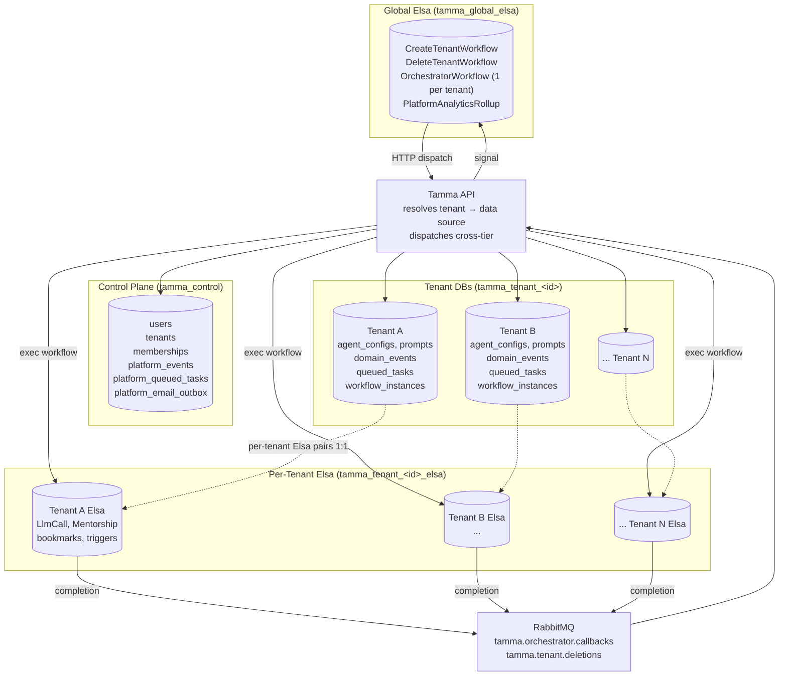
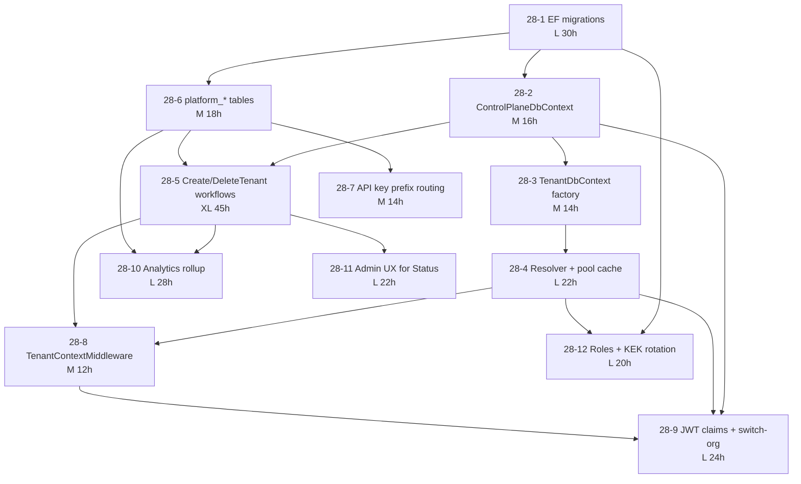

# Epic 28: Database-per-Tenant Isolation

Move Tamma from a single shared Postgres database (with `TenantId` column
and EF global query filter) to a database-per-tenant topology with a
separate control plane, per-tenant application DBs, a global Elsa DB for
platform workflows, and a per-tenant Elsa DB for each tenant's engine.

## Business rationale

The shared-DB model has reached the limit of what query filters can safely
guarantee: any forgotten `HasQueryFilter` is a cross-tenant leak, GDPR
"delete me" requires a multi-hour row-by-row purge, and cryptographic
tenant isolation is impossible. Database-per-tenant gives us constant-time
tenant deletion (`DROP DATABASE`), per-tenant encryption at rest, per-tenant
scaling knobs, and eliminates an entire class of query-filter-bypass bugs.
It also unlocks SOC 2 / ISO 27001 tenant-isolation requirements and opens
the door to BYO-database and on-prem tiers.

## Topology

## Stories

| # | Title | Effort | Category |
|---|---|---|---|
| [28-1](./28-1-ef-migration-scripts.md) | EF migration scripts (CP + tenant + global-Elsa + per-tenant Elsa) | L (30h) | Foundation |
| [28-2](./28-2-control-plane-dbcontext.md) | Split `TammaDbContext` into `ControlPlaneDbContext` | M (16h) | Foundation |
| [28-3](./28-3-tenant-dbcontext-factory.md) | `TenantDbContext` factory with runtime connection routing | M (14h) | Foundation |
| [28-4](./28-4-connection-resolver-pool-cache.md) | Tenant connection resolver + LRU pool cache | L (22h) | Foundation |
| [28-5](./28-5-create-delete-tenant-workflows.md) | `CreateTenantWorkflow` + `DeleteTenantWorkflow` on global Elsa | XL (45h) | Provisioning |
| [28-6](./28-6-platform-tables.md) | `platform_events` + `platform_queued_tasks` + `platform_email_outbox` | M (18h) | Provisioning |
| [28-7](./28-7-api-key-prefix-routing.md) | API-key prefix routing (`tk_t_` / `tk_pl_` / `tk_u_`) | M (14h) | Auth |
| [28-8](./28-8-tenant-context-middleware.md) | `TenantContextMiddleware` async-provisioning handling | M (12h) | Auth |
| [28-9](./28-9-jwt-claims-switch-org.md) | JWT claims + `/auth/switch-org` + refresh tokens across tenants | L (24h) | Auth |
| [28-10](./28-10-platform-analytics-rollup.md) | `platform_analytics_hourly` rollup workflow | L (28h) | Operations |
| [28-11](./28-11-admin-tenant-status-ux.md) | Admin UX for `tenants.Status` state machine | L (22h) | Operations |
| [28-12](./28-12-postgres-roles-kek-rotation.md) | Roles (`admin`/`provisioner`/`app`) + KEK rotation | L (20h) | Operations |
| [28-13](./story-28-13/28-13-openbao-kms-backend.md) | **DEFERRED** — OpenBao KMS backend for tenant KEK (replaces env-var KEK when a trigger condition fires — see story) | L–XL (30–45h) | Operations / Security |

**Total effort in scope**: 265 hours. Story 28-13 is deferred and
**not counted** — it lands only if a trigger condition (paying
tenants with breach clauses, compliance finding, threat-model change,
or OpenBao LF-graduation) is met.

## Dependency graph

**Dependency rules (textual form for clarity)**:

- 28-1 blocks every other story (nothing runs without schemas).
- 28-1 → 28-2 → 28-3 → 28-4 is the foundation critical path.
- 28-1 → 28-6 (platform tables only need migrations).
- 28-2 + 28-6 → 28-5 (workflow needs CP DbContext + `platform_events`).
- 28-4 + 28-5 → 28-8 (middleware needs the resolver + the status state machine).
- 28-2 + 28-4 + 28-8 → 28-9 (switch-org touches CP, resolver, and middleware).
- 28-6 → 28-7 (API-key routing uses control-plane key index).
- 28-5 + 28-6 → 28-10 (nightly rollup reads `platform_events` + per-tenant events).
- 28-5 → 28-11 (admin UX reflects the workflow-driven state machine).
- 28-1 + 28-4 → 28-12 (secrets and KEK feed the resolver).

## Cross-doc conflict resolutions

The four design docs under `plans/db-per-tenant/` were written by
different agents and disagree in four places. This epic resolves them as
follows; story files inherit these decisions.

### 1. Provisioning trigger — email verification, not registration

**Conflict**: Doc 01 §4.1–4.2 says registration writes to CP only and the
provisioning workflow is gated on the email-verification click. Doc 03
§0 / §1.1 says `POST /register` dispatches `CreateTenantWorkflow`
immediately.

**Resolution**: **Doc 01 wins.** Registration writes only to CP
(`users`, `tenants` with `Status='pending_verification'`,
`tenant_memberships`, `platform_events:TENANT.REGISTERED`). The
verify-email endpoint flips `tenants.Status` from `pending_verification`
to `provisioning` and emits `TENANT.PROVISIONING_REQUESTED`, on which the
global-Elsa `CreateTenantWorkflow` correlates. This avoids paying for DBs
for bot registrations and typo addresses — the dominant failure mode at
public-signup scale. Story 28-5 implements this trigger; story 28-11
reflects it in the state-machine UI.

### 2. Welcome email outbox — control plane

**Conflict**: Doc 01 §4.3 step 10 says "welcome email goes through the
**tenant's outbox** (`email_outbox` in the tenant DB)". Doc 03 §7.1 says
the welcome email queues to the **control-plane outbox**
(`platform_email_outbox`).

**Resolution**: **Doc 03 wins.** Welcome email enqueues to
`platform_email_outbox` in the control plane. Reasons: (a) it reuses the
existing `OutboxSmtpSender` single-table scan unchanged, (b) delivery is
decoupled from tenant-DB availability (a later maintenance window on the
tenant DB doesn't strand pending welcomes), (c) the content is owner
email + link — no tenant-DB PII. Story 28-5 step 10 inserts into
`platform_email_outbox`; story 28-6 ships the table.

### 3. Orchestrator lifetime on global Elsa — scale risk, measured

**Conflict**: Doc 02 §4.5 runs one long-running `OrchestratorWorkflow`
instance per active tenant on global Elsa. At 10k tenants that is 10k
idle workflow instances on a single Elsa. Doc 02 §12 open-decision #2
flags this as revisit-worthy.

**Resolution**: **Keep per-tenant instances for now, measure before we
exceed 500 production tenants.** Story 28-10 includes a benchmark task:
run global Elsa with 1k / 5k / 10k idle `OrchestratorWorkflow` instances
and measure DB-pool usage, bookmark-scan latency, and RAM. If any metric
exceeds a documented threshold (p95 bookmark scan > 500ms, instance RAM
> 2 GB at 5k idle), split the orchestrator to a tenant-fanout singleton
before production hits that scale. Recorded as an explicit scale risk on
the operations-category stories rather than deferred open question.

### 4. `platform_events` location — control plane (agreed)

**Conflict**: none — Doc 01 §5.1–5.2 and Doc 03 §2 both put
`platform_events` in the control plane.

**Resolution**: **Control plane.** `platform_events` is a new table with
the same schema as `domain_events`. Tenant-scoped events stay in each
tenant DB's `domain_events`; cross-tenant lifecycle events
(`TENANT.*`, `USER.REGISTERED`, `ORCHESTRATOR.TICK.*`) write to
`platform_events`. Story 28-6 ships it.

## Success metrics

1. **Four migration sets run clean on a fresh Postgres 17 instance.**
   `pnpm migrate:latest` (or the C# equivalent) produces the CP schema,
   tenant schema, global-Elsa schema, and per-tenant Elsa schema from
   zero to green, twice in a row (idempotent), with zero warnings.

2. **Tenant-create latency.** From verify-email click to
   `tenants.Status='active'`: p95 < 60s with 1 concurrent provisioning
   workflow, p95 < 120s with 10 concurrent workflows. Measured from
   `TENANT.PROVISIONING_REQUESTED` to `TENANT.PROVISIONED.SUCCESS`
   events in `platform_events`.

3. **Tenant-delete is O(1).** Wall-clock time for `DeleteTenantWorkflow`
   is independent of tenant data volume. A tenant with 10 events and a
   tenant with 10M events both finish deletion in under 30s (the cost is
   `DROP DATABASE`, not a row-by-row purge).

4. **Cross-tenant leak integration tests.** 12 targeted scenarios (query
   without tenant context, stale JWT with old `tid`, API key routed to
   wrong tenant, workflow-variable tenant spoof, admin impersonation
   exit, pool-cache eviction mid-request, concurrent switch-org,
   connection-string decrypt with wrong KEK, forgotten `TenantId` in a
   raw SQL query, webhook routing with unresolved installation, rootless
   JWT hitting tenant-scoped route, orphaned `user_id` from a deleted
   user) all pass with zero leaked tenant data.

5. **Steady-state connection count bounded.** At 1024 cached tenant
   pools × 10 max-conns per pool = 10k connection ceiling, but observed
   steady-state `pg_stat_activity` count stays under 4096 on a cluster
   with `max_connections=8192`. Measured via `tamma.tenant_pools.warm`
   metric.

## Design documents

- [`plans/db-per-tenant/01-control-plane-split.md`](../plans/db-per-tenant/01-control-plane-split.md)
  — control-plane / tenant-DB schema split, entity placement, auth,
  encryption, connection pool, tenant deletion.
- [`plans/db-per-tenant/02-elsa-two-tier.md`](../plans/db-per-tenant/02-elsa-two-tier.md)
  — global vs per-tenant Elsa topology, activity tier placement,
  orchestrator port, cross-tier HTTP + RabbitMQ communication.
- [`plans/db-per-tenant/03-async-tenant-provisioning.md`](../plans/db-per-tenant/03-async-tenant-provisioning.md)
  — `CreateTenantWorkflow` end-to-end, event taxonomy, idempotency,
  compensation, status projection, failure UX.
- [`plans/db-per-tenant/04-connection-pool-and-delete.md`](../plans/db-per-tenant/04-connection-pool-and-delete.md)
  — runtime connection resolver, LRU pool cache, delete flow,
  disaster-recovery, backup-before-delete.

## Implementation sequencing

See [`../plans/db-per-tenant/00-sequencing.md`](../plans/db-per-tenant/00-sequencing.md)
for the three-phase execution plan (Foundation → Provisioning plumbing →
Parallel streams), wall-clock estimates, parallel-agent safe groups, and
deploy gates.
