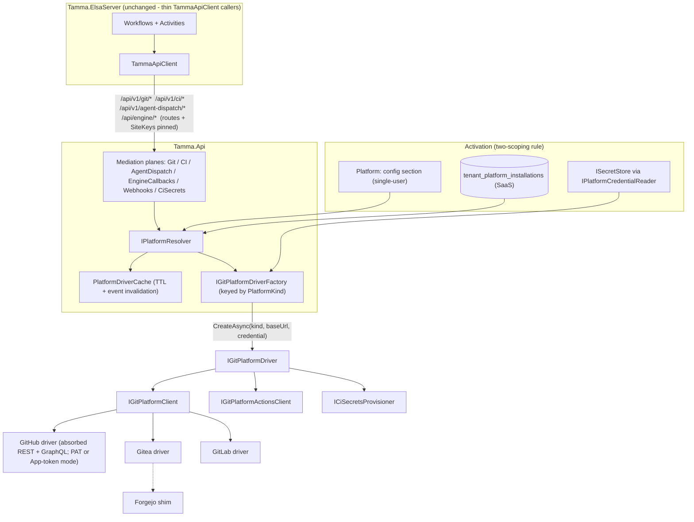

# Epic 31 — Multi-Git-Platform Execution Plan

**Date**: 2026-08-05
**Status**: ACTIVE — owner-directed completion plan
**Supersedes**: the Epic 31 freeze in D3 of `.dev/decisions/2026-08-04-post-wave-d-decisions.md`. By owner direction the epic is unfrozen and the architecture below is decided; do not re-litigate it. (D3's factual note stands: `docs/research/multi-git-platform-2026.md` never existed — demand is now asserted by the owner, not that citation.)

**The decided architecture** (owner, restated):
1. Config activates the platform — a config key in single-user mode; a per-tenant platform connection in SaaS (CLAUDE.md's two-scoping rule).
2. Every git call goes through the abstraction (`IGitPlatformClient`). No production path calls GitHub/Gitea/GitLab APIs directly. Drivers may implement via REST or CLI where CLI is the better tool.
3. Auth (user sign-in) is a separate plane from the git-platform plane.
4. Actions/CI is abstracted the same way (`IGitPlatformActionsClient`): dispatch, run status, artifacts.

All evidence below is grounded in `origin/main` (verified 2026-08-05, three independent inventory tracks + adversarial verdicts). Where a verdict refuted a claim, this plan states the correction.

---

## 1. Ground truth

**What is real.** The abstraction contract is complete: `IGitPlatformClient` (18 members incl. the six 31-13 PR-lifecycle verbs and `ListAccessibleReposAsync`), `IGitPlatformActionsClient` (5 verbs), `ICiSecretsProvisioner`, and `IGitPlatformDriver` with default-null `CiSecrets` (`Tamma.Platforms.Abstractions/IGitPlatformDriver.cs:59`). The Gitea and GitLab drivers make real HTTP for every core verb (branch, PR open/get/files/merge, line-anchored review comment, issue comment, webhook register, full Actions client); only the six lifecycle verbs return `capability_unsupported` (`GiteaPlatformClient.cs:280-318`, `GitLabPlatformClient.cs:392-423`). Forgejo is a wholesale shim over Gitea. The plane is **fully registered in Tamma.Api DI** — resolver, cache, credential reader, all four factories, connect service, webhook receiver (`Program.cs:846-928, 1080, 1089`).

**What is stub.** The GitHub driver's entire git surface returns `ServiceUnavailable`; `ListAccessibleReposAsync` is `yield break` with no HTTP (`GitHubPlatformClient.cs:293-307`), which makes the onboarding auth probe **vacuous for GitHub** — any junk credential persists a `connected` row (`PlatformConnectService.cs` probe loop). Its Actions surface delegates 3 of 5 verbs to `IGitHubActionsClient`, but that inner client is the real Octokit implementation **only when `GitHub:AppId`+`GitHub:PrivateKey` are configured** (`Program.cs:978-992`); PAT-only deployments get `NullGitHubActionsClient` — all 5 verbs dead. The factory discards per-tenant credentials (`GitHubPlatformDriverFactory.cs`: `_ = credentialPlaintext;`). The capability matrix **lies for GitHub**: it advertises `PrLifecycle` while the driver stubs all six verbs (`PlatformKindCapabilityMatrix.cs`).

**What is disconnected.** The governed production git path never touches the plane: `GitMediationService` (17 ops behind `/api/v1/git/*`) depends only on `IGitRepoAuthorizer`/`IGitTokenResolver`/`IGitHubClientFactory`/`IEventRepository` (`GitMediationService.cs:26-30`) and mints a token-bound `GitHubIntegrationService` at 17 call sites. `GitTokenResolver` hardcodes kind `"github"` and `GitHub:Token` (`GitTokenResolver.cs:30, :62`). The plane's only live consumers are the webhook receiver (`Program.cs:3367`) and onboarding connect. **Corrected fact (verdict)**: `CiSecretsRotationHandler` is *not* a production consumer — it is never registered as a keyed `IRotationHandler` (`SecretRotationServiceCollectionExtensions.cs:37-56` registers only `generic-http`/`postgres`/`cranl`), so CI-secrets is severed at **two** points: unregistered handler *and* null `driver.CiSecrets` on every driver.

**Other load-bearing corrections.**
- **Two disjoint GitHub registries**: the GitHub App flow (`/api/v1/onboarding/install-github` → `GitHubEndpoints.Callback` → `InstallationRouterService.cs:163`) writes `github_installations`, never `tenant_platform_installations`. App-installed tenants are invisible to the driver plane and to the BYOK tier.
- **The loop is not fully on `/api/v1/git`** (refuted claim): the cycle's step 0b reads repo conventions via `/api/engine/repo-config` (`SingleIssueCycleWorkflow.cs:136` → `ReadRepoConventionsActivity.cs:72`), and the loop's *feeder* — work-item selection (`AdlOrchestratorWorkflow.cs:104` → `SelectWorkItemActivity.cs:181`) and the whole triage/issue-creation flow — rides the GitHub-only, guard-less `/api/engine/*` callback plane (`EngineEndpoints.cs:663-811`, 8 handlers, no tenant param, no authorizer). Off-GitHub, the loop cannot even select work.
- **Nothing resumes the merge or CI waits, GitHub included**: `pr-merged-{n}` bookmark (`WaitForPRMergedActivity.cs:84`) has zero resumers — the legacy webhook enqueues `github.pull_request.*` tasks no handler consumes, and the 31-7 receiver dispatches to **zero registered `IWebhookHandler`s**; only the 12h TimedOut SLA ends the wait. Same for the CI-result bookmark (30m timeout). These must be built even for GitHub-only operation.
- **A governed CI mediation plane already exists** (`/api/v1/ci/{owner}/{repo}/test-runs` + `/build-status`, `Program.cs:3558-3565`) — GitHub-only via `CiClientFactory`. P3 extends *it*; no new routes.
- **Engine assembly is clean at DI level but not assembly level**: three orphaned Studio-reachable activities make direct GitHub REST calls (`ContextGatheringActivity.cs:277/391/544`, `FetchFileContentsActivity.cs:200`, `FetchSimilarPatternsActivity.cs:143`) — dormant, to be deleted/retyped.
- **Abstraction verb gaps**: the loop uses issue labels/close, release create, PR-comment listing, commits, and file-changes — none exist on `IGitPlatformClient`.
- **Docs drift**: `docs/sprint-status.yaml:452-464` marks 31-1..31-10 and 31-13 done; `wiki/Epics/Epic-31-Multi-Git-Platform.md` header says "Planning". Both wrong in opposite directions.

### Verb × driver matrix — `IGitPlatformClient`

REAL = makes HTTP · STUB = `ServiceUnavailable` · UNSUP = `capability_unsupported` (correct per contract) · Forgejo = Gitea shim · "GitHub live" = the production path (`GitHubIntegrationService`, 1074 lines) the driver must absorb.

| Verb | GitHub driver | GitHub live path | Gitea | GitLab | Forgejo | Null |
|---|---|---|---|---|---|---|
| GetRepo / ListBranches / GetFileContent | STUB | ✅ | REAL | REAL | =Gitea | STUB |
| CreateBranch | STUB | ✅ `:74` | REAL `:109` | REAL `:152` | =Gitea | STUB |
| OpenPullRequest (draft) | STUB | ✅ `:234` | REAL, draft flag, idempotent `:130` | REAL, "Draft: " title prefix `:186` | =Gitea | STUB |
| GetPullRequest / ListPRFiles | STUB | ✅ | REAL | REAL | =Gitea | STUB |
| CreatePRReviewComment (line) | STUB | ✅ `:562` | REAL via /reviews `:218` | REAL but base=start=head=one SHA — 400s on multi-commit MRs `:298` | =Gitea | STUB |
| MergePullRequest (method) | STUB | ✅ `:386` | REAL m/s/r `:251` | REAL m/s; rebase → typed `merge_method_unsupported` `:354` | =Gitea | STUB |
| Close / Reopen / Reviewers / Labels± / SetDraft (31-13 ×6) | STUB **while matrix advertises PrLifecycle** | ✅ (draft = GraphQL `/graphql`, `GitHubIntegrationService.cs:661-709`) | UNSUP | UNSUP | =Gitea | UNSUP |
| CreateIssueComment | STUB | ✅ `:929` | REAL `:321` | REAL `:425` | =Gitea | STUB |
| RegisterWebhook | STUB | n/a (no caller anywhere) | REAL w/ secret `:342` | REAL `:463` | =Gitea | STUB |
| ListAccessibleRepos | STUB (`yield break`, no HTTP) | n/a | REAL paged | REAL paged | =Gitea | empty |
| *Missing from interface*: issue labels/close, release create, PR-comment list, commits, file-changes | — | ✅ all (`:410-434, :686, :82, :194, :736`) | API supports | API supports | — | — |

### Verb × driver matrix — `IGitPlatformActionsClient`

| Verb | GitHub | Gitea | GitLab (pipelines) | Forgejo |
|---|---|---|---|---|
| Dispatch | Delegates to inner Octokit client **iff App configured**; returns placeholder run with EMPTY RunId | REAL | REAL | =Gitea |
| GetRunStatus | same conditional | REAL | REAL | =Gitea |
| ListRunJobs | STUB (inner seam lacks it) | REAL | REAL | =Gitea |
| DownloadArtifact | same conditional (4MB cap) | REAL | REAL | =Gitea |
| CancelRun | STUB (inner seam lacks it) | REAL | REAL | =Gitea |

### Seam inventory (production paths that bypass the abstraction)

| # | Seam | Where | Client today | Fixed in |
|---|---|---|---|---|
| 1 | GitMediationService, 17 ops, `/api/v1/git/*` | `GitMediationService.cs:24` (17× `_githubFactory.Create`) | `IGitHubClientFactory` → `GitHubIntegrationService` | P2 |
| 2 | GitTokenResolver BYOK/system tiers | `GitTokenResolver.cs:30,62` | hardcoded `"github"` + `GitHub:Token` | P2 |
| 3 | CI mediation `/api/v1/ci/*` | `CiMediationService.cs:69,113`; `CIIntegrationService.cs:66` | `CiClientFactory` → named "github" HttpClient | P3 |
| 4 | Second CI path: `TriggerCIActivity` → `/api/engine/trigger-ci` | `TriggerCIActivity.cs:129`; `EngineEndpoints.cs:796-819` | `IGitHubEngineCallbackService` (Octokit) | P3 |
| 5 | 8 engine-callback handlers (repo-config, issues, security-alerts, issue-comment, labels±, create-issue, trigger-ci) — no tenant, no guard | `EngineEndpoints.cs:663-811`; routes `Program.cs:3132-3196` | `IGitHubEngineCallbackService` | P3 |
| 6 | Agent dispatch + result aggregation (guarded by `IGitRepoAuthorizer` — correction: this seam IS guarded) | `AgentDispatchMediationService.cs:28-56`; `ActionsResultAggregator.cs` | `IGitHubActionsClient` (Octokit App tokens) | P3 |
| 7 | Octokit App client, default github.com base | `OctokitGitHubAppClient.cs:295-301` | Octokit | P2/P3 (moves into GitHub driver) |
| 8 | Legacy webhook route (only working inbound) | `Program.cs:3362`; `GitHubEndpoints.cs:118-256` | global `GitHub:WebhookSecret`, `InstallationRouterService` | P4 |
| 9 | 31-7 receiver: verified deliveries → zero handlers | `Program.cs:3367`; `WebhookEndpoints.cs`; no `RegisterHandler` call sites | — | P4 |
| 10 | Install-time TAMMA_API_KEY via `[Obsolete]` provisioner | `InstallationRouterService.cs:306`; `LibsodiumGitHubSecretsProvisioner.cs` | Octokit | P4 |
| 11 | 31-8 CI-secrets: 3 provisioners unmounted + rotation handler unregistered | `IGitPlatformDriver.cs:59`; `SecretRotationServiceCollectionExtensions.cs:37-56` | dead code | P4 |
| 12 | Latent DI bypass (legacy scoped registrations, zero injection sites) | `Program.cs:313-317` | static-token services | P1 ratchet |
| 13 | 3 orphaned engine activities with direct GitHub REST | `ContextGatheringActivity.cs:277/391/544`, `FetchFileContentsActivity.cs:200`, `FetchSimilarPatternsActivity.cs:143` | unregistered "github" named client (calls would throw) | P1 ratchet |
| 14 | Dual GitHub registries: `github_installations` vs `tenant_platform_installations` | `InstallationRouterService.cs:163` vs `PlatformConnectService.cs` | — | P2 |

---

## 2. Target architecture

One activation model, one resolution path, one client contract. Activation is a **config section in single-user mode** and a **`tenant_platform_installations` row in SaaS**. Both feed `IPlatformResolver`, which composes (and caches) an `IGitPlatformDriver` via the keyed `IGitPlatformDriverFactory.CreateAsync(installation, credential)` seam that already exists and that Gitea/GitLab already honor. Every mediation plane — git, CI, agent dispatch, engine callbacks, webhooks, CI secrets — consumes only the driver's `IGitPlatformClient` / `IGitPlatformActionsClient` / `ICiSecretsProvisioner` surfaces. Governance routes, SiteKeys, and the mediation contract (one terminal event, no-throw, typed failures) do not move; only what is *behind* the routes changes.

Auth stays a separate plane: GitHub OAuth sign-in is untouched. The GitHub App's second job (API access) moves inside the GitHub driver as one of its two credential modes (App-installation token minting vs PAT/BYOK plaintext) — a driver-internal concern, invisible above the factory seam.

**The invariant, stated once**: *no production code path may reference a platform-specific client type (`GitHubIntegrationService`, `CIIntegrationService`, `IGitHubActionsClient`, `IGitHubEngineCallbackService`, `IGitHubAppClient`, `Octokit.*`, `GiteaHttpClient`, `GitLabHttpClient`, …) outside that platform's driver project.* P1 makes this an enforced ratchet, not a convention.

**Key implementation decision (made here, gates everything): the GitHub driver ABSORBS the live client, it does not wrap it across the layering boundary.** `Tamma.Platforms.GitHub` cannot reference `Tamma.Api` (circular), and extending `IGitHubActionsClient` verb-by-verb keeps the App-only conditional registration bug. So the REST+GraphQL implementation bodies of `GitHubIntegrationService`/`CIIntegrationService`/`OctokitGitHubAppClient` move down into `Tamma.Platforms.GitHub`, constructed per-installation from factory args (`BaseUrl`, credential — fixing GHES and per-tenant BYOK in the same motion). During P1–P2 the Tamma.Api classes become thin delegators; P3 deletes them.

---

## 3. Phases

Strictly sequenced. Every phase states what does **not** change: mediation route paths, catalog SiteKeys, sweep pins, the one-terminal-event/no-throw mediation contract, and the engine's `TammaApiClient` surface — unless a phase explicitly says otherwise.

### P0 — Docs truth (S, 0.5–1d)

**Scope**: `docs/sprint-status.yaml:451-465` (epic-31 block: 31-3 is *not* done — driver is a stub; 31-2 done-minus-invalidation; 31-7 receiver-done/handlers-missing; 31-8 built/unwired; 31-9 probe vacuous for GitHub); `wiki/Epics/Epic-31-Multi-Git-Platform.md` header (says "Planning"; the plane is built and registered); `.dev/decisions/` — add a dated note that this plan supersedes D3's freeze by owner direction; fix the stale `[Ignore]` reason strings in `tests/Tamma.Platforms.IntegrationTests` (GitLab's says "driver not yet shipped"; it shipped).
**Risk**: none. **Acceptance**: story statuses match the matrices above; D3 note cross-links this file.
**Does not change**: any code.

### P1 — GitHub driver becomes REAL + the invariant ratchet (L, 6–8d)

**Scope**:
- Move the GitHub REST/GraphQL implementation into `Tamma.Platforms.GitHub`: implement all 18 `IGitPlatformClient` verbs (incl. the six 31-13 lifecycle verbs and GraphQL set-draft with a GHES-aware `/graphql` vs `/api/graphql` path) and the 5 Actions verbs (add ListRunJobs + CancelRun; make Dispatch re-fetch the dispatched run so it returns a **pollable RunId**, not the current empty placeholder). Files: `GitHubPlatformClient.cs`, `GitHubActionsPlatformClient.cs`, `GitHubPlatformDriverFactory.cs`, new client internals; source bodies from `Tamma.Api/Services/GitHubIntegrationService.cs`, `CIIntegrationService.cs`, `OctokitGitHubAppClient.cs`.
- Factory honors its arguments: `credentialPlaintext` parsed into PAT mode or App-installation-token mode; `BaseUrl` from the installation. Deletes `_ = credentialPlaintext;`. Both auth models must pass tests — the current App-only conditional (`Program.cs:978-992`) must not survive into the driver.
- Fix the capability lie: with verbs real, GitHub's `PrLifecycle` flag becomes true; add the contract test below so it can never lie again.
- Add missing abstraction verbs the loop needs (issue labels/close, release create, PR-comment list, commits, file-changes) to `IGitPlatformClient` + all drivers now (UNSUP where unimplemented), so P2 doesn't churn the interface mid-swap.
- **The ratchet**: a new architecture test/sweep (sibling to the existing governance sweeps) that scans production projects for references to platform-specific client types outside their driver project. Written **red-first**: it fails today with an explicit allowlist enumerating current violations (seams 1–13). The allowlist may only shrink; CI fails if it grows. Also under the ratchet: delete the three orphaned engine activities (seam 13) and the latent DI registrations (`Program.cs:313-317`, seam 12) or add them to the shrinking allowlist.

**Effort**: L. **Risk**: behavior drift in error classification — mediation parses status-prefixed error strings; the driver's `PlatformError` envelope must map to equivalent coarse wire codes (pin with parity tests before the P2 swap).
**Acceptance** (red-first where possible):
- Capability contract test, all drivers: `Capabilities.Contains(PrLifecycle) == (lifecycle verbs return non-capability_unsupported)` — red today for GitHub, green after.
- `GitHubIntegrationTests` `[Ignore]` removed; every verb hits the live API; onboarding probe (`ListAccessibleRepos`) **fails on a bad token** (vacuous-probe test written red first); a driver built from a tenant row uses the row's credential, not the process App singleton.
- Ratchet sweep in CI with frozen allowlist.
**Does not change**: `GitMediationService` still uses `IGitHubClientFactory` (swap is P2); all routes/SiteKeys; the mediation behavior for GitHub tenants.

### P2 — Activation + routing: config key, unified registry, mediation consumes only the abstraction (L, 6–8d)

**Scope**:
- **Single-user activation (owner point 1)**: new `Platform:` config section (`Kind`, `BaseUrl`, `CredentialSecretName` or env plaintext, `WebhookSecretName`). Implemented as a **config-backed source inside `PlatformResolver`** — it synthesizes an in-memory `PlatformInstallation` for the sole principal, never persisted. Rationale: no config↔DB drift, idempotent by construction, no re-seed semantics; SaaS keeps the DB row path unchanged. Both scoping answers are explicit per CLAUDE.md's rule.
- **Registry unification (correction #3)**: when the GitHub App callback links an installation to a tenant, `InstallationRouterService` also upserts a `tenant_platform_installations` row (kind=`github`, `installation_external_id`=installationId, credential = an App-installation *reference*, not plaintext) plus a one-time backfill. App tenants become visible to the resolver and the BYOK tier; `github_installations` remains the App-plane detail table.
- **The swap**: `GitMediationService`'s 17 op cores resolve `IPlatformResolver` → `driver.Client` instead of `_githubFactory.Create(cred.Token)`. `GitTokenResolver` generalizes: BYOK tier resolves the tenant's **primary installation of any kind** (raw-git clone/push credentials remain its job); the `IGitHubClientFactory` chokepoint is deleted. ADL `ExecuteCoreAsync` helpers (CreateBranch/CreatePullRequest/MergePullRequest) retype onto `IGitPlatformClient`.
- Wire `PlatformDriverCache.InvalidateTenantAsync` to the in-process platform event bus (CREDENTIAL_ROTATED / DISCONNECTED / SWITCH_ORG) — the emitter and event types exist; the subscriber was never built.

**Effort**: L. **Risk**: this is the only production git path — regression risk is concentrated here. Mitigation: P1's per-verb parity tests run against both backends before the flip; capability degradation (§4) must land its mediation-side typed surface in this phase so the P5/P6 platforms don't hard-fail.
**Acceptance**:
- `GitMediationService` has **zero** `IGitHubClientFactory` references (ratchet allowlist shrinks); existing mediation tests pass **unchanged** (GitHub behavior parity); governance sweep green with **zero SiteKey diffs**.
- Fresh single-user deployment with only the `Platform:` config (no onboarding API call) resolves a working driver — integration test.
- An App-installed tenant resolves through the bridged row; a BYOK Gitea-only tenant resolves a usable credential.
- Cache-invalidation subscriber unit test: disconnect/rotation evicts immediately.
**Does not change**: routes, SiteKeys, the engine, the `/api/engine/*` plane (P3), webhooks (P4).

### P3 — Actions/CI, agent dispatch, engine callbacks through the abstraction (L, 8–10d)

**Scope**:
- **CI**: back the *existing* governed `/api/v1/ci/*` plane (`CiMediationService`) with `driver.Actions` — do not mint new routes (the trigger-ci engine route is already catalog-governed, `Program.cs:3183-3185`). Repoint `TriggerCIActivity` at the governed CI plane; `/api/engine/trigger-ci` stays mapped, delegating to the same core, until a later deprecation. Express dispatch-then-poll in the abstraction; GitLab's pipeline-per-ref model (no per-file dispatch) is tolerated by the request shape.
- **CI completion resume (live hole, GitHub included)**: build the resumer for the `CIResultBookmarkPayload` bookmark. **Polling first** (durable poll of `GetRunStatusAsync` — no ingress dependency), webhook wake-up added in P4 as an accelerator. Today the CI wait can only time out (30m).
- **Agent dispatch**: `AgentDispatchMediationService` + `ActionsResultAggregator` swap `IGitHubActionsClient` for the resolved `driver.Actions`. The `IGitRepoAuthorizer` guard already present stays (correction: this seam was never guard-less); artifact-collection handles `capability_unsupported` typed, not by throwing.
- **Engine callbacks**: the 8 `/api/engine/*` handlers reroute onto the driver plane (or delegate into mediation verbs where they overlap), gaining the installation-based platform lookup they lack today. Response shapes are pinned by deployed activities (incl. the `503 github_client_not_configured` contract) — contract tests first, then reroute. Kill the fabricated `https://github.com/...` issue URL (return the platform's real URL from the driver). This is what lets the loop **select work and read conventions** off-GitHub.
- Delete the now-delegator-only `GitHubIntegrationService`/`CIIntegrationService`/`IGitHubEngineCallbackService`/`IGitHubActionsClient` surfaces from Tamma.Api/Tamma.Activities (ratchet allowlist shrinks toward empty).

**Effort**: L. **Risk**: run-correlation after dispatch is racy on GitHub (204 on dispatch) and Gitea — document at-least-once semantics; engine-activity response-shape drift breaks running workflows — pin with contract tests before rerouting.
**Acceptance**:
- `ci-with-debug-retry` completes (pass and fail paths) with CI completion arriving via the poller, not the timeout — red-first: a test asserting the bookmark resumes before the 30m SLA fails today.
- `SelectWorkItem` and `ReadRepoConventions` execute against a Gitea test instance.
- Existing engine-activity contract tests pass unchanged; sweeps green, zero route/SiteKey diffs; ratchet allowlist contains only webhook/secrets seams (P4's).
**Does not change**: route paths incl. `/api/engine/*`; the `Governs` keys on trigger-ci and the four issue callbacks.

### P4 — Webhooks: handlers, pr-merged resume, registration, CI secrets (M, 5–6d)

**Scope**:
- **First production `IWebhookHandler`s** registered on the 31-7 dispatcher: (a) installation/install-linking (ported from `GitHubEndpoints.Callback`/`InstallationRouterService`), (b) `workflow_run`/pipeline completion → CI bookmark wake (accelerating P3's poller), (c) **merged-PR → `pr-merged-{n}` resume**: map GitHub `pull_request.closed(merged=true)`, Gitea/Forgejo equivalent, GitLab `merge_request action=merge` to a new engine-side `PrMergedResumeEndpoint` (mirror `MergeApprovalResumeEndpoint.cs`), carrying `mergeSha`, tenant+repo-scoped. The webhook-handler route is chosen over a `github.*` task handler — the dead deferred-task write in `InstallationRouterService` is removed to prevent double-resume. Bookmark name gains a repo/tenant qualifier (rollout-safe: resumer matches both old and new names during transition).
- **Registration caller**: `git.webhook.register` comes alive — at platform connect (SaaS) or startup validation (single-user), mint the per-installation webhook secret into `ISecretStore`, compute callback URL from new `Tamma:PublicBaseUrl` + `/api/webhooks/{platform}`, call `driver.Client.RegisterWebhookAsync`, store the secret ref on the installation row. Documented manual-registration path for deployments without a public URL.
- **CI secrets, both severed points**: mount the three provisioners onto their driver factories (moving them down a layer as needed per P1's pattern) so `Secrets`-capable drivers expose non-null `CiSecrets`; register `CiSecretsRotationHandler` as keyed `"ci-secrets"` in `SecretRotationServiceCollectionExtensions.cs`; migrate `InstallationRouterService`'s TAMMA_API_KEY provisioning off the `[Obsolete]` `IGitHubSecretsProvisioner` and delete it.
- Legacy `/api/github/webhooks` enters its promised deprecation window (`Program.cs:3354-3361`) with cross-route idempotency (the legacy and platform delivery repositories must dedupe the same GitHub delivery during dual-route operation).

**Effort**: M. **Risk**: cross-tenant resume if handlers don't scope by tenant+repo; double-processing during the dual-route window; install-time provisioning failure must degrade to per-repo failure recording, not block linking.
**Acceptance** (red-first): replaying a recorded merged-PR webhook against a suspended cycle resumes `WaitForPRMerged` on the Merged edge with `mergeSha` — fails today for every platform; rotation registry resolves `"ci-secrets"` and a rotated secret lands in a Gitea/GitLab CI store; a signed delivery on `/api/webhooks/{platform}` reaches a real handler for all three platforms; connecting a Gitea installation leaves a live hook on the repo.
**Does not change**: receiver route, verifier wiring, delivery idempotency schema.

### P5 — Gitea end-to-end (L, 8–10d)

**Scope**:
- Implement the six lifecycle verbs in the Gitea driver (PATCH state, `requested_reviewers`, labels, draft via edit-PR `draft` field with version feature-detection and WIP-title fallback); flip `PrLifecycle` on for Gitea/Forgejo per detection.
- **Degradation semantics live** (§4): the un-draft edge, reviewers, review-comment anchoring, merge-method fallback — per the owner decisions below.
- Probe strictness: connect fails when a driver lacks `ListAccessibleRepos` capability rather than treating empty-as-success (GitHub's case was fixed in P1; this closes the class).
- **Full-stack acceptance vehicle** on top of the 31-10 harness: compose fixture with Postgres + Tamma.Api + Tamma.ElsaServer + Gitea 1.21 + act_runner (or a CI stub resuming the bookmark), agent executor stubbed (scripted no-LLM `LocalExecutor`), container-network callback URL for webhooks. Reuses `GiteaContainerFixture`'s admin/PAT/repo seeding. Nightly, like the GitLab job.

**Effort**: L (multi-container orchestration dominates). **Risk**: flakiness budget (runner startup, container-to-container webhook delivery); Gitea draft-field version dependence — feature-detect via the version endpoint the factory already probes.
**Acceptance — the epic's headline**: *one seeded issue completes end to end on Gitea* — cycle merges the PR in Gitea, `CYCLE.COMPLETED` observed, **zero GitHub configuration present**. Plus: harness Gitea suite gains passing lifecycle-verb tests; a cycle on a driver without a capability completes DEGRADED with audit events, never FAILED-by-capability.

### P6 — GitLab (M, 5–6d); Forgejo rides the shim

**Scope**: six lifecycle verbs (state_event, `reviewer_ids` with a username→id resolver inside the driver, labels, draft via title-prefix edit); review-comment position hardening (fetch MR `diff_refs`, stop sending base=start=head=one SHA); pipeline-completion wiring (Pipeline Hook handler from P4 + poller from P3); un-`[Ignore]` the GitLab harness suite, nightly. Forgejo inherits everything through the Gitea shim (its separate `ComputeCapabilities` stays for future divergence). External-API details flagged UNCERTAIN by verdicts (reviewer_ids shape, draft mechanics per version) are feature-detected, not assumed.
**Acceptance**: lifecycle verbs + a line comment on a 2-commit MR pass against a GitLab test instance; the P5 E2E scenario repeated on GitLab (pipelines model) at mediation level or full-stack per owner appetite.
**Bitbucket / Azure DevOps: stay deferred** — reserved enum + matrix rows only; `PlatformConnectService` keeps returning `driver_unavailable`.

---

## 4. Capability degradation — mechanism and decisions

**Why this is not optional**: `MarkPrReadyForReview` sits on the CI-passed edge and its Error outcome routes to the fail-the-cycle sink (`SingleIssueCycleWorkflow.cs:1232-1234`). Both Gitea and GitLab return `capability_unsupported` for `SetDraftAsync` today — without degradation, **every** cycle on either platform permanently fails at that node the moment P2 lands.

**Mechanism (decided shape)**: consultation is **dynamic, per-call** — activities react to the typed `capability_unsupported` failure code that the no-throw contract already delivers, so the matrix can never drift from driver reality (matrix flags remain advisory, used only for *proactive* choices like whether to request draft at PR-creation). Concretely:
1. Mediation passes `capability_unsupported` through as a first-class field on its existing error envelope (the `FailureCode` already round-trips) — no route or SiteKey change.
2. Capability-gated activities gain a third outcome (`Unsupported`) distinct from `Error`, wired per the policies below.
3. **Every degradation emits a DCB audit event** (e.g. `GIT.PR_DRAFT_SET.SKIPPED`) — silent skips are forbidden; the audit trail is the point of this platform.
4. Classification is exact-code-match only: anything other than `capability_unsupported` still routes to `Error`. Mis-classifying a real failure as "unsupported" would silently skip a gate.

**Owner decisions, each with a recommendation** (defaults apply if unanswered; the plan proceeds on the recommendation):

| # | Decision | Recommendation |
|---|---|---|
| DG-1 | **Draft-PR handling** (the un-draft edge) | Create draft wherever create-draft works (GitHub, Gitea, GitLab-via-title). If the *un-draft* returns `capability_unsupported`, treat as **satisfied-with-audit-event** and proceed to the merge gate — the gate itself is preserved; only the "not mergeable while cooking" guard is lost, and only on platforms that can't express it. Where create-draft is unsupported, create non-draft and mark the un-draft step satisfied at creation time. |
| DG-2 | Review-comment anchoring failure | Downgrade to a plain PR comment carrying `file:line` in the body + audit event. Never drop the feedback. |
| DG-3 | Reviewer request unsupported / unresolvable | Skip with label + audit event; do not fail the PR step. Username→id lookup lives inside the GitLab driver. |
| DG-4 | Merge-method unsupported (e.g. GitLab rebase) | Auto-fallback along fixed order rebase→squash→merge, audited. Fail loud only if none work. |
| DG-5 | CI completion vehicle | Durable polling of `GetRunStatusAsync` first (P3, no ingress dependency); webhook wake as accelerator (P4). |
| DG-6 | Merge-confirmation source of truth | Webhook resume is primary (matches audit intent); the 12h SLA stays as the exception path. Nothing resumes it today, so this is a new build either way. |

---

## 5. Governance impact

**Explicitly does NOT move — any phase**: all `/api/v1/git/*`, `/api/v1/ci/*`, `/api/v1/agent-dispatch/*`, `/api/engine/*`, `/api/webhooks/{platform}` route paths; every catalog SiteKey pinned by the sweeps (ordinal equality); the enforcement opt-in list; the mediation one-terminal-event/no-throw contract; the 11 catalog keys 31-13 added (effect count 59). Swapping what is behind a pinned route is free by design; renaming one fails the sweep and is out of scope.

**Moves, by phase**:
- **P1**: one new sweep added (the platform-client ratchet) with a frozen, shrink-only allowlist. No catalog changes.
- **P2/P3**: none to the catalog. Ratchet allowlist shrinks. New DCB event types for degradation audit (`GIT.*.SKIPPED`/`DEGRADED`) are event-type additions, not route/catalog changes.
- **P4**: `git.webhook.register` moves from RESERVED to live (its `ActionCatalog.Descriptors.cs:391-399` note anticipates exactly this — "when the first caller lands", per the Story 43-12 note); the ungoverned-route ratchet must account for the new engine-side `PrMergedResumeEndpoint` (follows the existing resume-endpoint precedent); the legacy webhook route enters its documented deprecation.
- **P5/P6**: capability-matrix flag flips (Gitea/GitLab gain `PrLifecycle` where detected) — matrix data, not catalog.

---

## 6. What we are NOT doing, and why

- **Bitbucket / Azure DevOps drivers**: reserved enum values only. No demand named; the resolver already fails loud if a row with an unregistered kind is resolved. Revisit only with a named prospect.
- **CLI-backed drivers (gh/glab/tea) now**: the owner allows them, but every current driver is further along via REST, and no CLI tooling exists in src (only the plain-git `GitOperationsTool`). Kept as a legitimate future driver implementation strategy behind the same interface — not this plan's path.
- **GHES as a supported target**: P1/P2 make per-installation base URLs *possible* (the plumbing is required for correctness anyway); certifying GHES (its `/api/graphql` path, API skew) is separate net-new surface with its own verification.
- **Per-file workflow dispatch on GitLab**: pipeline-per-ref is GitLab's model; the abstraction tolerates it rather than emulating GitHub's shape.
- **A second resume path for pr-merged**: webhook-handler route chosen; the dead `github.*` deferred-task write is deleted, not implemented — building both double-resumes.
- **Porting the legacy TS `packages/platforms/`**: historical; the C# plane supersedes it.
- **Per-user platform overrides in SaaS**: platform connections are tenant-owned, mirroring the prompt-store rule — keeps audit/compliance simple.
- **Renaming or "cleaning up" any pinned route/SiteKey**: sweep-pinned; deliberately untouched.

---

## 7. Owner decision list

1. **DG-1 draft policy** — approve the recommendation (create draft where supported; un-draft `capability_unsupported` = satisfied-with-audit-event)? This is the one that stops Gitea/GitLab cycles from perma-failing.
2. **DG-2/3/4** — approve the degradation recommendations for review-comment downgrade, reviewer skip, merge-method fallback?
3. **Single-user activation shape** — plan chose a config-backed resolver tier (nothing persisted) over startup row-seeding. Ratify?
4. **GitHub App registry bridge** — plan chose upsert-on-callback + one-time backfill into `tenant_platform_installations` (App tokens as credential *references*). Ratify?
5. **Legacy webhook route deprecation window** — how long does `/api/github/webhooks` dual-run after P4's handlers reach parity?
6. **P6 acceptance depth** — GitLab full-stack E2E (mirror of P5, +3–4d) or mediation-level acceptance only?
7. **`Tamma:PublicBaseUrl`** — confirm a new config key vs reusing `Tamma:ControlPlaneUrl` for the webhook callback URL.
8. **Timing** — P1+P2 are the critical path (~2.5–3.5 weeks) to "mediation is platform-agnostic"; P3–P5 (~4–5 weeks) to "one issue completes on Gitea". Confirm this sequencing holds against other epic priorities.