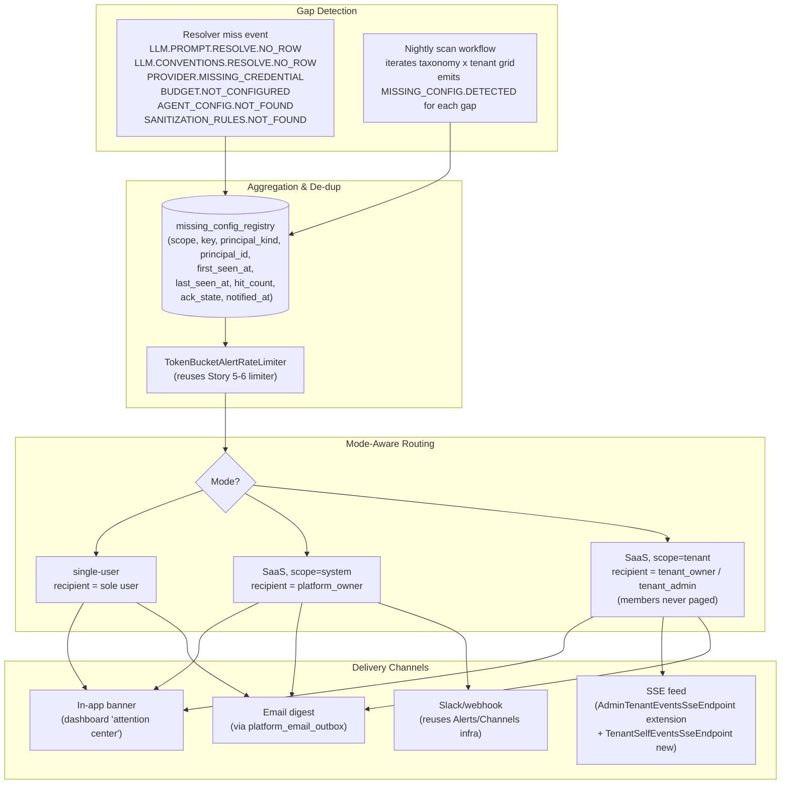
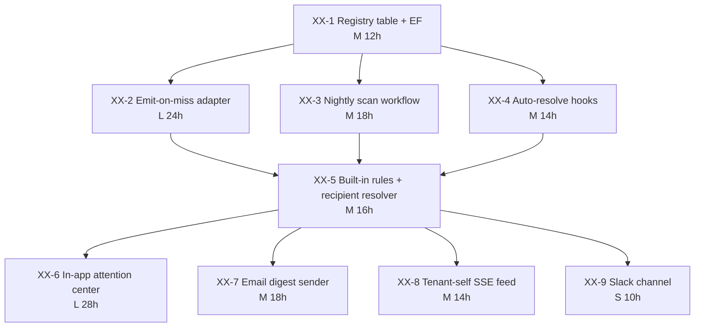

# Epic XX: Missing-Config Notifications

> **Status**: **draft — epic number not yet assigned** (the next free
> slot is **epic-32**, since 27–31 are taken and 33 is the deferred
> per-tenant IdP epic). Update the directory and references when the
> owner picks a number.
>
> **Layer**: Operations / Self-service onboarding polish.
> **Depends on**: Epic 27 (Prompt Store + Convention Store), Story 5-6
> built-in alert rules (already in main), Epic 28 (tenant lifecycle)
> for the per-tenant routing surface.
> **Related**: [`epic-27/README.md`](../epic-27/README.md) — sets the
> tenant→system→error precedent that motivates this epic; the
> [no-empty-fallback rule](#why-this-epic-exists) is the load-bearing
> constraint.

## Why this epic exists

Tamma's configuration stores resolve in exactly **one** order:
**tenant override → system default → `TammaError`**. There is no
fallback to an empty string, a "plain" prompt, or any silent degrade
— a missing config row is a loud, terminal error. This is a locked
project rule (see `feedback_resolution_no_empty_fallback.md`) and the
prompt + convention activities already enforce it
(`LLM.PROMPT.RESOLVE.NO_ROW`, `LLM.CONVENTIONS.RESOLVE.NO_ROW`,
`CONVENTION_NOT_FOUND` thrown at `ConventionStore.cs:297` and
`ResolveConventionsActivity.cs:214/234/255`).

The good news is that fail-loud catches misconfiguration the instant
it's hit. The bad news is that **the only person who finds out is the
end-user watching a workflow throw**, and they typically can't fix it
(member-role users can't edit prompts/conventions/providers in SaaS
mode). Today's pain shapes:

- Platform-admin pain: a new taxonomy cell from Story 27-15 lands with
  no system-default body → every tenant in the cluster fails to resolve
  → ops finds out from Sentry an hour later.
- Tenant-admin pain: a tenant signs up, hasn't configured a provider
  API key yet, opens a workflow → `PROVIDER.MISSING_CREDENTIAL` fires
  → no one tells the admin "you need to go to Settings → Providers and
  paste a key."
- Member-user pain: a member's run hits any of the above → cryptic
  `TammaError` page → support ticket.

This epic builds the **gap-detection + notification surface** that
turns "loud error in a workflow run" into "actionable to-do in front
of the right principal **before** the run ever happens." Resolution
behaviour does not change — the notifier surfaces the gap; the
resolver still throws.

## Topology



## How this overlaps with what we already have

We do **not** start from zero. Story 5-6 (in main) shipped a working
event-driven alert pipeline that already covers the "loud notification
to operators on a critical platform event" job. It includes:

| Component (in main) | What it gives us | What we still need |
|---|---|---|
| `BuiltInAlertRules.cs` (5 seeded rules) | Predicate DSL, throttling, event→rule matching | New built-in rules for `*.NO_ROW` / missing-credential events; rule predicate that groups by `(scope, key)` not just `tenantId` |
| `AlertEventEmitter.cs` | Routes events to tenant `domain_events` vs `platform_events` | Emit-on-miss adapter inside resolution paths (PromptStore, ConventionStore, ProviderChainResolver, BudgetConfigProvider) |
| `Alerts/Channels/` (Email, Slack, PagerDuty, Webhook) | Channel abstraction with rate-limit-aware delivery | A 5th in-app banner channel + tenant-scoped recipient resolution |
| `PostgresAlertSink` + `Alert` entity | Persisted alert history, severity enum, dashboard surface | A `missing_config_registry` table whose semantics are "open work item" not "historical incident" (alerts are append-only; gaps need ack/resolve) |
| `AdminTenantEventsSseEndpoint` | Live admin feed of `platform_events` per tenant | Mirror endpoint for tenant-self consumption (a tenant admin shouldn't need platform-owner access to see their own missing-config items) |
| `TokenBucketAlertRateLimiter` | Per-rule throttling | Per-`(scope, key, principal)` de-dup key, not per-rule throttling |
| `OutboxSmtpSender` + `platform_email_outbox` | Transactional email out | Digest builder + opt-in/opt-out preferences per principal |

**Bottom line**: Alerts is the wrong frame ("an incident happened,
page someone") and the right plumbing ("event → predicate → channel
fanout with throttling"). This epic adds a **gap registry** with
explicit lifecycle (open / acknowledged / resolved-by-config-change)
on top of the existing channel infrastructure, plus a small number of
new rules and a nightly scan.

## Detection model — emit-on-miss + scheduled-scan, both

Two complementary detectors. They are **both** required; neither alone
is sufficient.

### Emit-on-miss (reactive)

Every `tenant → system → error` resolver wraps its throw in an
event-emit:

```
PromptStoreService.ResolveAsync     → MISSING_CONFIG.PROMPT
ConventionStore.ResolveAsync        → MISSING_CONFIG.CONVENTION
ProviderChainResolver.ResolveAsync  → MISSING_CONFIG.PROVIDER
PostgresBudgetConfigProvider        → MISSING_CONFIG.BUDGET
AgentResolverService                → MISSING_CONFIG.AGENT
SanitizationService                 → MISSING_CONFIG.SANITIZATION
```

The throw still happens. The emit is best-effort + non-blocking
(swallow on emit failure — never let the audit-trail fail the user's
request). The event carries:

- `scope`: `system` | `tenant`
- `key`: the resolution key, e.g. `prompt:planner/decompose` or
  `provider:anthropic-claude:api_key`
- `principal_kind` + `principal_id`: who needs to fix it (derived
  from scope + mode — see [RBAC](#rbac))
- `correlation_id`, `workflow_instance_id`, `user_id`: forensic trail

**Trade-off**: catches real, in-the-wild misses with zero latency. Misses
nothing the user has actually hit. Does **not** tell you about config
gaps no one has stumbled into yet (e.g. a tenant created yesterday
that hasn't tried to use action `code-review` and so doesn't know yet
that their provider has no `code-review` budget).

### Scheduled-scan (proactive)

A nightly workflow walks the (role × action) taxonomy from
`RolePhaseMap` and asks the resolver: "for tenant T and this cell,
would resolution succeed?" Any cell that would throw becomes a
`MISSING_CONFIG.SCAN_HIT` event with the same shape as the reactive
event but `source: scan` so dedupe can prefer the live miss when
both exist.

**Trade-off**: surfaces gaps before users hit them, including for
newly-added taxonomy cells (Story 27-15 codegen) and brand-new
tenants. Costs O(tenants × taxonomy_cells) DB lookups nightly — cheap
at 100 tenants (~8000 cells), revisit at 10k tenants.

The two streams converge on the same `missing_config_registry` table.
`hit_count` increments on every emit; `first_seen_at` and
`last_seen_at` track the window.

## Delivery channels — cost/benefit

| Channel | When to use | Why | Why not |
|---|---|---|---|
| **In-app banner / "attention center"** (default for all) | Every gap; persistent until ack | Zero infra cost; the right surface for actionable work items; visible exactly when the principal lands in the dashboard | Useless if the principal never logs in (silent for ops-only tenants) |
| **SSE push** to the live dashboard | Backfills the banner in real time | Reuses `AdminTenantEventsSseEndpoint` pattern; cost is the existing 2s polling tick | Doesn't reach users outside the open session |
| **Email digest** (daily/weekly opt-in per principal) | Important enough to chase out-of-band | Reuses `platform_email_outbox` + `OutboxSmtpSender` → no new infra; digests are de-dup-friendly so they don't spam | Per-event email would spam; **must be digested** with a configurable cadence |
| **Slack / webhook** (opt-in per tenant) | Tenants who run support rotation in Slack | Reuses `Alerts/Channels/SlackAlertChannel`; one webhook URL per tenant | Per-tenant secret to manage; ops burden if it breaks |
| **PagerDuty** (intentionally NOT in scope) | Never for missing config | A missing config is a work item, not a 3am page. Workflows already alert on `WORKFLOW.RETRY_EXCEEDED` for the page-worthy downstream failure | Would train responders to ignore PagerDuty |

In-app + email-digest are the MVP. SSE backfill is a polish story.
Slack/webhook is opt-in tier-2. PagerDuty is explicitly out.

## De-duplication

The dominant failure mode for any notifier on a hot-path resolver is
**spam**. A single missing `prompt:planner/decompose` row in a busy
tenant emits one event per workflow run, which at 100 runs/hour is
~2,400/day per cell. The registry collapses this:

- **Primary key**: `(scope, key, principal_kind, principal_id)` —
  exactly one open row per "thing that needs fixing for someone."
- **Reactive emit**: `INSERT … ON CONFLICT (scope,key,principal_kind,principal_id)
  DO UPDATE SET last_seen_at=now(), hit_count=hit_count+1`. One row,
  no spam.
- **Notification cadence**: the **first emit** triggers a notification
  immediately (so a brand-new gap surfaces fast). Subsequent hits update
  `last_seen_at` + bump `hit_count` but do **not** re-notify until
  `notified_at < now() - cooldown` (cooldown defaults to 24h, tunable
  per scope).
- **Ack flow**: principal clicks "acknowledge" → `ack_state='acked'`
  + `acked_at` + `acked_by` recorded. Re-notification suppressed until
  the gap closes and re-opens (i.e. config got added then removed
  again).
- **Auto-resolve**: when the config arrives (override write or system
  default add), the corresponding open row(s) flip to
  `ack_state='resolved'` and a `MISSING_CONFIG.RESOLVED` event fires.
  This is detected by hooking the existing prompt/convention/provider
  `*.UPSERTED` event types — no new DB triggers needed.

`TokenBucketAlertRateLimiter` is reused for the notification step
(not the registry write — that's idempotent).

## RBAC — who gets notified

The principal routing differs sharply between modes. **A member user
should never be notified about config they cannot fix.**

| Scope of missing config | single-user mode | SaaS mode |
|---|---|---|
| **System default missing** (no `tenant_id IS NULL` row) | sole user (they're the platform owner here) | **platform owner only** (the `OwnerAccess` policy holders) — never tenants, even though they hit it; the tenant can't fix a system default |
| **Tenant override missing** for config types that need one (provider API key, custom convention the team mandates) | not applicable in single-user mode (there's only one principal) | `tenant_owner` + `tenant_admin` of the affected tenant; **never members** |
| **Tenant-required override missing** that's blocking a member's run right now | not applicable | banner says "ask your admin to configure X" to the member; the admin gets the actionable notification |

The platform-owner-only routing for missing **system** defaults
matters: a SaaS deployment with 500 tenants and a missing system row
would otherwise email 500 × `tenant_admin` count. The tenant doesn't
own the fix — ops does.

## Stories

| # | Title | Effort | Category |
|---|---|---|---|
| XX-1 | `missing_config_registry` table + EF entity + migration | M (12h) | Foundation |
| XX-2 | `IMissingConfigSink` abstraction + emit-on-miss adapter wired into PromptStore, ConventionStore, ProviderChainResolver, Budget, Agent, Sanitization resolvers | L (24h) | Detection |
| XX-3 | Nightly scan workflow (Elsa) — taxonomy × tenant grid scan, emits `MISSING_CONFIG.SCAN_HIT` | M (18h) | Detection |
| XX-4 | Auto-resolve on config-write — hook prompt / convention / provider `*.UPSERTED` events, flip matching open rows to `resolved` + emit `MISSING_CONFIG.RESOLVED` | M (14h) | Detection |
| XX-5 | New built-in alert rules + recipient resolver — `missing-config-system` (platform owner), `missing-config-tenant` (tenant owner/admin), per-scope cooldown | M (16h) | Routing |
| XX-6 | In-app "attention center" — dashboard widget for tenant admins, parallel widget for platform admins; ack/dismiss actions | L (28h) | UI |
| XX-7 | Email digest sender — daily/weekly cadence, per-principal opt-in/opt-out, builds Markdown digest from open registry rows, dispatches via `platform_email_outbox` | M (18h) | Delivery |
| XX-8 | Tenant-self SSE feed (`/api/me/missing-config/stream`) — mirrors `AdminTenantEventsSseEndpoint` but scoped to caller's tenant + role-filtered | M (14h) | Delivery |
| XX-9 | (optional / tier 2) Slack-webhook channel for missing-config events; reuses `Alerts/Channels/SlackAlertChannel` with a new payload template | S (10h) | Delivery |

**Total MVP effort** (XX-1 through XX-8): ~144h.
**With XX-9 Slack channel**: ~154h.

## Sequencing



- **XX-1** is foundation. Nothing else runs without the table.
- **XX-2/3/4** are independent producers — they can land in any order
  after XX-1. XX-2 is the most user-visible (real misses, today).
- **XX-5** is the routing fan-in. After it lands, the delivery stories
  (XX-6/7/8/9) parallelise cleanly.
- **XX-6** (attention center UI) is the MVP delivery surface — ship it
  first after XX-5.
- **XX-7** (email) and **XX-8** (SSE) parallelise after XX-5.
- **XX-9** (Slack) is tier-2 — defer until at least one tenant asks.

## Open questions

The user should resolve these before story drafting starts:

1. **Should missing-system-default ever auto-page the on-call?** The
   answer locks whether we add PagerDuty as a sixth channel (or just
   trust the existing Story 5-6 critical-rules pipeline). The current
   draft says **no** — missing config is a work item, the downstream
   workflow failure is what pages. Confirm.
2. **Email digest cadence default — daily or weekly?** This
   massively affects perceived spaminess. Daily is more responsive but
   noisier for low-traffic tenants. Weekly is calmer but lets a
   blocker simmer for up to 7 days. Current draft says **daily,
   opt-out to weekly, opt-out to off entirely**. Confirm or flip the
   default.
3. **What's the cooldown after acknowledgement?** Today's draft says
   "suppress re-notification until the gap closes and re-opens" —
   never re-notify on an open ack'd item. Alternative: re-notify after
   30 days to chase stale acks. Pick one.
4. **Should the nightly scan run against the per-tenant DB
   (Epic 28) or the central control plane?** Implementation diverges
   based on whether Epic 28 lands first. The current draft assumes
   per-tenant scope is iterated by the central scan via the
   `TenantConnectionResolver` (existing seam). Confirm.
5. **Naming: "missing config" vs "attention center" vs "config
   gaps"?** UI copy decision — affects route names, dashboard labels,
   email subject lines. Trivial but locks early.

## Out of scope

This epic does **not**:

- **Validate config correctness** beyond "does the row exist." A
  syntactically-valid-but-semantically-wrong template (e.g. an
  override that references an undefined `{{variable}}`) is *not* a
  missing-config event — that's a separate validation epic.
- **Suggest fixes** ("did you mean `code-review` instead of
  `code_review`?"). Pure detection + notification.
- **Drift detection** ("your tenant override is now 6 months
  behind the system-default body"). System defaults are admin-owned
  at runtime per `project_convention_system_defaults_ownership.md` —
  drift is intentional and not a fault.
- **Change resolution behaviour.** The locked rule stands:
  `tenant → system → TammaError` with no empty / plain fallback. The
  notifier surfaces the gap; resolution still throws. This epic
  contains no code path that silences `TammaError`.
- **Per-user notification preferences for members.** Members are
  never notified about config they can't fix; that's a feature, not a
  gap. Per-admin preferences (cadence / channel) are in scope; per-
  member preferences aren't.
- **Replace Story 5-6's existing alert pipeline.** This epic adds
  *on top of* the alert plumbing; built-in alert rules for genuinely
  page-worthy events (`BUDGET.EXHAUSTED`, `WORKFLOW.RETRY_EXCEEDED`,
  `SECRET.ROTATION.FAILED`) stay where they are.

## Change log

| Date | Version | Changes | Author |
|---|---|---|---|
| 2026-05-29 | 0.1.0 | Initial epic draft — stories, sequencing, RBAC, open questions | Planning sweep |
