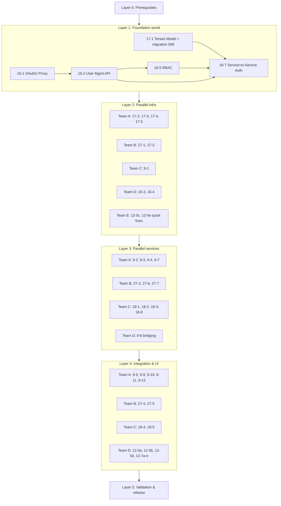

# Tamma Layered Implementation Plan

**Status**: Active
**Last Updated**: 2026-04-09
**Scope**: Epics 9, 12, 16, 17, 18, 27 (40+ stories, ~610 hours)

## Purpose

This document set describes how to execute the remaining work across Epics 9, 12, 16, 17, 18, and 27 using a **layered execution model** with **git worktrees** and **parallel agent teams**. Each layer has its own detailed plan file describing which stories run in that layer, in what order, under which worktree, with which dependencies.

Agents picking up work should:
1. Read this README.
2. Open the layer file they are assigned to.
3. Create the worktree and branch.
4. Follow the story implementation plans linked from each story row.

## Layered Approach

Rather than treating all 40+ stories as a single queue, work is organized into five layers plus a prerequisite layer:

| Layer | Purpose | Parallelism | Depends On |
|-------|---------|-------------|------------|
| **Layer 0** | Prerequisites — worktree tooling, shared test DB, CI conventions, branch naming | N/A | None |
| **Layer 1** | Foundation — auth, tenants, RBAC, service-to-service | Serial (1 team) | Layer 0 |
| **Layer 2** | Parallel infrastructure — tenant scoping, prompt store foundation, agent API foundation, admin UI | 5 teams | Layer 1 |
| **Layer 3** | Parallel services — Epic 9 services, prompt store API/Elsa wiring, Epic 18 backend | 4 teams | Layer 2 |
| **Layer 4** | Integration & UI — dashboards, Elsa integration, context tools, 12-5 sub-stories | 4 teams | Layer 3 |
| **Layer 5** | Validation — cross-epic testing, security audit, staging deploy, release prep | 1 team | Layer 4 |
| **Secret Management Track** | LLM-safe secret management — 30 stories (1.5-16 through 1.5-45): vault, broker, activities, workflows, mirrors, probes, leak detection, rotation cascade, auto-rotate, KMS, notifications, UI | 4 teams peak | Layer 1 complete |

**Key principle**: A story never starts until *all* of its dependencies are merged to `main`. Teams within a layer work in parallel when their worktrees do not conflict on shared files.

## Layer Files

| File | Purpose |
|------|---------|
| [`layer-0-prerequisites.md`](./layer-0-prerequisites.md) | Worktree setup, shared database, CI coordinator, branch naming, local test workflow |
| [`layer-1-foundation.md`](./layer-1-foundation.md) | Serial: 16-1, 17-1, 16-2, 16-5, 16-7 |
| [`layer-2-parallel-infra.md`](./layer-2-parallel-infra.md) | 5 teams: Tenant scoping, prompt store, agent API, admin UI, quick wins |
| [`layer-3-parallel-services.md`](./layer-3-parallel-services.md) | 4 teams: Epic 9 services, prompt store API/Elsa, Epic 18 backend, Epic 12 foundation |
| [`layer-2-3-status-post-epic-19.md`](./layer-2-3-status-post-epic-19.md) | **Post–Epic 19 status of Layers 2 and 3** + 60h hardening punch list. Read this before starting Layer 4. |
| [`layer-4-integration-ui.md`](./layer-4-integration-ui.md) | 4 teams: Epic 9 completion, prompt store UIs, Epic 18 dashboard, Epic 12-5/12-7 — revised 2026-04-16 to target the C# API |
| [`layer-5-validation.md`](./layer-5-validation.md) | Cross-epic tests, perf, security audit, staging, docs |
| [`secret-management-track.md`](./secret-management-track.md) | Parallel track: 30 stories (1.5-16 through 1.5-45) covering vault, broker, workflows, mirrors, probes, leak detection, rotation, UI — gates behind Layer 1, otherwise independent |

## Cross-Epic Dependency Graph



## All Stories by Layer

### Layer 1: Foundation (Serial)

| Story | Title | Hours | Migration | Blocks |
|-------|-------|-------|-----------|--------|
| 16-1 | OAuth2 Proxy Unified Auth | 16 | — | 16-2, 16-4, 16-5, 16-7 |
| 17-1 | Tenant Model + DB Schema | 16 | 008 | 17-2..17-5, 27-1, 9-1, 9-2, 9-3, 9-7, 18-3, 16-7 |
| 16-2 | User Management REST API | 20 | — | 16-3, 16-5, 16-7 |
| 16-5 | RBAC Enforcement | 16 | — | 16-7 |
| 16-7 | Service-to-Service Auth | 20 | — | Layer 3+ API stories |
| **Total** | | **88** | | |

### Layer 2: Parallel Infrastructure

| Team | Story | Title | Hours | Migration |
|------|-------|-------|-------|-----------|
| A | 17-2 | Row-Level Security | 12 | 009 |
| A | 17-3 | Tenant-Scoped Event Store | 10 | 010 |
| A | 17-4 | Tenant-Scoped Workflow Instances | 10 | 010 (shared) |
| A | 17-5 | API Tenant Context Middleware | 14 | — |
| B | 27-1 | Prompt Store Schema + Migration | 10 | 011 |
| B | 27-2 | Prompt Store Service (TS) | 14 | — |
| C | 9-1 | Agent Config Schema + API | 16 | 012 |
| D | 16-3 | Admin Dashboard | 24 | — |
| D | 16-4 | Unified Navigation Header | 12 | — |
| E | 12-5c | Skill-Level Fix (bug) | 4 | — |
| E | 12-5e | CI Retry Counter Fix (bug) | 2 | — |
| **Total** | | | **128** | |

### Layer 3: Parallel Services

| Team | Story | Title | Hours | Migration |
|------|-------|-------|-------|-----------|
| A | 9-2 | Diagnostics Service + API | 20 | 013 |
| A | 9-3 | Health Tracker Service + API | 16 | 014 |
| A | 9-4 | Provider Factory API | 12 | — |
| A | 9-7 | Sanitization Service + API | 14 | 015 |
| B | 27-3 | Prompt Store API Endpoints | 12 | — |
| B | 27-6 | Elsa Workflow Integration | 10 | — |
| B | 27-7 | Prompt Store Event Sourcing | 8 | — |
| C | 18-1 | User Registration + Email | L (40) | 017 |
| C | 18-2 | Login + Session Management | L (40) | — |
| C | 18-3 | Organization/Tenant Creation | XL (64) | 016 |
| C | 18-6 | Password Reset | M (24) | — |
| **Total** | | | **260** | |

### Layer 4: Integration & UI

| Team | Story | Title | Hours |
|------|-------|-------|-------|
| A | 9-5 | Provider Chain API | 14 |
| A | 9-8 | Unified Agent Resolver API | 18 |
| A | 9-9 | Engine Integration | 14 |
| A | 9-10 | CLI Wiring | 12 |
| A | 9-11 | Diagnostics Queue + Elsa | 32 |
| A | 9-12 | Cross-Epic Integration Test | 17 |
| B | 27-4 | Prompt Store Admin UI | 16 |
| B | 27-5 | Prompt Store Tenant UI | 16 |
| C | 18-4 | GitHub App Installation | M (24) |
| C | 18-5 | User-Facing Dashboard Shell | L (40) |
| D | 12-5a | Context Priority Truncation | 16 |
| D | 12-5b | Few-Shot Example Injection | 20 |
| D | 12-5d | A/B Testing Hooks | 12 |
| D | 12-7a | Vector DB Search Tools | 24 |
| D | 12-7b | Convention & History Tools | 16 |
| D | 12-7c | Context Budget Manager | 20 |
| D | 12-7d | Tool Access Config Per Role | 12 |
| D | 12-7e | Elsa Tool Loop Integration | 20 |
| **Total** | | | **343** |

### Layer 5: Validation

| Activity | Hours |
|----------|-------|
| Cross-epic integration test harness | 16 |
| Performance benchmarks (rate-limit, p95) | 12 |
| Security audit (auth flows, RLS, sanitization) | 16 |
| Staging deploy rehearsal | 8 |
| Wiki/docs refresh | 12 |
| PR orchestration & release notes | 8 |
| **Total** | **72** |

## Grand Total

| Layer | Hours |
|-------|-------|
| Layer 0 | 8 (one-time setup) |
| Layer 1 | 88 |
| Layer 2 | 128 |
| Layer 3 | 260 |
| Layer 4 | 343 |
| Layer 5 | 72 |
| **Total** | **~899 hours** |

Parallelism shortens wall-clock time significantly:

- **Layer 2 wall-clock** ≈ max(Team A 46h, Team B 24h, Team C 16h, Team D 36h, Team E 6h) ≈ **46h**
- **Layer 3 wall-clock** ≈ max(Team A 62h, Team B 30h, Team C 168h) ≈ **168h** (Epic 18 is the critical path)
- **Layer 4 wall-clock** ≈ max(Team A 107h, Team B 32h, Team C 64h, Team D 140h) ≈ **140h**

Estimated wall-clock with 5 parallel agents ≈ **88 + 46 + 168 + 140 + 72 ≈ 514 hours** vs. serial **~900h** — roughly **43% reduction**.

## Recommended Starting Point

1. **Finish Layer 0** (`layer-0-prerequisites.md`). Do not skip — worktree discipline and test DB conventions matter for parallelism.
2. **Start Layer 1 with Story 16-1 and Story 17-1 simultaneously** (they have no dependency between each other). Everything else in Layer 1 is serial. Assign one agent to each.
3. **Do not start Layer 2 until all of Layer 1 is merged to `main`** and the CI is green. Layer 2 teams pull from `main` to create their worktree branches.

## Agent Orchestration Strategy

### Agent Roles

| Role | Responsibility |
|------|----------------|
| **Coordinator** | Tracks layer progress, assigns teams, runs integration checkpoints, merges into `main` |
| **Team Lead (per layer team)** | Claims worktree, runs stories in team order, opens PR, responds to review |
| **Reviewer** | Reviews PRs from other teams; enforces CLAUDE.md standards, migration ordering, test coverage |
| **Migration Steward** | Owns `docs/stories/migration-ordering.md`. Any new migration number must be approved by this role. |

### Checkpoints

Teams check in at **layer boundaries**. Intra-layer checkpoints:

- **Layer 2 mid-point**: Team A 17-2 merged (RLS live). Teams B/C/D/E continue; Team A proceeds to 17-3.
- **Layer 3 mid-point**: Team B 27-3 merged (API live). Team A 9-8 can proceed since it needs 27-x.
- **Layer 4 mid-point**: Team D 12-7a/b merged. 12-7c can proceed.

## Git Worktree Setup

Shared conventions live in Layer 0. Quick reference:

```bash
# One-time (done in Layer 0)
cd /home/meywd/tamma
git fetch origin
mkdir -p ../tamma-worktrees

# Each team creates a worktree from main at the start of their layer
git worktree add ../tamma-worktrees/layer-1-16-1 -b feat/story-16-1-oauth-proxy origin/main
cd ../tamma-worktrees/layer-1-16-1
pnpm install

# When the layer is done
cd /home/meywd/tamma
git worktree remove ../tamma-worktrees/layer-1-16-1
```

## Integration & Merge Strategy

1. **One PR per story** — small PRs merge faster and isolate review.
2. **Squash-merge into `main`** — keep `main` history linear.
3. **Rebase worktree on `main` before opening PR** — avoid stale diffs.
4. **Do not merge a PR that breaks the shared test database** — migrations must be additive.
5. **Two reviewers** — one from the author's team, one from a different team (cross-check).
6. **Migration PRs reviewed by Migration Steward** — verify number assignment.
7. **Layer completion gate** — before declaring a layer done, run the full test suite on `main` (unit + integration + migration replay).

## Branch Naming Convention

`feat/story-{epic}-{story}-{slug}`

Examples:
- `feat/story-16-1-oauth-proxy`
- `feat/story-17-1-tenant-model`
- `feat/story-27-2-prompt-store-service`
- `feat/story-12-5c-skill-level-fix`
- `fix/story-12-5e-ci-retry-counter`

For bug-fix sub-stories, use `fix/` prefix. Sub-story suffix letter is lowercase.

## References

- `docs/stories/migration-ordering.md` — canonical migration sequence
- `docs/stories/rbac-unified-model.md` — unified platform/tenant role model
- `docs/stories/cli-fallback-behavior.md` — CLI mode fallback rules
- `CLAUDE.md` — global project conventions
- `.dev/README.md` — dev knowledge base guide

---

**Questions or blockers?** Add them to the coordinator's daily log in `.dev/findings/` before opening a Slack thread.
