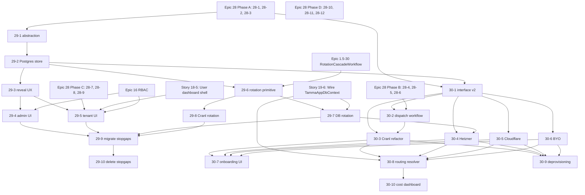

# Epic 29 + Epic 30 — Placement + Dependency Graph

**Status**: active, written 2026-04-20
**Scope**: where Epic 29 (Platform Secret Management) and Epic 30
(Pluggable Tenant Infrastructure Provisioning) slot into the layered
execution plan, what they block, and what they close from the
2026-04-20 code review.

## Layer placement

### Epic 29 → Layer 4

Epic 29 lands in **Layer 4** alongside the existing Cranl-era admin
UIs (Team B prompt store UIs; Team C dashboard shells). Rationale:

- It requires Epic 28 Phase A (DbContext factory, Story 28-3) so
  tenant-scoped `tenant_secrets` rows route correctly — Phase A is a
  Layer 4 prerequisite already.
- It requires Story 19-6 (real per-tenant `TammaAppDbContext` wiring)
  for the RLS defense-in-depth on `tenant_secrets` — 19-6 is a Layer 4
  follow-up.
- The UIs (29-4, 29-5) are admin and tenant dashboard work — same
  surface as Team B's prompt store UIs. Same worktree conventions.
- Rotation workflows (29-6..29-8) run in the same Elsa engine that
  Layer 4 Team A hooks up to the C# API.

Suggested Layer 4 team assignment:

| Story | Team | Notes |
|---|---|---|
| 29-1 secret store abstraction | Team A or shared | Foundation for the rest; land first |
| 29-2 Postgres-backed store | Team A | Co-requires 28-3 merged |
| 29-3 reveal-once UX | Team A | API-side |
| 29-4 admin UI | Team B | Matches prompt-store UI pattern |
| 29-5 tenant UI | Team B | Depends on 18-5 shell (Team C) |
| 29-6 rotation primitive | Team A | Elsa activity set |
| 29-7 DB rotation | Team A | Depends on 19-6 for pool drain |
| 29-8 Cranl env rotation | Team A | Depends on 29-6 |
| 29-9 migrate stopgap secrets | Coordinator | Cross-team coordination |
| 29-10 delete stopgaps | Coordinator | One release cycle after 29-9 |

### Epic 30 → Layer 5

Epic 30 lands in **Layer 5** — treated as a post-Epic-29 capability
extension that validates Tamma on multiple backends before wider
release. Rationale:

- Hetzner / Cloudflare / BYO backends are *scale-out* work; they do
  not block existing Cranl tenants.
- The interface refactor (30-1, 30-2, 30-3) is safe to ship *after*
  Epic 28 + 29 have stabilised the Cranl path.
- The multi-backend matrix adds integration-test complexity that
  Layer 5's cross-epic harness is already structured to absorb.
- Cost / quota dashboard (30-10) dovetails with Layer 5's performance
  benchmarks and validation tasks.

Suggested Layer 5 sequencing (wall-clock ~6 weeks at 1 team):

| Week | Stories |
|---|---|
| 1 | 30-1 (interface) + 30-2 (workflow) |
| 2 | 30-3 (Cranl refactor, feature-flag rollout) |
| 3-4 | 30-4 (Hetzner) || 30-5 (Cloudflare) in parallel |
| 4 | 30-6 (BYO) |
| 5 | 30-7 (onboarding UI) + 30-8 (routing resolver) |
| 6 | 30-9 (deprovisioning) + 30-10 (cost dashboard) |

### Why not bundle Epic 30 into Layer 4

Layer 4 is already 411h across four teams on a ~156h critical path.
Adding 216h of Epic 30 would double the critical path without adding
customer-facing wins (the current Cranl pipeline already works). Layer
5 is the right home.

## Dependency graph

## Epic 29 blocks Epic 30's rotation work

Epic 30 backends (Hetzner, Cloudflare, BYO) each ship their own
rotation handler (Story 29-6's handler contract). Those handlers
assume the Epic 29 cabinet exists and the workflow primitive is
merged. Ordering:

1. Epic 29 Layer 4.
2. Epic 30 Layer 5 (each backend story adds its rotation handler at
   time of implementation).

Both block **the "real RLS wiring" follow-up Story 19-6** in the sense
that 19-6's rotation-aware password pipeline relies on Story 29-7.
But 19-6 can ship *before* Epic 29 lands if the rotation is manual
(ops runs `ALTER ROLE` by hand); the pipeline becomes automated once
29-7 merges. Suggested ordering:

- Land 19-6 first (manual rotation runbook).
- Land 29-1..29-7.
- Auto-rotation goes live on next scheduled window.

## Review findings closed

Cross-reference of 2026-04-20 review findings to closing stories:

| Finding | Severity | Closes via |
|---|---|---|
| **1. Per-tenant wiring — scaffold-only** | P0 | 19-6 (app-role wiring) + 30-8 (per-tenant endpoint routing). Full close requires both. |
| **4. `Cranl:EncryptionKey` HKDF fallback bypasses `ISecretsService`** | P1 | 29-2 (all KEK material flows through `ISecretsService`) + 29-10 (delete the fallback). |
| **15. `tamma_app` password `changeme` literal** | P0 | 29-9 (migrate + auto-rotate on import) + 29-10 (safety-net migration asserts rotation). |
| **16. `TAMMA_SHARED_SECRET` plaintext env var** | P1 | 29-9 (import into cabinet + set 30-day rotation) + 29-6 (rotation primitive) + 29-8 (Cranl env-var rotation handler applies the new value to the consumer). |
| **Cranl-only coupling (not a finding — captured from user design intent)** | — | 30-1 (interface) + 30-3 (refactor) + 30-4..30-6 (additional backends). |

## Cross-reference: story → review finding

| Story | Closes |
|---|---|
| 29-2 | 4 (partial — cabinet path) |
| 29-9 | 4 (env-var fallback removed after migration), 15, 16 |
| 29-10 | 4 (code deletion), 15 (safety-net migration) |
| 19-6 | 1 (app-role wiring half) |
| 30-8 | 1 (per-tenant routing half) |
| 30-1, 30-3..30-6 | Generalisation-over-Cranl (not a numbered review finding) |

## Risks to the layered plan

| Risk | Mitigation |
|---|---|
| Epic 29 adds weight to an already-heavy Layer 4 | 166h across 10 stories; two teams can parallelise (Team A on 29-1..29-3, 29-6..29-9; Team B on 29-4..29-5). Critical path ~60h. |
| Epic 30 delay blocks "BYO enterprise tier" sales | Epic 30 is scoped after Epic 29 stabilises. If sales priority shifts, Stories 30-1 + 30-6 can be front-loaded into Layer 4 — adds ~36h. |
| Epic 1.5 secret-management track overlaps with Epic 29 | Researched and documented in research notes §5. Epic 29 reuses 1.5-16 crypto + 1.5-17 vault row format; handlers share the `IRotationHandler` contract; a future consolidation pass merges the two tracks. Near-term duplication is ~zero code, ~some docs. |
| OpenBao LF graduation before we adopt | Per `project_epic28_kek_decision.md`, adoption is gated on trigger conditions (first paying tenant, compliance finding, 10+ tenants). LF graduation alone is not a trigger — we stay on Postgres + env KEK. |

## Deliverables summary

- Epic 29: 10 story briefs + README + this placement doc
- Epic 30: 10 story briefs + README
- Research notes: 1 doc (`research/secret-management-and-multi-backend-provisioning-2026.md`)
- Next step: when a team is ready, convert each brief into a full
  implementation plan (same shape as `docs/stories/epic-19/19-1-phase-1-impl-plan.md`).

## See also

- [`epic-31-33-placement.md`](./epic-31-33-placement.md) — layer
  placement + dependency graph for Epic 31 (Multi Git Platform
  Support), Epic 33 (Per-Tenant IdP — deferred), and the tenant
  user-management add-ons (Stories 18-7 + 18-8). Cross-reference
  table there extends the one above with multi-platform review
  findings.
- [`tenant-user-mgmt-audit.md`](./tenant-user-mgmt-audit.md) — gap
  audit behind Stories 18-7 + 18-8.
