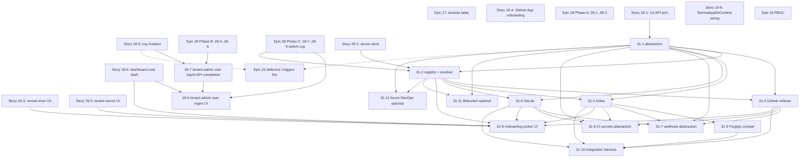

# Epic 31 + Epic 33 + Tenant User-Mgmt — Placement + Dependency Graph

**Status**: active, written 2026-04-21
**Scope**: where Epic 31 (Multi Git Platform Support), Epic 33 (Per-
Tenant Identity Providers — deferred), and the tenant user-
management add-ons (Stories 18-7 + 18-8) slot into the layered
execution plan; what they block; what they close from the 2026-04-20
code review; how they relate to Epics 29 / 30.
**Companion**: [`epic-29-30-placement.md`](./epic-29-30-placement.md)
— read first for Epic 29 / 30 context.

## Layer placement

### Tenant user management (Stories 18-7 + 18-8) → Layer 4

These land **inside Epic 18**, not as a standalone new epic (decision
in [`tenant-user-mgmt-audit.md`](./tenant-user-mgmt-audit.md) — option
(a)):

- **Story 18-7** (API completion, 14h) — slots in with Layer 4
  Team A. Closes 3 thin backend gaps (resend-invite endpoint, tenant-
  scoped audit endpoint, role-change event emission).
- **Story 18-8** (UI, 32h) — slots in with Layer 4 Team C
  (dashboard-user shell owner). Consumes 18-7 + the existing
  `OrgEndpoints.cs` surface.

Rationale:

- Backend is already 90% done — no new epic-level ceremony needed.
- The work is a direct continuation of Epic 18's theme (end-user-
  facing auth + tenant lifecycle).
- The UI lives in the 18-5 dashboard shell that Layer 4 Team C
  owns anyway.

No Layer-5 component — both stories finish in Layer 4.

### Epic 31 → split between Layer 4 and Layer 5

**Layer 4 (~192h across 8 stories)**: the foundation + Gitea/Forgejo
support + onboarding UI + test harness. Rationale:

- `IGitPlatformClient` / `IGitPlatformActionsClient` abstractions
  (31-1, 31-2) are *foundational* — every later driver depends on
  them. Ship early so they're stable.
- GitHub driver refactor (31-3) is a pure mechanical move — no
  behaviour change — can land alongside Layer 4's existing GitHub-
  centric work.
- Gitea driver (31-4) + Forgejo compat (31-5) are low-risk, low-cost
  additions and unlock self-hosted-git-preferring tenants.
- Webhook receiver abstraction (31-7) is a security-positive refactor
  (multi-platform path + per-platform verifier). Fits Layer 4's
  security-hardening theme.
- CI secrets provisioner abstraction (31-8) is needed by onboarding
  UI (31-9) — ship together.
- Onboarding platform picker (31-9) lives in the dashboard-user shell
  (Team C) — same worktree as 18-8.
- Integration test harness (31-10) can start in Layer 4 with Gitea/
  Forgejo fixtures; GitLab fixture activates in Layer 5.

**Layer 5 (~36h, one story)**: GitLab driver (31-6). Rationale:

- GitLab is the **heaviest non-optional driver** — 36h — because
  of the richer variable model and different CI dispatch shape.
- Adding it to Layer 4 overloads the critical path without customer
  benefit (Cranl + GitHub already work).
- Layer 5's cross-epic harness is already structured to absorb the
  heavy integration-test GitLab container.
- Layer 5 is also where scale-out / performance validation lives —
  the GitLab pipeline model is the scale-out test case for the
  abstraction.

**Deferred / optional (Bitbucket 31-11, Azure DevOps 31-12)**: not on
any layer. Activate post-launch when a paying customer or explicit
product priority justifies.

### Epic 33 → deferred post-launch

Epic 33 is a **forward-looking stub** — see
[`../epic-33/README.md`](../epic-33/README.md). No layer placement;
activate only when one of the trigger conditions fires:

1. First enterprise customer commits with SSO as contract term
2. Compliance audit flags lack of SSO
3. ≥5 tenants independently ask for SSO within 60 days
4. SCIM directory sync becomes a routine sales objection
5. "Tamma Enterprise" plan launch requires SSO as table stakes

Pre-scoped into three tiers (Lean ~100h / Full ~250h / Full+LDAP
~400h); tier selection happens at activation.

## Dependency graph

**Notes on the graph**:

- Tenant user-mgmt (18-7 / 18-8) and Epic 31 share Layer 4 but do
  not depend on each other.
- Epic 31 sign-in path stays untouched — Epic 33 (deferred) is where
  per-tenant IdP lives.
- Epic 33 is orthogonal to Epic 31: the sign-in plane and the API-
  access plane are independent.

## Review-finding cross-reference

Extends [`epic-29-30-placement.md`](./epic-29-30-placement.md)'s
cross-reference table with the Epic 31 + 33 + tenant-user-mgmt
additions:

| Finding | Severity | Closes via |
|---|---|---|
| **"User can't add users to their tenant"** (2026-04-20 review-sweep finding) | P1 | 18-8 (UI) — backend already exists in `OrgEndpoints.cs` |
| **`TENANT.MEMBER_ROLE_CHANGED.SUCCESS` not emitted** (self-identified in the audit sweep) | P2 | 18-7 task 1 |
| **Tenant-scoped audit view gap** | P2 | 18-7 task 2 + 18-8 task 5 |
| **Resend-invite UX parity gap** | P2 | 18-7 task 3 + 18-8 task 4 |
| **`GitHubEndpoints.Webhooks` hard-coded to GitHub HMAC shape** | P2 | 31-7 (webhook abstraction) |
| **`IGitHubAppClient` + `IGitHubActionsClient` hard-code GitHub surface on every agent-dispatch call site** | P2 | 31-3 (driver refactor) — fans out call-site refactor |
| **Self-hosted-git-platform tenants unsupported** (product roadmap) | — | 31-4 + 31-5 (Gitea + Forgejo); 31-6 (GitLab) for Layer 5 |
| **Sign-in plane and API-access plane conflated under one GitHub App** (2026-04-21 user constraint) | — | Epic 31 splits them; Epic 33 stub captures the future per-tenant IdP work |
| **Enterprise customers need SSO** (not yet fired) | — | Epic 33 activates on trigger conditions |

## Cross-reference: story → review finding

| Story | Closes |
|---|---|
| 18-7 | tenant-user-mgmt audit findings (role-change event, resend endpoint, audit view) |
| 18-8 | "user can't add users" |
| 31-3 | GitHub hard-coding on call sites |
| 31-7 | Webhook-endpoint GitHub hard-coding |
| 31-4 / 31-5 / 31-6 | Self-hosted-git-platform support |
| 31-9 | Onboarding hard-coded to GitHub flow |
| Epic 33 (when activated) | Enterprise SSO ask |

## Risks to the layered plan

| Risk | Mitigation |
|---|---|
| Epic 31 Layer 4 portion (~192h) plus Epic 29 Layer 4 (166h) plus the existing Layer 4 critical path (~156h) ≈ 514h across Teams A/B/C | Epic 31 stories 31-4/31-5/31-9 (thin Gitea work + UI) parallelise with Epic 29 (secrets). Critical paths don't overlap because 31 uses existing tables + secret store; 29 builds the secret store. Team split: Team A (31-1, 31-2, 31-3, 31-7, 31-8, 31-10) = 108h; Team C (31-4, 31-5, 31-9) = 68h. |
| 31-6 (GitLab) slips from Layer 5 into Layer 6 if GitLab container is flaky in CI | Integration test runs nightly, not per-PR; a flaky harness doesn't gate merges. Fallback: use `gitlab.com` live test project with a sandbox API token (adds ops risk but avoids container flake). |
| 31-9 (onboarding UI) blows past estimate because of per-platform credential-entry UX divergence | Brief lists a two-pass ship plan: pass 1 GitHub + Gitea (both simple); pass 2 GitLab + Forgejo (Forgejo trivially reuses Gitea UI). Cut-line is clean. |
| 18-7 + 18-8 dependency on Epic 28 Phase B RLS for tenant audit view | 18-7 is explicitly gated on 28B merge. If 28B slips, 18-7 ships without the RLS defence-in-depth — backend filter still applies; risk is lower defence-in-depth, not missing feature. |
| Epic 33 trigger fires mid-Layer-4 — forcing premature scoping | Epic 33 stub explicitly lists trigger conditions; if one fires, the activation note gets added to the roadmap but scoping happens in a dedicated sweep, not interleaved with Epic 31 / Layer 4. |

## Sequencing

Suggested merge order for Layer 4:

1. Epic 29-1 (secret store abstraction) — blocks 31-2's credential
   storage.
2. 31-1 + 31-2 (abstraction + resolver).
3. Epic 29-2 + 29-3 (Postgres store + reveal-once) — blocks 31-9.
4. 31-3 (GitHub refactor) — mechanical; lands alongside.
5. 18-7 (tenant user-mgmt API) — independent of 31; can land anytime
   after Epic 28 Phase B.
6. 31-4 (Gitea) + 31-5 (Forgejo compat) — parallel with 29-4 / 29-5.
7. 31-7 (webhook abstraction) + 31-8 (CI secrets abstraction) —
   serial after 31-3 / 31-4.
8. 18-8 (tenant user-mgmt UI) + 31-9 (onboarding UI) — parallel on
   Team C; share a shell.
9. 31-10 (test harness) — parallel throughout Layer 4.

Layer 5:

- 31-6 (GitLab driver).
- Optional: 31-11 / 31-12 if activated.

Post-launch (trigger-gated):

- Epic 33.

## Deliverables summary

- Epic 31: 12 story briefs + README (2 briefs marked optional / deferred)
- Epic 33: 1 forward-looking stub README (no stories)
- Tenant user-mgmt: 2 briefs in Epic 18 (18-7 + 18-8) + audit doc
- Research notes: 1 doc (`research/multi-git-platform-2026.md`)
- Placement + dependency graph: this doc
- Review-finding cross-reference: updated here + unchanged in
  [`epic-29-30-placement.md`](./epic-29-30-placement.md)

**Next step**: when a team is ready, convert each Epic 31 brief into
a full implementation plan (same shape as
`docs/stories/epic-19/19-1-phase-1-impl-plan.md`).

## Prioritization

Wave assignment + cross-epic ranking for Epic 31 / 33 and tenant
user-mgmt stories lives in
[`layer-4-5-prioritization-2026-04-21.md`](./layer-4-5-prioritization-2026-04-21.md).

Summary of placement decisions that doc makes for Epic 31 / 33 and
the tenant user-mgmt add-ons:

- **Tenant user-mgmt (18-7 + 18-8, 46h)**: **Wave A**. Closes the
  P1 "user can't add users to their tenant" review-sweep finding;
  18-5 dashboard shell is the shared surface, so both stories sit
  in Wave A alongside 18-4 / 18-5 / Epic 28 auth plane.
- **Epic 31 (10 active stories, 253h)**: foundation 31-1 + 31-2 +
  31-3 + 31-7 + 31-8 in **Wave C** (abstraction + GitHub refactor +
  webhook abstraction + CI-secrets abstraction); drivers 31-4
  (Gitea) + 31-5 (Forgejo) + 31-10 (test harness) in **Wave C**;
  31-9 (onboarding UI) spans late-Wave-C into **Wave D**; 31-6
  (GitLab) in **Wave D** (heaviest driver, external-API risk
  lands late). Optional 31-11 / 31-12 remain **deferred**.
- **Epic 33 (deferred)**: activation gated on the five trigger
  conditions enumerated in this doc. No scoring until triggered.

See [`layer-4-5-prioritization-2026-04-21.md`](./layer-4-5-prioritization-2026-04-21.md)
§4 for ordered per-wave lists; §5.2 for the Epic 31 ↔ Epic 29 /
Epic 28 dependency tensions; §6 for the open question "Do we ship
GitLab at launch or defer?" that would reshuffle 31-6 from Wave D
to Wave C.
