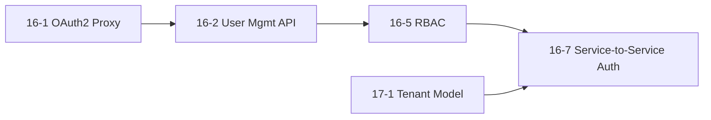

# Layer 1: Foundation

**Duration**: ~88 hours (serial), reducible to ~60h with 2 parallel agents
**Team**: 1–2 agents (see parallelism notes below)
**Goal**: Land the authentication, tenancy, and RBAC primitives that *every* other epic depends on.

**Blocking rule**: No Layer 2 team starts until every Layer 1 story is merged into `main` and CI is green.

## Execution Order

Two parallel tracks:

- **Track A (auth)**: 16-1 → 16-2 → 16-5 → 16-7
- **Track B (tenancy)**: 17-1

Track A and Track B run in parallel at the start. They converge at **16-7**, which requires both 16-5 (from Track A) and 17-1 (from Track B).



## Stories

### Story 16-1: OAuth2 Proxy Unified Auth

| Attribute | Value |
|-----------|-------|
| **Description** | Deploy `oauth2-proxy` in front of app.tamma.dev, elsa.tamma.dev, logs.tamma.dev. Unifies auth behind GitHub OAuth with a shared `.tamma.dev` cookie. |
| **Depends on** | None (Layer 0 complete) |
| **Blocks** | 16-2, 16-4, 16-5, 16-7, anything touching admin auth |
| **Estimated hours** | 16 |
| **Team assignment** | Track A (agent 1) |
| **Git worktree** | `/home/meywd/tamma-worktrees/layer-1-16-1-oauth-proxy` |
| **Branch** | `feat/story-16-1-oauth-proxy` |
| **Deploy requirement** | **YES** — Docker redeploy required (new oauth2-proxy container, nginx config changes). Notify Deploy Coordinator early. |
| **Story file** | `docs/stories/epic-16/16-1-oauth2-proxy-unified-auth.md` |

**Key files to modify**:
- `docker-compose.yml` — add `oauth2-proxy` services (one per subdomain or a single multi-upstream)
- `nginx-proxy/conf.d/*.conf` — insert `auth_request` directives
- `packages/api/src/auth/` — switch to reading user identity from oauth2-proxy headers (`X-Auth-Request-Email`, `X-Auth-Request-User`)
- `.env.example` — add `OAUTH2_PROXY_CLIENT_ID`, `OAUTH2_PROXY_CLIENT_SECRET`, `OAUTH2_PROXY_COOKIE_SECRET`, `OAUTH2_PROXY_REDIS_URL`
- `packages/api/src/routes/auth/github-oauth.ts` — deprecate direct OAuth handling; flow now ends at oauth2-proxy

**Test strategy**:
- Docker compose up on dev VM; verify login flow on `app.tamma.dev` redirects through oauth2-proxy → GitHub → back to app
- Integration test: GET `/api/v1/me` with a valid oauth2-proxy header, expect user identity populated
- Manual test: access `elsa.tamma.dev` without login → redirected to GitHub
- Rollback plan: `docker compose down oauth2-proxy && nginx-proxy reload` with old config

**Success criteria**:
- Logging into `app.tamma.dev` works end-to-end via oauth2-proxy
- `elsa.tamma.dev` and `logs.tamma.dev` gated behind oauth2-proxy
- `_oauth2_proxy` cookie set on `.tamma.dev` domain (shared across subdomains)
- `packages/api` can read the authenticated user from oauth2-proxy headers
- Unit tests for header parsing: 100% branch coverage

### Story 17-1: Tenant Model + Database Schema

| Attribute | Value |
|-----------|-------|
| **Description** | Create `tenants` table (migration 008), add nullable `tenant_id` FK to `github_installations`, `users`, `user_api_keys`, `user_invites`. Insert default tenant. Define `DEFAULT_TENANT_ID` sentinel. |
| **Depends on** | None (runs in parallel with 16-1) |
| **Blocks** | 17-2, 17-3, 17-4, 17-5, 27-1, 9-1, 9-2, 9-3, 9-7, 16-7, 18-3, any tenant-scoped store |
| **Estimated hours** | 16 |
| **Team assignment** | Track B (agent 2) |
| **Git worktree** | `/home/meywd/tamma-worktrees/layer-1-17-1-tenant-model` |
| **Branch** | `feat/story-17-1-tenant-model` |
| **Deploy requirement** | **NO** (migration only — run on next deploy) |
| **Migration number** | **008** (`008_tenants.sql`) |
| **Story file** | `docs/stories/epic-17/17-1-tenant-model-database-schema.md` |

**Key files to modify**:
- `database/migrations/008_tenants.sql` — new, idempotent
- `packages/shared/src/types/tenant.types.ts` — `Tenant` interface, `DEFAULT_TENANT_ID` constant
- `packages/shared/src/constants.ts` — export `DEFAULT_TENANT_ID = '00000000-0000-0000-0000-000000000000'`
- `packages/api/src/persistence/tenant-store.ts` — `ITenantStore` + Postgres impl
- `packages/api/src/persistence/user-store.ts` — add `tenant_id` to select/insert queries (still nullable)

**Test strategy**:
- Migration replay on shared test DB: `psql ... -f 008_tenants.sql` → verify table exists, default row present
- Idempotency test: run migration twice, assert no error
- Unit tests for `TenantStore.get()`, `.list()`, `.create()`
- Integration test: insert a user with the default tenant, verify FK

**Success criteria**:
- Migration 008 applied cleanly, default tenant row exists with sentinel UUID
- `ITenantStore` interface + Postgres implementation covered by unit tests
- `DEFAULT_TENANT_ID` exported from `@tamma/shared`
- Downstream stores can import and consume `tenant_id`

### Story 16-2: User Management REST API

| Attribute | Value |
|-----------|-------|
| **Description** | CRUD REST API for users: create, read, update, delete, invite, assign role. Enforced via oauth2-proxy headers. |
| **Depends on** | 16-1 |
| **Blocks** | 16-3, 16-5, 16-7 |
| **Estimated hours** | 20 |
| **Team assignment** | Track A (agent 1) |
| **Git worktree** | `/home/meywd/tamma-worktrees/layer-1-16-2-user-mgmt-api` |
| **Branch** | `feat/story-16-2-user-management-api` |
| **Deploy requirement** | NO (code change; API redeploy at end of Layer 1) |
| **Story file** | `docs/stories/epic-16/16-2-user-management-api.md` |

**Key files to modify**:
- `packages/api/src/routes/admin/users/*.ts` — GET/POST/PUT/DELETE routes
- `packages/api/src/persistence/user-store.ts` — extend with admin queries (list all, filter by role)
- `packages/api/src/persistence/invite-store.ts` — wire invite endpoints
- `packages/api/src/schemas/users.schema.ts` — JSON Schema for OpenAPI/validation

**Test strategy**:
- Unit tests: schema validation, happy path, unauthorized (no oauth2-proxy header)
- Integration tests: full CRUD round-trip on shared test DB
- Rate limiting: 30 req/min for write endpoints (use `@fastify/rate-limit`)

**Success criteria**:
- `GET /api/v1/admin/users` returns paginated user list (admin-only)
- `POST /api/v1/admin/users/invite` creates an invite token
- `PATCH /api/v1/admin/users/:id/role` updates role
- OpenAPI schema generated
- Coverage ≥ 80% line, 85% function

### Story 16-5: RBAC Enforcement

| Attribute | Value |
|-----------|-------|
| **Description** | Implement the unified RBAC per `docs/stories/rbac-unified-model.md`: tenant roles (`owner` > `admin` > `member`), platform roles (`user`, `platform_admin`), `hasPermission()` middleware applied to all admin routes. |
| **Depends on** | 16-2 |
| **Blocks** | 16-7, any tenant-scoped route |
| **Estimated hours** | 16 |
| **Team assignment** | Track A (agent 1) |
| **Git worktree** | `/home/meywd/tamma-worktrees/layer-1-16-5-rbac` |
| **Branch** | `feat/story-16-5-rbac-enforcement` |
| **Deploy requirement** | NO |
| **Story file** | `docs/stories/epic-16/16-5-role-based-access-control.md` |

**Key files to modify**:
- `packages/api/src/rbac/permissions.ts` — `TenantRole`, `PlatformRole`, `ROLE_HIERARCHY`, `hasPermission()`
- `packages/api/src/rbac/middleware.ts` — Fastify preHandler, reads JWT + oauth2-proxy identity
- `packages/api/src/schemas/jwt.schema.ts` — `UnifiedJwtPayload` (`tenantId`, `role`, `platformRole`)
- All existing admin routes — attach `{ preHandler: requireRole('admin') }`

**Test strategy**:
- Unit: `hasPermission('owner', 'users', 'delete')` → true, `hasPermission('member', 'users', 'delete')` → false
- Unit: platform_admin bypass for cross-tenant operations
- Integration: request with a `member` JWT to an admin route → 403
- Integration: request with a `platform_admin` JWT to any tenant's resources → 200

**Success criteria**:
- `packages/api/src/rbac/` module with unified model per `rbac-unified-model.md`
- All admin routes enforce RBAC
- Test coverage ≥ 90% on the permissions module (critical path)
- Unit tests pass for every row of the decision matrix in `rbac-unified-model.md`

### Story 16-7: Service-to-Service Authentication

| Attribute | Value |
|-----------|-------|
| **Description** | JWT-signed service tokens for inter-service calls (Elsa → API, Engine → API, API → Elsa). Rotates via shared secret; carries `serviceId`, `tenantId`, scoped claims. |
| **Depends on** | 16-1, 16-2, 16-5, 17-1 |
| **Blocks** | Every Layer 3 API story that Elsa or the Engine calls |
| **Estimated hours** | 20 |
| **Team assignment** | Track A (agent 1, after 16-5 and 17-1 both merged) |
| **Git worktree** | `/home/meywd/tamma-worktrees/layer-1-16-7-s2s-auth` |
| **Branch** | `feat/story-16-7-service-to-service-auth` |
| **Deploy requirement** | **YES** — needs `SERVICE_TO_SERVICE_SECRET` env var on every service (API, Elsa, Engine). Coordinate with Deploy Coordinator before merge. |
| **Story file** | `docs/stories/epic-16/16-7-service-to-service-auth.md` |

**Key files to modify**:
- `packages/shared/src/auth/service-jwt.ts` — `signServiceToken()`, `verifyServiceToken()`
- `packages/api/src/auth/service-auth-middleware.ts` — Fastify preHandler that accepts either user JWT or service JWT
- `apps/tamma-elsa/.../ServiceAuthHandler.cs` — C# DelegatingHandler that injects signed token into outbound HTTP calls
- `packages/orchestrator/src/api-client.ts` — inject service token into engine→API calls
- `.env.example` — add `SERVICE_TO_SERVICE_SECRET` (long random string)

**Test strategy**:
- Unit: sign + verify round-trip, expired token rejection, wrong-secret rejection
- Integration: C# Elsa call to Fastify API with service token → 200; without token → 401
- Engine → API call with service token → 200

**Success criteria**:
- All inter-service HTTP calls (Elsa→API, Engine→API, API→Elsa) authenticate via service JWT
- No long-lived shared API key between services
- Token carries `tenantId` so downstream RBAC can scope correctly
- Documented in `.dev/findings/service-to-service-auth.md`

## Integration Checkpoint

Before declaring Layer 1 complete:

1. Merge all five stories into `main` with passing CI.
2. Run a full-stack smoke test:
   - Log into `app.tamma.dev` → verify oauth2-proxy cookie
   - Hit `/api/v1/admin/users` as admin → 200
   - Hit same endpoint as member → 403
   - Elsa calls API → authenticates via service token
3. Apply migration 008 on the staging database.
4. Deploy Coordinator confirms oauth2-proxy and env var propagation on staging.
5. Announce in coordinator log:
   ```
   Layer 1 complete. Layer 2 teams may begin.
   ```

## Rollback Plan

If any Layer 1 PR causes production issues:

1. **16-1 rollback**: revert oauth2-proxy containers, restore nginx direct auth; JWT cookie auth still works as fallback.
2. **17-1 rollback**: migration 008 is idempotent and additive — leave it in place. Code changes can be reverted.
3. **16-2 / 16-5 / 16-7 rollback**: revert commits; old auth middleware handles requests.

## Handoff to Layer 2

Layer 2 assumes:

- `oauth2-proxy` is live on all subdomains
- Migration 008 applied (tenants table exists)
- `DEFAULT_TENANT_ID` sentinel exported from `@tamma/shared`
- `ITenantStore` available in `@tamma/api/persistence`
- RBAC middleware exported from `@tamma/api/rbac`
- Service-to-service auth middleware exported from `@tamma/api/auth`

---

**Next**: [`layer-2-parallel-infra.md`](./layer-2-parallel-infra.md)
