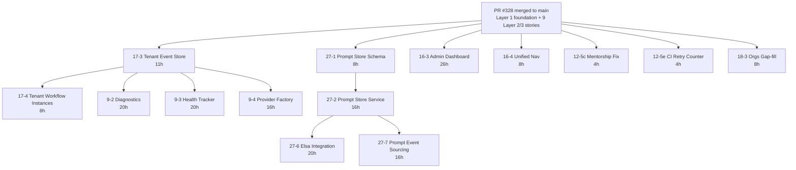

# Remaining Layer 2+3 Parallel Execution Plan

**Status**: Active
**Last Updated**: 2026-04-15
**Scope**: 14 stories not already in PR #328 — finish Layers 2 and 3 with
maximum parallelism.
**Prerequisite**: PR #328 (`feat/auth-foundation`) merged to `main`.

## The 14 remaining stories

All have implementation plan files. 9 were already in the repo, 5 were written
today (17-3, 17-4, 16-3, 16-4, 18-3), and 2 small Elsa plans were written
today (12-5c, 12-5e).

| # | Story | Layer | Effort (h) | Revised (h) | Key files |
|---|---|---|---|---|---|
| 17-3 | Tenant-Scoped Event Store | 2 | 10 | **11** | `packages/api/src/persistence/pg-event-store.ts` + sync→async interface break |
| 17-4 | Tenant-Scoped Workflow Instances | 2 | 8 | **8** | `packages/api/src/persistence/workflow-store.ts` + interface tightening |
| 27-1 | Prompt Store DB Schema | 2 | 8 | 8 | `database/migrations/012_prompt_store.sql` |
| 27-2 | Prompt Store Service (TS) | 2 | 16 | 16 | `packages/api/src/services/prompt-store.ts` |
| 16-3 | Admin Dashboard | 2 | 20 | **26** | `packages/dashboard/src/pages/admin/*` + 95 new tests |
| 16-4 | Unified Navigation Header | 2 | 16 | **~8** | `docker/nav-header/*` + `NavHeader.tsx` hardening (mostly already landed) |
| 12-5c | Mentorship Skill-Level Fix | 2 | 4 | 4 | `apps/tamma-elsa/.../MentorshipWorkflow.cs` |
| 12-5e | CI Retry Counter Fix | 2 | 2 | **4** | verify-first; `CiWithDebugRetryWorkflow.cs` |
| 9-2 | Diagnostics Service + API | 3 | 20 | 20 | `packages/api/src/routes/diagnostics/*` |
| 9-3 | Health Tracker Service + API | 3 | 20 | 20 | `packages/api/src/services/health-tracker.ts` |
| 9-4 | Provider Factory API | 3 | 16 | 16 | `packages/api/src/services/provider-factory.ts` |
| 27-6 | Elsa Workflow Integration | 3 | 20 | 20 | `apps/tamma-elsa/src/.../PromptStore*.cs` |
| 27-7 | Prompt Store Event Sourcing | 3 | 16 | 16 | `packages/api/src/services/prompt-store-events.ts` |
| 18-3 | Organization/Tenant Creation | 3 | 16 | **28** | `packages/api/src/routes/orgs/` — mostly landed, ~8h gap-fill |
| **Total** | | | **192** | **205** | |

## Effort revisions (from today's impl plan agents)

Several story plan agents discovered the situation differs from the layer-2
plan doc's assumptions. Revised effort:

- **17-3** +1h — migration is already `011` (not `010`); in-memory side is
  done; remaining work is `PgEventStore` + interface async conversion +
  transaction-scoped `withTenantContext()`.
- **16-3** +6h — the dashboard scaffold exists; gap is 95 unit tests, a11y
  fixes, audit log feature-flagged tab, and RBAC verification.
- **16-4** −8h — nav assets and React component already exist; gap is one
  bug fix + ARIA + elsa.tamma.dev `sub_filter` injection.
- **12-5e** +2h — the bug may not exist as described in the parent story;
  plan verifies with a failing test before committing to a fix direction.
- **18-3** +12h total effort but −36h vs. a greenfield build: `/api/v1/orgs/`
  routes already exist (666 lines, 11 endpoints). Gap is route refactoring
  to match the story's contract + personal-tenant auto-provisioning
  middleware + hard-delete confirmation.

## File conflict analysis

Grouped by which code paths each story touches:

| Code path | Stories | Conflict risk |
|---|---|---|
| `packages/api/src/persistence/` | 17-3, 17-4, 27-1, 27-2, 27-7 | **Medium** — 17-3/17-4 touch different files (event-store vs workflow-store). 27-1 is migration-only. 27-2 and 27-7 touch different service files. |
| `packages/api/src/services/` | 9-2, 9-3, 9-4, 27-2, 27-7 | **Low** — each story owns its own service file |
| `packages/api/src/routes/` | 9-2, 9-3, 9-4, 18-3 | **Low** — different route prefixes |
| `packages/api/src/middleware/` | 17-3, 17-4, 18-3 | **Medium** — 17-3 adds `withTenantContext()`, 17-4 consumes it, 18-3 adds `ensurePersonalTenant()`. Sequence: 17-3 → 17-4 parallel with 18-3 |
| `packages/dashboard/src/` | 16-3, 16-4 | **Medium** — 16-4 touches the Sidebar link filter AND `NavHeader.tsx`; 16-3 touches the admin pages. Same `packages/dashboard/` package but different subdirectories. |
| `database/migrations/` | 17-3 (011 already landed), 17-4 (011 extend), 27-1 (012) | **Low** — migration 011 already shipped by PR #328, 17-4 extends it in-place, 27-1 is a new file |
| `docker/nginx-proxy.conf.template` | 16-4 | **None** — single file owner |
| `docker/nav-header/` | 16-4 | **None** — single story owner |
| `apps/tamma-elsa/` (C#) | 12-5c, 12-5e, 27-6 | **Low** — each touches a different workflow file |

## Dependency graph

## Parallel execution — 5 teams, ~3 week wall clock

### Week 1 (Layer 2)

| Team | Stories | Hours | Critical path |
|---|---|---|---|
| **Team A — Tenant scoping** | 17-3 → 17-4 | 19 | 17-3 must land before 17-4 (shared `withTenantContext` helper) |
| **Team B — Prompt foundation** | 27-1 → 27-2 | 24 | 27-1 migration must land before 27-2 service |
| **Team C — Admin UI** | 16-3 (+16-4 if time) | 26 + 8 = 34 | Critical path of this week |
| **Team D — Epic 9 services start** | 9-4 (starts Wed once Team A's Task 1 is merged) | 16 | Unblocked by 17-3 task 1 |
| **Team E — Elsa quick wins** | 12-5c + 12-5e + 16-4 (if Team C doesn't) | 16 | Very small, closes out Friday |

**Week 1 output**: 17-3, 17-4, 27-1, 27-2, 9-4, 12-5c, 12-5e, 16-4 merged.
Remaining after Week 1: 16-3 (if still in progress), 9-2, 9-3, 27-6, 27-7, 18-3.

### Week 2 (Layer 3 starts + Layer 2 cleanup)

| Team | Stories | Hours |
|---|---|---|
| **Team A — Diagnostics/Health** | 9-2 → 9-3 | 20 + 20 = 40 |
| **Team B — Prompt continuation** | 27-6 (Elsa C#) + 27-7 (event sourcing) | 20 + 16 = 36 |
| **Team C — Admin UI cleanup** | Finish 16-3 if still going; start 18-3 gap-fill | ~16 |
| **Team D — Orgs gap-fill** | 18-3 | 8 |
| **Team E — Buffer** | Code review, integration test coordination | — |

**Week 2 output**: Everything except any spillover from 9-2/9-3 (Team A) and
27-6/27-7 (Team B).

### Week 3 (Validation)

| Team | Stories | Purpose |
|---|---|---|
| **Team A** | Spillover from 9-2/9-3 | |
| **Team B** | Spillover from 27-6/27-7 | |
| **Team E** | Cross-team integration test, Layer 5-style validation | Dry run for staging deploy |

**Week 3 output**: All 14 remaining Layer 2+3 stories merged. Ready for
Layer 4 (Integration & UI completion).

## Serial-equivalent effort

**205 hours of work**, 5 teams running roughly 40h/team/week = 15 days at
~2.7 teams' worth of parallel effort. Actual critical path is ~34h for
Team C in Week 1 = 4.25 days, plus Team A's 60h for 9-2+9-3 = 7.5 days in
Week 2. **Total wall clock: ~3 weeks with 5 teams.**

Serial effort (1 team): 205 / 40 = **5.1 weeks**.

Parallelism gain: **1.7×**. Not 5× because Week 1's critical path (16-3) is
most of a week on its own.

## Recommendations

1. **Start Team A (17-3 → 17-4) immediately after PR #328 merges.** 17-3 is
   a dependency for Team D's Week 1 work and for all of Layer 3's Team A
   in Week 2.

2. **Team B (27-1 → 27-2) also starts day 1.** No dependency on Team A;
   unblocks 27-6 and 27-7 for Week 2.

3. **Team C (16-3) is the critical path of Week 1.** Consider a second
   dashboard dev pair-programming to shave the 34h to ~20h wall clock.

4. **Team E is a slack team** in Week 1 (8h of Elsa work + optional 16-4 if
   Team C is overloaded). In Week 2, Team E becomes the integration-test /
   code-review coordinator for Teams A and B's merges.

5. **Do NOT parallelize 17-3 and 17-4.** Both touch the same
   `middleware/tenant-context.ts` helper. 17-3 adds it, 17-4 consumes it.
   Sequential on Team A.

6. **Do parallelize 9-2, 9-3, 9-4.** They touch different services and
   different routes. Three independent PRs. Team A takes 9-2+9-3 because
   they share diagnostic/health patterns; Team D can take 9-4 alone in
   Week 1.

7. **18-3 is a Week 2 quick-win** — 8h of gap-fill. Don't let it slip.

## Coordination points

- **Migration 012** (27-1) — coordinate number with any other in-flight
  migration PR.
- **`withTenantContext()` helper** (17-3) — Team A must publish its helper
  signature at Week 1 Monday EOD so Team D (9-4) and Week 2 Team A (9-2/9-3)
  can integrate.
- **Sidebar nav link filter bug** (16-4 Task 3) — isolate this change and
  merge it first on Team C so Team E's 16-3 test suite doesn't inherit the
  bug.

## What this plan does NOT cover

- Layer 4 stories (dashboards for each epic, Elsa integration, 12-5
  sub-stories a/b/d, 12-7 sub-stories) — still belong in
  `layer-4-integration-ui.md`, unchanged.
- Layer 5 validation — unchanged.
- Secret Management Track (stories 1.5-16 through 1.5-45) — separate lane
  per `secret-management-track.md`. Gates on Layer 1 complete; otherwise
  independent of this plan.

## Related

- Main plan: [`README.md`](./README.md)
- Layer 1: [`layer-1-foundation.md`](./layer-1-foundation.md) (mostly landed in PR #328)
- Layer 2: [`layer-2-parallel-infra.md`](./layer-2-parallel-infra.md) (reference for story ACs; effort estimates are stale, use this plan's revised numbers)
- Layer 3: [`layer-3-parallel-services.md`](./layer-3-parallel-services.md)
- Secret Management Track: [`secret-management-track.md`](./secret-management-track.md)
