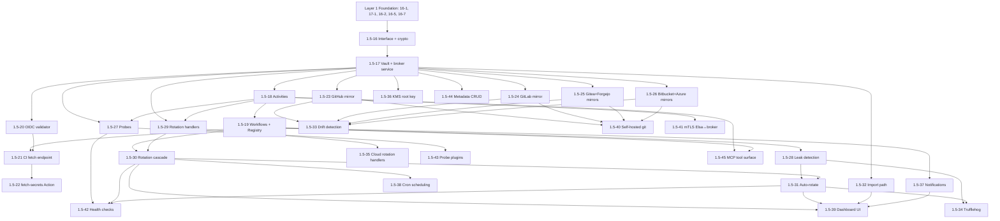

# Secret Management Track — Stories 1.5-16 through 1.5-45

**Status**: Active
**Last Updated**: 2026-04-15
**Scope**: 30 stories delivering LLM-safe secret management (create, rotate,
verify, probe, leak-detect, auto-rotate, cascade, mirror, scheduling,
notification, dashboard, import, drift detection, self-hosted variants, KMS)

This track is a **parallel execution lane** alongside the main layered plan.
It gates behind Layer 1 foundation (auth + tenants + RBAC + service API
keys) but otherwise runs independently — a dedicated team can pick up this
whole lineup and deliver it without blocking or being blocked by other
layers' work.

## Why a separate track?

Secret management touches many existing systems (auth, RBAC, tenant
isolation, event store, platform adapters, Elsa workflows, dashboard,
MCP) but is architecturally self-contained: a new package
(`packages/secret-broker/`) + a new set of Elsa activities + new DB
tables + new UI pages. It has ~30 stories of internal dependencies and
its own critical path. Folding it into Layers 2-5 would scramble the
existing layer sequencing.

Treat it as its own lane. It runs after Layer 1 foundation is merged
(it depends on tenants + RBAC + the JWT_SECRET fail-fast pattern), and
**does not block Layers 2-5** from starting their own work.

## All 30 stories

| # | Story | Purpose | Hours | Track Layer | Depends on |
|---|---|---|---|---|---|
| 1.5-16 | Secret Store Interface + commitment hash protocol | Define `ISecretStore`, crypto primitives, three-mode model, workflow contract | 16 | SM-1 | Layer 1 complete |
| 1.5-17 | TammaVaultStore + Postgres schema + broker HTTP service | Ship the vault, the DB, the broker process | 40 | SM-1 | 1.5-16 |
| 1.5-18 | Secret Activities (C# Elsa wrappers) | Elsa activities wrapping broker HTTP calls | 24 | SM-2 | 1.5-17 |
| 1.5-19 | Create/Rotate Workflows + LlmWorkflowLaunchRegistry | Workflows + LLM polling contract enforcement | 32 | SM-2 | 1.5-18 |
| 1.5-20 | OIDC trust registry + validator | OIDC relying-party support for CI runners | 20 | SM-2 | 1.5-17 |
| 1.5-21 | CI fetch HTTP endpoint | `POST /api/v1/ci/fetch-secrets` for Actions | 16 | SM-3 | 1.5-20, 1.5-17 |
| 1.5-22 | `actions/fetch-secrets/` GitHub Action | Action that user repos consume | 16 | SM-3 | 1.5-21 |
| 1.5-23 | GitHubSecretStore mirror | GitHub Actions secrets write path | 20 | SM-3 | 1.5-17 |
| 1.5-24 | GitLabSecretStore mirror + template | GitLab CI/CD variables + include template | 20 | SM-3 | 1.5-17 |
| 1.5-25 | Gitea + Forgejo secret stores | Shared impl for Gitea ≥ 1.19 / Forgejo ≥ 1.21 | 16 | SM-3 | 1.5-17 |
| 1.5-26 | Bitbucket + Azure DevOps secret stores | Bitbucket pipes + Azure variable groups | 20 | SM-3 | 1.5-17 |
| 1.5-27 | ProbeSecretWorkflow + v1 probe types | HTTP / DB / JWT / SMTP / GitHub probes | 24 | SM-3 | 1.5-17, 1.5-18 |
| 1.5-28 | LeakDetectionWorkflow — LLM scanner + git webhook | Pattern scanner + GitHub secret-scanning webhook | 24 | SM-4 | 1.5-17, 1.5-18, 1.5-19 |
| 1.5-29 | `IRotationHandler` + built-in handlers | Postgres/MySQL/Redis/GitHub App/HTTP | 32 | SM-3 | 1.5-17, 1.5-18 |
| 1.5-30 | RotationCascadeWorkflow | Fan-out rotation with rollback | 24 | SM-4 | 1.5-19, 1.5-29 |
| 1.5-31 | AutoRotateWorkflow (leak events → rotation) | Wires 1.5-28 to 1.5-30 | 16 | SM-4 | 1.5-28, 1.5-30 |
| 1.5-32 | Secret import path (TLS / SSH / existing) | `importSecret()` + handle-based upload | 20 | SM-4 | 1.5-17, 1.5-18 |
| 1.5-33 | Drift detection via platform audit webhooks | Background monitoring for `platform_only` | 20 | SM-4 | 1.5-23 through 1.5-26 |
| 1.5-34 | Non-GitHub git leak scanning (trufflehog) | Scan PRs Tamma creates regardless of platform | 16 | SM-4 | 1.5-28, 1.5-31 |
| 1.5-35 | Cloud provider rotation handlers | AWS IAM / GCP SA / Azure KV / Azure AD | 24 | SM-4 | 1.5-29 |
| 1.5-36 | KMS-backed root key | AWS/GCP/Azure KMS envelope encryption for root | 20 | SM-5 | 1.5-17 |
| 1.5-37 | Operator notification channels | Slack / email / PagerDuty / webhook | 20 | SM-5 | 1.5-19 |
| 1.5-38 | Cascade scheduling / cron-based rotation | Scheduled automatic rotation | 16 | SM-5 | 1.5-30 |
| 1.5-39 | Operator dashboard UI | React pages for secrets, rotations, alerts, targets | 32 | SM-5 | 1.5-19, 1.5-30, 1.5-31, 1.5-32, 1.5-37 |
| 1.5-40 | Self-hosted git platform variants | GHES / GitLab SM / Bitbucket Server / Azure DevOps Server | 16 | SM-5 | 1.5-23 through 1.5-26 |
| 1.5-41 | mTLS between Elsa and broker | Mutual TLS for internal service auth | 12 | SM-5 | 1.5-18 |
| 1.5-42 | Post-rotation health checks | Probe after rotation, rollback on failure | 20 | SM-5 | 1.5-27, 1.5-29, 1.5-30, 1.5-31 |
| 1.5-43 | Custom probe types + plugin framework | `IProbeHandlerPlugin` + sandboxed custom probes | 16 | SM-5 | 1.5-27 |
| 1.5-44 | Secret metadata CRUD | updateSecretMetadata, transferSecret, mergeSecrets | 12 | SM-5 | 1.5-17 |
| 1.5-45 | MCP tool surface for secret management | Expose 12 secret tools via MCP server | 16 | SM-5 | 1.5-18, 1.5-19, Epic 12-1 |
| **Total** | | | **648** | | |

## Track Layers

The 30 stories split into 5 internal layers. Stories within a layer can run
in parallel; layers run sequentially.

### SM-1: Foundation (serial, 1 team)

| Story | Notes |
|---|---|
| **1.5-16** | Interface + crypto + broker skeleton. Doc + types + crypto helpers. No DB yet. |
| **1.5-17** | Vault store + schema + broker HTTP service. First running broker. |

**Gating**: requires Layer 1 (main plan) complete — specifically `16-7`
(unified API keys) for the `TAMMA_BROKER_API_KEY` pattern and the JWT
fail-fast pattern from commit `126dfdf`.

**Duration**: 2 teams × 1 week = 56 hours.

### SM-2: Activities + Workflows + OIDC (parallel, 3 teams)

| Team | Stories |
|---|---|
| SM-2-A | 1.5-18 (Secret Activities C#) |
| SM-2-B | 1.5-19 (Create/Rotate Workflows + Registry) |
| SM-2-C | 1.5-20 (OIDC trust registry + validator) |

Team A delivers the activity wrappers. Team B delivers the workflows
(depends on A's activities but the workflow definitions can be written
before A finishes). Team C is fully independent — OIDC validator doesn't
depend on activities or workflows.

**Duration**: 3 teams × 1 week = 76 hours wall-clock.

### SM-3: Mirrors + Probes + Rotation handlers (parallel, 4 teams)

| Team | Stories |
|---|---|
| SM-3-A | 1.5-21 (CI fetch endpoint), 1.5-22 (GitHub Action) |
| SM-3-B | 1.5-23 (GitHub mirror), 1.5-24 (GitLab mirror) |
| SM-3-C | 1.5-25 (Gitea+Forgejo), 1.5-26 (Bitbucket+Azure) |
| SM-3-D | 1.5-27 (Probes), 1.5-29 (Rotation handlers) |

**Duration**: 4 teams × ~2 weeks = 144 hours wall-clock.

### SM-4: Automation + Integration (parallel, 3 teams)

| Team | Stories |
|---|---|
| SM-4-A | 1.5-28 (Leak detection), 1.5-30 (Cascade), 1.5-31 (Auto-rotate) |
| SM-4-B | 1.5-32 (Import), 1.5-33 (Drift detection) |
| SM-4-C | 1.5-34 (Trufflehog), 1.5-35 (Cloud rotation handlers) |

**Duration**: 3 teams × ~2 weeks = 124 hours.

### SM-5: Ops + UX + Hardening (parallel, 4 teams)

| Team | Stories |
|---|---|
| SM-5-A | 1.5-36 (KMS), 1.5-41 (mTLS) |
| SM-5-B | 1.5-37 (Notifications), 1.5-38 (Scheduling), 1.5-42 (Health checks) |
| SM-5-C | 1.5-39 (Dashboard UI) |
| SM-5-D | 1.5-40 (Self-hosted), 1.5-43 (Probe plugins), 1.5-44 (Metadata CRUD), 1.5-45 (MCP) |

**Duration**: 4 teams × ~2 weeks = 172 hours.

## Total effort

- **Serial-equivalent** (1 team doing everything in order): ~648 hours
- **Parallel with 3-4 teams** (as structured above): ~20 weeks wall clock
  at 40h/week per team = 5 weeks elapsed if the team pipeline is kept full

## Dependency graph

## Integration points with the main plan

This track's outputs feed into the main plan's Layers 4-5:

- **Layer 4 — Integration & UI**: Story 1.5-39 (dashboard UI) follows the
  same dashboard package conventions as existing Layer 4 stories. Can be
  picked up by the Layer 4 dashboard team.
- **Layer 4 — 12-5 MCP work**: Story 1.5-45 (MCP tool surface) is the
  secret-management-specific MCP server; it consumes Epic 12's tool
  executor infrastructure from Story 12-1.
- **Layer 5 — Validation**: Layer 5's security audit and staging deploy
  should include the full secret management track as a top priority
  validation area.

## Worktree conventions

Each SM layer gets its own worktree naming scheme:
- `wt/sm-1-foundation`
- `wt/sm-2-<team letter>` (e.g. `wt/sm-2-a-activities`)
- `wt/sm-3-<team letter>-<subject>`
- etc.

Branches push to `feat/secret-management-<story>` and merge into
`feat/secret-management` integration branch, which then PRs into `main`
at layer boundaries.

## Risks + mitigations specific to this track

| Risk | Severity | Mitigation |
|---|---|---|
| Root key bootstrap mistakes in prod | Critical | 1.5-17's fail-fast + 1.5-36's KMS backing + runbook in operator docs |
| RLS bypass for secrets table | Critical | 1.5-17 AC5; reuse 1.5-4 superuser fix pattern from this PR |
| Commitment hash algorithm change post-launch | High | Root key versioning in 1.5-17 handles key rotation; algorithm change requires re-committing every secret — document as a dedicated migration path |
| Platform API breakages (GitHub/GitLab deprecation) | Medium | Each mirror story includes version pin + quarterly review; 1.5-40 covers self-hosted variants |
| Scanner false-positive rate too high | Medium | 1.5-28 ships with tuning knobs; 1.5-31 medium-confidence override window |
| MCP protocol churn | Low | 1.5-45 pins MCP protocol version; updates are additive |

## Related

- Main plan: [`README.md`](./README.md) — Layers 0-5
- Layer 1 foundation: [`layer-1-foundation.md`](./layer-1-foundation.md)
- Layer 2 parallel infra: [`layer-2-parallel-infra.md`](./layer-2-parallel-infra.md)
- Epic 12 MCP: [`docs/stories/epic-12/`](../epic-12/)
- All 30 stories under: [`docs/stories/epic-1.5/story-1.5-16/`](../epic-1.5/) through
  [`story-1.5-45/`](../epic-1.5/)
