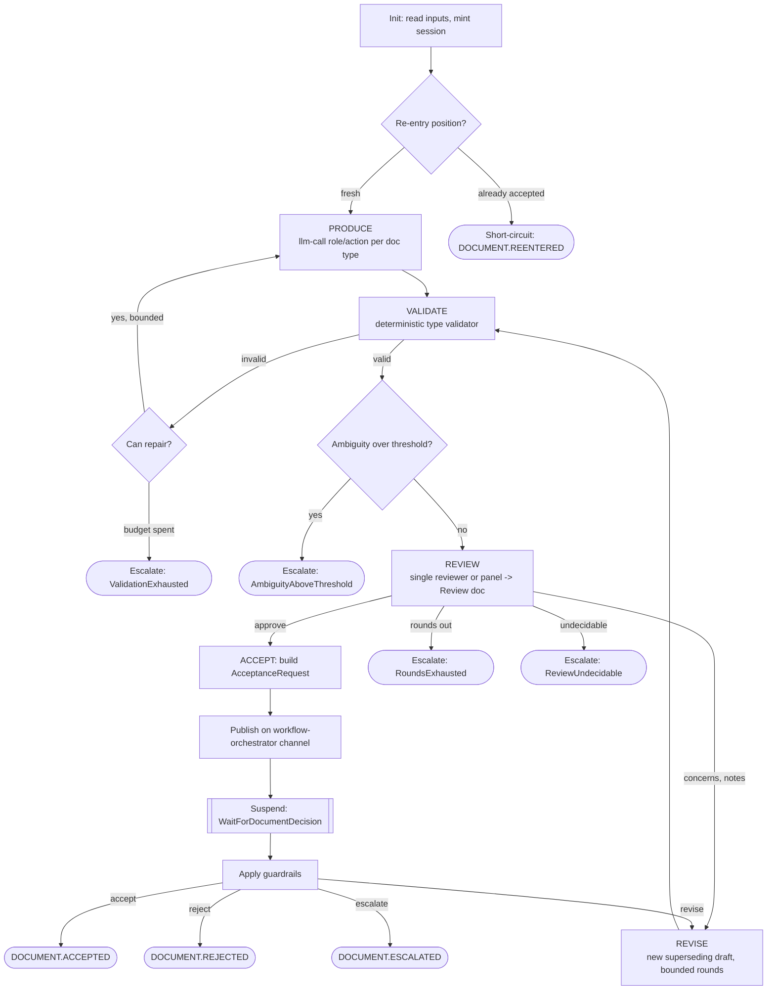

# Document Lifecycle & Typed Work Documents

_Epic 39. The platform's domain language, made explicit._

Before Epic 39 each producing workflow invented a private micro-language: an informal
JSON shape, a hand-rolled parser, and a `parse-ok? → done : dead` decision at the end.
There was no uniform answer to "who decides the result is acceptable," no
review-with-notes loop outside the plan family, and no standard for resuming a workflow
that stopped. Epic 39 replaces all of that with **one vocabulary and one lifecycle**,
built on three pillars:

1. **Typed work documents** — the ~10 artifacts the platform actually reasons about, as
   static C# types with schema + executable domain rules + a prompt-contract renderer.
2. **One universal lifecycle** — `produce → validate → review → revise → accept`, written
   once as a generic Elsa sub-workflow (`DocumentLifecycleWorkflow`, DefinitionId
   `document-lifecycle`) that every producer now binds to.
3. **Resumable by design** — every lifecycle workflow either suspends on a bookmark or
   re-enters from the latest accepted state after a crash — enforced by a build gate. See
   [Resumable Workflows](Resumable-Workflows).

> **Vocabulary static, composition dynamic.** Document types, their rules, roles, and
> actions are compile-time and drift-tested. Which workflows run, in what order, who
> reviews, and how many rounds are runtime policy/config.

---

## 1. Typed work documents

The document vocabulary lives as static C# types in
`apps/tamma-elsa/src/Tamma.Core/Documents/Types/`, registered in the fail-loud
`DocumentTypeRegistry` (`apps/tamma-elsa/src/Tamma.Core/Documents/DocumentTypeRegistry.cs` —
a bad registration refuses to load; `Resolve` never returns null or a silent default).
Each type implements `IDocumentType`: a **schema**, **executable domain rules** (beyond
schema), a **prompt-contract renderer**, and **examples**.

| Type | Produced by | Domain rules beyond schema |
|---|---|---|
| `Findings` | research, triage-context-scan | every finding cites evidence; relevance/confidence ∈ [0,1]; ranked |
| `AmbiguityAssessment` | score-ambiguity | score ∈ [0,1]; typed ambiguities; clear ⇒ empty list valid |
| `Clarification` | clarify, incorporate-answers | ≥1 open-ended question; resolution states the clarified requirement |
| `Decomposition` | decompose-issue | unique IDs; no dangling/self/cyclic `dependsOn`; 2–8h sizing; prerequisite order |
| `Plan` | plan-generation, create-tasks | file map per task; dependencies resolvable; testing stated per task |
| `Design` | propose-design | ≥1 alternative with trade-offs; recommendation references an alternative |
| `Review` | all review/verdict producers | subject reference; issues carry severity+category+fix; blocking issues ⇒ not approvable |
| `TriageDecision` | triage-* | closed enums for every classification field; reasoning required |
| `Diagnosis` | debug, diagnose-incident | hypotheses ranked by confidence; a suggested fix references affected files |
| `TestSpec` | write-tests, test-case-creation | each case bound to a task ID; one behavior per case |

Instances are JSON flowing through events, the store, and the API, always carrying
`issueId` lineage. Validation runs deterministically (`IDocumentType.Validate`); a type
that needs cross-document context (currently `TestSpec` checking a task ID against the
consumed plan) implements `ValidateWithContext`.

**Code is NOT a document type.** Code's store is git, its validator is the build/test/gate
stack (Epic 3 — the strongest in the system), and its review is a `Review` whose subject
is a diff. **Issues are anchors, not documents** — every instance references its `issueId`,
giving a queryable per-issue lineage: Issue → Findings → Decomposition → Plan → Reviews →
outcome.

---

## 2. The universal lifecycle

`DocumentLifecycleWorkflow`
(`apps/tamma-elsa/src/Tamma.ElsaServer/Workflows/DocumentLifecycleWorkflow.cs`, DefinitionId
`document-lifecycle`) runs the same loop for **any** registered document type, driven
purely by inputs: a producer dispatch spec (`producerRole` + `producerAction` +
`producerVariablesJson`), a `documentType`, lineage anchors (`issueId` / `correlationId`),
and the resolved acceptance rules. The Elsa graph only **routes**; all decision logic
lives in the pure `DocumentLifecycleHelper`.

### The deterministic repair ring (validate → bounded repair)

When the type's validator fails, the lifecycle feeds the domain-phrased violations back
to the producer as a bounded **repair** turn (`PrepareRepair` → `DispatchRepair` →
`IngestRepair` → back to `ValidateDraft`), up to `maxValidationRepairAttempts`. This is
the innermost ring — a validation problem is repaired before it ever reaches a reviewer.
Exhausting the budget escalates with `ValidationExhausted`.

### The review-with-notes revise loop

A passing draft is reviewed by the 39-7 review producer (`document-review`), yielding a
`Review` document. If the review requests changes, its notes drive a **revise** round
(`PrepareRevision` → `DispatchRevise`), which mints a **new superseding draft** (a revision
never rewinds a state — it extends the `SupersedesDocumentId` chain) and re-validates.
Rounds are bounded by `maxRevisionRounds`; running out escalates with `RoundsExhausted`.

### The accept gate is an actor, not a branch

The ACCEPT stage **always** submits the document to the orchestrator — it is never an
if-else that skips the decision, and never an embedded `llm-call`. It builds an
`AcceptanceRequest` (`Policy/AcceptanceRequest.cs`), publishes it on the
workflow↔orchestrator channel via `PublishAcceptanceRequestActivity`, and **suspends** on
`WaitForDocumentDecisionActivity`. The orchestrator — a long-running per-tenant agent —
reads the configurable **acceptance rules** and the **autonomy dial** through its tools and
decides WHO decides:

- **Itself** (the higher the dial, the more it self-decides), or
- a **tenant role, never an exact user** — the decision lands in the Task View of every
  role-holder in its visibility scope, and the first authorized completion wins.

Either decision resumes the same gate. Deterministic code (`AcceptanceGuardrails.Clamp`)
enforces only the hard guardrails around that decision — round bounds, the
blocking-review invariant, always-escalate classes — it never impersonates the decision
itself. The resolved route is one of accept / reject / revise / escalate.

### Typed escalation outcomes carry lineage

The internal loop exits only on **done** or a **typed unhandleable outcome**
(`DocumentLifecycleOutcome`): `ReviewUndecidable`, `AmbiguityAboveThreshold`,
`RoundsExhausted`, `ValidationExhausted`. Each escalates to the orchestrator/human **with
the full document lineage attached** (drafts, reviews, rounds) — never a bare failure. The
workflow's terminal `status` is `accepted`, `rejected`, or `escalated`; a parent binding
switches on `status` first.

---

## 3. Acceptance rules + the autonomy dial

`AcceptanceRules` (`apps/tamma-elsa/src/Tamma.Core/Documents/Policy/AcceptanceRules.cs`) is
the configurable policy per document type, resolved through `IAcceptanceRulesResolver`:

| Knob | Meaning |
|---|---|
| `autonomyLevel` | **70 (supervised baseline)** … **100 (full auto)**. How much the orchestrator decides itself. Validated 70–100 — it is a dial, not a mode. |
| `maxRevisionRounds` | Review/revision rounds before `RoundsExhausted` (1–10). |
| `maxValidationRepairAttempts` | Deterministic repair-ring budget (0–10). |
| `ambiguityEscalationThreshold` | Score at/above which a request escalates ([0,1]). |
| `alwaysEscalate` | Document-type / agent-action classes that short-circuit to `Escalate` before any acceptor runs (e.g. breaking changes — configuration, not a hardcoded rule). |
| `reviewerSelection` | Single reviewer role, or a panel roster + quorum + decision rule (unanimous/majority). |
| `decisionGuidance` / `routingGuidance` | Operator prose the orchestrator reads when it decides and routes. |

`Validate()` **rejects** out-of-range knobs and unknown taxonomy keys rather than clamping,
and runs both fail-loud on write and defensively on read. Humans sit at three positions at
every autonomy level: **intent** (the issue + its acceptance criteria), **policy** (the
rules + the dial, edited in the admin UI), and **exceptions** (escalations and assigned
tasks).

---

## 4. The document store + lineage

Every lifecycle transition emits a `DOCUMENT.*` DCB event AND projects a row into the
tenant-resident `document_instances` table (entity `DocumentInstance`,
`apps/tamma-elsa/src/Tamma.Data/Entities/DocumentInstance.cs`). This is a **read-optimized
product layer over the DCB stream, not a new event store** — it is rebuildable (truncate +
re-project), and if the store and the stream ever disagree, the stream wins. Each row
back-references its `CorrelatingEventId`, so an auditor can cross-check store ↔ stream
mechanically; the correlating id is minted once per persisting transition so the
`domain_events` row and the `document_instances` row share one id.

The store is **insert-only** keyed on the envelope's UUID v7 id: a revise round inserts a
new row (`revision + 1`) and flips its predecessor to `superseded` — so each distinct
envelope is persisted exactly once and the `SupersedesDocumentId` chain records the full
revision trail. `Review` instances hang off their subject via `ParentDocumentId`.

Reads go through `IDocumentInstanceRepository`:

- `GetLatestAcceptedAsync(tenantId, issueId, ct)` — the single indexed read that answers
  "what is already accepted?" (also what 39-10 re-entry consumes).
- The lineage endpoints (`apps/tamma-elsa/src/Tamma.Api/Endpoints/DocumentEndpoints.cs`):
  `GET /api/documents/issues/{issueId}/lineage` (full revision trail, DTO
  `IssueDocumentLineage`) and `.../latest` (`LatestAcceptedDocuments`).

Document states (`DocumentState`): `draft → validated → reviewed → {accepted | rejected |
escalated}`; the terminals have no outbound transitions.

---

## 5. Every producer is now a thin binding

The 39-12…39-15 migration retired the per-workflow micro-languages: each producing
workflow is now a **thin binding** that dispatches `document-lifecycle` with its
producer cell, consumes the typed exit, and maps it back to whatever its downstream
callers expect. The static `consumes`/`produces` interface for each binding is declared in
`DocumentTypeRegistry.WorkflowInterfaces` and checked by a build-time graph test.

| Family | Bindings | Typed flow |
|---|---|---|
| Decomposition (39-12, pilot) | `issue-decomposition` | → `Decomposition` |
| Assessment (39-13) | `research`, `ambiguity-scoring`, `clarifying-questions`, `design-proposal` | → `Findings` / `AmbiguityAssessment` / `Clarification` / `Design` |
| Planning (39-14) | `plan-generation`, `plan-review`, `task-creation` | `Decomposition` → `Plan`; `plan-review` reads `Plan` |
| Creation/Triage/Debug (39-15) | `triage-context-gathering`, `triage-po-decision`, `test-case-creation`, `debug-diagnosis` | → `Findings` / `TriageDecision` / `TestSpec` / `Diagnosis` |

The unified `Review` type (produced by `document-review`, single-reviewer or panel)
absorbed the three previously-forked review/verdict shapes, and the bespoke PlanReview
discussion loop and DesignProposal approval gate became instances of the generic
lifecycle. See [Workflow: Document Lifecycle](Workflow-Document-Lifecycle) for the graph
and [Workflow: Debug Diagnosis](Workflow-Debug-Diagnosis) for a worked binding.

---

## See also

- [Architecture](Architecture) — where the lifecycle sits in the running system
- [Resumable Workflows](Resumable-Workflows) — the resumable-by-design standard
- [Workflow: Document Lifecycle](Workflow-Document-Lifecycle) — the per-workflow reference
- [Role & Action Taxonomy](Role-Action-Taxonomy) — the producer cells the lifecycle dispatches
- [Event Schema & Catalog](Event-Schema-and-Catalog) — the `DOCUMENT.*` / `APPROVAL.*` families
