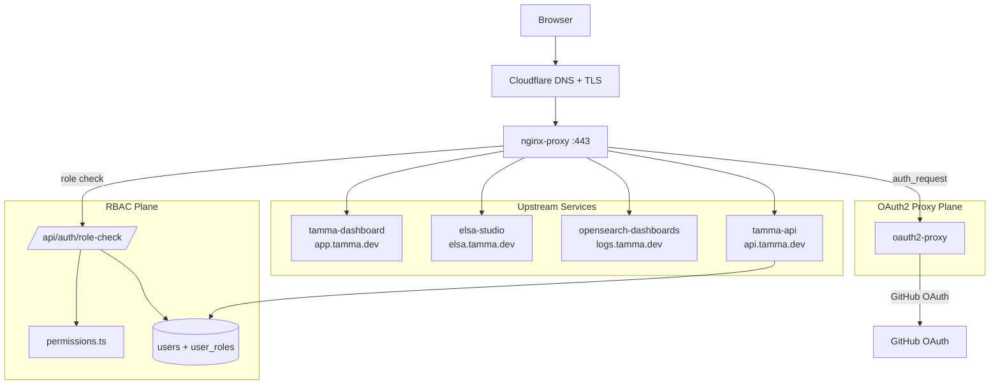
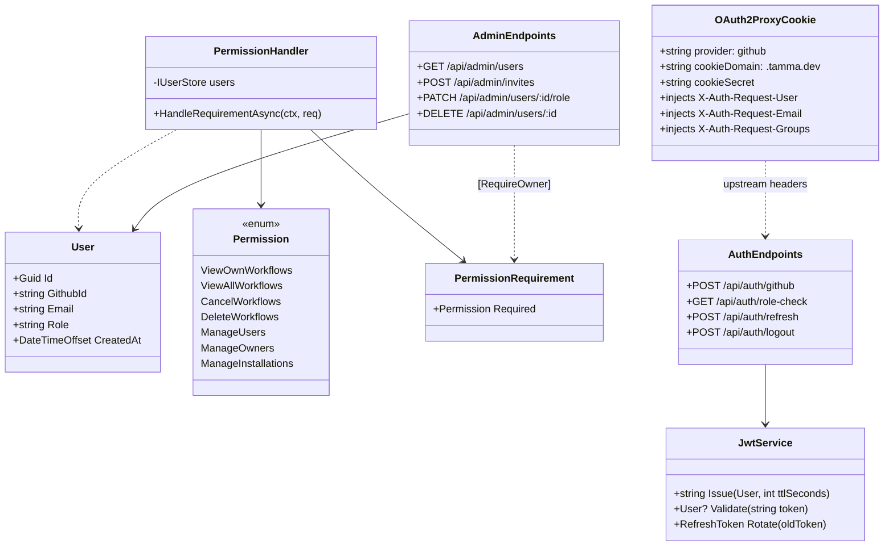
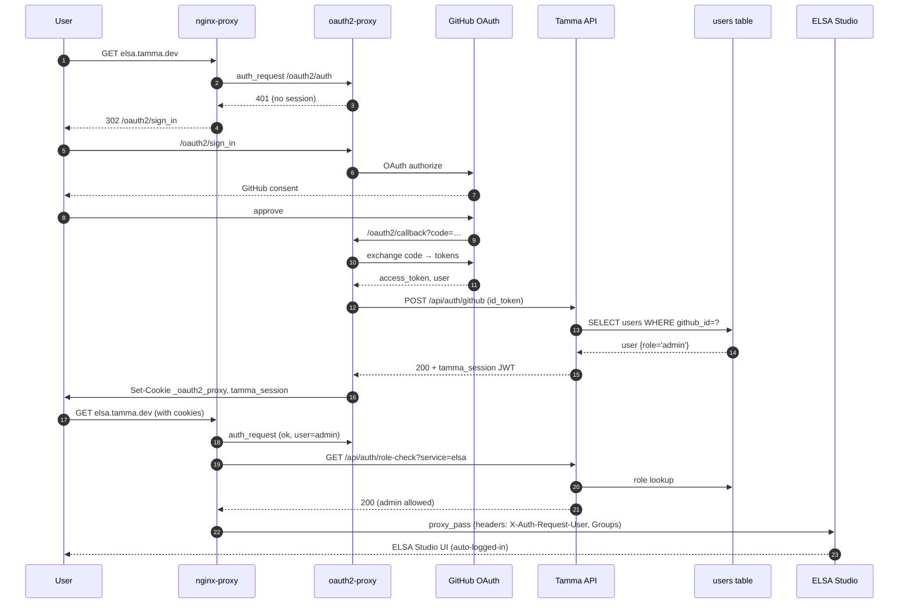

# Epic 16: Unified Auth, User Management & Admin

**Status:** Done (6 core stories shipped; 16-7 service-to-service auth + 16-8 Valkey session store planned)
**Stories:** 8 (16-1 through 16-8)
**Layer:** Layer 3 (Platform Ops)
**Depends on:** Epic 1.5 (API framework, GitHub App), Epic 5 (Dashboard SPA), Epic 14 (ELSA Studio)

> **Root topic**: [Auth & Admin](Auth-Admin) — the platform-wide reference.
> For end-user registration and dual auth see [Epic 18](Epic-18-User-Auth.md); for tenant-aware user plane see [Epic 17](Epic-17-Multi-Tenancy.md).

## Overview

Epic 16 consolidates three previously-fragmented authentication systems — Tamma Dashboard (GitHub OAuth → JWT), ELSA Studio (ELSA Identity with admin user), OpenSearch Dashboards (no auth, only nginx) — into a single sign-on plane fronted by `oauth2-proxy` and backed by the existing PostgreSQL `users` table. After this epic, one GitHub login grants access to every dashboard the user is authorised for; ELSA Studio and OpenSearch Dashboards are protected at the proxy layer; and a three-tier role system (`member`, `admin`, `owner`) is enforced at the API, nginx and UI levels.

The epic also ships the first user-management API (invite, list, change role, revoke), an admin dashboard at `app.tamma.dev/admin` and a unified navigation header that surfaces cross-service links and the signed-in user across all three subdomains.

## Architecture

Three subdomains, one cookie. All three services sit behind `oauth2-proxy` which translates the GitHub OAuth handshake into a session cookie (`_oauth2_proxy`, scoped to `.tamma.dev`). The Tamma Dashboard continues to mint its own JWT (`tamma_session`) for API-level authorisation; the proxy cookie handles page-access gating.

### Roles

| Role | Dashboard | Workflow runs | ELSA Studio | OS Dashboards | User mgmt | System config |
|------|-----------|---------------|-------------|---------------|-----------|---------------|
| **member** | own | own | — | — | own profile | — |
| **admin** | all | all, cancel | ✓ | ✓ | invite, change-role (≤ admin), revoke | — |
| **owner** | all | all, delete | ✓ | ✓ | promote to admin, delete user | ✓ |

Role source of truth is the `users.role` column (`CHECK (role IN ('owner','admin','member'))`). Role claims are stamped into both the GitHub OAuth callback's JWT and the `X-Auth-Request-Groups` header that `oauth2-proxy` forwards upstream.

## Components

| Component | Language | Responsibility | Source |
|-----------|----------|----------------|--------|
| **oauth2-proxy** | Go (vendor) | GitHub OAuth handshake, session cookie, upstream header injection | `docker/oauth2-proxy.cfg` |
| **AuthEndpoints (C#)** | C# | Login / logout / role-check / OAuth callback / refresh-token plane | `apps/tamma-elsa/src/Tamma.Api/Endpoints/AuthEndpoints.cs` |
| **JwtService** | C# | HS256 `tamma_session` signing, refresh-token lifecycle | `apps/tamma-elsa/src/Tamma.Api/Auth/JwtService.cs` |
| **PermissionHandler + Permissions** | C# | ASP.NET Core `IAuthorizationRequirement` + role→permission matrix | `Tamma.Api/Auth/PermissionHandler.cs`, `Permissions.cs` |
| **User management API** | C# | `/api/admin/users`, invite, list, change-role, revoke | `Tamma.Api/Endpoints/AdminEndpoints.cs` |
| **Invite plane** | C# | `user_invites` table, token issuance + acceptance | `Tamma.Api/Endpoints/AdminEndpoints.cs` + `InviteRepository.cs` |
| **Admin Dashboard (React)** | TypeScript | `/admin` routes — users, workflows, health, quick-links | `packages/dashboard/src/admin/` |
| **Unified Nav Header** | TypeScript | `TammaNav` component mounted in every dashboard | `packages/shared-ui/src/TammaNav.tsx` |
| **nginx RBAC blocks** | nginx | `auth_request` + role header check per server block | `docker/nginx-proxy.conf` |
| **ELSA auto-login shim** | C# | Trusts `X-Auth-Request-User` and bypasses ELSA Identity when present | `Tamma.ElsaServer/Program.cs` |
| **LoginLockoutService** | C# | Brute-force guard (5 failures → 15 min lock) | `Tamma.Api/Auth/LoginLockoutService.cs` |
| **SessionCookieWriter** | C# | Sets `tamma_session` on `.tamma.dev` with `SameSite=Lax`, `Secure`, `HttpOnly` | `Tamma.Api/Auth/SessionCookieWriter.cs` |

## Class diagram — RBAC plane

## Sequence — user logs in, accesses ELSA Studio

## Use cases

| # | Persona | Goal | Path |
|---|---------|------|------|
| 1 | First-time user | Log in via GitHub | Browser → any `*.tamma.dev` → oauth2-proxy GitHub flow → JWT minted |
| 2 | Admin | Invite a team member | Admin Dashboard → Users → "Invite" → email + role → `POST /api/admin/invites` |
| 3 | Invited user | Accept invite | Click email link → `/invite/:token` → GitHub OAuth → membership row created |
| 4 | Member | Try to open ELSA Studio | `elsa.tamma.dev` → oauth2-proxy sees cookie → role-check returns 403 → custom 403 page |
| 5 | Admin | Promote member to admin | Admin Dashboard → row action "Change role" → `PATCH /api/admin/users/:id/role` |
| 6 | Owner | Demote an admin | Only owners can touch owner/admin boundary; `PermissionHandler` checks `ManageOwners` |
| 7 | User | Sign out everywhere | `/oauth2/sign_out` clears both cookies; reopen any subdomain → fresh GitHub flow |
| 8 | Operator | Open OpenSearch Dashboards | `logs.tamma.dev` → oauth2-proxy → role-check (admin+) → proxy_pass to Dashboards |

## Dependencies

**Upstream**
- [Epic 1.5](Epic-1.5-Infrastructure.md) — Fastify / Kestrel API hosting, GitHub App credentials, nginx + Cloudflare TLS
- [Epic 5](Epic-5-Observability.md) — Dashboard SPA to embed the admin pages
- [Epic 14](Epic-11-14-ELSA.md) — ELSA Studio; Story 16-6 wires the auto-login shim
- [Epic 15](Epic-15-Log-Aggregation.md) — `logs.tamma.dev` receives the oauth2-proxy gate

**Downstream**
- [Epic 17](Epic-17-Multi-Tenancy.md) — adds `tenantId` claim to JWT + a tenant-aware permission matrix (`requireRole('admin', withinTenant)`)
- [Epic 18](Epic-18-User-Auth.md) — extends auth with email+password + email verification + multi-tenant sessions
- [Epic 20](Epic-20-Billing.md) — admin dashboard surfaces plan + usage widgets
- [Epic 28](Epic-28-DB-Per-Tenant.md) — API-key prefix routing (Story 28-7) + `/auth/switch-org` (28-9) extend this auth plane

## Current state

- **Stories 16-1 through 16-6 shipped** and live in production at `app.tamma.dev`, `elsa.tamma.dev`, `logs.tamma.dev`
- User mgmt API, admin dashboard, unified nav, RBAC and ELSA auto-login all operational
- **Story 16-7 (Service-to-Service Auth)** — planned. Introduces signed service tokens for `api → engine`, `engine → elsa` and replaces the shared HMAC env var with per-service rotating credentials. Depends on Story 17-1 for tenant context propagation
- **Story 16-8 (Valkey Session Store)** — planned. Moves oauth2-proxy from cookie-encrypted sessions to a Valkey (Redis-compatible) session store so that `logout everywhere` and single-session-per-user become possible
- The `tamma_session` JWT is HS256 with `JWT_SECRET` from env — the same secret drives the state parameter on GitHub App install callbacks (Epic 18-4). Rotation plan is tracked in Epic 29 (Secret Management)

## Stories

| # | Title | Priority | Effort | Status |
|---|-------|----------|--------|--------|
| 16-1 | OAuth2 Proxy Unified Auth | P0 | 16h | **Done** |
| 16-2 | User Management API | P0 | 20h | **Done** |
| 16-3 | Admin Dashboard | P1 | 24h | **Done** |
| 16-4 | Unified Navigation Header | P1 | 12h | **Done** |
| 16-5 | Role-Based Access Control | P0 | 16h | **Done** |
| 16-6 | ELSA Studio Auto-Login | P1 | — | **Done** |
| 16-7 | Service-to-Service Auth | P0 | 20h | Planned |
| 16-8 | Valkey Session Store | P2 | 12h | Planned |

## Operational notes

- **Cookie scope** — both `_oauth2_proxy` and `tamma_session` are set on `.tamma.dev` so every subdomain participates. Local dev uses `.localhost` and `Secure=false`.
- **Role refresh latency** — role changes take effect within 1 hour (oauth2-proxy session TTL). An immediate revocation path is Story 16-8's explicit goal.
- **Brute-force guard** — `LoginLockoutService` locks an email for 15 min after 5 failed passwordless login attempts (used by Epic 18's email+password path; the GitHub OAuth path is rate-limited at GitHub).
- **Audit trail** — every auth / admin mutation emits a DCB event (`AUTH.LOGIN.SUCCESS`, `AUTH.LOGIN.FAILED`, `USER.ROLE_CHANGED`, `USER.INVITED`, `USER.INVITE_ACCEPTED`, `USER.REVOKED`) with actor + target in tags.
- **403 page** — `docker/error-pages/403.html` explains why access was denied and links back to `app.tamma.dev`; served by nginx when `role-check` returns non-200.

## See also

- [Auth & Admin](Auth-Admin) — root topic
- [Epic 17: Multi-Tenancy](Epic-17-Multi-Tenancy.md) — tenant-aware extensions
- [Epic 18: End-User Auth](Epic-18-User-Auth.md) — email+password + M:N memberships
- [Epic 14: ELSA Studio](Epic-14-ELSA-Studio.md)
- [Epic 15: Log Aggregation](Epic-15-Log-Aggregation.md) — protected at `logs.tamma.dev`
- [Epic 28: DB-per-Tenant](Epic-28-DB-Per-Tenant.md) — Stories 28-7..28-9 extend the auth plane
- [Stories on GitHub](https://github.com/meywd/tamma/tree/main/docs/stories/epic-16)

---

_Last updated: 2026-04-22_
