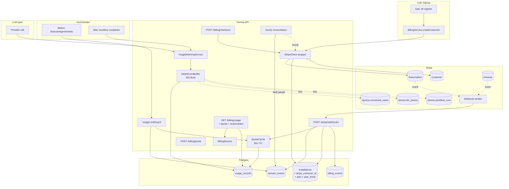
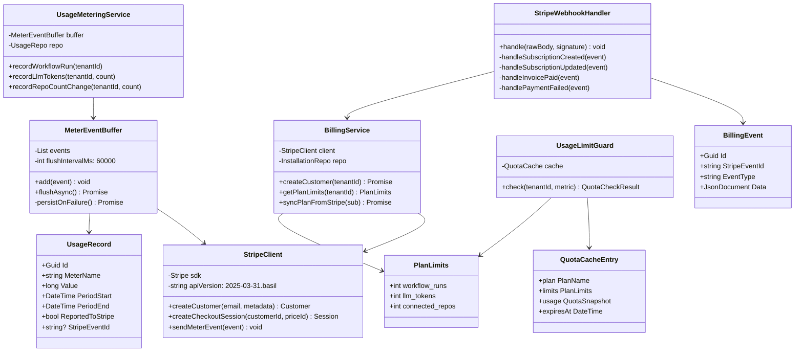
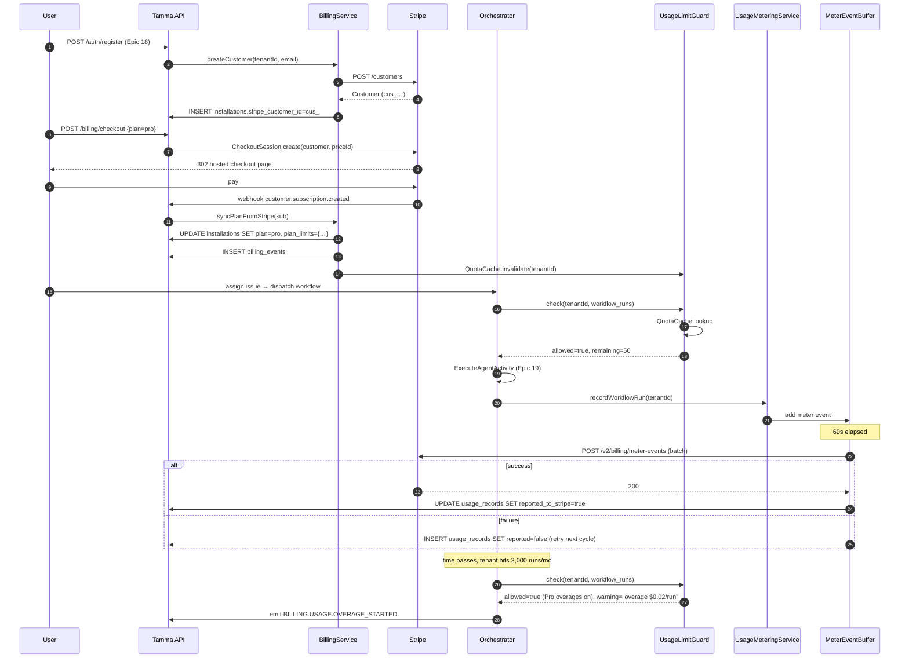

# Epic 20: Billing & Payments

**Status:** Drafted — 5 stories planned; Stripe SDK v18, Billing Meters v2 API targeted
**Stories:** 5 (20-1 through 20-5)
**Layer:** Layer 4 (Integration / UI)
**Depends on:** Epic 17 (tenant model), Epic 18 (user signup), Epic 2 (orchestrator dispatch), Epic 4/10 (event store), Epic 5 (dashboard)

> **Root topic**: [Billing](Billing) — plan catalogue, overage pricing, webhook shape.
> For the tenant model see [Epic 17](Epic-17-Multi-Tenancy.md); for where the limit-guard hooks in see [Epic 2 Autonomous Loop](Epic-2-Autonomous-Loop.md); for admin surfaces see [Epic 16](Epic-16-Auth-Admin.md).

## Overview

Epic 20 turns Tamma SaaS into a **paid product**. It integrates Stripe (SDK v18, API `2025-03-31.basil`) as the billing provider, defines three subscription plans (Free / Pro / Enterprise) with per-meter usage limits, wires usage capture into every workflow run + LLM call + repo connection, pushes batched meter events to Stripe, enforces limits at the orchestrator dispatch level, and ships a self-service billing dashboard.

The key design decisions:

- **One Tamma tenant = one Stripe Customer** — the `installations` table gains `stripe_customer_id`, `plan`, `plan_limits`. Stripe Customer is created on signup (Epic 18 hook) within 1 minute.
- **Stripe Billing Meters (v2)** — three meters: `tamma.workflow_runs` (SUM), `tamma.llm_tokens` (SUM), `tamma.connected_repos` (LAST / gauge). No legacy "usage records" API.
- **Local-first aggregation** — usage events batch in-memory, flush every 60s to Stripe. On flush failure they persist to `usage_records` and retry on the next cycle. Stripe is not the source of truth at dispatch time; the local cache is.
- **Enforcement before dispatch** — `UsageLimitGuard` runs inline before every `ExecuteAgentActivity`, returning `{allowed, reason, remainingQuota}` within 50ms p95.
- **Graceful degradation** — Free-tier excess puts the workflow into `pending_upgrade` state instead of failing it; Pro-tier excess is allowed and billed as overages; Enterprise always passes through.

## Architecture



### Plans

| Plan | Monthly | Workflow runs/mo | LLM tokens/mo | Connected repos | Support |
|------|---------|------------------|---------------|-----------------|---------|
| **Free** | $0 | 50 | 500K | 3 | Community |
| **Pro** | $29 | 2,000 | 10M | 25 | Email (48h) |
| **Enterprise** | Custom | Unlimited (-1) | Custom | Unlimited (-1) | Dedicated SLA |

Overage pricing (Pro only, metered via Stripe):
- Workflow runs: $0.02 / run over limit
- LLM tokens: $2.00 / 1M tokens over limit
- Additional repos: $1.50 / repo / month over limit

## Components

| Component | Source | Story | Role |
|-----------|--------|-------|------|
| **`StripeClient`** | `packages/api/src/services/billing/stripe-client.ts` | 20-1 | Typed SDK v18 wrapper with retries + idempotency keys |
| **`BillingService`** | `services/billing/billing-service.ts` | 20-1 | `createCustomer`, `getCustomer`, `getPlanLimits`, `syncPlanFromStripe` |
| **`PLAN_LIMITS` constant** | `services/billing/plan-config.ts` | 20-1 | Typed Free/Pro/Enterprise limit matrix |
| **`scripts/stripe-seed.ts`** | `scripts/stripe-seed.ts` | 20-1 | Seed Products + Prices + Meters, store IDs in `billing_config` |
| **`CheckoutRoute`** | `routes/billing/checkout.ts` | 20-2 | `POST /billing/checkout` — Stripe Checkout Session for plan |
| **`PortalRoute`** | `routes/billing/portal.ts` | 20-2 | `POST /billing/portal` — Stripe Customer Portal |
| **`StripeWebhookHandler`** | `routes/stripe/webhooks.ts` | 20-2 | Verifies signature, processes subscription + invoice events idempotently |
| **`SubscriptionRoute`** | `routes/billing/subscription.ts` | 20-2 | `GET /billing/subscription` — plan + period + payment status |
| **`UsageMeteringService`** | `services/billing/usage-metering-service.ts` | 20-3 | Captures events from orchestrator + LLM layer, writes to `usage_records` |
| **`MeterEventBuffer`** | `services/billing/meter-event-buffer.ts` | 20-3 | In-memory batch, 60s flush to Stripe Meter Events v2 |
| **`UsageReconciliation`** | `services/billing/usage-reconciliation.ts` | 20-3 | Hourly job comparing local totals with Stripe summaries; logs drift |
| **`UsageLimitGuard`** | `services/billing/usage-limit-guard.ts` | 20-4 | `check({tenantId, metric}) → {allowed, reason, remainingQuota}` in 50ms p95 |
| **`QuotaCache`** | `services/billing/quota-cache.ts` | 20-4 | In-memory cache, 30s TTL, invalidated on plan-change webhook |
| **`UsageLimitMiddleware`** | `middleware/usage-limit.ts` | 20-4 | Fastify plugin injecting quota into request |
| **`QuotaRoute`** | `routes/billing/quota.ts` | 20-4 | `GET /billing/quota` — snapshot for current tenant |
| **`BillingDashboard`** | `packages/dashboard/src/billing/` | 20-5 | Usage charts, plan management, invoice history |

## Class diagram



## Sequence — signup, subscribe, run workflow, hit limit



## Use cases

| # | Persona | Goal | Path |
|---|---------|------|------|
| 1 | New user | Sign up, get a Stripe Customer | 20-1 — on Epic 18 register hook |
| 2 | User | Subscribe to Pro | `POST /billing/checkout` → hosted Stripe Checkout → webhook syncs plan |
| 3 | User | Update payment method | `POST /billing/portal` → Stripe Customer Portal |
| 4 | User | Cancel subscription | Customer Portal → `customer.subscription.deleted` webhook → reverts to Free |
| 5 | Free-tier tenant | Try to run 51st workflow this month | `UsageLimitGuard` blocks → `pending_upgrade`; emits `BILLING.USAGE.LIMIT_REACHED` |
| 6 | Pro tenant | Run the 2,001st workflow | Allowed with warning; Stripe bills $0.02 overage at period close |
| 7 | Platform operator | Reconcile a missed meter event | Hourly reconciliation detects drift and logs `BILLING.USAGE.RECONCILIATION_MISMATCH` |
| 8 | User | See their usage | `GET /billing/usage` → dashboard chart with current period totals |
| 9 | User | See invoice history | Dashboard pulls from Stripe (no local invoice mirror for v1) |
| 10 | Enterprise tenant | Unlimited everything | `PLAN_LIMITS[enterprise] = {-1, -1, -1}` — guard short-circuits |

## Stripe webhook events

| Event | Handler action |
|-------|----------------|
| `customer.subscription.created` | Set `plan` + `plan_limits` on `installations`; emit `BILLING.SUBSCRIPTION.CREATED`; invalidate `QuotaCache` |
| `customer.subscription.updated` | Handle upgrade/downgrade; update `plan_limits`; emit `BILLING.SUBSCRIPTION.UPDATED` |
| `customer.subscription.deleted` | Revert to Free; emit `BILLING.SUBSCRIPTION.CANCELLED` |
| `invoice.payment_succeeded` | Clear `payment_failed` flag; emit `BILLING.PAYMENT.SUCCEEDED` |
| `invoice.payment_failed` | Set `payment_failed` flag; emit `BILLING.PAYMENT.FAILED` + alert |
| `customer.subscription.trial_will_end` | Emit `BILLING.TRIAL.WILL_END` (3 days before) |

All events are persisted to `billing_events` with `stripe_event_id` unique — duplicates are acknowledged but not reprocessed (idempotency).

## Dependencies

**Upstream**
- [Epic 1](Epic-1-Foundation.md), [Epic 17](Epic-17-Multi-Tenancy.md) — installations / tenants table
- [Epic 2](Epic-2-Autonomous-Loop.md) — orchestrator dispatch loop (where `UsageLimitGuard` injects)
- [Epic 4](Epic-4-Event-Sourcing.md), [Epic 10](Epic-10-Engine-Core.md) — DCB event store for the audit trail
- [Epic 5](Epic-5-Observability.md) — dashboard framework that billing UI extends
- [Epic 18](Epic-18-User-Auth.md) — signup flow creates Stripe Customer

**Downstream**
- [Epic 21](Epic-21-Marketing-Dashboard.md) — marketing surfaces plan + pricing tables fed from the same plan config
- [Epic 22](Epic-22-CLI-Standalone.md) — CLI mode has no billing plane (bypasses `UsageLimitGuard` entirely)
- [Epic 28](Epic-28-DB-Per-Tenant.md) — `installations.stripe_customer_id` moves to `tenants` in control-plane DB

## Implementation phases

| Phase | Stories | Duration |
|-------|---------|----------|
| 1. Foundation | 20-1, 20-2 | 6-8 days |
| 2. Metering & Enforcement | 20-3, 20-4 | 7-9 days |
| 3. Dashboard | 20-5 | 4-5 days |

## Database schema additions

```sql
ALTER TABLE installations ADD COLUMN stripe_customer_id TEXT UNIQUE;
ALTER TABLE installations ADD COLUMN plan TEXT NOT NULL DEFAULT 'free';
ALTER TABLE installations ADD COLUMN plan_limits JSONB NOT NULL DEFAULT '{}';
ALTER TABLE installations ADD COLUMN payment_failed BOOLEAN DEFAULT FALSE;

CREATE TABLE usage_records (
  id UUID PRIMARY KEY DEFAULT gen_random_uuid(),
  installation_id UUID NOT NULL REFERENCES installations(id),
  meter_name TEXT NOT NULL,
  value BIGINT NOT NULL,
  period_start TIMESTAMPTZ NOT NULL,
  period_end TIMESTAMPTZ NOT NULL,
  reported_to_stripe BOOLEAN DEFAULT FALSE,
  stripe_event_id TEXT,
  created_at TIMESTAMPTZ DEFAULT NOW()
);
CREATE INDEX idx_usage_records_lookup
  ON usage_records(installation_id, meter_name, period_start);

CREATE TABLE billing_events (
  id UUID PRIMARY KEY DEFAULT gen_random_uuid(),
  installation_id UUID NOT NULL REFERENCES installations(id),
  stripe_event_id TEXT UNIQUE,
  event_type TEXT NOT NULL,
  data JSONB NOT NULL,
  processed_at TIMESTAMPTZ DEFAULT NOW()
);
```

## Current state

All 5 stories **Planned**. No story has shipped code yet. The Stripe SDK choice (v18, Billing Meters v2) is locked; the plan catalogue is locked; database schema additions are locked. The open questions heading into implementation:

1. **Currency + tax** — v1 is USD only, no tax calculation; future story integrates Stripe Tax.
2. **Mid-period plan changes proration** — using Stripe's default (upgrades immediate, downgrades end-of-period).
3. **Stripe source of truth for invoices** — v1 reads invoice history from Stripe on demand; no local mirror. Revisit if audit compliance demands it.
4. **Free → Pro conversion trigger** — email nudge at 80% usage via `BILLING.USAGE.QUOTA_WARNING` event (handled by marketing workflow).

## Stories

| # | Title | Priority | Effort | Status |
|---|-------|----------|--------|--------|
| 20-1 | Stripe Integration & Plan Model | P0 | 3-4d | Planned |
| 20-2 | Subscription Management | P0 | 3-4d | Planned |
| 20-3 | Usage Metering | P0 | 4-5d | Planned |
| 20-4 | Usage Limits Enforcement | P0 | 3-4d | Planned |
| 20-5 | Billing Dashboard | P1 | 4-5d | Planned |

## Success metrics

- 100% of tenants have a Stripe Customer record within 1 minute of signup
- Usage meter events delivered to Stripe within 120 seconds of occurrence
- Limit enforcement blocks dispatches within 500 ms p99; `UsageLimitGuard.check` itself < 50 ms p95
- Webhook processing latency < 2 s p95
- Billing dashboard loads within 1 s p95
- Zero missed invoice events (verified via event-sourcing reconciliation)

## See also

- [Billing](Billing) — root topic with plan catalogue + pricing
- [Epic 2: Autonomous Loop](Epic-2-Autonomous-Loop.md) — where `UsageLimitGuard` hooks in
- [Epic 17: Multi-Tenancy](Epic-17-Multi-Tenancy.md) — installations / tenants model
- [Epic 18: User Auth](Epic-18-User-Auth.md) — signup fires `BillingService.createCustomer`
- [Epic 28: DB-per-Tenant](Epic-28-DB-Per-Tenant.md) — moves `stripe_customer_id` to control-plane tenants table
- [Stripe Billing Meters API docs](https://docs.stripe.com/api/billing/meter)
- [Stripe Node.js SDK v18 migration guide](https://github.com/stripe/stripe-node/wiki/Migration-guide-for-v18)
- [Stories on GitHub](https://github.com/meywd/tamma/tree/main/docs/stories/epic-20)

---

_Last updated: 2026-04-22_
