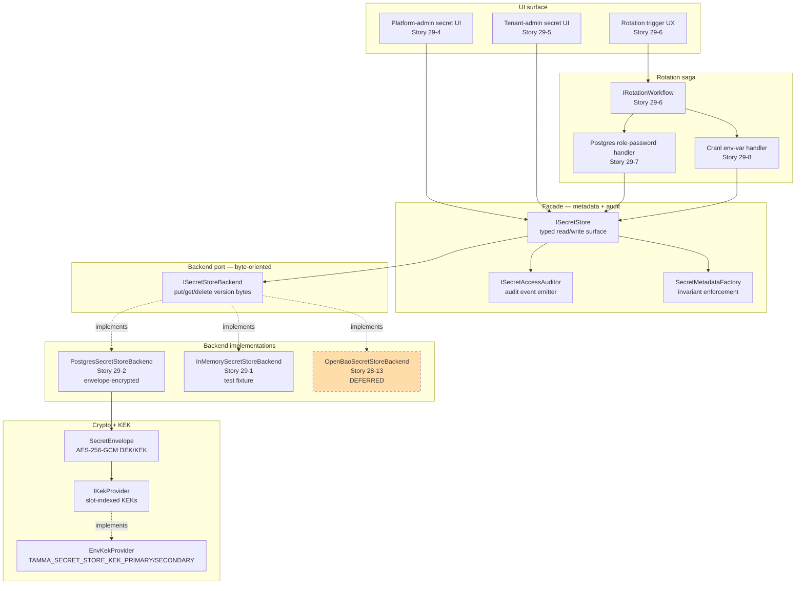
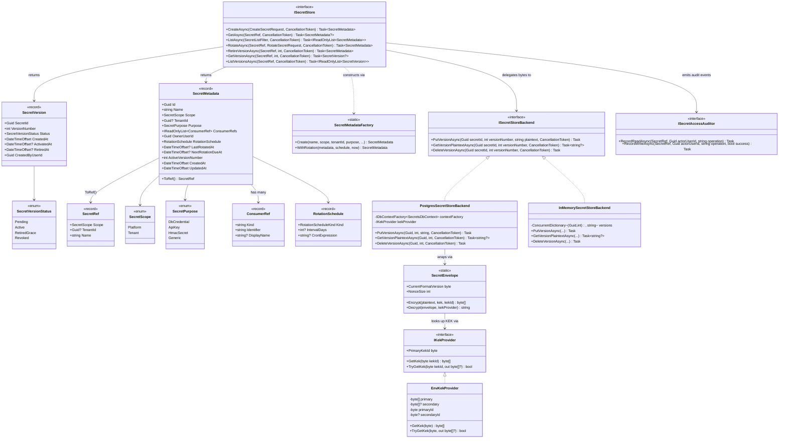
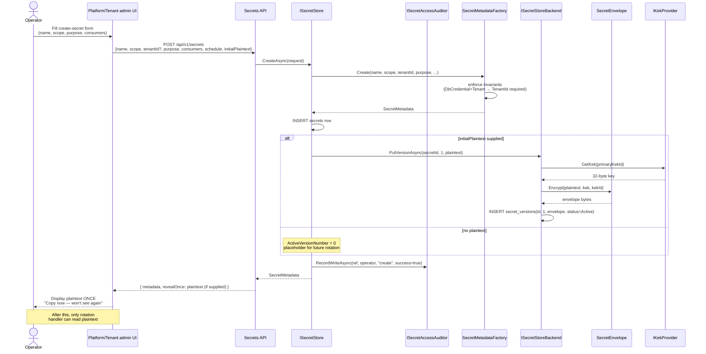
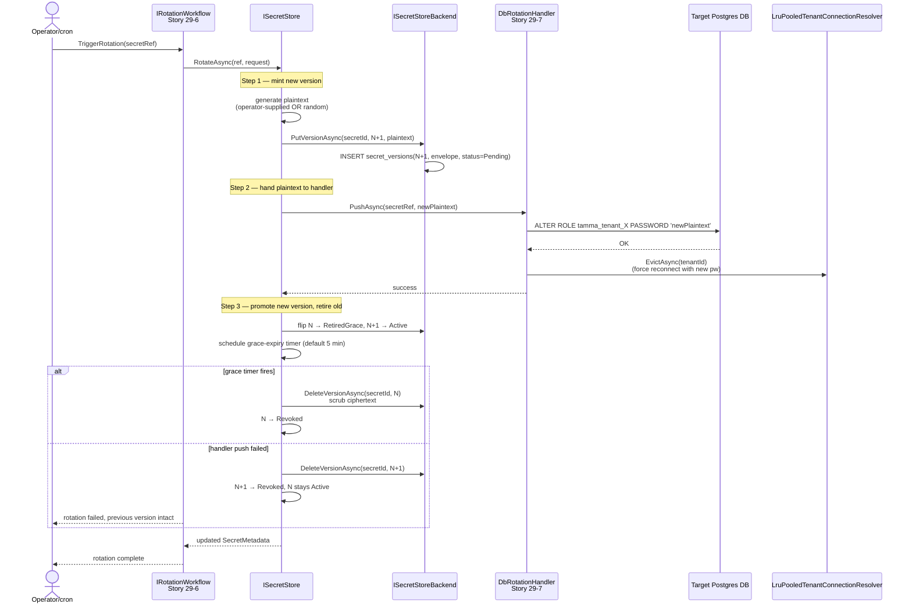
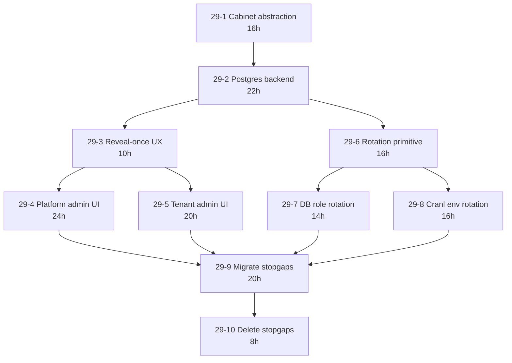

# Epic 29: Platform Secret Management

**Status:** In progress — 29-1/2 landed (typed cabinet + Postgres backend); 29-3..29-10 planned
**Stories:** 10 (29-1 through 29-10), ~166h
**Layer:** Layer 4 (integration/UI)
**Depends on:** Epic 28 Phase A (28-3 DbContext factory), Epic 28 Story 28-12 (KEK primitives), Epic 19 Story 19-6 (real per-tenant DbContext wiring)

> **Overview**: [Secret Management](Secret-Management) — root-level topic page with the data model, crypto pipeline, rotation patterns, and tenant/platform UI surfaces.

## 1. Overview

Today Tamma has **three stopgap secret stores** and none of them is managed:

1. `TenantSecretProtector` — a direct AES-GCM helper whose key is read from `Cranl:EncryptionKey` or HKDF-derived from `Cranl:ApiKey`.
2. `tenants.cranl_database_url_encrypted` — a `bytea` column holding each tenant's Cranl DATABASE_URL, bound to the above protector.
3. Plaintext env vars baked into deployment: `TAMMA_SHARED_SECRET`, `ConnectionStrings:TammaAppDb` (with a literal `changeme` password set by migration `20260419021119_Phase2RlsAndTriggers`), `Cranl:ApiKey`, GitHub App private key.

Epic 29 ships a **typed secret cabinet** with two UIs (platform admin, tenant admin), rotation workflows that push the new value into the consumer (database, Cranl env, engine config), an auditable reveal-once-on-create flow, and a migration of every stopgap secret into the cabinet.

The user's design intent (2026-04-20):

> Tenant DB passwords will be generated and saved in tenant secret store. Tenant admins can generate and edit these passwords, but that means auto-generate and update, since they can't access dbs directly. Platform works the same for admin. Secret management UI tells what this key is, where it's used and so on.

### Non-goals

- Does not introduce OpenBao. The `ISecretStoreBackend` seam stays intact; Story 28-13 is the adoption path when triggers fire.
- Does not mirror secrets into GitHub / GitLab / Gitea Actions stores — Epic 1.5-23..1.5-26 own that surface.
- Does not change the GitHub App private key loading (separate hardening item).

## 2. Architecture

### 2.1 Layered design — facade owns metadata, backend owns bytes



### 2.2 Separation of concerns

- **Facade (`ISecretStore`)** owns the typed surface — metadata, invariants, audit. It sees `SecretMetadata` records and rotation semantics.
- **Backend (`ISecretStoreBackend`)** owns the byte-oriented storage — `PutVersion(secretId, versionNumber, plaintext)`, `GetVersionPlaintext`, `DeleteVersion`. The backend never sees `SecretMetadata`, never decides rotation — it's a pure byte store.
- **Crypto (`SecretEnvelope` + `IKekProvider`)** lives below the backend. Postgres backend wraps plaintext in AES-GCM envelope at rest; future OpenBao backend uses KMS-managed keys.

This lets Story 28-13 swap the backend without touching the facade, and lets test fixtures inject an `InMemorySecretStoreBackend` without a Postgres container.

### 2.3 Envelope encryption wire format (Postgres backend)

```
offset  bytes  field
────── ────── ─────────────────────────────────────────────
0      1      format_version       (currently 1)
1      1      kek_id               (which KEK slot wrapped the DEK)
2      12     wrap_nonce           (AES-GCM nonce for DEK wrap)
14     32     wrapped_dek          (AES-256-GCM ciphertext of DEK)
46     16     wrap_tag             (AES-GCM tag for DEK wrap)
62     12     value_nonce          (AES-GCM nonce for value)
74     N      value_ct             (AES-256-GCM ciphertext of plaintext)
74+N   16     value_tag            (AES-GCM tag for value)
────── ────── ─────────────────────────────────────────────
total: 74 + N + 16 = 90 + plaintext_len
```

Fresh DEK per row bounds the blast radius of a single-row compromise. KEK rotation only rewraps DEKs — never plaintext — so rotation is O(rows) AES ops rather than O(plaintext bytes).

## 3. Components

### 3.1 Cabinet abstraction (Story 29-1, landed)

| Component | Type | File |
|-----------|------|------|
| `ISecretStore` | facade interface | `Tamma.Api/Services/Secrets/ISecretStore.cs` |
| `ISecretStoreBackend` | driver port | `Tamma.Api/Services/Secrets/ISecretStoreBackend.cs` |
| `SecretMetadata` | typed metadata record | `Tamma.Api/Services/Secrets/SecretMetadata.cs` |
| `SecretMetadataFactory` | invariant-enforcing constructor | `Tamma.Api/Services/Secrets/SecretMetadataFactory.cs` |
| `SecretVersion` / `SecretVersionStatus` | version lifecycle | `Tamma.Api/Services/Secrets/SecretVersion.cs` |
| `SecretRef` / `SecretScope` / `SecretPurpose` | typed refs | `Tamma.Api/Services/Secrets/SecretRef.cs` |
| `ConsumerRef` / `ConsumerRefLookup` | downstream-consumer graph | `Tamma.Api/Services/Secrets/ConsumerRef.cs` |
| `RotationSchedule` / `RotationScheduleCalculator` | cadence types | `Tamma.Api/Services/Secrets/RotationSchedule.cs` |
| `CreateSecretRequest` / `RotateSecretRequest` / `SecretListFilter` / `SecretValue` | request/response shapes | `Tamma.Api/Services/Secrets/SecretRequests.cs` |
| `ISecretAccessAuditor` | audit emitter | `Tamma.Api/Services/Secrets/ISecretAccessAuditor.cs` |
| `InMemorySecretStoreBackend` | test fixture | `Tamma.Api/Services/Secrets/InMemorySecretStoreBackend.cs` |

### 3.2 Postgres backend (Story 29-2, landed)

| Component | Type | File |
|-----------|------|------|
| `PostgresSecretStoreBackend` | production backend | `Tamma.Api/Services/Secrets/Postgres/PostgresSecretStoreBackend.cs` |
| `SecretsDbContext` | dedicated DbContext | `Tamma.Api/Services/Secrets/Postgres/SecretsDbContext.cs` |
| `SecretEnvelope` | AES-GCM envelope helper | `Tamma.Api/Services/Secrets/Postgres/SecretEnvelope.cs` |
| `IKekProvider` | KEK source port | `Tamma.Api/Services/Secrets/Postgres/IKekProvider.cs` |
| `EnvKekProvider` | env-var KEK loader | `Tamma.Api/Services/Secrets/Postgres/EnvKekProvider.cs` |
| `KekNotAvailableException` | missing-slot signal | `Tamma.Api/Services/Secrets/Postgres/IKekProvider.cs` |
| Migrations | `Tamma.Api/Services/Secrets/Postgres/Migrations/` | `secrets` + `secret_versions` tables |

### 3.3 Downstream (planned)

| Story | Component | Status |
|-------|-----------|--------|
| 29-3 | Reveal-once UX + audit events | Planned |
| 29-4 | Platform-admin secret UI | Planned |
| 29-5 | Tenant-admin secret UI | Planned |
| 29-6 | `IRotationWorkflow` Elsa primitive | Planned |
| 29-7 | Postgres role-password rotation handler | Planned |
| 29-8 | Cranl env-var rotation handler | Planned |
| 29-9 | Migrate stopgap secrets into cabinet | Planned |
| 29-10 | Delete `TenantSecretProtector` + encrypted columns | Planned |

## 4. Class diagram



## 5. Sequence diagrams

### 5.1 Create secret (operator-driven, reveal-once)



### 5.2 Rotation saga (database credential example)



## 6. Use cases

### UC-29-01: Operator creates a new secret and sees the plaintext once

Flow in §5.1. Afterwards, the plaintext is no longer retrievable through any HTTP surface — only the in-process rotation handler callback sees it. If the operator loses the revealed value, the recovery path is emergency re-create + rotate (documented in Story 29-3).

### UC-29-02: Scheduled rotation of a tenant DB password

1. Cron or manual trigger fires `RotateAsync` on `(scope=tenant, tenantId=X, name='db/app-role')`.
2. Workflow mints new version, pushes to Postgres via `ALTER ROLE`, evicts tenant pool (forces reconnect).
3. In-flight requests drain against the old password (retired-grace window, default 5 min).
4. Grace expires, old version's ciphertext scrubbed.

### UC-29-03: Rotation push fails — compensation

If the Postgres push fails (network blip, wrong role, permission denied):

1. New version's ciphertext is scrubbed (`DeleteVersion`), status → `Revoked`.
2. Previous version stays `Active` — no tenant impact.
3. Workflow surfaces the failure to the operator via audit event.

### UC-29-04: KEK rotation without re-encrypting plaintext

1. Operator sets `TAMMA_SECRET_STORE_KEK_SECONDARY` with a new 32-byte key on slot 2 (primary was slot 1).
2. `EnvKekProvider.PrimaryKekId` returns `2` on next restart — new writes wrap under slot 2.
3. A background "rewrap" sweep reads `secret_versions WHERE kek_id = 1`, decrypts DEK with old KEK, re-wraps DEK under new KEK, updates row. Plaintext never touched.
4. When zero rows remain at `kek_id = 1`, operator clears the old slot.

### UC-29-05: Migrating a stopgap secret (Story 29-9)

1. Operator runs migration script: reads `Cranl:ApiKey` env var, calls `ISecretStore.CreateAsync` with `InitialPlaintext` set, `Scope=Platform`, `Purpose=ApiKey`.
2. Store returns the new `SecretMetadata` with `ActiveVersionNumber=1`.
3. Deployment config updates to read `Cranl:ApiKey` via `ISecretStore` instead of env var.
4. Next rotation replaces the env-var value; env var can be removed.

### UC-29-06: Tenant admin manages their own secrets

Tenant admin UI (Story 29-5) calls `ListAsync(SecretListFilter{Scope=Tenant, TenantId=current})` — backend tenant filter plus RLS on `secret_versions` table (depends on 19-6) enforces isolation twice. Tenant admin cannot see other tenants' secrets even with a crafted request.

## 7. Dependencies

### Upstream

- [Epic 28](Epic-28-DB-Per-Tenant.md) Phase A — `ITenantDbContextFactory` (28-3), tenant resolver (28-4), KEK primitives (28-12)
- [Epic 1.5](Epic-1.5-Infrastructure.md) — secret-management track (1.5-16, 1.5-30) for crypto primitives + LLM-safe rotation activities
- [Epic 19](Epic-19-Agent-Dispatch.md) Story 19-6 — real per-tenant DbContext wiring (needed for RLS on `secret_versions`)

### Downstream

- [Epic 30](Epic-30-Pluggable-Provisioning.md) Stories 30-4..30-6 — each provisioning backend registers its own rotation handler with the cabinet
- [Epic 31](Epic-31-Multi-Git-Platform.md) Story 31-8 — `ICiSecretsProvisioner` consumes the cabinet's per-tenant credentials

### Story dependency graph



## 8. Current state

### Landed

- **29-1** — typed cabinet abstraction: `ISecretStore`, `ISecretStoreBackend`, `SecretMetadata`, `SecretVersion`, `SecretRef`, `SecretScope`, `SecretPurpose`, `ConsumerRef`, `RotationSchedule`, `CreateSecretRequest` / `RotateSecretRequest`, `InMemorySecretStoreBackend`, `ISecretAccessAuditor`.
- **29-2** — Postgres backend: `PostgresSecretStoreBackend` + `SecretsDbContext` + `SecretEnvelope` + `IKekProvider` / `EnvKekProvider`. Envelope format v1 live. `TAMMA_SECRET_STORE_KEK_PRIMARY` / `_SECONDARY` env vars per the env-KEK decision (memory: `project_epic28_kek_decision.md`).

### Planned

- **29-3..29-10** — brief + impl plan authored 2026-04-20; dev scheduled after Wave A.5 completes.

### Review findings closed (from code review 2026-04-20)

- **Finding 4** (§2.4) — `Cranl:EncryptionKey` HKDF-from-API-key fallback bypasses `ISecretStore`. Closed by 29-2 (all KEK material flows through the provider).
- **Finding 15** (§2.15) — `tamma_app` password hard-coded `changeme` in Phase-2 migration. Closed by 29-9 (rotation on first deploy).
- **Finding 16** (§2.16) — `TAMMA_SHARED_SECRET` plaintext env var. Closed by 29-9 (moved into cabinet, rotated with HMAC probe).
- **Partial close on Finding 1** (per-tenant wiring) via the rotation-aware `TenantDbContext` password pipeline in 29-7 + 29-9.

### Drift findings (2026-04-22 audit)

- Three stopgap stores still live in production (`TenantSecretProtector`, `tenants.cranl_database_url_encrypted`, plaintext env vars). Closed only by 29-9 (migrate) + 29-10 (delete).
- `TenantSecretProtector.FromConfiguration` HKDF-from-`Cranl:ApiKey` fallback still honoured for Cranl-only deployments. Retired in 29-10.
- Epic 1.5 secret-management track overlaps with 29 — 29 reuses 1.5's crypto primitives and adds the operator-facing cabinet on top.

## 9. See also

- [Secret Management](Secret-Management) — root-level topic page
- [Epic 28](Epic-28-DB-Per-Tenant.md) — DB-per-tenant foundation providing KEK primitives + factory
- [Epic 1.5](Epic-1.5-Infrastructure.md) — secret-management infrastructure track
- [Epic 30](Epic-30-Pluggable-Provisioning.md) — consumes 29's rotation primitive for per-backend handlers
- [Epic 31](Epic-31-Multi-Git-Platform.md) — Story 31-8 CI secrets provisioner
- Sources:
  - User design intent: 2026-04-20 planning session
  - Research notes: `docs/stories/research/secret-management-and-multi-backend-provisioning-2026.md`
  - KEK decision memory: `~/.claude/projects/-home-meywd-tamma/memory/project_epic28_kek_decision.md`
  - Current stopgaps: `apps/tamma-elsa/src/Tamma.Api/Services/Provisioning/TenantSecretProtector.cs`, migration `20260419021119_Phase2RlsAndTriggers.cs`
- Story files: [Epic 29 on GitHub](https://github.com/meywd/tamma/tree/main/docs/stories/epic-29)

---

_Last updated: 2026-04-22_
