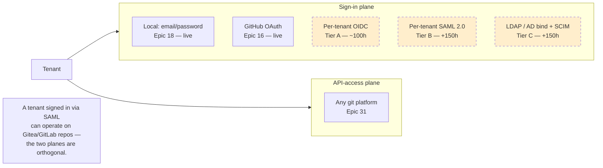
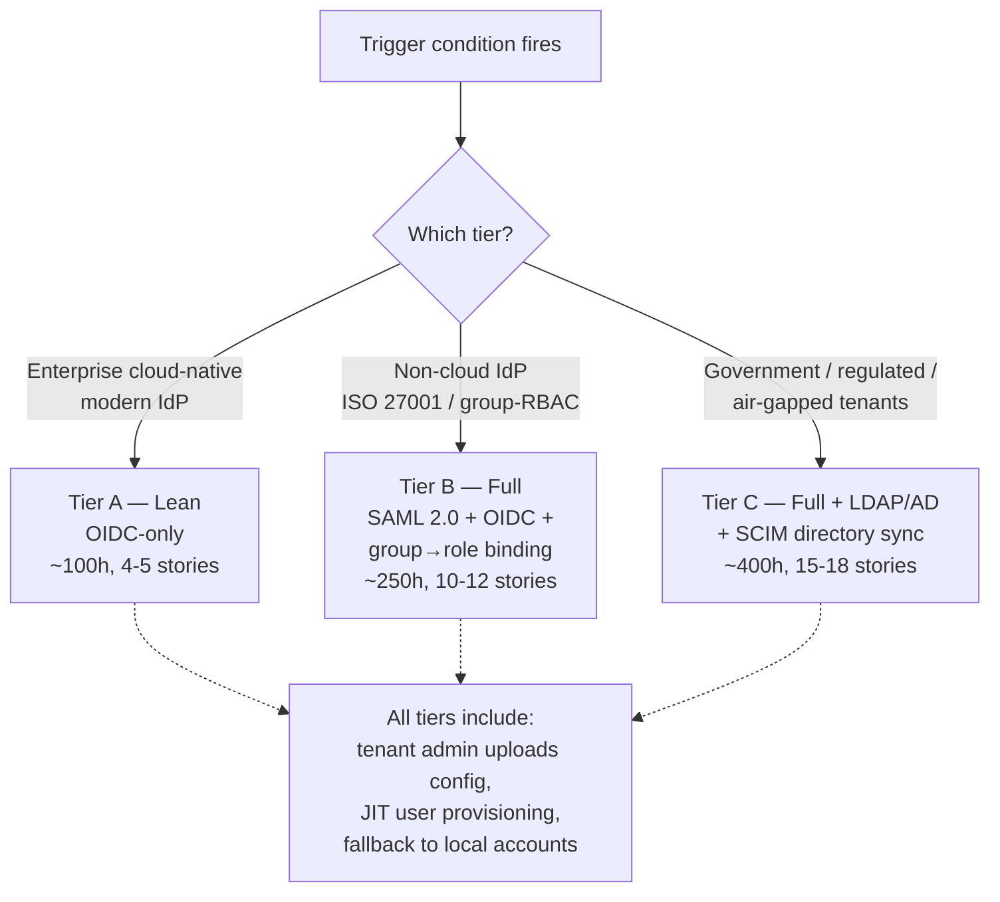
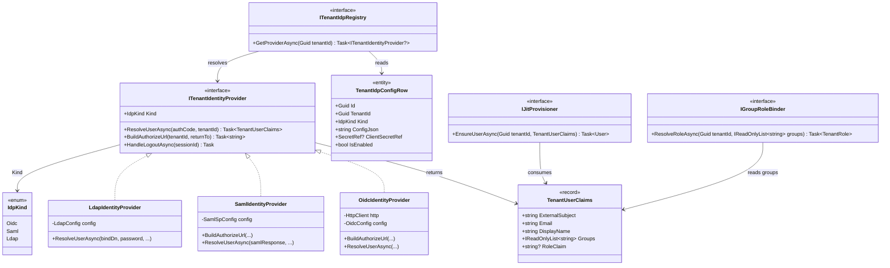
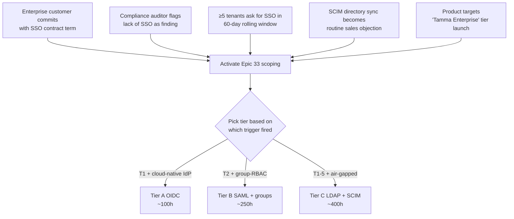

# Epic 33: Per-Tenant Identity Providers (deferred / post-launch)

**Status:** **Deferred — forward-looking stub, not scoped in detail** (written 2026-04-21)
**Stories:** none yet — activates when trigger conditions fire
**Layer:** will slot into Layer 5 or later when activated
**Depends on:** Epic 18 (user + tenant model), Epic 28 (tenant lifecycle), Epic 31 (platform abstraction — sign-in stays orthogonal to API access)

> **Overview**: [Identity Providers](Identity-Providers) — root-level topic page with the deferral rationale, trigger conditions, and approximate scope tiers.

## 1. Overview

Allow each tenant to configure their **own** identity provider (SAML 2.0, OIDC, LDAP / Active Directory) so their users sign into Tamma via that IdP rather than through Tamma's built-in email/password or shared GitHub OAuth.

Typical asks that drive this epic:

- Enterprise customer requires SAML SSO tied to corporate IdP (Okta, Azure AD / Entra, Google Workspace, Ping, Duo, Auth0)
- Compliance framework (SOC 2 Type II with managed-identity control, ISO 27001, FedRAMP moderate) forces SSO
- Tenant admin requires automatic user provisioning via SCIM 2.0 / "Directory Sync" — no per-user invite flow
- Tenant wants to bind group membership in their directory to tenant roles inside Tamma

### Why this is not being scoped in detail now

The near-term path is covered by:

- **Built-in user management** — Stories 18-7 + 18-8 ship tenant-admin invite / list / role / remove / audit for the local user flow
- **GitHub OAuth sign-in** — already live; handles self-service sign-in for GitHub-connected users
- **Password reset + email verification** — Stories 18-1 / 18-6 handle the built-in auth flow

That combination covers every current user until a paying enterprise customer demands SSO.

Scoping IdP integration is a **big** effort (100–400h depending on tier) and is the wrong place to invest until the trigger conditions fire. Doing it now would ship a feature nobody is asking for against real-world IdP quirks we haven't encountered.

## 2. Architecture

### 2.1 Two-plane model (orthogonal to API-access)

### 2.2 Three pre-scoped tiers

## 3. Components (forward-looking)

### 3.1 Tier A — OIDC-only (~100h, 4-5 stories)

| Component | Purpose |
|-----------|---------|
| `ITenantIdentityProvider` | interface — `ResolveUserAsync(authCode) Task<TenantUserClaims>` |
| `OidcIdentityProvider` | reads tenant's OIDC discovery URL + client-id/secret |
| `tenant_idp_configs` table | per-tenant IdP config (discovery URL, client ID, encrypted client secret via Epic 29 cabinet) |
| `/login?tenant={slug}` endpoint | redirects to tenant's IdP authorize URL |
| `/auth/idp/callback` endpoint | exchanges auth code for tokens, extracts claims, JIT-provisions user |
| JIT provisioning | first login creates `tenant_memberships` with role `member` |

### 3.2 Tier B — + SAML 2.0 + group → role (~+150h)

| Component | Purpose |
|-----------|---------|
| `SamlIdentityProvider` | SAML SP-initiated + IdP-initiated flows |
| SAML metadata UX | upload XML / paste / URL-fetch |
| Attribute-mapping UI | map IdP claims to Tamma display name, email, role claim |
| `IGroupRoleBinder` | resolves IdP group → tenant role on each login |
| Session binding | Tamma session tied to IdP session; IdP-triggered logout invalidates Tamma session |
| SLO (Single Logout) | Tamma sends `LogoutRequest` on user-initiated logout |

### 3.3 Tier C — + LDAP/AD + SCIM (~+150h)

| Component | Purpose |
|-----------|---------|
| `LdapIdentityProvider` | LDAP bind on each login; group lookup via LDAP |
| LDAP connector runner | tenant-hosted; tunnels bind calls to their AD |
| `IScimDirectorySync` | incoming `SCIM 2.0` user/group push from tenant's IdP |
| AD quirks handling | UPN vs sAMAccountName, nested groups, stale tokens |

## 4. Class diagram (aspirational, Tier A baseline)

## 5. Sequence diagram — Tier A OIDC sign-in

```mermaid
sequenceDiagram
    actor User
    participant Browser
    participant Tamma as Tamma API
    participant Registry as ITenantIdpRegistry
    participant Oidc as OidcIdentityProvider
    participant Idp as Tenant's IdP (Okta/AzureAD/...)
    participant Jit as IJitProvisioner
    participant Binder as IGroupRoleBinder
    participant CP as ControlPlaneDbContext

    User->>Browser: visit /login?tenant=acme
    Browser->>Tamma: GET /login?tenant=acme
    Tamma->>Registry: GetProviderAsync(tenantSlug="acme")
    Registry->>CP: SELECT tenant_idp_configs WHERE tenant_slug='acme'
    CP-->>Registry: OIDC config
    Registry-->>Tamma: OidcIdentityProvider

    Tamma->>Oidc: BuildAuthorizeUrl(tenantId, returnTo="/dashboard")
    Oidc-->>Tamma: https://idp.acme.com/authorize?client_id=...&state=...
    Tamma-->>Browser: 302 redirect

    Browser->>Idp: GET /authorize
    Idp-->>User: login form
    User->>Idp: credentials
    Idp-->>Browser: 302 → /auth/idp/callback?code=...&state=...

    Browser->>Tamma: GET /auth/idp/callback?code=...
    Tamma->>Oidc: ResolveUserAsync(authCode, tenantId)
    Oidc->>Idp: POST /token (exchange code)
    Idp-->>Oidc: access_token + id_token
    Oidc->>Oidc: validate JWT, extract claims
    Oidc-->>Tamma: TenantUserClaims{ sub, email, name, groups, role? }

    Tamma->>Binder: ResolveRoleAsync(tenantId, claims.Groups)
    Binder-->>Tamma: TenantRole.Member

    Tamma->>Jit: EnsureUserAsync(tenantId, claims)

    alt first login — JIT create
        Jit->>CP: INSERT users (external_subject, email, tenantId)
        Jit->>CP: INSERT tenant_memberships (tenantId, userId, role=Member)
    else returning user
        Jit->>CP: UPDATE users SET last_login=now()
    end

    Jit-->>Tamma: User

    Tamma->>Tamma: mint JWT with tid + sub
    Tamma-->>Browser: Set-Cookie + 302 → /dashboard
```

## 6. Use cases

### UC-33-01: Okta-backed enterprise onboarding (Tier A)

1. Sales closes a contract with "Acme Corp". Tamma provisions their tenant (Epic 28).
2. Tenant admin logs in via initial admin email, navigates to tenant settings → identity.
3. Uploads Okta OIDC discovery URL + client ID. Generates a client secret stored in Epic 29 cabinet as `tenant/acme/oidc-client-secret`.
4. Flips `is_enabled = true`. Now employees visit `/login?tenant=acme`, Tamma redirects to Okta, Okta authenticates and redirects back, Tamma JIT-provisions the user with role `member`.
5. Tenant admin can override role in tenant-admin UI (Epic 18 Story 18-8).

### UC-33-02: Compliance-driven SSO requirement (Tier B)

SOC 2 auditor flags local-password auth as a finding. Enterprise tenant must:

1. Upload SAML metadata XML for their on-prem ADFS.
2. Map SAML attributes: `http://schemas.xmlsoap.org/ws/2005/05/identity/claims/emailaddress` → Tamma email.
3. Configure group → role: `CN=TammaAdmins,OU=Groups,DC=acme,DC=corp` → `TenantRole.Admin`.
4. Enable SLO so user logout in ADFS tears down Tamma session.

### UC-33-03: Air-gapped government tenant (Tier C)

Agency runs on-prem infrastructure with an AD Connect Server on an isolated network. Tamma deploys an LDAP connector into their DMZ that:

- Binds to their AD for each login
- Subscribes to SCIM user/group changes for auto-provisioning
- Reports directory deltas back to Tamma over a narrow, audited channel

## 7. Dependencies

### Upstream

- [Epic 18](Epic-18-User-Auth.md) — user + tenant model; Stories 18-7 / 18-8 ship the local user-management fallback
- [Epic 28](Epic-28-DB-Per-Tenant.md) — tenant lifecycle hooks
- [Epic 29](Epic-29-Secret-Management.md) — secret cabinet holds per-tenant IdP client secrets / service account passwords
- [Epic 31](Epic-31-Multi-Git-Platform.md) — platform abstraction; orthogonal but in the same Layer-5 band

### Downstream

None — terminal epic.

### Trigger-condition graph

## 8. Current state

### Not started — epic is a one-page placeholder until triggers fire

No stories scoped. No code committed. Design intents locked-in (see Architecture §2) but not turned into acceptance criteria yet.

### What exists today (fallback auth)

- **Email/password** (Epic 18 Stories 18-1..18-6) — registration, login, password reset, email verification
- **GitHub OAuth** (Epic 16) — sign in with GitHub for users with a GitHub account
- **User management** (Epic 18 Stories 18-7, 18-8) — tenant admin can invite, list, change role, remove users

This combination handles 100% of current users. Epic 33 is for the first paying customer that demands SSO.

### Reference architectures to read before scoping

Three industry analogues at B2B SaaS scale:

| Vendor | What they do | What we'd learn |
|--------|--------------|-----------------|
| [Auth0 Organizations](https://auth0.com/docs/manage-users/organizations) | Per-organization connection picker; each org binds to its own IdP; user identity is `(org, sub)` | Data model for `(tenant, external_identity)` mapping; connection-picker UX; policy per org |
| [Clerk multi-tenant](https://clerk.com/docs/authentication/social-connections/overview) | Per-organization SSO + SAML with metadata upload; magic-link fallback | SAML metadata ingestion UX; JIT provisioning shape; session scoping across orgs |
| [WorkOS Directory Sync / SSO](https://workos.com/docs/sso/overview) | SSO-in-a-box: one API over ~40 IdP implementations; SCIM directory sync with realtime change stream | Abstraction surface for "one API covers 40 IdPs"; SCIM event model; test harness strategy |

Reading these before writing the story set is non-negotiable — NameID formats, attribute mapping, metadata refresh, SLO vs session invalidation are where every greenfield SAML integration burns weeks.

### Architecture decisions to lock before story-writing begins

1. **Sign-in plane stays orthogonal to API-access plane** — tenant signed in via SAML can operate on Gitea / GitLab repos
2. **One IdP per tenant for v1** — multi-IdP is post-MVP
3. **Local accounts as fallback stay forever** — built-in email/password + GitHub OAuth are the universal login
4. **JIT user provisioning is the default for Tier A** — SCIM is Tier C only
5. **No per-tenant custom-domain login pages in MVP** — marketing/brand polish, not an identity concern

### Drift findings (2026-04-22 audit)

- Nothing to drift against — no code, no stories, no schemas. This epic is deliberately a stub.

### Not in scope (for eventual scoping, too)

- Multiple IdPs per tenant — one-IdP-per-tenant is good enough for 99% of cases
- Social provider federation on top of tenant IdPs — tenant IdP is the authority
- Custom-domain login pages (`login.tenant.example.com`) — Layer 6 marketing/brand polish
- FIDO2 / Passkey as sole factor — add-on to any tier above

### Open questions (gating decisions for when scoping activates)

1. **Build vs buy**: build SAML/OIDC against `Microsoft.IdentityModel.*` directly, or use WorkOS / Auth0 / Stytch? Saves 50-100h on Tier B/C but adds vendor cost + lock-in
2. **Tenant onboarding UX for SAML metadata XML**: upload-file vs paste-XML vs URL-fetch
3. **Session model**: Tamma session on top of IdP session (Tier B SLO), or independent?
4. **Trigger-condition watchlist**: instrument support-ticket tagging for SSO mentions to detect trigger #3 automatically?

## 9. See also

- [Identity Providers](Identity-Providers) — root-level topic page
- [Epic 18](Epic-18-User-Auth.md) — built-in user auth and the fallback path
- [Epic 16](Epic-16-Auth-Admin.md) — platform-level auth / admin plane
- [Epic 28](Epic-28-DB-Per-Tenant.md) — tenant lifecycle hooks
- [Epic 29](Epic-29-Secret-Management.md) — holds per-tenant IdP client secrets
- [Epic 31](Epic-31-Multi-Git-Platform.md) — the orthogonal API-access plane
- Cross-reference:
  - Tenant user management (built-in path): `docs/stories/plans/tenant-user-mgmt-audit.md`
  - Layer placement across Epics 29 / 30 / 31 / 33: `docs/stories/plans/epic-31-33-placement.md`
  - Unified RBAC reference: `docs/stories/rbac-unified-model.md`
- Story files: [Epic 33 README on GitHub](https://github.com/meywd/tamma/tree/main/docs/stories/epic-33)

## Change log

| Date | Version | Changes | Author |
|------|---------|---------|--------|
| 2026-04-21 | 0.1.0 | Initial stub (forward-looking, deferred) | Planning sweep |
| 2026-04-22 | 0.2.0 | Rewrite with 9-section template + forward-looking class/sequence diagrams | Planning sweep |

---

_Last updated: 2026-04-22_
